

 

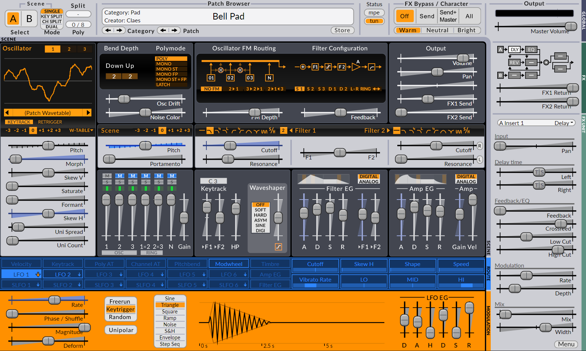

 
 
 
 
# Surge 1.9 Benutzer\*innen Handbuch
{:.no_toc}
 
## Inhaltsverzeichnis
{:.no_toc}

* unordered list
{:toc}

 
 
 
 

# Einstieg
Vielen Dank, dass Sie **Surge** benutzen!

Surge ist ein virtueller Synthesizer, der im September 2018 vom Autor Claes Johanson in OpenSource überführt wurde
und seitdem von einer Gruppe von Freiwilligen weiterentwickelt wird.

Dieser erste Abschnitt soll Ihnen einen kurzen Überblick über einige, 
für diesen Synthesizer spezifischen Konzepte vermitteln,
sowie eine Einführung über Navigation, Manipulation und die Nutzung von Surge in vollem Umfang. 

Ausführliche Informationen zur Synthese-Engine und anderen weiterführenden technischen Daten,
Spezifikationen und Optionen dieses Synthesizers gibt es in einem zweiten Abschnitt, der der
[technischen Referenz](#technische-referenz) gewidmet ist.

Schließlich können Sie für weitere Tipps und Tricks, Tutorials und zum Herunterladen zusätzlicher Inhalte auch einen Blick auf [Surges Wiki](https://github.com/surge-synthesizer/surge-synthesizer.github.io/wiki) werfen.

 
 

## Installation von Surge
*Audio Units, AU ist ein Warenzeichen von Apple Computer, Inc.  
VST ist ein Warenzeichen der Steinberg Media Technologies GmbH*

Das Installationsprogramm von Surge ist unter [https://surge-synthesizer.github.io](https://surge-synthesizer.github.io) verfügbar.

### Windows

Für die Windows-Plattform wird Surge sowohl als 32- als auch als 64-Bit VST3-Plug-In-Instrument ausgeliefert.

Der Dateiname für VST3 ist `Surge.vst3`.

Systemvoraussetzungen:

  - Windows 7 oder neuer
  - Eine einigermaßen schnelle CPU (Pentium 4/Athlon 64 oder höher)
  - Mindestens 4 GB RAM
  - VST-kompatible Host-Anwendung

Um die 64-Bit-Version unter Windows zu verwenden, benötigen Sie außerdem Folgendes:

  - Eine CPU, die den x64 (AMD64/EM64T) Befehlssatz unterstützt
  - Eine **64-Bit**-Version von Windows
  - Eine Anwendung, die 64-Bit-VST-Plug-Ins hosten kann

Die VST3-Version des Plug-Ins sollte automatisch im Standardverzeichnis für VST3-Plug-Ins installiert werden
und von Ihrer Host-Anwendung gefunden werden. Die Windows-Version verfügt jedoch auch über einen **portablen Modus**:

- Der portable Modus ermöglicht es Ihnen, Assets im gleichen Verzeichnis wie Surge.vst3 zu speichern.
- Wenn Surge.vst3 in einem Ordner installiert ist und sich in demselben Ordner ein Verzeichnis namens `SurgeData` befindet, wird Surge dieses für die Werksdaten verwenden und nicht `%PROGRAMDATA%\Surge`.
- Wenn sich in demselben Ordner ein Verzeichnis namens `SurgeUserData` befindet, wird Surge dieses für Benutzerdaten verwenden und nicht `%DOCUMENTS%\Surge`.
- Es können entweder keiner, einer oder beide dieser Ordner vorhanden sein. Surge wird auf Standardeinstellungen zurückgesetzt, wenn sie nicht vorhanden sind.
Sie können Ihre Dateipfade immer im [about screen](#about-surge) sehen.

 
### macOS

Auf dem Mac wird Surge als 64-Bit-Plug-in-Instrument geliefert, sowohl für Audio
Unit (AU) als auch für die VST-Plug-in-Schnittstelle (VST3).

Systemvoraussetzungen:

  - Mac OS X 10.11 oder neuer
  - Eine 64-Bit-Intel-CPU
  - Mindestens 4 GB RAM
  - 64-Bit-AU- oder VST-kompatible Host-Anwendung

Führen Sie zum Installieren das Paketinstallationsprogramm aus. Sie haben hiermit die Möglichkeit
AU `Surge.component` und VST3` Surge.vst3` automatisch an ihren richtigen Positionen zu installieren.
Die werkseitigen Voreinstellungen und Wavetables werden ebenfalls automatisch installiert.

Das Ausführen des Installationspakets installiert Surge für alle Benutzer\*innen Ihres
Mac.

 
### Linux

Unter Linux wird Surge als 64-Bit VST3 ausgeliefert.

Die Systemvoraussetzungen sind schwer zu bestimmen, da es viele verschiedene Distributionen und weitere Faktoren gibt die hier eine Rolle spielen.
Die folgenden Informationen sind jedoch möglicherweise gut zu wissen:

 - Das Installationspaket auf der **Surge-Webseite** liegt in Form eines Debian-Pakets vor
 - Das Distributionspaket basiert auf Ubuntu 18.04
 - Die benötigten Pakete sind im Quelltext und in der deb-Datei aufgeführt

**Hinweis:** Einige Aktionen in Surge werden mit Alt + Ziehen oder Scrollrad ausgeführt. Auf bestimmten Linux-Distributionen,
können diese Shortcuts und Gesten zu Konflikten zwischen Surge und der Desktop-Umgebung führen. Wir haben entschieden, dass wir 
alt-drag nicht für alle Plattformen aufgeben können, nur weil ein Fenstermanager in einer Distribution es standardmäßig verwendet. Deshalb
ist es oft möglich, diese globale Geste in Desktop-Umgebungen zu deaktivieren, was der einfachste Weg wäre,
dieses mögliche Problem zu lösen.

 
 

### Vom Quellcode kompilieren
Wenn Sie Surge aus dem Quellcode erstellen möchten, lesen Sie die Anweisungen in
[unserer Github-Repository](https://github.com/surge-synthesizer/surge).

 
 

## Dateipfade

### Windows

Die Preset-Library und die Wavetables befinden sich unter `C:ProgramData\Surge`.
Die Benutzer-Presets befinden sich unter `C:\Benutzer\Ihr Benutzername\Eigene Dateien\Surge`.

### macOS

Die Preset-Library und die Wavetables befinden sich unter `/Library/Application Support/Surge`.
Die Benutzervoreinstellungen befinden sich unter `~/Documents/Surge`.

### Linux

Das Plugin selbst, die Preset-Library und die Wavetables befinden sich bei einer Standardinstallation unter `/usr/share/surge`.
Die Benutzervoreinstellungen befinden sich unter `~/Documents/Surge`, dieser Ordner wird angelegt sobald Sie zum ersten mal ein Patch oder Preset speichern oder die Benutzervoreinstellungen ändern.

 

Hinweis: Diese Orte können im Menü von Surge geändert werden (siehe [Daten und Patches](#data-folders)).

Sollten Sie eigene Inhalte im Werksordner ablegen oder diesen anderweitig verändern, so wird dies von zukünftigen Installern gelöscht. 
Die Installationsprogramme von Surge verändern nie etwas im Benutzerbereich.

Wenn Sie also einen benutzerdefinierten Skin, eine Reihe von Patches oder andere Dinge zu Surge hinzufügen möchten, 
legen Sie sie in Ihrem Benutzerdaten-Ordner ab und nicht hier, sonst riskieren Sie, dass sie beim Upgrade verloren gehen.

 
 

# Einführung in die Benutzeroberfläche

Die Benutzeroberfläche von Surge ist in vier Hauptbereiche unterteilt:
  - Patch/Global
  - Scene-Controls
  - Modulation/Routing
  - FX

Wenn Sie sich diese Struktur vor Augen halten, wird es Ihnen leichter fallen, das Layout zu verstehen.

*Die vier Abschnitte der Benutzeroberfläche, in die Surge unterteilt ist.*

 

## Das "Scene"-Konzept

Jedes Patch in Surge enthält zwei Szenen (A & B) und eine Effekt-Sektion.
Beide Szenen und alle Effekteinstellungen werden in jedem Patch gespeichert. Eine Szene ähnelt einem
traditionellen Synthesizer-Patch, da es alle Informationen speichert, die zur Synthese einer Stimme verwendet werden.
Da es in jedem Patch zwei Scenes gibt, ist es möglich, gelayerte oder Split-Sounds in einem einzigen Patch zu speichern.
(siehe [Scene Select und Scene Mode](#scene-select-und-scene-mode)).

 

## Audio-Ausgänge

Geladen in eine DAW, verfügt jede Instanz von Surge über **3 Audioausgänge**:
- Stereo Out
- Scene A Out
- Scene B Out

In einigen Hosts, wie z.B. FL Studio, deaktiviert Surge die einzelnen Szenenausgänge aufgrund eines Konflikts mit der
Audio-Routing-Architektur der DAW. Um diese zusätzlichen Ausgänge in solchen Fällen zu aktivieren,
siehe [diese Option](#workflow) im Surge-Menü.

 

## Slider und Bedienelemente

Das häufigste Bedienelement der Benutzeroberfläche in Surge ist der Slider. Dieser existiert
sowohl in horizontaler als auch in vertikaler Ausrichtung, ihre Funktionalität ist
ansonsten identisch.

Slider werden immer gezogen, es gibt keinen Sprung, wenn Sie auf den Regelweg
statt auf den Slider-Kopf klicken, sondern wechselt in den Zieh-Modus.

Slider-Interaktionen:  
  - **Ziehen mit der linken Maustaste** - Slider ziehen
  - **Shift + Ziehen mit der linken Maustaste** - Slider ziehen (fein)
  - **Strg/Cmd + Ziehen mit der linken Maustaste** - Slider ziehen (quantisierte Schritte)
  - **Alt + Ziehen mit der linken Maustaste** - Slider im elastischen Modus ziehen (schnappt beim Loslassen in die Ausgangsposition zurück)
  - **Scroll-Rad** - Slider verschieben
  - **Shift + Scrollrad** - Slider verschieben (fein)
  - **Doppelklick mit der linken Maustaste** - Parameter auf Standardwert zurücksetzen  
  - **Rechtsklick** - Kontextmenü

Neben den Slidern werden einige der Parameter in Surge auch als Zahlen- und Wertefelder, Schaltflächen und Schaltflächenreihen dargestellt.

 

### Parameter Kontextmenü

Das Kontextmenü eines jeden Parameters kann mit einem Rechtsklick aufgerufen werden. Dieses Menü hat zahlreiche nützliche Funktionen:

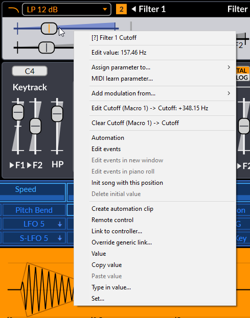

#### Name und kontextabhängige Hilfe
Durch Anklicken des ersten Menüpunktes wird in diesem Benutzer\*innen Handbuch der entsprechende Abschnitt zur Erklärung des betreffenden Parameters geöffnet.

#### Edit Value
Diese Option ermöglicht es Ihnen, den gewünschten Wert eines Parameters einzugeben. Sobald das Werte-Popup erscheint, ist der Text bereits
hervorgehoben, und Sie können sofort mit der Eingabe des Wertes beginnen. Wenn Sie fertig sind, drücken Sie einfach die Eingabetaste, um die
Änderung zu bestätigen. Um dieses Popup abzubrechen und zu schließen, drücken Sie die Escape-Taste oder bewegen Sie einen anderen Parameter.

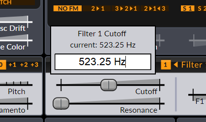

Für diskrete Parameter (z.B. Unison-Stimmen oder eine Tastenreihe) werden anstelle eines Eingabefelds alle möglichen Werte direkt im Menü angezeigt,
so dass direkt auf sie zugegriffen werden kann.

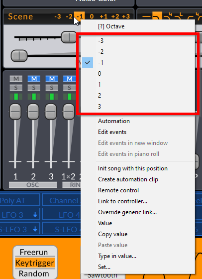

Wenn ein Steuerelement moduliert wird, gibt es für jede Modulationsquelle auch Eingabemöglichkeiten für die Stärke der Modulation.
Der eingegebene Wert entspricht der Position des Modulationsreglers (blauer Slider) für diese Modulationsquelle (siehe [Routing](#routing) für weitere Informationen).

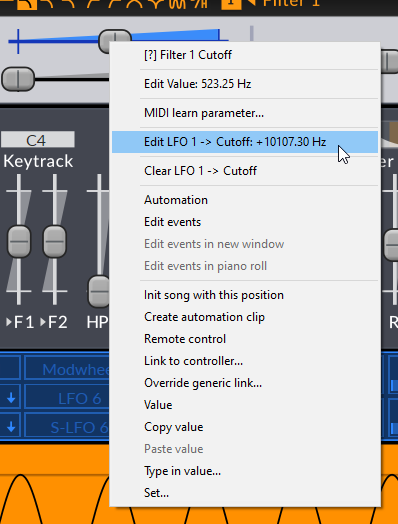

Beachten Sie, dass in beiden Fällen die tatsächliche Einheit des Parameters nicht eingetippt werden muss.

#### Extend Range
Bei einigen Parametern kann der Bereich erweitert werden. Die Option **Extend range** erscheint im Kontextmenü
wenn zutreffend. **Pitch** ist zum Beispiel einer dieser Parameter.

#### Tempo Sync
Einige Parameter können mit dem Host-Tempo synchronisiert werden. Die Option **Tempo-Sync** erscheint in diesem Fall im
Kontextmenü, wenn zutreffend.

Sobald sie temposynchronisiert sind, zeigen die Slider bei Verwendung des Surge Classic-Skins ein "TS"-Symbol auf ihren Kappen an, um diesen Zustand anzuzeigen, etwa so:

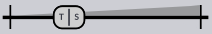

Diese Anzeige kann je nach verwendetem Skin variieren.

#### Activate / Deactivate
Einige Parameter können aktiviert oder deaktiviert werden. Wenn ein Slider transparent erscheint oder die Faderkappe fehlt,
kann das in manchen Fällen daran liegen, dass der Parameter deaktiviert ist. Verwenden Sie zum Umschalten einfach diese Option.

#### Assign parameter to...
Mit dieser Option können Sie den mit der rechten Maustaste angeklickten Parameter einem beliebigen MIDI-CC zuweisen.

#### MIDI-Learn-Parameter...
Hier weisen Sie dem gewünschten Slider einen MIDI-Controller zu. Um das MIDI-Lernen für diesen Parameter abzubrechen,
klicken Sie einfach erneut mit der rechten Maustaste und die Option wird nun zu **Abort Parameter MIDI Learn**.

#### Clear learned MIDI (...)
Diese Option ist verfügbar, wenn der ausgewählte Parameter bereits MIDI-gelernt wurde. Sie ermöglicht es Ihnen, diese Verknüpfung zu löschen (die
bestehende verknüpfte MIDI CC-Nummer wird in Klammern angezeigt).

#### Add modulation from...
Dieser Menüeintrag ermöglicht es, den mit der rechten Maustaste angeklickten Parameter direkt mit einer beliebigen Modulationsquelle in Surge zu modulieren.
Sobald eine Quelle ausgewählt ist, erscheint ein Pop-up-Fenster, in dem Sie den gewünschten Modulationsgrad dieser Quelle eingeben 
können.

#### Clear Modulation
Dieses Menü enthält auch eine leicht zugängliche Option, um alle Modulationsroutings zu einem modulierten Slider zu löschen (diejenigen mit einem blauen Farbton) (siehe [Routing](#routing)).

#### VST3 Options
Schließlich unterstützt die VST3-Version von Surge auch VST3-Kontextmenüeinträge. Abhängig vom Host,
kann es mehr oder weniger Optionen bezüglich Automation, MIDI oder Parameterwerten geben.

 
 
 
 

# Patch/Globaler Bereich
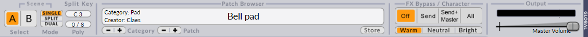
 
 
## Scene Select und Scene Mode
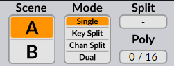

Es gibt zwei Setups aller Bedienelemente innerhalb des Szenenbereichs der Benutzeroberfläche.
Die **Scene Select**-Schaltflächen **[A|B]** bestimmen, welche Szene zur Bearbeitung ausgewählt ist.
Wenn Sie mit der rechten Maustaste auf diese Schaltflächen klicken, wird ein Kontextmenü angezeigt, mit dem Sie Szeneninhalte kopieren/einfügen können.

Abhängig vom **Scene Mode** können diese beiden Schaltflächen auch dazu verwendet werden, auszuwählen, welche Szene *gespielt* werden soll.
Ob eine Szene beim Drücken einer Taste eine Stimme erzeugt, wird nämlich durch die Einstellung **Scene Mode** bestimmt:

  - **Single** - Noten werden nur von der ausgewählten Szene gespielt.
  - **Key Split** - Noten unterhalb des **split keys** werden von Szene A gespielt,
    Noten oberhalb und einschließlich des **split keys** von Szene
    B.
  - **Channel Split** - Noten von MIDI-Kanälen unterhalb des **split MIDI channels** werden von Szene A gespielt,
    Noten von MIDI-Kanälen oberhalb und einschließlich des **split MIDI channels** werden von Szene B gespielt.
  - **Dual** - Beide Szenen spielen alle Noten.

Sowohl im **Key Split**- als auch im **Dual**-Modus unterstützt das System, wenn MPE deaktiviert ist, auch ein MIDI-Kanal-Routing, bei dem Kanal 2 nur von
Szene A und Kanal 3 nur von Szene B gespielt wird. MIDI-Kanal 1 und alle anderen Kanäle höher als 3 spielen im Split/Dual-Modus.

**Poly** zeigt die Anzahl der aktuell gespielten Stimmen an und ermöglicht Ihnen
eine Obergrenze für die Anzahl der gleichzeitig spielenden Stimmen festzulegen
indem Sie den Wert horizontal ziehen. Der Voice-Limiter schaltet überzählige Stimmen sanft ab,
um hörbare Artefakte zu vermeiden, daher ist es nicht ungewöhnlich, dass die Anzahl der Stimmen
den Grenzwert übersteigen.

 

## Patch-Browser

### Durch Presets navigieren
Das Finden von Sounds in Surge ist einfach: Drücken Sie einfach die Pfeiltasten
bis Sie etwas finden, das Ihnen gefällt. Wenn Sie mit der linken Maustaste auf das Patch-Namen
Feld (irgendwo im weißen Bereich) klicken, wird ein Menü mit allen verfügbaren
Patches, geordnet nach Kategorien angezeigt. Wenn Sie mit der rechten Maustaste klicken, wird ein Menü angezeigt, das nur die
Patches der aktuellen Kategorie enthält.

Diese Kategorien sind ebenfalls in drei Bereiche unterteilt, je nachdem, wer sie erstellt hat:

  - Factory Patches - Patches, die von den Surge-Autor\*innen selbst erstellt wurden.

  - 3rd Party Patches - Patches, die von Benutzer\*innen und Drittparteien erstellt wurden.
    Nach Ersteller\*innen kategorisiert.

  - User Patches - Hier werden Ihre eigenen Patches gespeichert. Wie Sie sie kategorisieren
    liegt ganz bei Ihnen.

Schließlich gibt es unten eine Option zum [Download zusätzlicher Inhalte](https://github.com/surge-synthesizer/surge-synthesizer.github.io/wiki/Additional-Content).

Sie können Patches (.fxp) auch direkt laden, indem Sie sie irgendwo über die Surge-Oberfläche ziehen und ablegen.

 

### Der Store Dialog

Ein Klick auf den Store-Button des Patch-Browsers öffnet den Speicherdialog.
Hier benennen Sie Ihren neuen Patch und wählen, in welche Kategorie
er gehören soll. Sie können hier auch manuell eine neue Kategorie
erstellen. Die Patches, die Sie speichern, landen im User-Bereich im unteren Teil
des Patch-Menüs. Der Speicherdialog bietet auch Textfelder für den Namen des Patch-Erstellers
und Kommentare.

Hinweis: Kommentare werden derzeit nicht in der Haupt-GUI angezeigt.

 

## Statusbereich

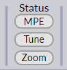

Dieser Bereich ist als Schnellzugriff auf einige der Funktionen von Surge gedacht, die auch im Menü vorhanden sind.
(siehe [Menü-Schaltfläche](#menu-button))

Wenn Sie mit der rechten Maustaste auf eine dieser Schaltflächen klicken, werden weitere Optionen angezeigt, die auch in Untermenüs unter der Menü-Schaltfläche zu finden sind.

Wenn Sie z.B. das erste Mal auf die Schaltfläche **Tune** klicken und keine benutzerdefinierte Stimmung geladen ist, wird das gleiche Menü geöffnet
wie wenn Sie mit der rechten Maustaste auf diese Schaltfläche geklickt hätten. Sobald jedoch eine benutzerdefinierte Stimmung geladen ist, können Sie mit einem Linksklick auf diese Taste
die geladene Stimmung ein- oder ausschalten.

Alternativ können **.scl**- und **.kbm**-Dateien auch an eine beliebige Stelle auf der Benutzeroberfläche gezogen und dort abgelegt werden, um eine
eigene Stimmung zu importieren.

Weitere Informationen finden Sie unter [Microtonal Tuning](#microtonal-tuning) im Abschnitt "Technische Referenz".

 

## FX-Bypass, Character und Global Volume

Mit **FX-Bypass** können Sie hören, wie ein Patch ohne die Effektgeräte klingt. (siehe [FX-Sektion](#fx-section))

  - **Off** - Bypass ist deaktiviert, alle Effekte sind aktiv.
  - **Send** - Die Send-Effekte werden umgangen.
  - **Send + Global** - Die Send- und Global-Effekte werden umgangen.
  - **All** - Alle Effekte werden umgangen.

**Character** steuert den Anteil der hohen Frequenzen in den meisten
Oszillator-Algorithmen von Surge. Die Auswahlmöglichkeiten sind Warm, Neutral
und Bright.

**Global Volume** steuert die letzte Verstärkungsstufe vor dem Ausgang. Das
VU-Meter darüber zeigt den Ausgangspegel an und wird rot, wenn er
über 0 dBFS liegt. Sie können wählen, ob der globale Ausgang entweder bei
**+18 dBFS** (Standard) oder **0 dBFS** abschneidet.

Der Zustand dieser beiden Einstellungen wird **nicht** mit den Patches gespeichert.
Sie werden jedoch von der Host-Anwendung in Ihren Projektdateien gespeichert.

 
 
 
 

# Scene Controls Sektion

Die UI der Szenensektion lässt sich ebenfalls in zwei weitere Teile unterteilen:

  - Klangerzeugung
  - Klangformung

Im Bereich Sound-Generation wird der Klang erzeugt und gemischt. Danach durchläuft er
den Bereich des Sound-Shaping.

 

## Sound-Generation

Hier wird der Klang geboren. Die Oszillatoren erzeugen Wellenformen
entsprechend der gespielten Noten. Diese werden dann im Mixer summiert.

 

### Oszillatoren

**1/2/3-Buttons** - Wählt den aktiven Oszillator zur Bearbeitung aus. Sie können mit der rechten Maustaste auf einen von ihnen klicken
und ein Kontextmenü mit den Optionen **Copy** und **Copy (with modulation)** wird eingeblendet.

**Display** - Zeigt die aktive Wellenform an. Wenn der Oszillator **Wavetable** oder **Window**
verwendet wird, funktioniert er auch als Wavetable-Selektor, indem Sie auf den orangefarbenen Balken oder auf die Pfeile drücken
um sie zu durchlaufen.

**Type** - Oszillatortyp. Wählt aus, welcher Algorithmus für den
Oszillator verwendet wird. Verfügbare Optionen sind:
- Classic
- Modern
- Wavetable
- Window
- Sine
- FM2
- FM3
- String
- Twist
- Alias
- S&H Noise
- Audio Input.

Weitere Informationen finden Sie unter [Oszillator-Algorithmen](#oszillator-algorithmen) im Abschnitt "Technische Referenz".

**Pitch & Octave** - Steuert die Tonhöhe für diesen bestimmten Oszillator.
Sein Kontextmenü kann verwendet werden, um den Bereich zu erweitern oder die Tonhöhe auf den Modus **Absolute** zu setzen, wodurch die Tonhöhe in absoluter Frequenz 
statt relativ zur gespielten Note verschoben wird.

**Keytrack** - Wenn diese Funktion deaktiviert ist, spielt der Oszillator die gleiche Tonhöhe
unabhängig von der gedrückten Taste. Diese Schaltfläche kann mit der rechten Maustaste angeklickt werden, um ihren Zustand für alle
Oszillatoren in der Szene umzuschalten.

**Retrigger** - Wenn aktiviert, starten der Oszillator und alle seine Unison-Stimmen immer sofort
an der gleichen Phasenposition. Dies ist nützlich für bissige Sounds, bei denen Sie wollen, dass der
Attack bei jeder Note genau gleich klingen soll. Dieser Schalter kann mit der rechten Maustaste angeklickt werden, um seinen Zustand für alle
Oszillatoren in der Szene zu festzulegen.

**Other** - Die restlichen Slider des Oszillator-Editors sind spezifisch für jeden
Oszillator-Typ. Weitere Informationen finden Sie unter [Oszillator-Algorithmen](#oszillator-algorithmen) im Abschnitt
"Technische Referenz".

 

### Mixer

#### Mixer-Kanäle

Ohne den **Vorfilter Gain** (Slider auf der rechten Seite) hat der Mixer 6 Kanäle (Quellen) von links nach rechts:

  - **Oszillatoren 1, 2, 3**

  - **Ringmodulation von 1x2, 2x3** - Die Quelle dieser beiden Kanäle ist **digitale Ringmodulation** von den Oszillatoren.
                                      Diese Art der RM unterscheidet sich ein wenig von der traditionellen Ringmodulation im Stil eines Trägermodulators.
                                      Die digitale Ringmodulation ist einfach das Ergebnis der Multiplikation des Ausgangs von Oszillator 1 und 2,
                                      oder 2 und 3.
  - **Noise-Oszillator**

#### Kanalparameter

Jeder Kanal hat die folgenden Bedienelemente:

  - **M** - Mute. Sie können entweder mehrere Kanäle gleichzeitig stumm schalten oder, mit **Strg/Cmd + Linksklick** auf den entsprechenden
   Mute Button, einen einzelnen Kanal exklusiv.

  - **S** - Solo (spielt nur Kanäle ab, bei denen Solo aktiv ist). Sie können mehrere Kanäle gleichzeitig auf Solo schalten, oder
  jeweils nur einen Kanal, indem Sie **Strg / Cmd** gedrückt halten und auf den gewünschten Solo-Schalter klicken.

  - **Triple Orange Box** (Filter-Routing) - Wählt aus, zu welchem Filter der Kanal geroutet wird.
                In der linken Position wird der Kanalausgang zu Filter 1 geleitet, in der rechten Position
                zu Filter 2, während die mittlere Position,
                die standardmäßig ausgewählt ist, ihn zu beiden leitet .
                Diese Einstellung leitet den Kanalausgang jedoch nur zu Filter
                1, wenn eine **serielle** Filterblockkonfiguration verwendet wird, da das
                Audio dann ohnehin durch den zweiten Filter im Filterblock geleitet wird.
                Wenn eine andere Konfiguration als die serielle verwendet wird, wird das Audio
                wie erwartet durch beide Filter geleitet.

  - **Slider** - Verstärkungsregler für jeden Eingang.

 

### Andere Klangerzeugungsparameter

**Pitch & Octave** - Steuert die Tonhöhe für die gesamte Szene. Beeinflusst
das Filter-Keytracking und die Keytrack-Modulationsquelle aus. Der
Bereich des Sliders kann über das Kontextmenü erweitert werden.

**Portamento** - Portamento ist ein gleitender Tonhöhenübergang zweier nacheinander ǵespielten Noten. 
Diese Einstellung bestimmt die Länge des
Übergangs. Eine Einstellung auf 0 deaktiviert Portamento.
Für diesen Parameter kann Tempo Sync aktiviert werden.

Portamento hat einige interessante Optionen, die über das Kontextmenü zugänglich sind:
- **Constant rate** - Wenn diese Option aktiviert ist, wird die Zeit, um **eine Oktave** abzudecken,
durch den Portamento-Sliderwert definiert. Von da an dauert das Gleiten zwischen 2 Oktaven
zum Beispiel doppelt so lange, und so weiter.
In der Voreinstellung ist diese Option deaktiviert, so dass die **Gleitgeschwindigkeit**
proportional zum Abstand zwischen den beiden Tasten ist und das Gleiten
zwischen **zwei beliebigen Tasten** immer die gleiche Zeit benötigt.
- **Glissando** - Wenn diese Option aktiviert ist, wird das Tonhöhengleiten
auf die Skalengrade quantisiert.
- **Retrigger at scale degrees** - Wenn diese Option aktiviert ist, werden die FEG und AEG
(siehe [Hüllkurven-Generatoren](#envelope-generators)) jedes Mal ausgelöst, wenn der Portamento
Slider einen Skalengrad durchkreuzt.
- **Curve options** - Sie können zwischen einer **logarithmischen**, **linearen** oder **exponentiellen**
Portamento-Kurve wählen. In der Voreinstellung folgt der Portamento-Slide einer linearen Kurve.

**Osc Drift** - Wendet eine kleine Instabilität auf die Tonhöhe aller Oszillatoren an,
wodurch sie leicht verstimmt werden. Obwohl der Parameter
gemeinsam genutzt wird, ist die Zufälligkeit des Instabilitätseffekts für alle
Oszillatoren und alle Unison-Stimmen eines jeden Oszillators unabhängig. Mit einem Rechtsklick
auf dieses Steuerelement können Sie entscheiden, ob Sie direkt am Anfang der Note noch Zufälligkeiten auf die Tonhöhe
anwenden, indem Sie die Option **Randomize initial drift phase** aktivieren.

**Noise Color** - Beeinflusst das Frequenzspektrum des Rauschgenerators.
Die mittlere Position ergibt ein weißes Rauschen. Wenn Sie den Slider
nach links bewegen, werden tiefe Frequenzen betont, nach rechts werden hohe Frequenzen betont.

**Bend Depth** - Pitch Bend Depth Up/Down. Steuert den Bereich des
Pitch-Bend-Rads in Halbtönen.

**Play Mode** - Wählt aus, wie mehrere Noten behandelt werden.
Poly erlaubt das gleichzeitige Spielen mehrerer Noten, während Mono nur die letzte Note spielen lässt.
Latch spielt kontinuierlich die zuletzt gespielte Note (Mono).

Mono hat zwei mögliche Modifikatoren:

  - **Single Trigger EG (ST)** bedeutet, dass die beiden Hüllkurvengeneratoren
    nicht neu gestartet werden, wenn sie zwischen zwei Noten gleiten (zwei Noten, die sich
    zeitlich überschneiden)
  - **Fingered Portamento (FP)** bedeutet, dass das Portamento nur beim
    Gleiten zwischen zwei Noten angewendet wird und nicht, wenn zwischen den gespielten Noten
    ein zeitlicher Abstand liegt.

Wenn **Play Mode** auf einen der Mono-Modi eingestellt ist, zeigt das Kontextmenü der betreffenden Tastenliste
zusätzliche Optionen, die sich auf die Mono-Notenpriorität beziehen:

- **Last note priority** - Spielt die letzte Note, wenn mehrere Noten zusammen gespielt werden
- **High note priority** - Spielt die höchste Note, wenn mehrere Noten zusammen gespielt werden
- **Low note priority** - Spielt die niedrigste Note, wenn mehrere Noten zusammen gespielt werden
- **Legacy note priority** - Wenn mehrere Noten zusammen gespielt werden, wird die jüngste Note gespielt, sobald sie angeschlagen wird
und nach dem Loslassen die höchste verbleibende Note.

- **Sustain-Pedal im Mono-Modus**
  - **Sustain pedal holds all notes (no note off retrigger)** - Wenn Sustain aktiviert ist und mehrere Noten angeschlagen und dann nacheinander
  gehalten werden, bleibt Surge beim Loslassen der letzten Note auf der zuletzt angeschlagenen Note, anstatt auf die vorherige
  Note zu wechseln.
  - **Sustain pedal allows note off retrigger** - Wenn Sustain aktiviert ist und mehrere Noten angeschlagen und dann nacheinander gehalten werden,
  schaltet Surge beim Loslassen der letzten Note auf die vorherige Note um.

 
 

## Klangformung

 

### Filter Einstellungen
**Filter Block Configuration** - Wählt aus, wie die Filter, der Waveshaper und
die Verstärkungsstufe miteinander verbunden sind. Beachten Sie, dass nur die Konfigurationen Stereo und Wide
ein Stereosignal ausgeben.

**Feedback** - Bestimmt den Anteil (und die Polarität) des Ausgangssignals, der 
in den Eingang des Filterblocks zurückgeführt wird. Es hat keine Auswirkung bei Verwendung der
Filterblock-Konfiguration Serial 1 (die dadurch eine geringere
CPU-Last hat).

Anmerkung:
Seien Sie vorsichtig mit der Abhörlautstärke, wenn Sie Feedback verwenden. Es ist leicht möglich
aus Versehen sehr laute, hohe Sounds zu erzeugen, wenn Sie nicht
damit vertraut sind, wie der Synthesizer auf Rückkopplungen reagiert.  

Lassen Sie sich davon aber nicht abschrecken. Es gibt viel zu gewinnen bei richtigem und kreativem Einsatz von 
Feedback. Ändern Sie den Charakter von Filtern, lassen Sie
Filter miteinander interagieren,erstellen Sie einfache physikalische Modelle, Sounds
die kurz davor sind, auseinander zu brechen. Es sind diese Dinge, die
Surge wirklich zu etwas Besonderem machen.

**Filter Balance** - Steuert, wie die beiden Filter gemischt werden. Das
Verhalten hängt von der Konfiguration des Filterblocks ab.

**Type** - Wählt den Typ des Filters aus. Es sind [zahlreiche Typen verfügbar](#filteralgorithmen).

**Subtype** - Wählt Variationen des jeweiligen Filtertyps aus. Der Unterschied kann
von subtil bis radikal variieren, je nachdem, wie der Filter verwendet wird. Siehe
[Filteralgorithmen](#filteralgorithmen) im Abschnitt "Technische Referenz"
für Informationen zu den Untertypen der einzelnen Filtertypen. Sie werden
als Zahl neben dem Filtertyp angezeigt (sofern verfügbar).

**Cutoff** - Steuert die Grenzfrequenz des Filters. Wenn Sie die Einstellung vornehmen, zeigt der Tooltip
nicht nur die Frequenz in Hz, sondern auch den ungefähren MIDI-Notenwert an,
Dies ist sehr nützlich, wenn Sie den Filter für melodische Zwecke und zum Stimmen verwenden.
Sie können auch mit der rechten Maustaste auf diesen Regler klicken und die Option
**Reset cutoff to keytrack root** wählen, was das Stimmen von Filtern sehr einfach macht
wenn Sie Filter-Keytracking verwenden. Schließlich kann die Option **Apply SCL/KBM tuning to filter cutoff**
gewählt werden, wenn die Option **Apply tuning after modulation** im Tuning-Menu aktiviert ist.
(Siehe [diesen Abschnitt](#anwenden-der-stimmung-am-midi-eingang-/-nach-der-modulation-menueoptionen) in der
technischen Referenz für weitere Informationen).

**Resonance** - Steuert die Stärke der Resonanz des Filters.

**Filter 2 Offset-Taste** (kleine "+"-Taste rechts neben den Filterparametern) - Wenn aktiviert,
wird die Grenzfrequenz relativ zu Filter 1 eingestellt.
Dies schließt alle Modulationen ein (einschließlich der fest verdrahteten FEG-Tiefe &
Keytracking). Der Slider für die Cutoff-Frequenz von Filter 2 **wird zu einer Offset-Einstellung** relativ
zur Cutoff-Frequenz von Filter 1.

**Resonance Link Button** (kleine Taste, nur Filter 2) - Lässt den Slider
der Einstellung des Resonanzreglers von Filter 1 folgen.

**Keytrack \> F1/F2** - Steuert, wie stark die Tonhöhe einer Note die
Grenzfrequenz des Filters beeinflusst. Eine Einstellung von 100 % bedeutet, dass die Filter
Frequenz harmonisch der Tonhöhe folgen wird.

 

### Envelope Generators

Es gibt zwei Hüllkurvengeneratoren, die mit dem Filterblock verbunden sind.

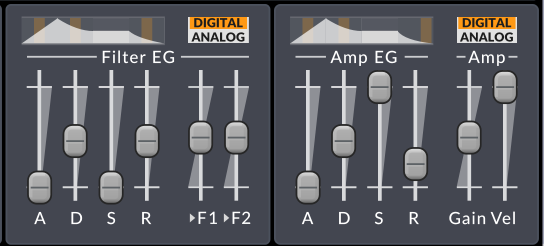

Auf der linken Seite befindet sich der Filter-Envelope-Generator (Filter EG).
Er ist fest mit den beiden Filtern verdrahtet, deren Tiefe mit den Slidern **\>F1** und **\>F2** eingestellt wird.

Auf der rechten Seite befindet sich der Amplitude-Envelope-Generator (Amp EG). Dieser ist fest mit der Gain
stufe des Filterblocks verbunden.

 

*Die ADSR-Hüllkurvenstruktur*

Die Hüllkurvengeneratoren sind vom 4-stufigen ADSR-Typ. Dies ist die häufigste
Form von EG, die in Synthesizern verwendet wird, und ist nach ihren vier Stufen
**Attack**, **Decay**, **Sustain** und **Release** benannt. Wenn Sie neu
in der Synthesizer-Programmierung sind, sollte Ihnen die Abbildung einen guten Eindruck vermitteln, 
wie sie funktionieren. Was Sie sich merken müssen, ist, dass,
nachdem die Hüllkurve die Attack- und Decay-Phasen durchlaufen hat, bleibt sie solange in der Sustain
Phase, bis die Taste losgelassen wird.

**Attack**, **Decay** und **Release** sind zeitbasierte Parameter und können mit einem Rechtsklick auf einen der Slider temposynchronisiert werden.
Sie finden auch eine Option, mit der Sie diese drei Regler für jeden Hüllkurvengenerator gleichzeitig temposynchronisieren können.

Über den Reglern der Hüllkurvenstufe befindet sich eine grafische Darstellung der
ADSR-Struktur.

Wenn der Hüllkurvenmodus auf **Digital** eingestellt ist, gibt es kleine einstellbare orangefarbene Felder
in der Grafik. Wenn Sie diese horizontal ziehen, können Sie die Krümmung der verschiedenen Stufen der Hüllkurve einstellen.

Wenn der Hüllkurvenmodus auf **Analog** gesetzt ist, wird die Krümmung der verschiedenen Stufen
automatisch auf eine Form eingestellt, die versucht, analoges Verhalten zu emulieren.

 

### Andere Parameter zur Klangformung

**Keytrack root note** - Stellt den Grundton des Filter-Keytrackings und die
Keytrack-Modulationsquelle ein. Bei der Grundtonart hat die Keytrack-Modulationsquelle
den Wert Null. Oberhalb/unterhalb davon hat sie
eine positive/negative Modulation in Abhängigkeit vom Abstand zum Grundton
in Oktaven. Dieser Parameter hat keinen Einfluss auf die Oszillator-Tonhöhe.

**Keytrack amount sliders** - Bestimmt den Anteil des Filter-Keytrackings, der auf jeden Filter 
angewendet wird.

**HP** - Steuert den Szenen-Hochpassfilter (Szenenparameter). Dieser Parameter kann deaktiviert werden, wodurch er
aus dem Audiopfad entfernt wird.

**FM configuration** - Legt fest, wie Oszillator FM (Frequenzmodulation)
geroutet wird.

**FM depth** - Bestimmt die Tiefe der Oszillator-FM.

**Waveshaper type** - Wählt den Typ des nichtlinearen
Wave-Shaping-Elements.

**Waveshaper drive** - Stellt die Stärke der Ansteuerung des Waveshapers ein. Dieser Regler kann erweitert werden.

**Amp Vel.** - Legt fest, wie **Amp Gain** mit der Anschlagsstärke skaliert. Dies
ist in der maximalen Position neutral. Andere Einstellungen sorgen für eine Dämpfung
bei niedrigeren Anschlagsstärken, so dass diese Einstellung den Parameter **Amp Gain**
nie durch die Anschlagstärke erhöht.

**Amp Gain** - Steuert das Verstärkungselement innerhalb des Filterblocks.

 

### Scene Output

Die Ausgangsstufe befindet sich im Audiopfad hinter dem Filterblock. Da
sie außerhalb der Filterblock-Struktur liegt, hat eine Änderung der Verstärkung hier
keinen Einfluss auf die Klangfarbe der Stimme (im Gegensatz zum vorherigen
Gain-Regler, der die Wirkung von Feedback und des Waveshapings beeinflussen kann),
kann aber dennoch die Klangfarbe der Effektsektion verändern, wenn nicht-lineare
Effekte (wie Verzerrung) angewendet werden.

**Volume** - Lautstärkeregler für die Szene. Sie können wählen, ob der Szenenausgang bei **+18 dBFS** (Voreinstellung) oder
**0 dBFS** hart geclippt werden soll oder das **Hard Clipping** deaktiviert wird, indem Sie mit der rechten Maustaste auf diesen Regler klicken und die gewünschte Option wählen.

**Pan** - Pan/Balance-Regler

**Width** - Der Betrag der Stereospreizung (nur vorhanden für die Filterblock-Konfigurationen **Stereo** und
**Wide**)

**Send FX 1/2 Level** - Send-Pegel für Send-Effekt 1/2. (Szenenparameter)

 
 
 
 

# Modulation/Routing Sektion

Die Modulationssektion unterscheidet sich von den Sektionen Klangerzeugung
und Shaping, da keine Audiodaten durch geleitet werden. Stattdessen ermöglicht sie
Ihnen die Parameter in den anderen Sektionen von verschiedenen Quellen aus 
steuern.

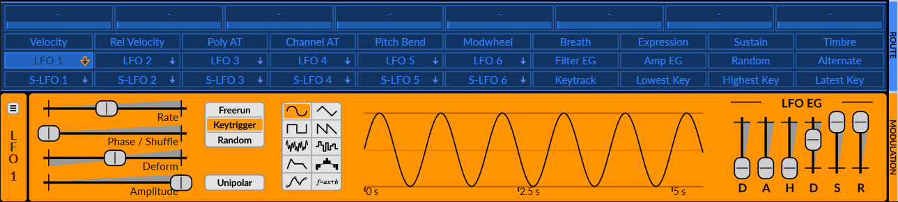

 

## Routing

Das Modulations-Routing in Surge ist im Vergleich zu den meisten Synthesizern ein wenig anders,
aber es ist tatsächlich sehr intuitiv und extrem leistungsfähig, dank der Routing-Leiste.

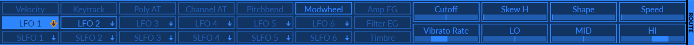

 

### Wie Sie Modulation auf Parameter anwenden
So funktioniert es:

1. Wählen Sie die Modulationsquelle aus, die Sie verwenden möchten.

    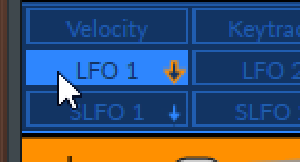

2. Aktivieren Sie den Routing-Modus mit einem zweiten Klick auf die Quelle. Sie wird hellgrün,
und die Slider, die moduliert werden können, zeigen einen blauen Slider für die Modulationstiefe zusätzlich zu ihrem normalen Slider an.

    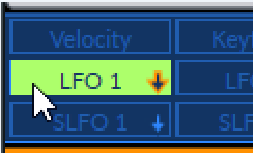

3. Ziehen Sie den gewünschten Modulations-Slider (blauer Slider) an die Position, an der der Parameter stehen soll
(z.B. am oberen Peak eines Sinus-LFOs oder nach der Attack-Phase einer Hüllkurve).
Der volle Bereich der Modulation wird dann mit dem entsprechenden grünen Balken auf dem Slider angezeigt.

    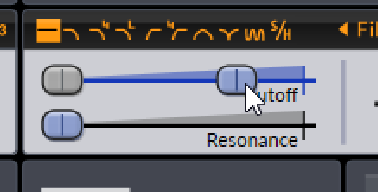

4. Deaktivieren Sie den Routing-Modus, indem Sie erneut auf die Modulationsquelle klicken.

    

 
Alternativ kann der Routing-Modus auch durch Drücken von **TAB** auf der Tastatur ein- oder ausgeschaltet werden,
sowie durch Drücken der Maustasten **Mitte**, **Vorheriges** oder **Nächstes** an beliebiger Stelle auf der Oberfläche.

Sie können auch direkt auf den Dialog für den numerischen Modulationswert zugreifen (erklärt [hier](#edit-value))
indem Sie **Strg/Cmd** auf der Tastatur gedrückt halten und dann die gewünschte Modulationsquelle über den Zielparameter ziehen.

Beachten Sie, dass der Modulationsbereich immer **relativ** zum Basiswert ist, der durch den grauen Slider dargestellt wird.
Das bedeutet, dass das Verschieben seiner Position dann den gesamten Modulationsbereich nach oben oder unten verschiebt.
Das bedeutet auch, dass, wenn der Wert eines Modulationsreglers kleiner als der Basiswert ist,
die Polarität der Modulation invertiert wird.

Wenn Sie die Modulation auf bestimmte zeitbasierte Parameter (wie Portamento, Hüllkurven-Attack usw.) anwenden,
die auf 0,00 Sekunden eingestellt sind, kann es vorkommen, dass die Modulation aufgrund der internen Funktionsweise nicht richtig ausgelöst wird.
Um dies zu beheben, erhöhen Sie den betreffenden Parameter einfach um einen sehr kleinen Betrag, so dass er nicht den Wert
von 0 hat.

 

### Modulieren von LFO-Parametern mit einem anderen Modulator

Wenn Sie auf einen der LFO-Buttons in der Routing-Leiste klicken, werden sowohl die LFO-Quellenauswahl
als auch der LFO-Editor ausgewählt. Die beiden Aktionen können jedoch getrennt werden, da Sie wählen können, welche Schaltfläche als Modulations-Routing-Quelle ausgewählt wird, und gleichzeitig Parameter von **einem anderen LFO**
als der Quelle bearbeiten können.

Dazu wählen Sie die Quelle normal aus und klicken dann
auf den Mini-Button eines anderen LFOs (der kleine orange Pfeil):

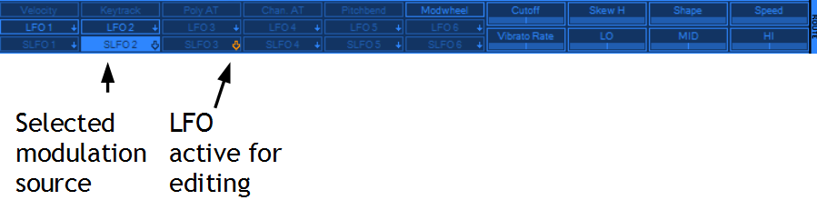

Damit können Sie effektiv **die Parameter eines LFOs mit (einer) beliebigen anderen Modulationsquelle(n)** modulieren.
Beachten Sie jedoch als Beispiel, dass ein S-LFO logischerweise Parameter eines LFOs modulieren kann, aber
ein LFO **nicht** die Parameter eines S-LFOs.
(siehe [Voice-Modulatoren vs. Scene-Modulatoren](#voice-modulatoren-vs-scene-modulatoren)).

Denken Sie daran, dass Sie auch sehen können, welcher LFO gerade im Editor angezeigt wird, indem Sie schauen, was
vertikal links neben dem Editor steht.

 

### Modulierte Slider

Sobald ein Slider einer Modulationsquelle zugewiesen ist, zeigt die Blaufärbung seines Fachs an
ob der Parameter moduliert wird und von welcher Quelle.

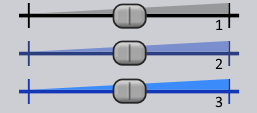

1) Parameter ist nicht moduliert (grau)

2) Parameter ist moduliert (grau-blau)

3) Parameter wird von der aktuell gewählten Modulationsquelle moduliert (hellblau)

Wenn Sie mit dem Mauszeiger über einen modulierten Slider fahren, wird/werden außerdem die Quelle(n), von der/denen er moduliert wird,
in der Routing-Leiste hervorgehoben. So ist es einfacher zu sehen, welche Modulationsquelle(n)
mit einem Parameter verbunden sind.

 

### Schaltflächen für Modulationsquellen
Sobald sie auf einen Parameter geroutet sind, ändern die Schaltflächen für die Modulationsquellen ihr Aussehen, je nachdem, ob sie ausgewählt sind,
und ob sie im aktuellen Patch geroutet sind oder nicht. (szenenabhängig)

 

1) Ungenutzte Modulationsquelle

2) Verwendete Modulationsquelle

3) Ungenutzte ausgewählte Modulationsquelle

4) Verwendete ausgewählte Modulationsquelle

 

### Löschen der Modulation

Nachdem Sie mit der rechten Maustaste auf einen modulierten Slider geklickt haben, sehen Sie eine Option, mit der Sie die Modulation einfach löschen und von ihrer Quelle trennen können.

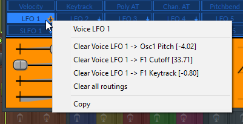

Alternativ können Sie den Modulationsregler (blauer Slider) auch auf 0 zurücksetzen, indem Sie im Routing-Modus darauf doppelklicken
oder durch Eingabe von 0 im Type-In-Editor (siehe [Edit Value](#edit-value)).

 

Außerdem gibt es durch Rechtsklick auf eine beliebige Modulationsquelle die Möglichkeit, entweder einen bestimmten verknüpften Parameter zu löschen,
oder auch alle auf einmal.

 
 
 
 

## Modulatoren
Surge verfügt über vier Haupttypen von Modulationsquellen :

 - LFOs
 - Interne Modulatoren
 - Stimmen- und Noteneigenschaften
 - Makros

Alle diese Modulationsquellen befinden sich in der Routingleiste (siehe [Routing](#routing)) :

 

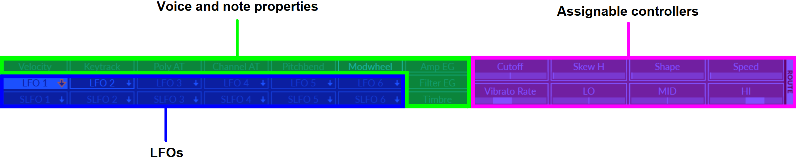

*Die vier Arten von Modulationsquellen, unterteilt in Kategorien.*

 

### Voice-Modulatoren vs. Scene-Modulatoren

Einige Modulationsquellen arbeiten auf der Voice-Ebene, während andere auf der Szenenebene arbeiten.
Obwohl sie auf den ersten Blick ähnlich erscheinen, gibt es einen wichtigen Faktor, der sie voneinander unterscheidet.

Einerseits hat ein Voice-Modulator getrennte Modulationspfade *für jede Stimme*,
das bedeutet, dass er Parameter auf Voice-Ebene (wie z.B. Filter-Cutoff) steuern kann, aber keine Parameter auf Szenenebene (wie z.B. FX-Pegel oder Szenentonhöhe).

Andererseits hat ein Szenenmodulator einen identischen Modulationspfad *für die gesamte Szene*, so dass er sowohl Parameter der Szenenebene **als auch** Parameter der Voice-Ebene steuern kann.

 

*Oben, drei Voice-LFOs. Unten, drei Scene-LFOs, wobei "S-" für Scene steht.*

 
Um diese Unterscheidung zu demonstrieren, nehmen wir an, ein Sinus-LFO moduliert die Cutoff eines Filters.
Wenn nun 3 Noten mit einer kleinen Verzögerung zwischen den einzelnen Noten angeschlagen werden, wird die Phase des LFOs zwischen den Noten entsprechend verzögert.

Sie werden in der Tat deutlich hören, wie sich der Cutoff des Filters bei jeder Note unabhängig voneinander bewegt, was den Eindruck erweckt, dass es drei LFOs und drei Filter gibt (was tatsächlich der Fall ist!).
Das gleiche Prinzip gilt für die Hüllkurven.

 

Anders als bei der ersten Demonstration ist es diesmal jedoch so, dass wenn ein S-LFO einen bestimmten Parameter moduliert,
und Sie mehrere Noten anschlagen, wird nicht für jede Stimme ein LFO "hinzugefügt", was den Eindruck erweckt, dass es einen einzigen LFO gibt
der die Grenzfrequenz des Filters moduliert, statt vieler.

Weitere Informationen finden Sie unter [Modulations Routing im detail](#modulations-routing-im-detail) im Abschnitt "Technische Referenz".
 
 

### LFOs

Im Vergleich zu einigen anderen Synthesizern verfügt Surge nicht über dedizierte **LFO**, **Envelope**, **Step Sequencer** oder
**MSEG** Modulationsquellen. Stattdessen sind diese in jedem LFO integriert. Dies ermöglicht effektiv die
Flexibilität von bis zu 12 LFOs, Hüllkurven, Step-Sequenzern oder MSEGs und alles dazwischen, einfach durch
die Änderung ihre Form.

Die LFOs von Surge sind sehr flexibel und verfügen über eine eingebaute DAHDSR-Hüllkurve, die
entweder als dedizierter Hüllkurvengenerator arbeitet oder die Amplitude anderer Modulationsarten zeitlich formt.

 

Surge verfügt über insgesamt 12 LFOs:
 - 6 Voice-LFO-Quellen (z.B. mit LFO 1-6 beschriftet)
 - 6 Scene-LFO-Quellen (z.B. mit S-LFO 1-6 beschriftet)

Eine Erläuterung des Unterschieds zwischen LFOs und S-LFOs finden Sie unter [Voice-Modulatoren vs. Scene-Modulatoren](#voice-modulatoren-vs-scene-modulatoren).

 
 

#### Shapes

LFO-Formen (von links nach rechts, von oben nach unten):

| -------- | ------------------------------------------------------------------------------------------------------------------------------------------ | ---------------- |
| Sine | Sinuswellen LFO | Vertikale Biegung |
| Triangle | Dreieckswellen LFO | Vertikale Biegung |
| Square | Pulswellen LFO | Pulsbreite |
| Sawtooth | Sägezahnwellen LFO | Vertikale Biegung |
| Noise | Glattes Rauschen LFO | Korrelation |
| S&H | Sample & Hold (gestuftes Rauschen) LFO | Korrelation |
| Envelope | Hüllkurvengenerator - setzt den LFO auf einen konstanten Ausgang von 1, der dann durch den LFO EG geformt werden kann (siehe [LFO-Envelope-Generator](#lfo-envelope-generator)) | Hüllkurvenform |
| Step Seq | 16-Schritt-Step-Sequenzer (siehe [Step Sequencer](#step-sequencer)).                                                               | Smoothness/Spikyness |
| MSEG | Vollständig editierbarer MSEG (Multi-Segment Envelope Generator) mit einer großen Anzahl von Kurventypen und verschiedenen Bearbeitungsmöglichkeiten (siehe [Multi-Segment Envelope Generator](#multi-segment-envelope-generator-mseg))       | Abhängig von Segmenttyp und Konfiguration |
| f = ax + b | Hier gibt es nichts zu sehen, nur einen kleinen Teaser für eine kommende neue Modulationsquelle... :-) |[...]|

*Links, die verschiedenen Formen und ihre Erklärung. Rechts, die Art und Weise, wie der* ***Deform*** *Parameter die Wellenform beeinflusst.*

Je nachdem, welche Form für einen bestimmten LFO ausgewählt wurde, ändert sich sein Name in der Routing-Leiste.
Wenn Sie die ersten 6 Wellenformen verwenden, heißt er **LFO**. Wenn Sie jedoch die Hüllkurvenform verwenden, wird **ENV**
angezeigt, **SEQ** wird angezeigt, wenn der Step-Sequenzer verwendet wird, und für den MSEG wird **MSEG**
angezeigt. Die Szenen-LFOs haben ebenfalls ihre entsprechenden Bezeichnungen:

 

#### Parameter
 

**Rate** - Steuert die Modulationsrate. Wenn der Typ auf
Step Seq eingestellt ist, entspricht ein Schritt einem ganzen Zyklus. Dieser Slider kann tempo-synchronisiert werden
und über sein Kontextmenü deaktiviert werden.
Das Deaktivieren der Rate friert den LFO effektiv auf einen bestimmten konstanten Wert ein, abhängig vom
Phase/Shuffle-Parameter.
Dies kann z.B. für das manuelle Scrubbing in einem Wellenformzyklus eines LFOs nützlich sein und kann auch in
der gleichen Weise im Sequenzer verwendet werden. Dieses Feature kann auch genutzt werden um die Modulationsquelle,
in Verbindung mit dem Triggermodus "Random", als **randomizer** einzusetzen. Eine einfachere [Random](#random-modulationsquelle)
Modulationsquelle kann jedoch auch für diesen Zweck verwendet werden.
Darüber hinaus kann die Modulation sogar mit einer anderen Modulationsquelle auf den Parameter Phase/Shuffle angewendet werden,
was viele Möglichkeiten eröffnet, z.B. den eingefrorenen LFO effektiv als Mod-Mapper zu verwenden.

Hinweis: Wenn Sie im LFO-Editor mit der rechten Maustaste auf Parameter klicken, die temposynchronisiert werden können, gibt es auch die Option, alle LFO-Parameter auf einmal zu temposynchronisieren.

**Phase/Shuffle** - Steuert die Startphase der Modulationswellenform. Wie bei jedem Parameter,
kann er moduliert werden. In diesem Fall ändert sich sein modulierter Wert jedoch nicht, nachdem die Modulation ausgelöst wurde
(zum Beispiel ist es nicht möglich, die Phase eines LFOs zu verschieben, während eine Note gedrückt wird).
Es wird nur die Startphase berücksichtigt.

**Amplitude** - Steuert die Amplitude der Modulation. Dies ist der Parameter
den Sie verwenden sollten, wenn Sie die Tiefe eines LFOs mit einem
Controller steuern wollen (wie z.B. die Steuerung der Vibratotiefe mit dem Modulationsrad).
Dieses Steuerelement kann auch über sein Kontextmenü erweitert werden, wodurch Sie einen negativen Amplitudenbereich erreichen können (-100 bis 100% statt 0 bis 100%).

**Deform** - Verformt die Modulationsform auf verschiedene Weise. Der Effekt variiert in Abhängigkeit von der gewählten Form.
Für die Formen **Sine**, **Triangle**, **Sawtooth** und **Envelope** sind verschiedene Verformungsarten verfügbar,
und können durch Rechtsklick auf den **Deform** Slider aufgerufen werden.

**Trigger-Mode** - Wählt aus, wie der LFO ausgelöst wird, wenn eine neue Note gespielt wird:

- **Freerun** - Die Startphase des LFOs wird mit der Songposition des Hosts synchronisiert, damit er kontinuierlich im Hintergrund läuft. Die Modulation wird in ihrer Startphase ausgelöst, wenn die Wiedergabeposition entweder an der Anfangsposition ist und der Song zu spielen beginnt, oder wenn die Wiedergabeposition am Anfang eines Loops zurückgeht
zum Beispiel. Freerun verhält sich bei Voice-LFOs oder Szenen-LFOs gleich.
- **Keytrigger** - Die Startphase des LFOs wird ausgelöst, wenn eine neue Note gedrückt wird.
Wenn der Synth auf "Poly" eingestellt ist, wird bei Verwendung eines Voice-LFOs jede neue Stimme mit einem eigenen LFO getriggert.
Wenn Sie jedoch einen Szenen-LFO verwenden, legt die erste Stimme die Position des LFOs fest, und die anderen folgen ihr dann.
- **Random** - Die Startphase des LFOs wird auf einen zufälligen Punkt in seinem Zyklus gesetzt. Wenn der Synth auf "Poly" eingestellt ist,
wird bei Verwendung eines Voice-LFOs für jede neue Stimme ein eigener LFO mitgetriggert.
Wenn Sie jedoch einen Szenen-LFO verwenden, legt die erste Stimme die Position des LFOs fest, und die anderen folgen ihr dann.

**Unipolar** - Wenn aktiviert, erfolgt die Modulation im \[0 .. 1\]
Bereich (unipolar). Wenn nicht, liegt sie im Bereich \[-1 .. 1\] (bipolar).

Der Modulationsbereich für einen Parameter wird durch einen grünen Balken dargestellt, wenn der Routing
Modus aktiviert ist (siehe [Routing](#routing)).

*Modulation eines Reglers von einer bipolaren Quelle*

 

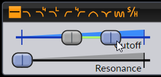

*Modulation eines Reglers von einer unipolaren Quelle*

 
 

#### LFO Envelope Generator

Die Hüllkurvengeneratoren sind vom 6-stufigen DAHDSR-Typ, die
mit dem Wellenformgenerator multipliziert werden, unabhängig davon, welche LFO-Form gewählt ist.
Das bedeutet, dass, wenn die LFO-Form auf "Envelope" eingestellt ist, der Ausgang einfach 100% beträgt,
und dann durch den LFO EG geformt werden kann.

Beachten Sie auch, dass bei Verwendung der Hüllkurvenform die Hüllkurve immer auf Tastentrigger ausgelöst wird,
unabhängig davon, wie der Trigger-Modus eingestellt ist.

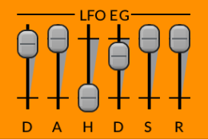

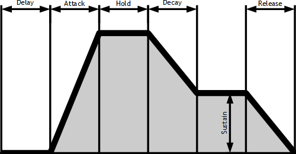

*6-stufige DAHDSR-Hüllkurve*

 

#### Step Sequencer

Die Form **Step Seq** beherbergt einen Step-Sequencer-Editor an der Stelle, an der sich die LFO-Anzeige befinden würde. Er erlaubt Ihnen,
die Ausgangswellenform mit bis zu 16 Schritten einzuzeichnen.

*Step Sequencer Editor*

Die beiden blauen Marker definieren Loop Punkte, innerhalb derer die
Sequenz wiederholt wird, sobald sie in den Loop gelangt.
Die linke Maustaste wird zum Zeichnen verwendet, während die rechte Maustaste die Werte auf
Null setzt.

Um einen Step schnell auf 0 zu setzen, doppelklicken Sie entweder auf einen Schritt oder halten Sie Strg/Cmd gedrückt und klicken oder ziehen Sie mit der Maus über
die gewünschte(n) Stufe(n).

Wenn Sie mit der rechten Maustaste klicken und über die Stufen ziehen, können Sie eine gerade Linie über die gewünschten Stufen zeichnen,
Dadurch wird ein perfekt lineares Treppenmuster erzeugt.

Wenn Sie beim Zeichnen die **Shift** Taste gedrückt halten, quantisieren Sie die Werte auf
die Skalengrade (1/12 im Falle der Standardstimmung, oder eventuell andere
für benutzerdefinierte Stimmungen), die den Bereich von **einer Oktave** abdecken.
Außerdem stehen bei gedrückter **Shift + Alt** doppelt so viele Werte zur Verfügung, also
nützlich, wenn Sie die Tonhöhe stattdessen um **zwei Oktaven** modulieren.

Weitere Informationen zur mikrotonalen Tonhöhenmodulation mit dem Step-Sequenzer finden Sie in
[diesem Artikel](https://github.com/surge-synthesizer/surge-synthesizer.github.io/wiki/Microtonal-pitch-modulation-using-the-step-sequencer)
im Surge-Wiki.

 

Die Step-Sequenzer in **Voice-LFOs** haben eine zusätzliche Spur am oberen Rand des
Step-Editors, die es erlaubt, die beiden regulären Voice-Hüllkurven neu zu triggern
(die Amplituden- und Filter-Hüllkurven-Generatoren), wenn das kleine
Rechteck in dem jeweiligen Schritt gefüllt ist.

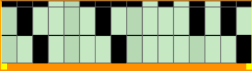

*Step Seq von LFO 1 mit dem Re-Trigger-Fenster*

Durch einen Shift-Klick oder einen Rechtsklick auf diese Rechtecke kann der angegebene Schritt im Sequenzer jedoch 
**nur eine der beiden Hüllkurven** triggern. Wenn der Schritt auf der linken Seite halb ausgefüllt ist,
wird nur die Filterhüllkurve ausgelöst. Wenn er rechts gefüllt ist, wird nur die Amplitudenhüllkurve ausgelöst.

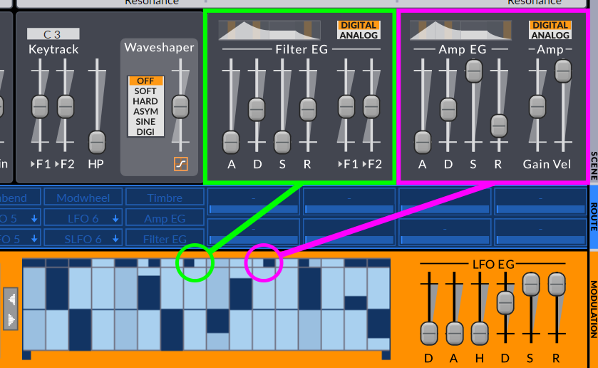

 

Der Parameter **Deform** verleiht der **Step Seq**-Wellenform eine große Flexibilität. Ein Wert von
0% gibt die Steps so aus, wie sie im Editor aussehen. Negative
Werte ergeben eine zunehmend spitz zulaufende Wellenform, während positive Werte
Werte die Ausgabe glätten.

|**Negative Verformung**| 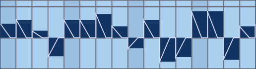|
|**Positive Verformung**| |

*Auswirkung des Deform-Parameters auf die Step-Seq-Wellenform*

 
 

#### Multi-Segment-Envelope-Generator (MSEG)

Der Multi-Segment-Hüllkurven-Generator (MSEG) von Surge ist leistungsstark und voll editierbar mit einer großen Anzahl von Kurventypen
und verschiedenen Bearbeitungsoptionen. Er kann verwendet werden, um kompliziertere LFO-Wellenformen oder Hüllkurven zu erzeugen
im Vergleich zu den zuvor erwähnten Modulationsformen.
Mit der Kombination aus verschiedenen Einstellungen im Editierfenster und den üblichen Parametern aus dem LFO-Editor
können Sie praktisch jede erdenkliche Modulationsform erzeugen.

Um dieses MSEG-Editierfenster zu öffnen, können Sie entweder auf den kleinen Bleistift-Button neben der Wellenformanzeige klicken (1),
auf die Wellenanzeige selbst klicken (2) oder auf das MSEG-Symbol in der Modulationsart-Auswahl doppelklicken (3):

 

**Default MSEG State**

Nach dem Öffnen sehen Sie eine Form, die als Hüllkurve arbeitet, wenn Sie einen Voice-LFO verwenden, oder eine Dreieckswelle
die als LFO arbeitet, wenn Sie einen Szenen-LFO verwenden. In jedem Fall können Sie entweder auf diese
Formen aufbauen, wenn sie Ihren Bedürfnissen entsprechen, oder Sie können sie auf eine einfache gerade Linie zurücksetzen, indem Sie mit der rechten Maustaste auf eine beliebige Stelle
im Editierfenster klicken und dann **Create -> Minimal MSEG** wählen. Weitere Informationen zu diesen Menüeinträgen
finden Sie weiter unten.

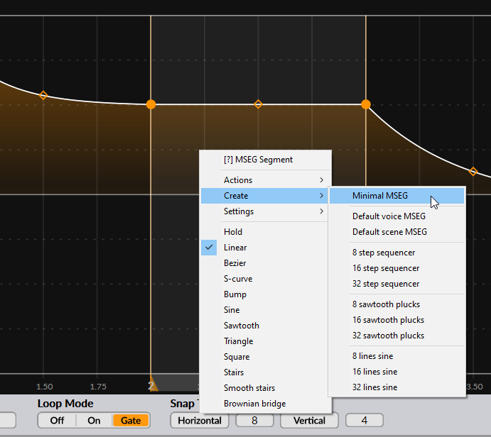

 

**Zooming und panning**

Im MSEG-Editor können Sie die Ansicht nach links oder rechts schwenken, indem Sie entweder mit der linken Maustaste oder mit der mittleren Maustaste klicken,
und dann auf dem Hintergrund nach links oder rechts ziehen.

Sie können auch hinein- und herauszoomen, indem Sie entweder mit dem Mausrad scrollen oder mit der linken Maustaste klicken
und dann die Maus nach oben oder unten ziehen. Alternativ können Sie auch wieder mit der mittleren Maustaste klicken und ziehen, wenn Sie dies bevorzugen.

 

**Hinzufügen und Entfernen von Knoten**

Im MSEG von Surge besteht ein Segment aus seinem Anfangsknoten (Punkt) und dem Segment selbst. Der "Endknoten" eines Segments
ist eigentlich der Startknoten des nächsten Segments. Um einen neuen Knoten hinzuzufügen, doppelklicken Sie einfach auf die Stelle, an der Sie ihn
hinzugefügt werden soll. Um einen Knoten und sein folgendes Segment zu entfernen, doppelklicken Sie einfach auf den Knoten, den Sie entfernen möchten.
Beachten Sie, dass Sie nur Knoten entfernen können, wenn mehr als zwei Knoten in der Form vorhanden sind.

 

**Kontrollpunkte**

Außerdem finden Sie oft einen **Kontrollpunkt** in der Mitte eines Segments.
Dieser kann vertikal (und manchmal auch horizontal) gezogen werden, um die Krümmung des Segments oder andere Eigenschaften zu verändern,
abhängig vom Linientyp. Um einen Kontrollpunkt auf seine Standardposition zurückzusetzen, klicken Sie einfach doppelt auf ihn.

 

**MSEG-Bearbeitungs- und Verhaltensoptionen**

Am unteren Rand des Editors befinden sich einige Optionen zur Konfiguration der Bearbeitungsmodi und des allgemeinen Verhaltens des MSEG:

- **Movement Mode** - Legt das Verhalten beim Verschieben von Knoten fest.
  - **Single** - Beim horizontalen Ziehen eines Knotens wird ein einzelner Knoten verschoben, ohne die anderen zu beeinflussen.
  - **Shift** - Beim horizontalen Ziehen eines Knotens werden die auf den verschobenen Knoten folgenden Knoten verschoben, wobei die Länge des zu diesem Knoten gehörenden Segments konstant bleibt.
  - **Draw** - Sperrt das horizontale Ziehen von Knoten, so dass Sie über vorhandene Knoten ziehen können, um deren Wert  mithilfe einer simplen 
  Wischbewegung einzuzeichnen.

- **Edit Mode** - Konfiguriert den MSEG-Editor für die Arbeit im Hüllkurven- oder LFO-Modus.
  - **Envelope** - Zeigt ziehbare Loop-Punkte und die Region an (stellt effektiv die Sustain-Stufe in einer Hüllkurve dar).
  - **LFO** - Blendet die verschiebbaren Loop-Punkte und die Region aus, verknüpft den Wert der Start- und Endknoten, um den
  Wellenformzyklus, hält den Loop-Modus immer aktiviert (auch wenn er auf "off" gestellt ist).

- **Loop-Mode**
  - **Off** - Kein Loop im Hüllkurvenmodus, deaktivieren Sie verschiebbare Loop-Punkte.
  - **On** - Endlosschleife im Loop-Bereich (zwischen den Loop-Punkten). Nachfolgende Segmente, falls vorhanden,
  werden nie erreicht.
  - **Gate** - Loop, bis die Note losgelassen wird, dann sofortiger Übergang zu den Segmenten, die auf die Loop-Region folgen.

- **Snap To Grid**
  - **Horizontal** - Aktiviert das horizontale Einrasten am Raster. Das Zahlenfeld rechts daneben entspricht der
  horizontalen Rasterauflösung. Sie können das horizontale Einrasten auch vorübergehend aktivieren, indem Sie die Strg/Cmd-Taste
  während des Ziehens gedrückt halten.
  - **Vertical** - Aktiviert das vertikale Einrasten am Raster. Das Zahlenfeld rechts daneben entspricht der
  vertikalen Rasterauflösung. Sie können das vertikale Einrasten auch vorübergehend aktivieren, indem die Alt-Taste
  während des Ziehens gedrückt halten.

 

**Segmentoptionen**

Jedes Segment verfügt über Optionen in einem Kontextmenü, auf das Sie mit einem Rechtsklick in den
Bereich des jeweiligen Segments zugreifen können. Einige davon werden nur auf das mit der rechten Maustaste angeklickte Segment angewendet, während 
andere auf die gesamte Form angewendet werden:

- **Actions**
  - **Split** - Teilt das Segment in zwei Teile, indem ein neuer Knoten in seiner Mitte hinzugefügt wird
  - **Delete** - Entfernt das Segment und seinen Anfangsknoten
  - **Double duration** - Verdoppelt die Gesamtdauer der gesamten Form
  - **Half duration** - Halbiert die Gesamtdauer der gesamten Form
  - **Flip vertically** - Spiegelt die gesamte Form vertikal
  - **Flip horizontally** - Spiegelt die gesamte Form horizontal
  - **Quantize notes to snap division** - Quantisiert die Knoten in der gesamten Form auf die nächstgelegene horizontale Rasterposition. Nur im Hüllkurven-Bearbeitungsmodus verfügbar.
  - **Quantize notes to whole units** - Quantisiert die Knoten in der gesamten Form horizontal auf die nächstgelegenen ganzen Zeiteinheiten. Nur im Hüllkurven-Bearbeitungsmodus verfügbar.
  - **Distribute nodes evenly** - Verteilt die vorhandenen Knoten der gesamten Form gleichmäßig auf der horizontalen Achse zwischen dem ersten und dem letzten Knoten.

- **Create**
  - **Minimal MSEG** - Lädt eine gerade Linie, die im Wert von 1 bis 0 geht, ein guter Ausgangspunkt, um darauf aufzubauen.
  - **Default voice MSEG** - Lädt die Standard-Stimmen-MSEG-Voreinstellung (Hüllkurvenform)
  - **Default scene MSEG** - Lädt das Standard-MSEG-Preset für die Szene (Dreieckswellen-LFO-Form)
  - **8, 16, 32 step sequencer** - Ersetzt die vorhandene Form durch eine 8-, 16- oder 32-Step-Sequenzerform
  - **8, 16, 32 sawtooth plucks** - Ersetzt die vorhandene Form durch eine 8-, 16- oder 32-fache Sägezahn-Zupf-Form
  - **8, 16, 32 lines sine** - Ersetzt die vorhandene Form durch eine Sinuswelle, die aus 8, 16 oder 32 Segmenten besteht.

- **Settings**
  - **Link start and end nodes** - Verknüpft den Wert des Start- und Endknotens (nützlich z.B. für nahtloses
  Loopen).
  - **Deform applied to segment** - Legt fest, ob das ausgewählte Segment vom
   Deform-Parameter aus dem LFO-Editor beeinflusst wird oder nicht (siehe [deform parameter](#parameter)).
  - **Invert deform value** - Invertiert die auf das ausgewählte Segment angewendete Verformungspolarität.

- **Segment types** - Liste der Linientypen, aus denen ein Segment bestehen kann. Der Kontrollpunkt, falls vorhanden,
  hat je nach verwendetem Typ eine andere Wirkung.
  - **Hold** - Hält den Wert des vorherigen Knotens bis zum Endknoten des Segments. Kein Kontrollpunkt vorhanden.
  - **Linear** - Einzelne Linie. Der Kontrollpunkt steuert die Krümmung des Segments.
  - **Bezier** - Einzelne Linie. Der Kontrollpunkt kann das Segment frei krümmen.
  - **S-Curve** - Gekrümmte Linie. Der Kontrollpunkt bestimmt, wie abrupt die S-Form ist und ihre Richtung.
  - **Bump** - Einzelne Linie. Der Kontrollpunkt kann nach oben oder unten bewegt werden, um einen "Höcker" im Segment zu erzeugen.
  - **Sine, sawtooth, triangle, square** - Sinus-, Sägezahn-, Dreieck- oder Rechteckwellen.
  Der Kontrollpunkt bestimmt, wie viele Wellenzyklen zwischen dem Anfangs- und Endknoten des Segments liegen.
  - **Stairs, smooth stairs** - Linientypen Treppe oder glatte Treppe. Der Kontrollpunkt bestimmt,
  wie viele Stufen zwischen dem Anfangs- und Endknoten des Segments liegen.
  - **Brownian bridge** - Zufällig zwischen dem Anfangs- und Endknoten bei jeder Auslösung.
  Durch Verschieben des Kontrollpunkts nach unten wird die Anzahl der Schritte angepasst, während sie auf 24 äquidistante Schritte quantisiert werden
  (nützlich z.B. für zufällige Skalen). Wenn Sie den Kontrollpunkt nach oben bewegen, wird die Anzahl der Schritte ebenfalls angepasst,
  dieses Mal jedoch ohne Quantisierung. Der horizontale Wert des Kontrollpunkts stellt die Korrelation ein.

 
 

#### LFO-Presets
Links neben dem Parameter **Rate** befindet sich ein kleines Menüsymbol. Wenn Sie es anklicken, werden Optionen angezeigt, um
den ausgewählten LFO-Zustand zu speichern, zuvor gespeicherte Zustände zu öffnen und schließlich Presets erneut zu scannen, um die Liste zu aktualisieren.
Die Presets werden nach Modulationsform kategorisiert.

#### LFO-Einstellungen kopieren/einfügen
Nachdem Sie einen LFO eingerichtet haben, können Sie seine Einstellungen kopieren und in einen anderen LFO einfügen,
indem Sie mit der rechten Maustaste auf einen beliebigen LFO in der blauen Routing-Leiste klicken und die Optionen **Copy** und **Paste** verwenden.

 

Weitere Informationen zu den LFO-Algorithmen finden Sie unter
[LFOs](#LFOs) im Abschnitt "Technische Referenz".

 
 

### Interne Modulatoren

#### Filter EG Modulationsquelle 
Die Filter-Envelope-Generator-Modulationsquelle, die mit "Filter EG" beschriftet ist, ist einfach eine Modulationsquelle,
die dem Ausgang des Filter EG entspricht, der, wie der Name schon sagt, fest
mit den Filtermodulen verbunden ist. Auch andere Parameter können durch den Filter EG um verschiedene Beträge moduliert werden,
indem Sie sie einfach auf diese Quelle routen.

#### Amp EG Modulationsquelle 
Die Amp-EG-Modulationsquelle, die mit "Amp EG" beschriftet ist, ist einfach eine Modulationsquelle, die dem
Ausgang des Amp EG entspricht, der, wie der Name schon sagt, fest mit dem Endstufenmodul verdrahtet ist. Andere
Parameter können ebenfalls durch den Amp EG um verschiedene Beträge moduliert werden,
indem sie einfach auf diese Quelle geroutet werden.

 

#### Random Modulationsquelle
Diese Modulationsquelle arbeitet auf Voice-Ebene. Sie erzeugt einen einzelnen Zufallswert innerhalb des Modulationsbereichs
für jede Stimme, jedes Mal wenn eine Stimme gespielt wird.

Standardmäßig ist diese Modulationsquelle bipolar. Sie können sie jedoch auf eine unipolare Version umschalten, indem Sie
mit der rechten Maustaste darauf klicken und **Switch to Random Unipolar** wählen. Die beiden können auch gleichzeitig verwendet werden,
so dass sie als zwei unabhängige Modulationsquellen betrachtet werden können.

Beachten Sie, dass mehrere Parameter, die an diese Modulationsquelle geleitet werden, alle denselben Wert (in Prozent) erhalten.
Um unterschiedliche zufällige Werte an verschiedene Parameter zu senden, können mehrere LFOs
so konfiguriert werden, dass sie dies mit größerer Kontrolle tun. Siehe die Erklärung von
[dem Parameter **Rate**](#parameter).

 

#### Alternierende Modulationsquelle
Diese Modulation arbeitet auf der Voice-Ebene. Sie erzeugt alternierende Werte zwischen den beiden Extremen des 
Modulationsbereichs.

Standardmäßig ist diese Modulationsquelle bipolar. Sie können sie jedoch auf eine unipolare Version umschalten, indem Sie
mit der rechten Maustaste darauf klicken und **Switch to Alternate Unipolar** wählen. Die beiden können auch gleichzeitig verwendet werden,
daher können sie als zwei unabhängige Modulationsquellen betrachtet werden.

 
 

### Voice und Note Properties

Wie andere Synthesizer empfängt Surge MIDI-Daten, um zu bestimmen, welche Note(n) er spielen soll.
Er kann jedoch auch **MIDI CC**-Daten verwenden, um jeden routbaren Parameter zu modulieren.

Es gibt 14 dieser Voice- und Noteneigenschaften in der Routingleiste:

|**Velocity**|Anschlagdynamik pro Note|Voice-Modulator|Unipolar|
|**Release Velocity**|Anschlagdynamik pro Note|Voice-Modulator|Unipolar|
|**Polyphonic Aftertouch (beschriftet mit Poly AT)**|Per Note polyphoner Aftertouch|Voice Modulator|Unipolar|
|**Channel Aftertouch (beschriftet mit Channel AT)**|Monophoner Aftertouch, wenn MPE deaktiviert ist|Szenenmodulator,  Voice-Modulator im MPE-Modus|Unipolar|
|**Pitch Bend**|Pitch Bend Radwert|Szenenmodulator|Bipolar|
|**Modwheel**|Modulationsradwert|Szenenmodulator|Unipolar|
|**Breath**|Breath-Controller-Signal|Szenenmodulator|Unipolar|
|**Expression**|Wird oft mit Pedalen und für Crescendos oder Decrescendos verwendet|Szenenmodulator|Unipolar|
|**Sustain**|Sustain-Signal, oft von einem Pedal|Szenenmodulator|Unipolar|
|**Timbre**|Hauptanwendung für MPE-Controller|Voice-Modulator|Bipolar|
|**Keytrack**|Pro-Note-Keytrack-Wert|Voice-Modulator|Bipolar|
|**Lowest Key**|Keytrack-Wert, der der tiefsten gespielten Note entspricht|Szenenmodulator|Bipolar|
|**Highest Key**|Keytrack-Wert, der der höchsten gespielten Note entspricht|Szenenmodulator|Bipolar|
|**Latest Key**|Keytrack-Wert, der der zuletzt gespielten Note entspricht|Szenenmodulator|Bipolar|

Beachten Sie, dass nur Modulationsquellen auf Szenenebene auf FX-Sends und Parameter geroutet werden können.
Sie können zum Beispiel **Latest Key** anstelle von **Keytrack** verwenden, um FX-Parameter zu modulieren, da Keytrack
eine Modulation auf Voice-Ebene ist.
Weitere Einzelheiten finden Sie unter [Voice-Modulatoren vs. Scene-Modulatoren](#voice-modulatoren-vs-scene-modulatoren).

 

 

### Macros
Es gibt 8 Makros, und standardmäßig sind sie leer.

Was diese zuweisbaren Controller vom Rest unterscheidet, ist, dass sie mit einem Rechtsklick
einem MIDI-Controller oder einem MIDI-CC-Signal zugewiesen werden können und ihr Wert mit dem blauen digitalen Slider unter ihrem Namen auf dem 
Bildschirm bearbeitet werden kann.

Werksseitig sind die Makros MIDI CC 41-48 zugeordnet, was in vielen MIDI-Controllern der Standardzuweisung
von Drehreglern oder Faderbänken entspricht.

Weitere Informationen finden Sie unter [Continuous-Controller-Information (CC)](#continuous-controller-information-cc) im Abschnitt "Technische Referenz".

Über das Rechtsklick-Kontextmenü können Sie den Controller auch umbenennen.
Außerdem gibt es die typischen Routing- und Löschoptionen,
(siehe [Routing](#routing)) und Sie können wählen, ob ihre Modulation bipolar (sowohl positiv als auch negativ mit 0
in der Mitte) oder unipolar (nur positiv) ist.

Makros können auch per Drag&Drop über andere Makros gezogen werden, um deren Plätze zu tauschen. Klicken Sie dazu einfach mit der linken Maustaste + ziehen Sie über die gewünschte Makro-Slot-Position.

Schließlich ist zu beachten, dass Makros als **globale Modulatoren** gelten, d.h. sie werden von beiden Szenen A und B gemeinsam genutzt und wirken auf beide.
Dies ist nützlich, wenn Sie bestimmte Parameter aus beiden Szenen schnell
an einer einzigen Stelle steuern möchten.

 
 
 
 

# FX Section

Die FX-Sektion steuert die 8 Effekteinheiten des Effektblocks
die in jedem Patch gespeichert sind.

 

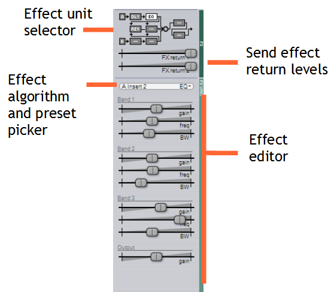

 

## Effect Unit Selector
Der Selektor für die Effekteinheit befindet sich im oberen Bereich der FX-Sektion. Er stellt auch den Signalweg
des Effektblocks dar. Hier ist er im Detail zu sehen:

*Der Effektblock*

Ein **Linksklick** auf eine bestimmte Einheit in der Effektgeräteauswahl bringt diese Einheit in den Editor.
Ein **Rechtsklick** auf eine Einheit deaktiviert/aktiviert sie. Dieser Zustand wird in den Patches gespeichert,
anders als die globale FX-Bypass-Einstellung.

Außerdem können Sie Einheiten per Drag & Drop über andere Einheiten ziehen, um deren Plätze zu tauschen. Wenn Sie **Strg/Cmd** gedrückt halten und
Ziehen können Sie stattdessen Units auf andere Units duplizieren (kopieren), und bei gedrückter **Shift** Taste können Sie die Ziel-Unit einfach 
durch eine andere ersetzen (überschreiben).

Schließlich können Sie mit der rechten Maustaste entweder auf das **A**- oder das **B**-Symbol im Diagramm klicken, um die Optionen für das Hard-Clipping der Ausgabe aufzurufen,
welche denen entsprechen, die zuvor in den Kapiteln [Scene Output](#scene-output)
und [Globale Lautstärke](#fx-bypass-character-und-global-volume) erläutert wurden.

 

## Effekt- und Preset-Picker
Effekte können über den **Effekt- und Preset-Picker** hinzugefügt oder entfernt werden
(direkt unter den FX-Return-Slidern). Sie können auch durch die Effekte und Presets blättern, indem Sie die
Pfeiltasten drücken, die auch im globalen [Patch-Browser](#patch-browser) zu finden sind.

Sie können auch Ihre eigenen Effekt-Presets speichern, die dann global mit
dem Synth gespeichert werden. Schließlich gibt es am unteren Rand dieses Menüs die Optionen **Copy** und **Paste**, mit denen Sie einen Effekt und seine Parameter kopieren und auf einem anderen Gerät einfügen können. Sie können dazu auch Drag-and-Drop-Gesten verwenden
(siehe [Effect Unit Selector](#effect-unit-selector)).

 

## Effekt Editor
Hier können alle Effektparameter bearbeitet werden. Wie beim Oszillator-Editor ändern sich die Parameter der einzelnen Slider
je nach geladenem Effekt.

Hier ist eine Liste der verfügbaren Effekte:
- EQ
- Exciter
- Graphic EQ
- Resonator
- CHOW
- Distortion
- Neuron
- Tape
- Combulator
- Frequency Shifter
- Nimbus
- Ring Modulator
- Treemonster
- Vocoder
- Chorus
- Ensemble
- Flanger
- Phaser
- Rotary Speaker
- Delay
- Reverb 1
- Reverb 2
- Airwindows (Kollektion aus 53 Effekten von Airwindows)
- Conditioner

Weitere Informationen zu den einzelnen Effekten finden Sie unter [Effekt-Algorithmen](#effekt-algorithmen) im Abschnitt "Technische Referenz".

Hinweis: Denken Sie daran, dass **FX-Parameter Szenensteuerungen sind**. Das bedeutet, dass nur Modulationsquellen auf Szenenebene
sie modulieren können.

 
 
 

# Menu Button
In der rechten unteren Ecke befindet sich ein kleiner Menü-Button. Wenn Sie mit der linken Maustaste darauf klicken,
werden Konfigurationsoptionen angezeigt.

Hinweis: Einige dieser Optionen befinden sich auch am oberen Rand der Benutzeroberfläche, um den Zugriff zu erleichtern
(siehe [Statusbereich](#statusbereich)).

Dieses Menü kann auch durch einen Rechtsklick an einer beliebigen Stelle der Benutzeroberfläche geöffnet werden, an der sich keine Bedienelemente befinden.

 

### MPE-Optionen
**MPE** steht für **MIDI Polyphonic Expression**. Sie kann in ihrem Untermenü aktiviert oder deaktiviert werden.
Der aktuelle und voreingestellte Pitch-Bend-Bereich kann hier ebenfalls geändert werden. Schließlich können Sie auch noch
den MPE-Pitchbend-Glättungsbetrag einstellen.

 

### Tuning-Optionen

Surge bietet volle Keyboard-Microtuning-Unterstützung und verwendet eine Implementierung der kompletten
**Scala SCL** und **KBM** Microtuning-Formate.

Die **Tuning**-Menüoptionen sind **Set to standard tuning** und **Set to standard keyboard mapping**.

Darunter befinden sich die Optionen zum Importieren und **Apply .scl file tuning** oder **Apply .kbm keyboard mapping**-Dateien, um
andere Skalen als die Standard-Skala zu verwenden. Direkt darunter befindet sich die Option **Remap A4 (MIDI note 69) directly to...**.
Diese Einstellungen werden im DAW-Status gespeichert und optional in einem Patch abgelegt.

Die Einstellungen **Apply tuning at MIDI input** und **Apply tuning after modulation** bedürfen einer recht ausführlichen Erklärung, die
Sie im Abschnitt [Microtonal Tuning](#microtonal-tuning) der technischen Referenz finden.

**Use ODDSound MTS-ESP (if loaded in DAW)** erlaubt es der [ODDSound MTS-ESP-Suite](http://oddsound.com/), wenn sie in
in der gleichen Session geladen ist, mit Surge zu interagieren.

Am Ende dieses Untermenüs finden Sie die Option **Show current tuning information...**, die eine HTML-Datei öffnet,
die alle Informationen zu den einzelnen Tönen der geladenen Skala enthält, und die **Factory tuning library...**, die
den Speicherort der Stimmungsbibliothek-Dateien im Dateimanager öffnet.

Alternativ können Scala SCL- und KBM-Dateien auch über den [Statusbereich](#statusbereich) importiert werden oder durch
Ablegen irgendwo auf der Oberfläche von Surge.

Siehe [Microtonal Tuning](#microtonal-tuning) in der technischen Referenz für weitere Informationen zur Mikrotonalen Stimmung
in Surge.

 

### Zoom
Die Option **Zoom** kann bei bestimmten Monitoren und Konfigurationen sehr nützlich sein.

In ihrem Untermenü gibt es verschiedene Optionen, um den Maßstab der gesamten Benutzeroberfläche auf eine bestimmte Größe zu ändern.
Beachten Sie, dass Sie die Größe nicht beliebig ändern können, da es eine Obergrenze gibt, die von Ihrer Bildschirmauflösung abhängt.

Wenn eine neue Instanz von Surge geladen wird, wird der Zoom auf die Standardgröße gesetzt. Um diesen Wert zu ändern,
gehen Sie zurück in dieses Untermenü und wählen Sie die Option "Set [zoom %] as default", oder "Set default zoom to ..." und geben Sie dann den gewünschten Wert ein.

 

### Skins
Hier kann die UI-Skin ausgewählt, neu geladen und gescannt werden. Surge wird mit zwei Werks-Skins ausgeliefert:
**Classic** und **Dark**, und ein Skin eines Drittanbieters namens **Royal** von [Voger Design](https://vogerdesign.com/).

**Classic**:

 

**Dark**:

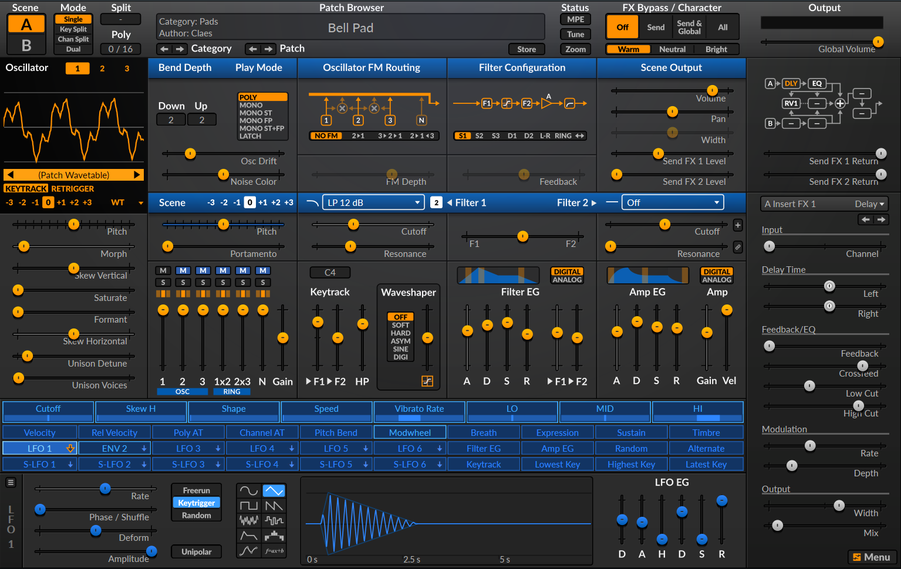

 

**Royal**:

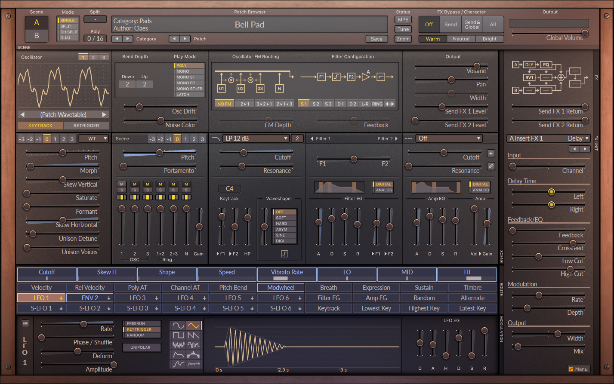

 

Von dort aus können Sie auch den aktuellen Skin neu laden, Skins neu scannen, den Speicherort des aktuellen Skin-Ordners öffnen und den Skin
Inspektor sowie die Skin-Entwicklungsanleitung öffnen.

Wenn Sie in die Skin-Engine einsteigen und Skins entwickeln möchten,
sehen Sie sich die Dokumentation zur [Entwicklung von Surge-Skins](https://surge-synthesizer.github.io/skin-manual.html) an.

 

### User Settings

In diesem Untermenü gibt es eine Vielzahl von Optionen, die die Benutzeroberfläche betreffen.

#### Mouse Behavior
Dieses Untermenü enthält Optionen, mit denen Sie die Empfindlichkeit der Maus beim Bewegen von Slidern ändern können.
Während standardmäßig *Legacy* verwendet wird, reichen die anderen 3 Optionen von *Slow* (granularer) bis *Exact*
(so schnell wie der Mauszeiger). Außerdem gibt es eine Option, mit der der Mauszeiger auf dem Bildschirm angezeigt wird,
wenn Sie ein Steuerelement bewegen.

Obwohl Surge offiziell keine Unterstützung für Touchscreens bietet, wird Ihnen die Einstellung der Mausbewegung auf *Exact* und die Option
*Show mouse cursor while editing* wahrscheinlich die beste Erfahrung bei der Interaktion mit Surge mit einem Touchscreen bieten.

#### Patch Defaults
Hier können Sie konfigurieren, was standardmäßig in den Feldern **Author** und **Comment** erscheint, wenn Sie einen Patch speichern.

#### Value displays
- **High Precision Value Readouts** - Ermöglicht, dass Werte-Popups, die beim Einstellen von Parametern erscheinen, mehr Ziffern
nach dem Dezimalpunkt (6 Stellen) anzeigen. Dies kann in einigen fortgeschrittenen und präzisen Szenarien nützlich sein.

- **Modulation Popup Shows Bounds** - Ermöglicht dem Werte-Popup, das beim Anwenden von Modulationen und beim Anpassen ihrer Menge an einen 
Parameter erscheint, mehr Werte anzuzeigen, z.B. den relativen Bereich in negativer Ausichtung sowie
absolute Minimal- und Maximalwerte darunter.

- **Middle C** - Ermöglicht es Ihnen, die Referenzoktave zu ändern, die in Popup-Anzeigen einiger frequenzbezogener Parameter verwendet wird,
wie z.B. dem Filter-Cutoff. Sie können das mittlere C entweder auf **C3**, **C4** oder **C5** einstellen.

#### Workflow
- **Activate individual scene outputs** - Aktivieren oder deaktivieren Sie die einzelnen Audio-Szenenausgänge.
In den meisten DAWs ist diese Option standardmäßig aktiviert, aber aus Kompatibilitätsgründen ist sie bei einigen anderen DAWs (z.B. FL Studio) standardmäßig deaktiviert
und muss erst aktiviert und im Plugin-Wrapper konfiguriert werden, um diese Funktion nutzen zu können.

- **Load MSEG snap state from patch** - Legt fest, ob Surge die MSEG-Snap-Parameter aus dem gespeicherten Patch laden oder
die bestehenden Einstellungen beibehalten soll.

- **Remember tab positions per scene** - Merkt sich die Positionen der Registerkarten (z.B. den aktuell ausgewählten Oszillator oder
  LFO, der gerade im LFO-Editor angezeigt wird) separat für jede Szene oder einheitlich im gesamten Synth.

 

### Data Folders

In diesem Untermenü gibt es eine Reihe von Optionen, die sich auf Benutzerdaten und Patches beziehen.

#### Open User Data Folder

Dies öffnet den Ort, an dem die von Benutzer\*innen gespeicherten Patches abgelegt werden.

#### Open Factory Data Folder

Dies öffnet den Ort, an dem Werks-Patches, Wavetables und andere Konfigurationsdateien gespeichert werden.

#### Set Custom User Data Folder
Wie der Name schon sagt, können Sie hier festlegen, wo die User-Patches gespeichert werden sollen.

#### Rescan All Data Folders

Diese Option kann nützlich sein, nachdem Sie Patches importiert haben, die von einem anderen User erstellt wurden, nachdem Sie User-Patches auf einen anderen Computer übertragen haben,
oder nach dem Herunterladen von Patches aus dem Internet.

 

### MIDI Settings

Dieses Untermenü enthält Optionen für MIDI-Zuordnungen.

#### Controller smoothing
Dieses Untermenü enthält Optionen zur Einstellung der gewünschten MIDI-Controller-Glättung.

#### Sustain pedal in mono mode

- **Sustain pedal holds all notes (no note off retrigger)** - Wenn Sustain aktiviert ist und mehrere Noten angeschlagen und dann
nacheinander gehalten werden, bleibt Surge beim Loslassen auf der letzten Note, anstatt auf die vorherige 
Note zu wechseln.
- **Sustain pedal allows note off retrigger** - Wenn Sustain aktiviert ist und mehrere Noten angeschlagen und dann nacheinander gehalten werden, schaltet Surge auf die vorherige Note um,
wenn die letzte Note losgelassen wird.

#### Save MIDI Mapping As...

Hiermit können Sie das aktuelle MIDI-Mapping speichern. Das neu erstellte Profil wird in diesem Menü unter den beiden oberen Optionen angezeigt.

#### Show Current MIDI Mapping...
Dies öffnet eine HTML-Datei, die das aktuell geladene MIDI-Mapping auflistet.

#### Clear current MIDI mapping
Wie der Name schon sagt, löscht diese Option das bestehende MIDI-Mapping in Surge und setzt es auf die Standardeinstellungen zurück.

 

### Online-Optionen

Die folgenden Optionen dienen zum [Erreichen der Entwickler\*innen und Informationen zum Benutzer\*innen Feedback](https://surge-synthesizer.github.io/feedback), [Lesen des Codes auf GitHub](https://github.com/surge-synthesizer/surge/), [Herunterladen zusätzlicher Inhalte](https://github.com/surge-synthesizer/surge-synthesizer.github.io/wiki/Additional-Content), [Öffnen der Surge-Website](https://surge-synthesizer.github.io/), und schließlich
dem Öffnen dieses Benutzer\*innen Handbuchs.

 

### About Surge
Schließlich gibt es eine Option zum Öffnen des **About**-Fensters, das verschiedene Versions-, Konfigurations- und Lizenzinformationen enthält.

### Developer Menü
Wenn Sie mit der rechten Maustaste auf die Schaltfläche Menü klicken, erscheinen in verschiedenen Untermenüs weitere Optionen für Entwicklungs- und Testzwecke.

 
 
 
 
 
 

# Technische Referenz

## Surge Hierarchie

 

### Übersicht

*Blockschaltbild der Synthesizer-Engine.*

Die Abbildung zeigt eine Übersicht über die Synthesizer-Engine von Surge.

 

### Voices

*Blockschaltbild einer Synthesizer-Voice*

Die Abbildung zeigt die meisten Audio- und Steuerpfade einer einzelnen
Voice. Nicht alle Verarbeitungselemente der Voice sind im
Diagramm dargestellt.

 

### LFOs

Jede Voice hat 6 konfigurierbare LFOs und jede Szene hat
zusätzliche 6 konfigurierbare LFOs, so dass jede Voice effektiv Modulationen von insgesamt 
12 LFOs empfangen kann.

*LFO-Blockdiagramm*

 

### Modulations-Routing im Detail

Wie das Modulations-Routing intern funktioniert, ist etwas, worüber Sie sich
bei der Verwendung von Surge normalerweise keine Gedanken machen müssen. Aktivieren Sie einfach den Modulationsmodus
mit der gewünschten Quelle und schauen Sie, welche der Slider blau werden.
Dennoch ist es nützlich zu wissen, welche Begrenzungen vorhanden sind und warum.

*Modulations-Routing hinter den Kulissen*

Zu beachten ist, dass Stimmenmodulationsquellen nicht
Szene-Parameter, Global-/Effekt-Parameter oder Parameter von Szene-LFOs modulieren können, da es sich hierbei um zwei
deutlich unterschiedliche Modulationswege handelt. Ansonsten sollte es ziemlich einfach sein.

 
 

## Oszillator-Algorithmen

Surge bietet 8 verschiedene Oszillator-Algorithmen, die jeweils in der Lage sind
Klänge auf unterschiedliche Art und Weise mit verschiedenen Reglern zu erzeugen.
Es handelt sich nicht einfach nur um unterschiedliche Wellenformen.

 

### Classic

Der Classic Oszillator-Algorithmus besteht aus einem Hauptoszillator, der
eine Pulswelle, eine Sägezahnwelle, eine Dual-Sägezahnwelle oder irgendwas 
dazwischen erzeugen kann.

Ein Suboszillator liefert eine Pulswelle eine Oktave unterhalb des Hauptoszillators.
Eine Änderung der Pulsbreite des Suboszillators wirkt sich
auch auf den Hauptoszillator aus, da sich die Pegel beider Oszillatoren zur gleichen Zeit ändern.
Der Hauptoszillator tut dies allerdings doppelt so oft.

Der Classic Algorithmus ist auch zur Selbstsynchronisation der Oszillatoren fähig. Beachten Sie, dass
der Suboszillator als Grundton für die Synchronisation verwendet wird.

Der Algorithmus bietet Unison auf der Oszillator-Ebene mit bis zu 16
Instanzen. Anders als beim Wavetable-Oszillator sind die Kosten für Unison in Bezug auf
die CPU-Auslastung für den Classic Oszillator recht bescheiden. Die Unison
Oszillator-Instanzen werden durch den Osc-Drift-Parameter auf Szenenebene
unabhängig beeinflusst.

|--- |--- |--- |
|Shape|Wellenformform -100% = Puls, 0% = Saw, 100% = dual saw|-100 .. 100 %|
|Width 1|Tastgrad (Puls) oder relative Phase (dual saw)|0 .. 100 %|
|Width 2|Staucht oder erweitert die Wellenform auf andere Weise. Wenn positiv, werden die beiden letzten Hälften von zwei aufeinanderfolgenden Einzelzyklen enger zusammengedrückt.|0 .. 100 %|
|Sub Mix|Sub-Oszillator-Mix, 0% = nur Main, 100% = nur Sub|0 .. 100 %|
|Sync|Oszillator-Hartsynchronisation|0..60 Halbtöne|
|Unison Detune|Stimmung der Unison-Oszillatoren. Kann erweitert werden. Kann zwischen relativ (Standard) und absolut umgeschaltet werden. 0 ... 100 Cent 0 ... 1200 Cent 0 ... 16 Hz 0 ... 192 Hz|
|Unison Voices|Anzahl der Oszillatoren, die für Unison verwendet werden (1 = deaktiviert).|1 .. 16|

 

### Modern

Der Modern-Oszillator-Algorithmus ist ein Multi-Wellenform-Oszillator, der saubere,
aliasarme Versionen von Puls-, Dreieck-, Sägezahn- und Sinuswellen kreiert und Unison- und
Sub-Oszillator-Fähigkeiten bietet. Er basiert auf dem differenzierten polynomialen Wellenform
Algorithmus, aus [dieser Arbeit](https://www.researchgate.net/profile/Juhan-Nam/publication/224557976_Alias-Suppressed_Oscillators_Based_on_Differentiated_Polynomial_Waveforms/links/573f274d08ae9ace84133dc9/Alias-Suppressed-Oscillators-Based-on-Differentiated-Polynomial-Waveforms.pdf).

Die drei Parameter mit den Bezeichnungen **Sawtooth**, **Pulse** und **Triangle** steuern relative Mischungen dieser Wellenformen, während
der Parameter **Width**" die Pulsbreite für die Pulswelle steuert. **Sync** gleicht die Tonhöhe des Oszillators mit der Tonhöhe des internen Referenzoszillators ab
und setzt gleichzeitig die Phase des Hauptoszillators auf die Phase des Referenzoszillators zurück, um typische Hard-Sync-Effekte zu erzielen.
Die Unison-Steuerungen funktionieren wie bei anderen Surge-Oszillatoren.

|--- |--- |--- |
|Sawtooth|Amplitude der Sägezahnwellenform.|-100 .. 100 %|
|Pulse|Amplitude der Pulswellenform.|-100 .. 100 %|
|Triangle, Sine, Square|Amplitude der dritten Wellenform, kann mit der rechten Maustaste angeklickt werden (weitere Informationen siehe unterhalb dieser Parameterliste).|-100 .. 100 %|
|Width|Tastgrad der Pulswelle|0 .. 100 %|
|Sync|Oszillator-Hartsynchronisation|0..60 Halbtöne|
|Unison Detune|Stimmung der Unison-Oszillatoren. Kann erweitert werden. Kann zwischen relativ (Standard) und absolut umgeschaltet werden. 0 ... 100 Cent 0 ... 1200 Cent 0 ... 16 Hz 0 ... 192 Hz|
|Unison Voices|Anzahl der Oszillatoren, die für Unison verwendet werden (1 = Unison deaktiviert).|1 .. 16|

#### Dritter Wellenform Parameter

Der dritte Wellenform-Parameter (standardmäßig mit "Triangle" beschriftet) ist insofern besonders, als
er mehrere Wellenformoptionen haben kann. Wenn Sie mit der rechten Maustaste darauf klicken, können Sie sehen
dass er eine Dreieckswelle, eine Sinuswelle oder eine Rechteckwelle erzeugen kann. Dieses Steuerelement
kann auch zu einem Suboszillator werden, der mit der halben Frequenz der anderen beiden Wellenformen spielt.
Im Sub-Oszillator-Modus nimmt die dritte Wellenform **nicht** am Unison teil. Zum Schluss,
gibt es auch eine Option für den Sub-Oszillator, die harte Synchronisation gegen den internen Referenzoszillator, zu umgehen.

 

### Wavetable

Eine Wavetable in Surge besteht aus bis zu 4096 Einzeltakt-Wellenformen.
Mit dem Parameter **Morph** ist es möglich, durch die Wellenformen
in der Wavetable zu sweepen.

Die einzelnen Wellen sind in der Tabelle äquidistant. Wenn die Shape
Einstellung zwischen zwei Einzelwellen liegt, werden sie gemischt, um einen
sanften Übergang zu gewährleisten. Sie können den Inhalt der Wavetable nicht direkt in
Surge bearbeiten, aber es ist möglich, eigene Wavetables mit externer
Software zu erzeugen.

Surge kann auch Wavetables importieren, die einen **clm**-Block zur Angabe der Loop-Größe enthalten (wie er von Serum verwendet wird),
einen **cue**-Block (wie er von verschiedenen Produkten einschließlich Native Instruments verwendet wird) und einen **smpl**-Block.
Wavetable-Dateien ohne Loop-Informationen werden als One-Shots geladen.

Dadurch können Sie effektiv verschiedene Wavetables von anderen Produkten wie **Serum** importieren.
Alle diese Wavetables von Drittanbietern, die in Surge getestet wurden, funktionieren laut Berichten einwandfrei.

Um eigene Wavetables zu importieren, verwenden Sie die Wavetable-Auswahlleiste am unteren Rand der Oszillatoranzeige. Von hier aus können Sie auch
[zusätzliche Wavetable-Inhalte herunterladen](https://github.com/surge-synthesizer/surge-synthesizer.github.io/wiki/Additional-Content).

Alternativ können Sie auch einfach eine beliebige kompatible Wavetable-Datei per Drag & Drop über die Surge-Oberfläche ziehen um sie zu laden.

Sie können sogar Ihre eigenen Wavetables für Surge mit [wt-tool](https://github.com/surge-synthesizer/surge-synthesizer.github.io/wiki/Creating-Wavetables-For-Surge) oder [WaveEdit](https://github.com/surge-synthesizer/surge-synthesizer.github.io/wiki/Creating-Wavetables-With-WaveEdit) erstellen.

Sobald ein Wavetable geladen ist, können Sie sie auch über die Wavetable-Auswahlleiste exportieren.

Durch Modulation des Parameters **Morph** ist es dann möglich, Bewegung zu erzeugen,
dynamische Reaktion auf das Spiel und klangliche Variation. Wenn Sie einen genauen Frame auswählen möchten, ziehen Sie den Slider bei gedrückter
Strg/Cmd Taste, wodurch Sie auf exakte Werte in der Tabelle einrasten können, was z.B. beim Umschalten zwischen verschiedenen
Formen nützlich ist.

Welche reale Eigenschaft, wenn überhaupt, der **Morph**-Parameter spiegeln soll, hängt vom
jeweiligen Wavetable ab. Häufige Fälle sind:

  - Analysiert von Klängen, die sich im Laufe der Zeit weiterentwickeln. Das Verhalten kann
    nachgebildet werden, indem die Form über die Zeit durch Modulation ansteigen gelassen wird. Es ist
    der häufigste unter den analysierten Wavetables.
  - Analysiert von statischen Klängen über verschiedene Tonhöhen zur Erfassung der
    Formantverschiebung eines Klangs. Das Verhalten kann nachgebildet werden durch
    die Modulation der Formantverschiebung durch die Keytrack Modsource.
  - Ein Parameter einer mathematischen Gleichung.

Am Ende ist es nur ein Datensatz und Surge ist es egal, wie er erzeugt wurde,
wichtig ist nur, wie sie klingen.

Der Wave-Table-Oszillator hat einige interessante klangliche Eigenschaften. Er
gibt die Wellenform treppenförmig aus, ohne dabei zu versuchen,
die Stufen zu glätten, sondern tut dies auf eine Art und Weise, die vollständig bandlimitiert ist.
Dadurch klingt er ähnlich wie 80er Wavetable-Synths und Sampler,
die kein Resampling verwendeten, sondern
D/A-Wandler für jede Stimme hatten und die Tonhöhe durch Variation der
Samplefrequenz der einzelnen D/A-Wandler veränderten.

Die Tatsache, dass die Schritte nicht geglättet werden, verursacht ein Artefakt, das als
harmonisches Aliasing bekannt ist. Dies ist nicht zu verwechseln mit dem inharmonischen Aliasing
welches sich anhört wie ein AM-Radio, das gerade eingestellt wird, eher garstig.
Stattdessen bewirkt dieses Artefakt, dass sich die Oberwellen der
Wellenform wiederholen und das gesamte hörbare Spektrum ausfüllen,
genau wie bei einer Rechteckwelle, was verhindert, dass die
Wellenform dumpf klingt. Da dieses Artefakt vollständig harmonisch ist,
ist es auch musikalisch ansprechend. Dennoch kann es
bei sehr glatten Wellenformen etwas deplatziert klingen, der Effekt kann jedoch durch einen
Tiefpassfilter im Filterblock herausgefiltert werden, falls gewünscht. Einige der Wavetable,
wie z.B. die Regular-Triangle-Wave, sind groß genug, sodass dieses Artefakt
genau aus diesem Grund nie im normalerweise verwendeten Bereich auftritt.

Wichtig ist, dass er, wie die meisten anderen Oszillatoren in Surge,
keinerlei inharmonisches Aliasing oder hörbares Interpolationsrauschen hinzufügt,
zwei Artefakte, die eine große Rolle darin gespielt haben
digitalen Synthesizern einen schlechten Ruf zu verpassen.

Für weitere Informationen können Sie 
[diesen Artikel](https://github.com/surge-synthesizer/surge-synthesizer.github.io/wiki/Why-you-may-get-high-frequency-distortion-from-some-wavetables)
im Surge Wiki lesen.

**Für Entwickler und fortgeschrittene Anwender**:
 
Es gibt eine Referenz für das .wt-Dateiformat, das von den Wavetables verwendet wird. Sie
befindet sich unter: `surgedata/wavetables/wt fileformat.txt`

 

|--- |--- |--- |
|Morph|Interpoliert zwischen Wavetable Frames. 0% = erstes Frame, 100% = letztes Frame|0 .. 100 %|
|Skew Vertikal|Vertikale Schräglage der Wellenform|-100 .. 100 %|
|Saturate|Sanfte Sättigung der Wellenform|0 .. 100 %|
|Formant|Komprimiert die Wellenform zeitlich, behält aber die Zykluszeit bei|0 ... 60 Halbtöne|
|Skew Horizontal|Horizontale Schräglage der Wellenform|-100 .. 100 %|
|Unison Detune|Stimmung der Unison-Oszillatoren. Kann erweitert werden. Kann zwischen relativ (Standard) und absolut umgeschaltet werden. 0 ... 100 Cent 0 ... 1200 Cent 0 ... 16 Hz 0 ... 192 Hz|
|Unison Voices|Anzahl der für Unison verwendeten Oszillatoren. 1 = deaktiviert|1 .. 16|

 

### Window

Der Window-Oszillator ist ein weiterer Versuch der Wavetable
Synthese, die sich von dem vorherigen Wavetable-Algorithmus unterscheidet.

Die Welle, die jede in Surge enthaltene Wellenform sein kann, wird mit einer zweiten Wellenform, dem Fenster,
multipliziert, was eine von 9 Wellenformen sein kann,
die speziell für den Window-Oszillator gemacht sind. Der Formant
Parameter steuert die Tonhöhe der Welle unabhängig vom Fenster,
aber da die Welle immer mit dem Fenster neu gestartet wird, bleibt die Tonhöhe
gleich. Stattdessen ändert sich das Timbre des Klangs
sehr stark, je nachdem, welches Fenster gewählt ist.

Im Gegensatz zum Wavetable-Algorithmus verwendet der Window-Oszillator einen eher
traditionellen Resampling-Ansatz, der nicht zu harmonischem
Aliasing führt.

|--- |--- |--- |
|Morph|Wählt ein Frame vom Wavetable, ohne Interpolierung. 0% = erstes Frame, 100% = letztes Frame |0 .. 100 %|
|Formant|Ändert Tonhöhe des Wavetableframes unabhängig von der Tonhöhe des Fensters|-60 .. 60 Halbtöne|
|Window|Wählt die Wellenform für das Ampltuden-Fenster.|Triangle, Cosine, Blend 1, Blend 2, Blend 3, Sawtooth, Sine, Square, Rectangle |
|Low Cut|Grenzfrequenz des integrierten Hochpassfilters. Muss in seinem Kontextmenü aktiviert werden, um zu wirken.|13.75 .. 25087.71 Hz|
|High Cut|Grenzfrequenz des integrierten Tiefpassfilters. Muss in dessen Kontextmenü aktiviert werden, um zu wirken.|13.75 .. 25087.71 Hz|
|Unison Detune|Stimmung der Unison-Oszillatoren. Kann erweitert werden. Kann zwischen relativ (Standard) und absolut umgeschaltet werden.|0 .. 100 Cent 0 .. 1200 Cent 0 .. 16 Hz 0 .. 192 Hz|
|Unison Voices|Anzahl der für Unison verwendeten Oszillatoren. 1 = deaktiviert|1 .. 16|

 

### Sine

Wenig überraschend erzeugt der Sine-Oszillator eine Sinuswelle. Es gibt jedoch noch eine Reihe weiterer interessanter Dinge die er kann!

|--- |--- |--- |
|Shape|Zahlreiche Sinus Varianten durch Quadrantenmaskierung, Verschiebung und Frequenzverdopplung |1 .. 28|
|Feedback|FM-Rückkopplungsanteil Kann erweitert werden.| -100 .. 100 % -400 .. 400 % |
|FM-Behavior|Wählt, ob sich FM wie Surge 1.6.1.1 und früher oder konsistent mit FM2/3 Oszillatoren verhält.|Legacy (before v1.6.2), Consistent with FM2/3|
|Low Cut|Grenzfrequenz des integrierten Hochpassfilters. Muss in seinem Kontextmenü aktiviert werden, um zu wirken.|13.75 .. 25087.71 Hz|
|High Cut|Grenzfrequenz des integrierten Tiefpassfilters. Muss in dessen Kontextmenü aktiviert werden, um zu wirken.|13.75 .. 25087.71 Hz|
|Unison Detune|Stimmung der Unison-Oszillatoren. Kann erweitert werden. Kann zwischen relativ (Standard) und absolut umgeschaltet werden.|0 .. 100 Cent 0 .. 1200 Cent 0 .. 16 Hz 0 .. 192 Hz|
|Unison Voices|Anzahl der für Unison verwendeten Oszillatoren, 1 = deaktiviert.|1 .. 16|

 

### FM2

FM2 bietet eine Miniatur-FM-Synthesizer-Stimme in einem Oszillator, der
speziell darauf zugeschnitten ist, schöne und musikalische FM-Klänge zu erzeugen. Ein
einzelner Sinusträger wird von zwei Sinusmodulatoren moduliert, deren Verhältnis
zum Träger immer ganzzahlig sind, so dass die resultierende Wellenform immer
zyklisch ist. Mit **M1/2 Offset** können Sie die Modulatoren jedoch leicht absolut versetzen,
wodurch ein sich entwickelnder und angenehmer Verstimmungseffekt
entsteht.

| -------------- | --------------------------------------------------------------------------------------------- | ------------- |
| M1 Amount      | Modulationsbetrag des ersten Modulators                                                       | 0 .. 100 %    |
| M1 Ratio       | Verhältnis des ersten Modulators zum Träger                                                   | 1 .. 32       |
| M2 Amount      | Modulationsbetrag des zweiten Modulators                                                      | 0 .. 100 %    |
| M2 Ratio       | Verhältnis des zweiten Modulators zum Träger                                                  | 1 .. 32       |
| M1/2 Offset    | Absolute Verstimmung der Modulatoren Kann erweitert werden.                               | -10 .. 10 Hz -1000 .. 1000 Hz |
| M1/2 Phase     | Ändert die Anfangsphase der Modulatoren, um unterschiedliche Variationen der Wellenform zu erhalten.     | 0 .. 100 %    |
| Feedback       | Modulationsbetrag des Trägers zu sich selbst Kann erweitert werden. |-400 .. 400 %   -100 .. 100 % |

 

### FM3

Im Gegensatz zu FM2 ist FM3 der Algorithmus der Wahl zum Abkratzen der Farbe
von den Wänden. Die Modulatoren haben einen größeren Bereich, die Verhältnisse können
Non-Integer sein und es gibt einen dritten Modulator, dessen Rate als
absolute Frequenz gesetzt ist.

| ----------- | -------------------------------------------- | ------------- |
| M1 Amount | Modulationsanteil des ersten Modulators | 0 .. 100 % |
| M1 Ratio | Verhältnis des ersten Modulators zum Träger, kann entweder erweitert oder absolut sein. | 0.0 .. 32.00 1/32.0 .. 32.0 ~ 8 Hz .. 24 kHz |
| M2 Amount | Modulationsanteil des zweiten Modulators | 0 .. 100 % |
| M2 Ratio | Verhältnis des zweiten Modulators zum Träger, kann entweder erweitert oder absolut sein. | 0.0 .. 32.00 1/32.0 .. 32.0 ~ 8 Hz .. 24 kHz |
| M3 Amount | Modulationsanteil des dritten Modulators | 0 .. 100 % |
| M3 Frequenz| Frequenz des dritten Modulators | ~ 14 Hz .. 25 kHz |
| Feedback | Modulationsbetrag des Trägers zu sich selbst Erweiterter Modus (Standard) kann deaktiviert werden. |-400 .. 400 %   -100 .. 100 % |

 

### String

Der String-Oszillator verwendet eine physikalische Modellierungstechnik, bei der Anregungsquellen
in eine abgestimmte Delay-Line mit Rückkopplung geschickt werden, mit verschiedenen Filtern inline
(basierend auf dem ursprünglichen Karplus-Strong-Algorithmus). Der Oszillator führt zwei Saiten
an, die gegeneinander verstimmt und individuell bedämpft werden können.

Um das Modell zum Klingen zu bringen, müssen Sie es anregen. Wir haben zwei Klassen der
Anregungsmodi, **Burst** und **Constant**. Im Burst-Modus wird die Delay-Line
bevor eine Note gespielt wird mit einem Pattern geladen, und dann dem Oszillator kein weiteres Signal hinzugefügt.
Stellen Sie sich dies als Emulation einer gezupften Saite vor. Im Constant-Modus wird die Delay-Line
auch vorgeladen, aber das Signal wird weiterhin angewendet solange die Taste gehalten wird.
Stellen Sie sich dies als Emulation gestrichener Modi vor. In fast allen Fällen werden die Continuous-Modi 
in Verbindung mit einer Modulation des **Exciter Level** Parameters verwendet um Bogenandruck zu emulieren.

Die Anregungsmodi stellen zahlreiche Wellenformen zur Verfügung - noise, pink noise, ramp, usw... -, mit denen Sie die Saite anregen können,  
was zu verschiedenen Timbres führt. Der Audioeingang von Surge kann auch als Exciter Signal genutzt werden.

|--- |--- |--- |
|Exciter|Bestimmt Modus und Wellenform, die zur Anregung der Saite verwendet werden |Burst, Constant|
|Exciter Level|Bestimmt, wie stark die Saite angeregt wird. |-100 .. 100 %|
|String 1 Decay|Bestimmt die Abklingzeit der ersten Saite.|-100 .. 100 % |
|String 2 Decay|Bestimmt die Abklingzeit der zweiten Saite.|-100 .. 100 %|
|String 2 Detune|Ändert die Stimmung der zweiten Saite. Kann erweitert werden. Kann zwischen relativ (Standard) und absolut umgeschaltet werden.|-100 .. 100 Cent -1200 .. 1200 Cent -16 .. 16 Hz -192 .. 192 Hz|
|String Balance|Mischungsregler zwischen den beiden Saiten.|-100 .. 100%|
|Stiffness| Fügt Tiefpass- (links) und Hochpassfilter (rechts) im Feedback Loop hinzu, was zahlreiche Level der Steifigkeit der Saite emuliert. Führt zu inharmonischen Timbres an den Extremen.|-100 .. 100%|

 

### Twist

Dieser Oszillator importiert einen recht berühmten Eurorack-Makro-Oszillator in Surge basierend auf Émilie Gillets
Gerät. Sie können das Handbuch für das Hardware-Modul, auf dem dieser Oszillator basiert
[hier](https://mutable-instruments.net/modules/plaits/manual) lesen.

Diese Implementierung stellt alle 16 Oszillator-Modi dar, die Regler benennen sich passend zum Modell,
dynamisch um. Die wesentlichen Unterschiede zwischen dem Hardware-Modul und der Implementierung sind:

1. Standardmäßig ist der LPG im Modul deaktiviert, aber durch Aktivieren der LPG-Pegel- und -Abklingregler (mittels Rechtsklick und Activate),
wird der LPG pro Stimme für jede empfangene MIDI Note getriggert.

2. In der Grundeinstellung können Sie zischen dem Haupt- und dem Aux-Oszillator-Ausgang mit einem "Mix"-Regler mischen.
Sie können auch mit Rechts auf den Mix Parameter klicken und die **Pan main and auxiliary signals** Option wählen
wodurch der -100%-Wert Main nach links/Aux nach rects darstellt, der +100%-Wert Main nach rechts/Aux nach links, und der 0% eine gleichmäßige Mischung beider Signale die zu links und Rechts gesendet werden.
Dies ist nur hörbar in einem der Stereo-Filter-Algorithmen. 

Der Twist-Oszillator kann mehr CPU-Leistung erfordern als die meisten der anderen Surge-Oszillator-Algorithmen.
Der vernünftige Einsatz des Maximum-Polyphony-Settings und ein vorsichtiger Umgang mit Amp-EG Release-Werten
können einiges bringen die CPU Belastung zu minimieren und somit robuste Patches zu erstellen.

 

### Alias

Der Alias-Oszillator ignoriert absichtlich einige Jahrzehnte der Forschung zur Erzeugung digitaler Signale mit geringem oder keinem Aliasing
und macht all die Dinge, die man nicht tun sollte, so dass es absichtlich digital, grob, kaputt, schrecklich 
und dennoch großartig klingt.

|--- |--- |--- |
|Shape|Setzt die Form der Oszillator-Wellenform|Siehe Erläuterungen [unten](#shape)|
|Wrap|Verzerrt die Wellenform, indem es sie verstärkt und dann von der anderen Seite her umschlägt, anstatt sie hart zu clippen|-100 .. 100 %|
|Mask|Setzt eine 8-bit Bitmaske, die auf die Wellenform angewendet wird|-100 .. 100 % |
|Threshold|Bestimmt den Wendepunkt der Wellenform (Ramp),Tastgrad (Puls) oder Wavetable-Ausleseoffset (Andere) der Wellenform.|-100 .. 100 %|
|Bitcrush|Stellt den Grad des auf die Wellenform angewendeten Bitcrushing ein|1.00 .. 8.00 Bits|
|Unison Detune|Stimmung der Unison-Oszillatoren. Kann erweitert werden. Kann zwischen relativ (Standard) und absolut umgeschaltet werden.|0 .. 100 Cent 0 .. 1200 Cent 0 .. 16 Hz 0 .. 192 Hz|
|Unison Voices|Anzahl der für Unison verwendeten Oszillatoren, 1 = deaktiviert.|1 .. 16|

#### Shape

Der **Shape**-Parameter (in Form eines Menüs) ist sehr wichtig und sollte genauer erklärt werden,
da er es Ihnen ermöglicht, die für den Alias-Algorithmus verwendeten Quelle zu wählen.

Neben den regulären Shapes (wie Sine, Ramp, Pulse und Noise) kann auch der Audioeingang von Surge verwendet werden.

Weitergehend gibt es Additive, was Ihnen erlaubt, die Wellenform mittels Änderung der Amplituden von bis zu 16 Obertönen zu verändern,
zugänglich durch Klicken auf die Schaltfläche "Edit", die in diesem Modus erscheint:

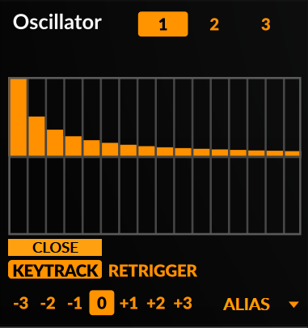

Dieser Editor arbeitet ähnlich wie der Step-Sequenzer-Editor, allerdings gibt es einige zusätzliche Optionen wenn Sie mit der rechten Maustaste in dieses Fenster klicken:

- **Shapes** - Teilweise Pegelvoreinstellungen, die grob verschiedene Wellenformen darstellen, einschließlich einer Zufallsoption.
- **Absolute** - Setzt den Pegel aller Teiltöne in den positiven Bereich.
- **Invert** - Spiegelt die Teilpegel vertikal.
- **Reverse** - Spiegelt die Teilebenen horizontal.

Zusätzlich können Sie **Quadrant Shaping** Wellenformen als Quelle Verwenden, wie sie auch im [Sine](#sine)-Oszillator zu 
finden sind.

Schließlich gibt es noch zahlreiche **Memory from...** Optionen:

- **This alias instance** - Erzeugt eine Wellenform basierend auf dem Lesen des Speichers, der mit der derzeit ausgewählten Alias-Instanz zusammen hängt.
- **Oscillator Data** - Erzeugt eine Wellenform basierend auf dem Lesen des Speichers, der mit den allgemeinen Oszillatordaten zusammen hängt.
- **Step Sequencer Data** - Erzeugt eine Wellenform basierend auf dem Lesen des Speichers, der mit Step Sequencer Daten zusammen hängt.
- **Scene Data** - Erzeugt eine Wellenform basierend auf dem Lesen des Speichers, der mit den allgemeinen Szenendaten zusammen hängt.
- **DAW Chunk Data** - Erzeugt eine Wellenform basierend auf dem Lesen des Speichers, der mit den DAW Chunk-Daten zusammen hängt.

**Hinweis:** Wenn Sie **Memory From...** als Quelle verwenden, können wir nicht garantieren, dass die resultierende Wellenform
konsistent sein wird, da die Speicherdaten in Dingen variieren können: von Session zu Session, der verwendeten DAW, der jeweiligen Surge-Instanz, dem Neustart Ihres Rechners und so weiter.
Daher ist es eine gute Praxis, die Audioausgabe von Surge aufzuzeichnen und dann zu bouncen, wenn Sie diese Form verwenden.
Sie kennen ja sicherlich das Sprichwort: "If you like it, you should ...  mic it."

 

### S&H Noise

S&H ist eine Abkürzung für 'Sample and Hold'. Der S&H-Noise-Oszillator-Algorithmus arbeitet wie ein Pulsoszillator,
aber anstatt immer zwischen +1 und -1 zu wechseln, werden die verwendeten Pegel stochastisch bestimmt.

Die Korrelationsparameter bestimmen, wie die neuen Pegel berechnet werden. 
Eine Einstellung von 0 % hat keinen Speicher und jeder neue Pegel wird
effektiv eine Zufallszahl (weißes Rauschen). Eine niedrigere Einstellung
bevorzugt neue Werte, die näher am vorherigen Pegel liegen und
ein Rauschen mit einem dunkleren Spektrum. Höhere Werte bevorzugen
Werte, die so weit wie möglich vom vorherigen Wert entfernt sind, wobei 100%
zu einer harmonischen Pulswelle führt.

|--- |--- |--- |
|Correlation|Rauschkorrelation. 0% = weißes Rauschen, 100% = Puls|-100 .. 100 %|
|Width|Tastgrad des Oszillators|0 .. 100 %|
|Low Cut|Grenzfrequenz des integrierten Oszillator-Hochpassfilters. Muss in seinem Kontextmenü aktiviert werden, um zu wirken.|13.75 .. 25087.71 Hz|
|High Cut|Grenzfrequenz des integrierten Oszillator-Tiefpassfilters. Muss in seinem Kontextmenü aktiviert werden, um zu wirken.|13.75 .. 25087.71 Hz|
|Sync|Oszillator-Hartsynchronisation|0..60 Halbtöne|
|Unison Detune|Stimmung der Unison-Oszillatoren. Kann erweitert werden. Kann zwischen relativ (Standard) und absolut umgeschaltet werden.|0 .. 100 Cent 0 .. 1200 Cent 0 .. 16 Hz 0 .. 192 Hz|
|Unison Voices|Anzahl der für Unison verwendeten Oszillatoren. 1 = deaktiviert|1 .. 16|

 

### Audio Input

Mit dem Audioeingang können Sie externe Audiosignale in die Voice-Architektur von
Surge routen. Außerdem können Sie damit die Audioausgabe von Szene A in Szene B leiten.

| ----- | ------------------------------------------------------------------ | -------------- |
|Audio In L/R Channel|Wählt aus, welcher externe Eingang verwendet wird. -100 % = links, 0 % = beide (Stereo), 100 % = rechts.|-100 .. 100 %|
|Audio In Gain| Externe Eingangsverstärkung in dB.|48 .. +48 dB|
|Scene A L/R Channel**1**|Wählt, welcher Eingang von Szene A verwendet wird. -100% = links, 0% = beide (Stereo), 100% = rechts.|-100 .. 100%|
|Szene A Gain**1**| Szene A Eingangsverstärkung in dB.|48 .. +48 dB|
|Audio In<>Scene A Mix**1**|Überblendregler zwischen dem externen Audioeingangssignal und dem Ausgang von Scene A.|-100 .. +100%|
|Low Cut|Grenzfrequenz des integrierten Oszillator-Hochpassfilters. Muss in seinem Kontextmenü aktiviert werden, um zu wirken.|13.75 .. 25087.71 Hz|
|High Cut|Grenzfrequenz des integrierten Oszillator-Tiefpassfilters. Muss in seinem Kontextmenü aktiviert werden, um zu wirken.|13.75 .. 25087.71 Hz|

**1** Nur in Szene B verfügbar

Hinweis: Wenn Sie den Oszillatortyp "Audio Input" in Szene B verwenden, um Audio von Szene A zu erhalten,
kann es sinnvoll sein den **den Play-Mode auf Latch** einstellen. Auf diese Weise wird Szene B immer getriggert.

Für weitere Informationen und mögliche Anwendungen lesen Sie bitte
[diesen Artikel](https://github.com/surge-synthesizer/surge-synthesizer.github.io/wiki/Using-Surge-as-an-effect-(and-vocoder))
im Surge Wiki.

 
 

## Filteralgorithmen

Es stehen mehrere Filteralgorithmen für jede der 2
Filtereinheiten im Filterblock zur Verfügung. Jeder der Algorithmen hat
verschiedene Untertypen, die ihren Klang verändern.

Einige der Filter-(Unter-)typen haben einige nichtlineare Elemente in sich
um ihnen eine stabile und vorhersagbare Selbstoszillation zu ermöglichen.
Das heißt, sie klingen unterschiedlich, je nachdem, wie stark sie angesteuert werden.
Dies lässt sich bequem mit der Pre-Filter
Gain-Einstellung im Mixer steuern. Wenn zum Beispiel die Resonanzspitzen eines Filters
zu laut sind, erhöhen Sie die Vorfilter-Verstärkung, um den Rest des Signals
dominanter zu machen (und verringern Sie gegebenenfalls die Verstärkung an der Ausgangsstufe
der Stimme, um dies zu kompensieren).

Filter in Surge sind in die folgenden Kategorien unterteilt:
- Lowpass Filter
- Highpass Filter
- Bandpass Filter
- Notch Filter
- Effect Filter

### Filter-Modelle
 
**12 dB** - 2-poliger Filter. Erhältlich in den Ausführungen **Lowpass**, **Highpass**, **Bandpass**
und **Notch**.

**24 dB** - 4-poliger Filter. Erhältlich in den Ausführungen **Lowpass**, **Highpass**, **Bandpass** 
und **Notch**.

Untertypen für **12 dB** und **24 dB**:

1. **Clean** - sauber mit starker Resonanz, fähig zur Selbstoszillation. Behandelt das Einschwingverhalten extrem gut.
2. **Driven** - brustbetonter, etwas verzerrter Klang mit einer eher zurückhaltenden Resonanz. Fähig zur Selbstoszillation.
3. **Smooth** - der sanfteste Subtyp, fähig zu einer niedrigeren Resonanz als die anderen, was geeignet ist, wenn der Klang des Filters nicht auffallen, sondern nur einen Teil des Spektrums abschwächen soll.

 

**Legacy Ladder** - 4-poliger Ladder-Filter. Dies ist der ursprüngliche und ältere Ladder-Filter von Surge.
Er hat eine stabile Selbstoszillation und beansprucht weniger CPU als der neuere Vintage Ladder-Filter.
Erhältlich in der Ausführung **Lowpass**.

Untertypen:

1. **6 dB** - Ausgang abgegriffen von der 1.Stufe (1-polig).
2. **12 dB** - Ausgang abgegriffen von der 2.Stufe (2-polig).
3. **18 dB** - Ausgang abgegriffen von der 3.Stufe (3-polig).
4. **24 dB** - Ausgang abgegriffen von der 4.Stufe (4-polig).

 

**Vintage Ladder** - 4-poliger Ladder-Filter. Dies ist ein neuerer, genauerer und oft besser klingender Ladder-Filter.
Er hat auch eine stabile Selbstoszillation, beansprucht die CPU aber mehr als der ältere Legacy Ladder-Filter.
Erhältlich in der Ausführung **Lowpass**.

Untertypen:

1. **Typ 1** - Imitiert einen Moog-Resonanzfilter durch numerische Runge-Kutta-Integration
einer Differentialgleichung, was die Dynamik der Schaltung näherungsweise beschreibt.
2. **Typ 1 Compensated** - Verstärkungskompensierte Version von Typ 1.
3. **Typ 2** - Moog Ladder-Filter, der auf der Arbeit von Smith und Stilson aus der Arbeit von Antti Huovilainen aufbaut.
4. **Typ 2 Compensated** - Verstärkungskompensierte Version von Typ 2.

Danke an [@ddiakopoulos](https://github.com/ddiakopoulos) für die Aufrechterhaltung dieser sehr nützlichen
[Repository of Research and Code](https://github.com/ddiakopoulos/MoogLadders), welche
die von uns implementierten Modelle stark beeinflusst hat.

 

**K35** - 12 dB/Oktave-Filter aus dem Odin 2 Synthesizer, inspiriert von der Korg MS-20 Filtertopologie.
Mit zunehmender Resonanz klingen sie dreckiger und aggressiver.
Erhältlich in den Typen **Lowpass** und **Highpass**.

Untertypen:

1. No Saturation
2. Mild Saturation
3. Moderate Saturation
4. Heavy Saturation
5. Extreme Saturation

Vielen Dank an [@TheWaveWarden](https://github.com/TheWaveWarden), dass wir die K35-Filter von Odin 2 in Surge implementieren durften.
Sie können Odin 2 [hier](https://www.thewavewarden.com/odin2) herunterladen, oder den Code
[hier](https://github.com/TheWaveWarden/odin2) lesen.

 

**Diode Ladder** - 4-poliger Diode-Ladder-Filter aus dem Odin 2 Synthesizer mit individuell
abgegriffenen Polausgängen. Dieser Filter versucht, den Klang eines Ladder-Filters zu modellieren, welcher Dioden
anstelle von Transistoren verwendet. Dieser Filter schwingt ohne Feedback nicht selbst.
Verfügbar in der Ausführung **Lowpass**.

Untertypen:

1. **6 dB** - Ausgang abgegriffen von der 1.Stufe (1-polig).
2. **12 dB** - Ausgang abgegriffen von der 2.Stufe (2-polig).
3. **18 dB** - Ausgang abgegriffen von der 3.Stufe (3-polig).
4. **24 dB** - Ausgang abgegriffen von der 4.Stufe (4-polig).

Vielen Dank an [@TheWaveWarden](https://github.com/TheWaveWarden) für die Erlaubnis, Diode-Ladder-Filter von Odin 2
in Surge zu implementieren. Sie können Odin 2 [hier](https://www.thewavewarden.com/odin2) herunterladen, oder den Code
[hier](https://github.com/TheWaveWarden/odin2) lesen.

 

**OB-Xd 12dB** - 12dB-Filter aus dem OB-Xd Synthesizer von discoDSP und aus der Arbeit von Vadim Filatov, die auf den Filtern des Oberheim OB-Xa basieren. Verfügbar in den Typen **Lowpass**, **Highpass**, **Bandpass**
und **Notch**.

Untertypen:
1. **Standard** - Standard-Filterverhalten.
2. **Pushed** - Fügt verstärkte Nichtlinearitäten hinzu, die das Filter bei hohen Resonanzwerten 
in eine stärkere Selbstoszillation treiben.

Vielen Dank an [discoDSP](https://www.discodsp.com/news/), dass wir die Filter des OB-Xd in Surge implementieren durften. Sie können OB-Xd [hier](https://www.discodsp.com/obxd/) beziehen, oder [hier](https://github.com/reales/OB-Xd) den Quelltext lesen.

 

**OB-Xd 24dB** - 24dB-Filter aus dem OB-Xd-Synthesizer von discoDSP und aus der Arbeit von Vadim Filatov, die auf den Filtern des Oberheim OB-Xa basieren. Erhältlich in der Ausführung **Lowpass**.

Untertypen:

1. **6 dB** - Ausgang abgegriffen von der 1.Stufe (1-polig).
2. **12 dB** - Ausgang abgegriffen von der 2.Stufe (2-polig).
3. **18 dB** - Ausgang abgegriffen von der 3.Stufe (3-polig).
4. **24 dB** - Ausgang abgegriffen von der 4.Stufe (4-polig).

Vielen Dank an [discoDSP](https://www.discodsp.com/news/), dass wir die Filter des OB-Xd in Surge implementieren durften. Sie können OB-Xd [hier](https://www.discodsp.com/obxd/) beziehen, oder den Quelltext [hier](https://github.com/reales/OB-Xd) lesen.

 

**Cutoff Warp** - 12dB/Oktave-Filter, die mit einer nichtlinearen Biquad-Filterstruktur erstellt wurden. Die Nichtlinearitäten im Cutoff-Warp-Filter bewirken, dass die Cutoff-Frequenz bei steigendem Signalpegel zu höheren Frequenzen wandert (siehe unten). Verfügbar in den Typen **Lowpass**, **Highpass**, **Bandpass**, **Notch** und **Allpass (Effect)**.

Weitere Informationen zum Cutoff-Warp-Filter finden Sie in [diesem Blog-Beitrag](https://jatinchowdhury18.medium.com/complex-nonlinearities-episode-4-nonlinear-biquad-filters-ae6b3f23cb0e) von Jatin Chowdhury oder in [diesem DAFx-Beitrag aus dem Jahr 2020](https://dafx2020.mdw.ac.at/proceedings/papers/DAFx2020_paper_3.pdf), insbesondere in Abschnitt 4.

**Resonance Warp** - 12dB/Oktave-Filter, die mit einer nichtlinearen Biquad-Filterstruktur erstellt werden. Die Nichtlinearitäten im Resonance Warp-Filter bewirken, dass die Resonanz des Filters mit steigendem Signalpegel abnimmt (siehe unten). Verfügbar in den Typen **Lowpass**, **Highpass**, **Bandpass**, **Notch** und **Allpass (Effect)**.

Weitere Informationen zum Cutoff-Warp-Filter finden Sie in [diesem Blog-Beitrag](https://jatinchowdhury18.medium.com/complex-nonlinearities-episode-5-nonlinear-feedback-filters-115e65fc0402) von Jatin Chowdhury oder in [diesem DAFx-Beitrag aus dem Jahr 2020](https://dafx2020.mdw.ac.at/proceedings/papers/DAFx2020_paper_3.pdf), insbesondere in Abschnitt 3.

Untertypen für **Cutoff Warp** und **Resonance Warp**:

1. **1 Stufe tanh** - Ausgang der 1. Stufe (2-polig), unter Verwendung von "tanh"-Nichtlinearitäten.
2. **2 Stufen tanh** - Ausgang der 2. Stufe (4-polig), unter Verwendung von "tanh"-Nichtlinearitäten.
3. **3 Stufen tanh** - Ausgang der 3. Stufe (6-polig), unter Verwendung von "tanh"-Nichtlinearitäten.
4. **4 Stufen tanh** - Ausgang der 4. Stufe (8-polig), unter Verwendung von "tanh"-Nichtlinearitäten.
5. **1 Stufe Soft-Clip** - Ausgang der 1. Stufe (2-polig), unter Verwendung von Soft-Clipping-Nichtlinearitäten.
6. **2 Stufen Soft-Clip** - Ausgang der 2. Stufe (4-polig), unter Verwendung von Soft-Clipping-Nichtlinearitäten.
7. **3 Stufen Soft-Clip** - Ausgang der 3. Stufe (6-polig), unter Verwendung von Soft-Clipping-Nichtlinearitäten.
8. **4 Stufen Soft-Clip** - Ausgang der 4. Stufe (8-polig) unter Verwendung von Soft-Clipping-Nichtlinearitäten.
9. **1 Stufe OJD** - Ausgang der 1. Stufe (2-polig), unter Verwendung von OJD-Nichtlinearitäten.
10. **2 Stufen OJD** - Ausgang der 2. Stufe (4-polig), unter Verwendung von OJD-Nichtlinearitäten.
11. **3 Stufen OJD** - Ausgang der 3. Stufe (6-polig) unter Verwendung von OJD-Nichtlinearitäten.
12. **4 Stufen OJD** - Ausgang der 4. Stufe (8-polig), unter Verwendung von OJD-Nichtlinearitäten.

 

**Allpass** - Wie der Name schon sagt, reicht dieser Filter alle Frequenzen bei gleichbleibender Verstärkung durch. Er ist jedoch nützlich, um die Phasenbeziehung im Spektrum zu verändern. Sofern kein Feedback im Spiel ist, ist seine Wirkung am besten zu hören, wenn die Cutoff-Frequenz in Bewegung ist. Daher kann Modulation verwendet werden, um interessante Ergebnisse zu erzielen.

Allpass finden Sie unter der Kategorie **Effect**.

 

**Comb +** und **Comb -** - Kammfilter, der sich von den vorherigen Filtertypen unterscheidet, da er nicht
einen Teil des Spektrums filtert, sondern stattdessen das Originalsignal mit einer Verzögerung wiedergibt. Der erste Typ hat
positive Rückkopplung und der zweite Typ hat eine negative Rückkopplung.

Untertypen:

1. **50% Wet**
2. **100% Wet**

Wenn der Subtyp auf 2 und die Resonanz auf 0% eingestellt ist, arbeitet der
Kammfilter als reine Verzögerungseinheit (mit Sub-Sample
Genauigkeit). Dies kann gemeinsam mit der anderen Filtereinheit
und mit Filter-Block-Feedback genutzt werden um interessante Möglichkeiten bereit zu stellen. Die
Presets "Winds/Clarinet" und "Plucks/Simple Waveguide"
zeigen, wie diese Fähigkeit für einfache physikalische Modellierungen genutzt werden kann.
Sie verwenden nur die Oszillator-Sektion, um den Sound zu entfachen, der Rest
passiert im Filterblock.

Außerdem erzeugt der negative Kammfilter den Klang eine Oktave tiefer als der positive Kammfilter.

Comb + und Comb - sind in der Kategorie **Effect** zu finden.

 

**Sample & Hold** - Das Sample & Hold-Modul sampelt den Ton mit der durch die
Cutoff-Frequenz festgelegten Rate. Die Resonanz betont die Schwingungen um die
Grenzfrequenz, nicht unähnlich der Resonanzspitze eines Tiefpassfilters.

Sample & Hold ist in der Kategorie **Effect** zu finden.

 
 

## Effekt-Algorithmen

Surge hat 8 Effekteinheiten, von denen jede eine der 10 bereitgestellten 
Algorithmen ausführen kann

 

### EQ

Die EQ-Einheit bietet 3 Bänder eines vollparametrischen Equalizers. Dieser
hochwertige Algorithmus hat ein viel besseres Ansprechverhalten bei hohen Frequenzen
als es digitale Equalizer normalerweise haben.

|--- |--- |--- |
|Band 1/2/3 Gain|Bandverstärkung, abschaltbar|-48 .. +48 dB|
|Band 1/2/3 Freq|Bandfrequenz|14Hz .. 25kHz|
|Band 1/2/3 Bandwith|Bandbandbreite|0 .. 5 Oktaven|
|Output gain|Verstärkungsregler|-48 .. +48 dB|
|Mix|Überblendregler zwischen unbearbeitetem und bearbeitetem Signal|0 .. 100 %|

 

### Exciter

Exciter ist ein harmonischer Exciter, der auf dem berühmten Aphex Aural Exciter basiert.
Weitere Informationen über die Entwicklung des Effekts finden Sie in [diesem Blog Beitrag](https://jatinchowdhury18.medium.com/complex-nonlinearities-epsiode-2-harmonic-exciter-cd883d888a43) von Jatin Chowdhury.

|--- |--- |--- |
|Drive|Steuert den Anteil der erzeugten Obertöne|0 .. 100 %|
|Tone|Steuert die Tonbalance der erzeugten Obertöne|0 .. 100 %|
|Attack|Steuert die Attack-Zeit der erzeugten Obertöne|5 .. 20 ms|
|Release|Steuert die Release-Zeit der erzeugten Obertöne|50 .. 200 ms|
|Mix|Steuert die Mischung von Wet- und Dry-Signalen|0 .. 100 %|

 

### Graphic EQ

Der Graphic EQ ist, wie der Name schon sagt, ein grafischer Equalizer. Er besteht aus
11 im Pegel einstellbaren und (über das Rechtsklick-Menü) deaktivierbaren Bändern,
dadurch ist dieser Equalizer besser als der normale EQ in der Lage, relativ komplexe Frequenzgangkurven zu modellieren.
Abgesehen von der Tatsache, dass es am unteren Rand der Oberfläche noch einen Regler für die Ausgangsverstärkung gibt,
gibt es nicht mehr viel hinzuzufügen.

 

### Resonator

Der Resonator bietet sorgfältig abgestimmte Tiefpass-, Bandbass-, Bandpass + Notch- oder Hochpassfilter,
jeweils mit einer individuellen Verstärkung und Resonanz. Standardmäßig lassen sich die Filter nicht in Eigenschwingung versetzen,
aber wenn Sie mit der rechten Maustaste auf einen der drei **Resonance** Parameter klicken und **Modulation extends into self oscillation** aktivieren,
können Modulationsquellen die Filter in eine Selbstoszillation treiben. In ähnlicher Weise sind die drei Resonanzbänder
so eingestellt, dass sie Reichweiten einer berühmten Resonatorschaltung gleichen, können aber erweitert werden um eine größere Reichweite zu erlauben.

|--- |--- |--- |
|Frequeny 1/2/3|Frequenz des Filters für das erste, zweite oder dritte Band. Kann erweitert werden.|60 ... 300 Hz 60 ... 7500 Hz|
|Resonance 1/2/3|Betrag der Resonanz für das erste, zweite oder dritte Band. Modulation kann den Filter in die Selbstoszillation treiben,Auswahl über das Rechtsklickmenü.|0 .. 100 %|
|Gain 1/2/3|Erste, zweite oder dritte Bandverstärkung.|-inf .. 0 dB|
|Mode|Stellt den Filtertyp für den Resonator-Effekt ein.|Lowpass, Bandpass, Bandpass+Notch, Highpass|
|Mix|Steuert die Mischung von bearbeitetem und unbearbeitetem Signal.|0 .. 100 %|

 

### CHOW

Chow ist ein halbwellen-gleichrichtender Verzerrungseffekt, mit Reglern, ähnlich denen wie sie häufig in einem Kompressor gefunden werden. 
Der ursprüngliche Effekt wurde als [Open-Source-Audio-Plugin](https://github.com/Chowdhury-DSP/CHOW) von Jatin Chowdhury implementiert.

|--- |--- |--- |
|Threshold|Steuert den Schwellenwert, bei dem die Gleichrichtung beginnt|-96dB .. 0dB|
|Ratio|Steuert den Betrag der Gleichrichtung|1:1 .. 1:20|
|Flip|Schaltet das Ausgangssignal auf positiv oder negativ um|Ein/Aus|
|Mix|Steuert die Mischung von Wet- und Dry-Signal|0 .. 100 %|

 

### Distortion

Verzerrer-Algorithmus. Bietet eine Vielzahl von EQ-Optionen sowie eine
Rückkopplungsschleife, um die Tonalität der Clipping-Stufe zu verändern.

*Abbildung 21: Blockdiagramm des Verzerrungsalgorithmus*

|--- |--- |--- |
|Pre-EQ Gain/Freq/BW|Parametrische EQ-Bandparameter vor der Clipping-Stufe, Gain kann erweitert werden.||
|Pre-EQ High Cut|High Cut Element vor der Clipping-Stufe, 14Hz .. 25kHz|
|Model|Waveshaper, der für die Verzerrung verwendet wird|Soft, Hard, Asymmetric, Sine, Digital|
|Drive|Ansteuerung der Clipping-Stufe, Kann erweitert werden. -24 .. +24 dB -120 .. 120 dB|
|Feedback|Feedback-Schleife um die Clipping-Stufe, -100 .. 100 %|
|Post-EQ Gain/Freq/BW|Parametrische EQ-Bandparameter nach der Clipping-Stufe, Gain kann erweitert werden.||
|Post-EQ High Cut|High Cut Element vor der Clipping-Stufe|14Hz .. 25kHz|
|Output gain|Ausgangsverstärkung|-24 .. +24 dB

 

### Neuron

Der Neuron-Effekt ist eine Audio-Effekt-Implementierung einer [Gated Recurrent Unit](https://en.wikipedia.org/wiki/Gated_recurrent_unit)
(GRU), einem häufig verwendeten Baustein wiederkehrender neuronaler Netze.

Weitere Informationen über die Entwicklung des Neuron-Effekts finden Sie in
[diesem Blogbeitrag](https://jatinchowdhury18.medium.com/complex-nonlinearities-episode-10-gated-recurrent-distortion-6d60948323cf) von Jatin Chowdhury.

|--- |--- |--- |
|Drive|Der <i>Wh</i>&nbsp; Koeffizient der GRU; steuert die Eingangsverstärkung des Hauptsignalwegs|0 .. 100 %|
|Squash|Der <i>Wf</i>&nbsp; Koeffizient; steuert die Eingangsverstärkung des Sidechain-Signalwegs|0 .. 100 %|
|Stab|Der <i>Uf</i>&nbsp; Koeffizient; steuert die Rückkopplungsverstärkung des Sidechain-Signalwegs|0 .. 100 %|
|Asymmetry|Der <i>Uh</i>&nbsp; Koeffizient; steuert die Rückkopplungsverstärkung des Hauptsignalwegs|0 .. 100 %|
|Bias|Der <i>bf</i>&nbsp; Koeffizient; steuert den Bias-Anteil des Sidechain-Signalwegs|0 .. 100 %|
|Comb Freq|Steuert die Länge der Rückkopplungsverzögerung, die einen internen Kammfilter erzeugt|14Hz .. 25kHz|
|Comb Separation|Steuert die Trennung zwischen den Kammfilterfrequenzen im linken und rechten Kanal|-96 .. 96 Halbtöne|
|LFO Wellenform/Rate/Depth|Steuert die Modulation der Kammfilterfrequenz|

 

### Tape

Tape ist eine Portierung des Chow-Tape-Model-Bandemulationseffekts, einem physikalischen Echtzeitmodell
einer analogen Bandmaschine. Das Modell enthält
Parameter zur Steuerung der Bandverzerrung und -verschlechterung
sowie physikalische Eigenschaften der Bandmaschine, wie z.B. 
Abspielkopfbreite oder Banddicke.

Das Original-Plugin ist [auf GitHub](https://github.com/jatinchowdhury18/AnalogTapeModel) zu finden,
und die Details der Signalverarbeitung in 
[diesem 2019 DAFx-Paper](http://dafx2019.bcu.ac.uk/papers/DAFx2019_paper_3.pdf).

|--- |--- |--- |
|Drive|Steuert die Verstärkung der Bandverzerrung|0 .. 100 %|
|Saturation|Steuert den Grad der Bandsättigung|0 .. 100 %|
|Bias|Steuert die Stärke der Bandverzerrung|0 .. 100 %|
|Ton|Steuert die Tonbalance der Bandverzerrung|-100 .. 100 %|
|Speed|Steuert die Bandgeschwindigkeit|1 .. 50 ips|
|Gap|Steuert die Breite des Abspielkopfspalts|0,1 .. 20 Mikrometer|
|Spacing|Steuert den Abstand zwischen dem Band und dem Abspielkopf|0,1 .. 50 Mikrometer|
|Thickness|Steuert die Banddicke|1 .. 50 Mikrometer|
|Depth|Steuert die Tonbalance der Bandverzerrung|0 .. 100 %|
|Amount|Steuert die Tonbalance der Bandverzerrung|0 .. 100 %|
|Variance|Steuert die Tonbalance der Bandverzerrung|0 .. 100 %|
|Mix|Steuert die Mischung von Wet- und Dry-Signal|0 .. 100 %|

 

### Combulator

Der Combulator-Effekt ist dem [Resonator](#resonator) insofern ähnlich, als dass er
ebenfalls aus drei Filterbändern besteht, jedoch verwendet dieser Algorithmus Kammfilter.
Diese drei Filter sind auf einen Center-Pitch und zwei Offsets gestimmt, jeweils mit
eigener Gain-Control während Comb 2 und 3 mit individuellem Pan daherkommen.
Ein häufiger Anwendungsfall ist die Verwendung einer monophonen (scene-level) Modulationsquelle wie **Highest Key** zur Modulation der
mittleren Tonhöhe. Die Schaltung implementiert einen Envelope Follower
am Eingang und mischt Rauschen basierend auf dieser Hüllkurve und dem Parameter 
**Extra Noise** hinzu.

|--- |--- |--- |
|Extra Noise|Steuert den Pegel des zusätzlichen Rauschens, welches den Kammfiltern hinzugefügt wird|0 .. 100 %|
|Center|Master-Center-Pitch-Regler, verschiebt die drei Kammfilter gleichzeitig|0,5 .. 25087,71 Hz %|
|Offset 1/2|Steuert den Offset unabhängig für zwei der Kammfilter|-60 .. 60 Halbtöne|
|Feedback|Steuert die auf die Kammfilter angewendete Rückkopplungsmenge|-100 .. 100 %|
|Tone|Wendet Tiefpassfilterung (links) oder Hochpassfilterung (rechts) an|-100 .. 100 %|
|Comb 1/2/3|Ausgangsverstärkung für jedes der Kammfilter|-inf .. 0 dB|
|Pan 2/3|Unabhängige Ausgangspanorama-Regelung für zwei der Kammfilter|-inf .. 0 dB|
|Mix|Steuert die Mischung von Wet- und Dry-Signal|0 .. 100 %|

 

### Frequency Shifter

Frequenzverschiebungseffekt. Bietet eine Verzögerungseinheit und eine Rückkopplungsschleife,
um aufeinanderfolgend verschobene, sich wiederholende Verzögerungen zu erzeugen.

|--- |--- |--- |
|Left|Betrag der Frequenzverschiebung (in Hertz) für den linken Kanal, kann erweitert werden|-10 .. 10 Hz -1 .. 1 kHz|
|Right|Betrag der Frequenzverschiebung (relativ zum linken Kanal) für den rechten Kanal|-100 .. 100 %|
|Time|Verzögerungszeit für das frequenzverschobene Signal. Kann tempo-synchronisiert werden.|0 .. 32 s 1/512 .. 16 ganze Noten|
|Feedback|Rückkopplung um den Frequenzschieber und die Delay-Einheit.|-inf .. 0 dB|
|Mix|Überblendregler zwischen unbearbeitetem und bearbeitetem Signal.|0 .. 100 %|

 

### Nimbus

Der Nimbus-Effekt importiert den Granulartextur-Effekt aus dem Eurorack-Projekt von Émilie Gillet.
Das Handbuch für das Hardware-Gerät, auf dem dieser Effekt basiert, finden Sie
[hier](https://mutable-instruments.net/modules/clouds/manual).

Die Beschriftungen und Bereiche des Effekts passen sich je nach Modus an,
damit Sie den Effekt in Surge entsprechend verwenden können.

 

### Ring Modulator

Flexibler Algorithmus zur Ringmodulation.

|--- |--- |--- |
|Shape|Verwendete Form des Träger Oszillators.|1 .. 24|
|Frequency|Frequenz der Träger Oszillators.|8.18 .. 12543.86 Hz|
|Unison Detune|Stimmung der Träger-Unison-Stimmen. Kann erweitert werden. Kann zwischen relativ (Standard) und absolut umgeschaltet werden.|0 ... 100 Cents 0 ... 1200 Cents 0 ... 16 Hz 0 ... 192 Hz|
|Unison Voices|Anzahl der Unison-Stimmen, die vom Träger verwendet werden. 1 = deaktiviert.|1 .. 16|
|Forward Bias|Steuert das Näherungsmodell der Diode **1**.|0 .. 100 %|
|Linear Region|Steuert das Näherungsmodell der Diode **1**.|0 .. 100 %|
|Low Cut|Low Cut-Element vor der Endstufe.|13.75 .. 25087.71 Hz|
|High Cut|High Cut-Element vor der Endstufe.|13.75 .. 25087.71 Hz|
|Mix|Überblendregelung zwischen unbearbeitetem und bearbeitetem Signal.|0 .. 100 %|

**1** Für weitere Informationen über das vom Ringmodulator verwendete Diodenmodell,
können Sie [diesen Beitrag](http://dafx.de/paper-archive/2011/Papers/66_e.pdf) lesen.

 

### Treemonster

Der Treemonster-Effekt ist ein spezialisierter Effekt, der aus Shortcircuit 2, einem Vember Audio-Klassiker, portiert wurde.
Treemonster führt einen naiven Tonhöhenerkennungsalgorithmus auf dem Eingangssignal aus, lässt einen Sinusoszillator auf dieser 
Tonhöhe laufen und moduliert dann das Eingangssignal digital mit dem
resultierenden gestimmten Sinus-Oszillator. Das kann ziemlich verrückt werden, vor allem, wenn Sie
Tonhöhenverschiebungen auf den erzeugten Oszillator anwenden. Wie die emulierte analoge Ringmodulation in Surge,
kann dieser Effekt sehr schnell sehr unharmonisch werden.

|--- |--- |--- |
|Threshold|Schwelle oberhalb derer die Tonhöhe des Eingangssignals erkannt wird.|1 .. 24|
|Speed|Übergangsgeschwindigkeit zwischen zwei erkannten Tonhöhen.|0 .. 127 Halbtöne|
|Low Cut|Grenzfrequenz des Hochpassfilters vor der Tonhöhenerkennung auf das Eingangssignal angewendet. Kann deaktiviert werden.|13.75 .. 25087.71|
|High Cut|Grenzfrequenz des Hochpassfilters vor der Tonhöhenerkennung auf das Eingangssignal angewendet. Kann deaktiviert werden.|1 .. 16|
|Pitch|Tonhöhenversatz des Träger Oszillators.|0 .. 100 %|
|Ring Modulation|Mischung zwischen dem sauberen Sinus-Träger-Oszillator (links) und dem ringmodulierten Signal (rechts).|0 .. 100 %|
|Width|Stereobreite 0% = mono, 100% = stereo, -100% = reverse stereo |-24 .. +24 dB|
|Mix|Überblendregler zwischen unbearbeitetem und bearbeitetem Signal.|-100 .. +100%|

 

### Vocoder

Der Audio-Eingang von Surge wird zur Modulation des Trägersignals in der
Eingangsstufe dieses 20-Band-Vocoder-Algorithmus genutzt.

|--- |--- |--- |
|Gain|Verstärkungsregler des Modulators|-48 .. +48 dB|
|Gate|Bänder unterhalb dieses Pegels werden stummgeschaltet.|-96 .. 0 dB|
|Env Follow|Rate der Hüllkurvenverfolgung.|0 .. 100 %|
|Q|Steuert die Steilheit der Filter.|-100 .. 100 %|
|Bands|Die Anzahl der Vocoder-Bänder.|4 .. 20|
|Min Frequency|Frequenz des niedrigsten Vocoderbandes, das auf den Träger angewendet wird. Die Bänder werden gleichmäßig in der Tonhöhe zwischen diesem und dem hohen Band verteilt.|55 .. 3520 Hz|
|Max Frequency|Frequenz des höchsten Vocoder-Bandes, das auf den Träger angewendet wird. Die Bänder werden gleichmäßig in der Tonhöhe zwischen diesem und dem Low-Band verteilt.|440 .. 14080 Hz|
|Input|Wählt die Konfiguration der Eingangsquelle aus.|Mono Sum, Left Only, Right Only, Stereo|
|Range|Erweitert oder verkleinert den Bereich der Modulatorbänder.|-100 .. 100 %|
|Center|Die Modulatorbänder sind standardmäßig auf die Trägerbänder eingestellt, aber dies verkleinert den Modulator, während der gleiche Low/High-Abstand beibehalten wird.|-100 .. 100 %|

 

### Chorus

4-stufiger Chorus-Algorithmus.

|--- |--- |--- |
|Rate|Rate der Modulation, Kann tempo-synchronisiert werden.|0.008 .. 512 Hz 64 .. 1/1024 Note|
|Depth|Tiefe der Modulation|0 .. 100 %|
|Time|Verzögerungszeit, die als Zentrum verwendet wird.|0 .. 0,125 s|
|Feedback|Menge, die vom Ausgang in den Eingang zurückgeführt wird.|-inf .. 0 dB|
|Low/High-cut|EQ-Regler des Chorussignals.|14Hz .. 25kHz|
|Width|Verstärkungsskalierung der Side-Komponente des Wet-Signals.|-24 .. 24 dB|
|Mix|Überblendregler zwischen unbearbeitetem und bearbeitetem Signal.|0 .. 100 %|

 

### Ensemble

Ein Ensemble-Chorus-Effektbasierend auf BBD (Bucket-Brigade-Device) Delay-Lines (mit optionalen Clean-Digital-Delay-Lines).

Die Implementierung des BBD-Chips basiert auf einem 
[2018 DAFx-Paper](http://dafx2018.web.ua.pt/papers/DAFx2018_paper_12.pdf)
von Martin Holters und Julian Parker.

|--- |--- |--- |
|Filter|Die Frequenz des vom BBD verwendeten Anti-Aliasing-Filters|14Hz .. 25kHz|
|Modulation Freq 1/2|Steuert die Modulationsfrequenz des Chorus|0.01 .. 20 Hz|
|Modulation Depth 1/2|Steuert die Modulationstiefe des Chorus|0 .. 100 %|
|Delay Type|Steuert den Typ der Verzögerungsleitung, die für den Chorus-Effekt verwendet wird|128 .. 4096 BBD Stages, Digital|
|Clock Rate|Steuert die Taktrate, die von den BBD-Delays verwendet wird|1,5kHz .. 100kHz|
|Saturation|Steuert eine BBD-ähnliche Sättigung für die Chorus-Delays|0 .. 100 %|
|Feedback|Steuert die Rückkopplung um die Chorus-Delays und erzeugt einen Flanging-Effekt|0 .. 100 %|

 

### Flanger

Vielseitiger Flanging-Algorithmus.

|--- |--- |--- |
|Waveform|Wellenform der Modulation|Sine, Triangle, Sawtooth, Sample & Hold|
|Rate|Rate der Modulation, Kann temposynchronisiert werden|0.008 .. 512 Hz 64 .. 1/1024 Note|
|Depth|Tiefe der Modulation|0 .. 100%|
|Count|Anzahl der Kammfilter, die für den Flanger-Algorithmus verwendet werden|1.00 .. 4.00|
|Base Pitch|Grenzfrequenz/Tonhöhe des ersten Kammfilters.|0 .. 127 Halbtöne|
|Spacing|Grenzfrequenz-Offset für die anderen Kammfilter.|0 .. 12 Halbtöne|
|Feedback|Erhöht die Flanger-Resonanz. |0 .. 100 %|
|LF Damping|Dämpfung für tiefe Frequenzen.|0 .. 100 %|
|Mode|Verwendeter Modus für den Flanging-Algorithmus|Dry Signal + Combs, Combs Only, Dry Signal + Arpeggiated Combs, Arpeggiated Combs Only|
|Width|Gain-Skalierung der Side-Komponente des Wet-Signals, -24 .. +24 dB|
|Mix|Überblendregler zwischen unbearbeitetem und bearbeitetem Signal.|-100 .. +100%|

 

### Phaser

Flexibler Phaser mit einstellbarer Anzahl von Stufen.

|--- |--- |--- |
|Waveform|Form der Modulation|Sinus, Dreieck, Sägezahn, Noise, Sample & Hold, Rechteck|
|Rate|Rate der Modulation LFO, Kann temposynchronisiert werden. Kann deaktiviert werden**1**.|0.008 .. 512 Hz 64 .. 1/1024 Note|
|Depth|Tiefe der Phaser-Modulation LFO.|0 .. 100 %|
|Stereo|LFO Phasenverhältnis zwischen den Stereokanälen 0% = 0 Grad, 100% = 180 Grad.|0 .. 100 %|
|Count|Anzahl der Stufen|2 .. 16|
|Spread|Abstand zwischen den Stufen.|0 .. 100%|
|Center|Basisfrequenz für die Stufen.|-100 .. 100 %|
|Sharpness|Q-Einstellung für die Stufen.|-100 .. 100 %|
|Feedback|Feedback des Phasers.|-100 .. 100 %|
|Width|Gain-Skalierung der Side-Komponente des Wet-Signals.|-24 .. +24 dB|
|Mix|Überblendregler zwischen unbearbeitetem und bearbeitetem Signal.|0 .. 100 %|

**1** Sobald er deaktiviert ist, verhält sich der Parameter **Rate** wie ein Phasenparameter, der
durchlaufen und moduliert werden kann, um manuelle Phasing- und Kammfilter-Effekte zu erzielen.

 

### Rotary Speaker

Algorithmus für den Rotary-Lautsprecher-Simulator.

|--- |--- |--- |
|Horn rate|Rate des HF-Horns, das NF-Horn ist ein kleineres Vielfaches dieser Rate, kann temposynchronisiert werden.|0,008 ... 512 Hz 64 .. 1/1024 note|
|Rotor Rate|Rotorrate (Faktor von Horn rate).|0 .. 100 %|
|Model|Waveshaper der für die Verzerrung verwendet wird.|Soft, Hard, Asymmetric, Sine, Digital|
|Drive|Verzerrungs-Antriebsbetrag|0 .. 100 %|
|Doppler|Die Stärke der Doppler-Verschiebung, die in der Simulation verwendet wird (Vibrato).|0 .. 100 %|
|Tremolo|Die Stärke der Amplitudenmodulation, die in der Simulation verwendet wird.|0 .. 100 %|
|Width|Verstärkungsskalierung der Side-Komponente des Wet-Signals.|-24 .. +24 dB|
|Mix|Überblendregler zwischen unbearbeitetem und bearbeitetem Signal.|-100 .. +100%|

 

### Delay

Der Delay-Algorithmus in Surge ist sehr vielseitig und kann sowohl als
Echo/Delay als auch als Chorus eingesetzt werden.

*Abbildung 20: Blockdiagramm des Delay-Algorithmus*

An die Delay-Lines ist ein LFO angeschlossen (nicht im Diagramm dargestellt)
der die Delay-Lines stereo-verbreitern/verzerren kann.

| --- | --- |--- |
|Channel|Routet die beiden Kanäle durch Panning auf die Delay-Einheiten. Die Verstärkung der Eingangskanäle bleibt unbeeinflusst, es ändert sich nur ihre Stereolage. (ein Ton, der nur im linken Kanal gehört wird, ist auch dann noch zu hören, wenn Pan hier auf 100% eingestellt ist, aber nur im rechten Kanal.)|-100 ... 100 %|
|Delay time Left|Verzögerungszeit für den linken Kanal. Kann temposynchronisiert werden.|0 .. 32 s 1/512 .. 16 ganze Noten|
|Delay time Right|Verzögerungszeit für den rechten Kanal. Kann temposynchronisiert werden. Kann mit dem linken Kanal verknüpft werden.|0 ... 32 s 1/512 ... 16 ganze Noten|
|Feedback|Menge, die vom Kanal in den eigenen Eingang eingespeist wird.|-inf .. 0 dB|
|Crossfeed|Menge, die vom Kanal auf den Eingang des gegenüberliegenden Kanals gespeist wird.|-inf .. 0 dB|
|Low/High- cut|EQ-Regler des verzögerten Signals.|14Hz .. 25kHz|
|Modulation Rate|Rate des Modulations-LFOs (Dreieck). |0,008 .. 512 Hz 64 .. 1/1024 Note|
|Modulation Depth|Indirekte Steuerung der Modulations-LFO-Tiefe. Der Effekt passt die Tiefe an die hier eingestellte Verstimmung in Cent an.|0 ... 200 Cent|
|Width|Gain-Skalierung der Side-Komponente des Wet-Signals.|-24 .. 24 dB|
|Mix|Überblendregler zwischen unbearbeitetem und bearbeitetem Signal.  0% = 100% dry, 0% wet 100% = 0% dry, 100% wet|0 .. 100 %|

 

### Reverb 1

Der Algorithmus Reverb 1 ist ein klassischer und älter klingender Digitalhall.

|--- |--- |--- |
|Pre-Delay|Menge der Verzögerung, die auf das Signal angewendet wird, bevor es der Hall-Einheit zugeführt wird, kann temposynchronisiert werden|0 ... 32 s 1/512 ... 16 ganze Noten|
|Room Shape|Wählt zwischen 4 Raumformen, die unterschiedlich klingen, (bei Änderung dieses Parameters wird das Signal unterbrochen)|0 .. 3|
|Size| Ändert die scheinbare Größe des simulierten Raums. (Ändern dieses Parameters unterbricht das Signal)|0 .. 100 %|
|Decay Time|Die Zeit, die es dauert, bis der Nachhall ausklingt. (-60 dB)|0 .. 64 s|
|HF Damping|Menge der HF-Dämpfung, die auf das Signal im Hallgerät angewendet wird.|0 .. 100 %|
|Low Cut, Peak Freq/Gain, High Cut|Equalizer-Regler für den Nachhallbereich.||
|Width|Gain-Skalierung der Side-Komponente des Nasssignals|-24 .. 24 dB|
|Mix|Überblendregler zwischen unbearbeitetem und bearbeitetem Signal.||0 .. 100 %|

 

### Reverb 2

Der Algorithmus Reverb 2 ist eine zweite Version des ursprünglichen Reverb-Effekts von Surge und verfügt über einen anderen Algorithmus und andere Bedienelemente.
Reverb 2 ist natürlicher und enthält weniger digitale Artefakte. Für die meisten Anwendungsfälle klingt Reverb 2 besser als Reverb 1.

|--- |--- |--- |
|Pre-Delay|Menge der Verzögerung, die auf das Signal angewendet wird, bevor es in die Halleinheit geleitet wird, kann temposynchronisiert werden|0 ... 2 s 1/512 ... ganze Noten|
|Room Size|Verändert die scheinbare Größe des simulierten Raumes|100 .. 100 %|
|Decay time|Die Zeit, die der Nachhall zum Ausklingen benötigt. (-60 dB)|0 .. 64 s|
|Diffusion|Verändert die Komplexität des Raums und passt damit die Diffusionsmenge an|0 .. 100 %|
|Buildup|Steuert, wie lange der Nachhall braucht, um seine Spitze zu erreichen und wie "verschmiert" der Effekt in der Zeit ist.|0 .. 100 %|
|Modulation|Menge der Tonhöhenmodulation, die auf den Eingang angewendet wird, um einen üppigeren Klang zu erzielen.|0 .. 100 %|
|LF/HF Damping|Die Stärke der Absorption/Reduktion für tiefe oder hohe Frequenzen|0 .. 100 %|
|Width|Verstärkungsskalierung der Side-Komponente des Wet-Signals|-24 .. 24 dB|
|Mix|Überblendregelung zwischen unbearbeitetem und bearbeitetem Signal|0 .. 100 %|

 

### Airwindows
Airwindows Effect ist eine Integration von 53 verschiedenen Effekten von Chris Johnson.
Vielen Dank an Airwindows für die Bereitstellung hochwertiger Open-Source-Effekte!

Sie können mehr über diese Effekte [hier](https://www.airwindows.com/category/free/) lesen,
und den Code [hier](https://github.com/airwindows/airwindows) einsehen.

 

### Conditioner

Der Conditioner ist ein einfacher EQ, Stereobildregler und Limiter
in einer Einheit. Der Limiter wendet Make-up Gain
automatisch an.

| --------- | -------------------------------------------------------------- | -------------- |
| Bass      | NF-Anhebung/Absenkung                                          | \-12 .. +12 dB |
| Treble    | HF-Anhebung/Absenkung                                          | \-12 .. +12 dB |
| Width     | Stereobreite. 0% = Mono, 100% = Stereo, -100% = umgekehrtes Stereo | \-100 .. 100 % |
| Balance   | Stereobalance                                                  | \-100 .. 100 % |
| Threshold | Limiter-Schwellwertpegel.                                      | \-48 .. 0 dB   |
| Attack    | Limiter-Ansprechrate                                           | \-100 .. 100 % |
| Release   | Limiter-Release-Rate                                           | \-100 .. 100 % |
| Output    | Limiter-Ausgangsabschwächung                                   | \-48 .. 0 dB   |

 
 

## Microtonal Tuning

Surge bietet vollständige Keyboard-Mikrotuning
Unterstützung und verwendet eine Implementierung der kompletten
**Scala SCL**- und **KBM**-Mikrotuning-Formate von 
**Manuel Op de Coul**, dem Entwickler der Scala-Anwendung. Scala
ist ein Freeware-Programm für die Erstellung und
Analyse von historischen, ethnischen und zeitgenössischen
Intonationssystemen. Eine leistungsstarke Fähigkeit von Scala ist,
dass es Benutzer\*innen ermöglicht, die proprietären
Daten zu erstellen und zu exportieren, die für das Microtuning einer breiten Palette von Hard- und Software
Synthesizern und Samplern benötigt wird.

Hier sind einige externe Links zum [Scala herunterladen](http://www.huygens-fokker.org/scala/downloads.html),
Informationen über das [Scala-Format](http://www.huygens-fokker.org/scala/scl_format.html) und
[Tastaturbelegung](http://www.huygens-fokker.org/scala/help.htm#mappings).

Das Scala-Format besteht aus zwei menschenlesbaren Textdateien:

**SCL**: Die Skalendatei, die Daten für die Grade eines
Intonationssystems in Cents oder Ratios enthält.

**KBM**: Die Tastaturbelegungsdatei, die die
Zuordnung der in einer SCL-Datei enthaltenen Skalengrade
zu MIDI-Noten auf einem Keyboard-Controller festlegt.

 

### Laden von Scala SCL- und KBM-Dateien
Wie bereits erläutert, bietet Surge zwei Methoden zum Laden von Scala SCL- und KBM-Dateien
zum Ändern des zugrunde liegenden Intonationssystems des Instruments:

1. Über den [Menu-Button](#menu-button) unten rechts auf der Oberfläche.

2. Rechtsklick oder Drag-and-Drop von Scala SCL- und KBM-Dateien auf die Schaltfläche **tun**
die sich im [Statusbereich](#statusbereich) befindet.

 

### SCL- und KBM-Abstimmungsdaten anzeigen

Surge verfügt über eine nützliche Analysefunktion zur Anzeige von
Informationen über die geladenen Scala SCL- und KBM-Dateien, und wie
die Tonhöhen auf MIDI-Noten auf dem Keyboard-Controller abgebildet werden. Um
die geladenen Stimmungsdaten aus einer HTML-Datei in einem Browser zu öffnen, klicken Sie mit der rechten Maustaste auf die Schaltfläche **tun**
Schaltfläche und wählen Sie **Show current tuning**.

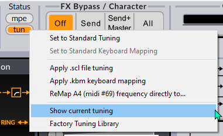

Die exportierte HTML-Seite zeigt dann die in der SCL-Datei enthaltene Stimmungsbeschreibung
in der SCL-Datei, die Grade der Skala und die Zuordnung von Tonhöhen zu
MIDI-Noten. Unten sehen wir, dass die Bohlen-Pierce-Stimmung 
mit ihrem 1/1-Startton auf C.60 @ 261.626 Hz gemapped wird.

Um die 1/1-Zuordnung auf eine andere MIDI-Note zu ändern, ziehen Sie eine
andere KBM-Datei auf die Surge-Oberfläche und öffnen Sie dann erneut die HTML-Seite
mit der Option **Show current tuning**, um zu sehen, wie sich das
Mapping verändert hat.

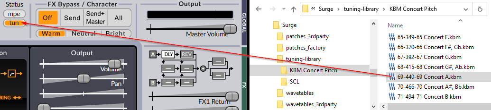

Unten sehen wir, dass die 1/1 für Bohlen-Pierce jetzt
auf die MIDI-Note A.69 @ 440 Hz gemapped ist:

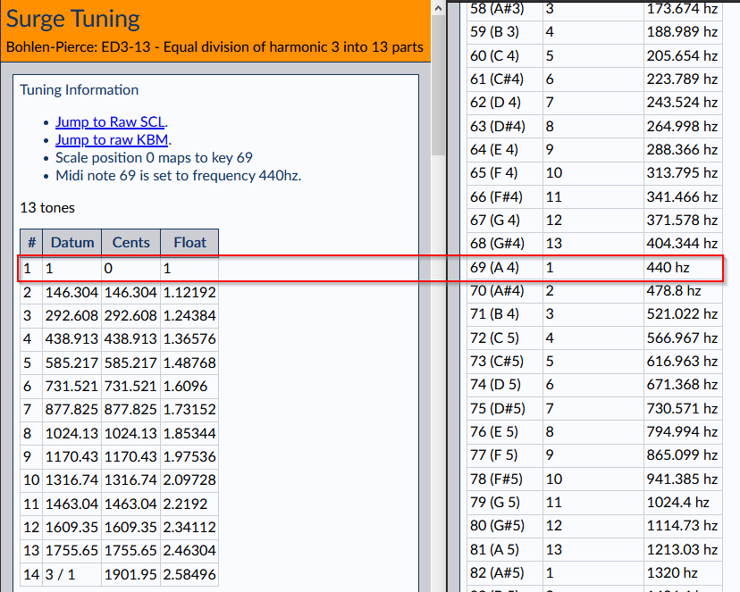

Klicken Sie auf die Links **Jump to Raw SCL** oder **Jump to Raw KBM**, um
die geladenen SCL- und KBM-Datei Mapping-Daten zu sehen.

 

### Definition von Scala Linear Keyboard Mapping Files (KBM)

*"Keyboard-Mappings bestimmen die Zuordnung von Skalengraden zu Tasten
auf einem MIDI-Keyboard bzw. MIDI-Notennummern im Allgemeinen"*.

Software-Implementierungen des kompletten
[Scala-Format](http://www.huygens-fokker.org/scala/scl_format.html) enthalten sowohl
die SCL-Datei: die tatsächlichen Skalengrade eines gegebenen Mikrotunings oder
Intonationssystems, als auch die KBM-Datei, die angibt, wie die
Tonhöhen des Intonationssystems direkt
auf Noten von MIDI-Keyboard-Controllern [zugeordnet werden](http://www.huygens-fokker.org/scala/help.htm#mappings). 
Beides sind für Menschen lesbare, Text formatierte Dateien.

Während es zwar eine Vielzahl verschiedener Verwendungsmöglichkeiten für die Scala-KBM
Dateien gibt, ist die vielleicht wichtigste die so genannte, lineare
Tastaturbelegung, die angibt:

- **Key For 1/1** - Die MIDI-Note auf dem Controller, bei der die Skala beginnt:
die Stufe 0 des Microtunings. Zum Beispiel könnte dies die MIDI-Note
C.60, A.69 oder eine beliebige MIDI-Note, die für das jeweilige musikalische Szenario geeignet ist, sein.

- **Reference Frequency** - Die Frequenz (Hz, CPS), die auf die Referenztaste abgebildet wird.
Die Frequenz (Hz, CPS), die der Referenztaste zugeordnet wird, z.B. A.69 mit 440 Hz,
oder C.60 bei 261,625565 Hz.

- **Reference Key** - Die MIDI-Note, auf die die Referenzfrequenz abgebildet wird,
die, wie oben, typischerweise C.60 oder A.69 sein kann. Es ist die Kombination
aus der Referenztaste und der ihr zugewiesenen Referenzfrequenz,
die die gemeinsame Grundtonhöhe und die relative
Zuordnung von Frequenzen zu MIDI-Noten im gesamten musikalischen Bereich für jedes
Intonationssystem, das einem MIDI-Instrument zugewiesen ist, bestimmt.

Wie wir also sehen, ist eine lineare Tastaturzuordnung "linear" in dem
Sinne, dass die Tonhöhen eines Intonationssystems sequentiell
über den musikalischen Bereich der MIDI-Noten in Abhängigkeit von den Einstellungen der drei
Parameter zugeordnet sind: Key For 1/1, Reference Frequency und
Reference Key.

Ein tiefes Verständnis dafür, wie dies funktioniert und warum es wichtig ist für
praktisch alle Musikinstrument-Stimmungen, ist grundlegend für die Arbeit mit
alternativen Intonationssystemen sowie für die mikrotonale
und xenharmonische Musikkomposition, wo hochpräzise Intonation ein
häufiges Merkmal und Anforderung ist.

Hier ist ein Beispiel für Linear Keyboard Mapping, das den
Key For 1/1 der MIDI-Note C.60 zuordnet, wobei die Referenz
Frequenz bei 440 Hz und der Reference Key auf der MIDI-Note 69 liegt:

 
**Beispiel für lineares Mapping**

`!`
 
`! Size of map:`
 
`0`
 
`! First MIDI note number to retune:`
 
`0`
 
`! Last MIDI note number to retune:`
 
`127`
 
`! Middle note where the first entry in the mapping is mapped to:`
 
`60`
 
`! Reference note for which frequency is given:`
 
`69`
 
`! Frequency to tune the above note to (floating point e.g. 440.0):`
 
`440.000000`
 
`! Scale degree to consider as formal octave:`
 
`0`
 
`! Mapping.`

 
Dies wäre typisch für die Abbildung von Intonationssystemen auf Halberstadt
Klaviaturen, wie z.B. die 12-stimmige pythagoräische, verschiedene Formen der mitteltönigen
Stimmungen und eine Reihe anderer sogenannter syntonischer Stimmungen, die auf
Ketten (oder Zyklen) von Quinten beruhen, bei denen der 1/1-Startton auf
C.60 (mittleres C), und der Kammerton auf A.69 @ 440 Hz fallen soll. Mit
diesem KBM fallen alle bekannten klassischen diatonischen Modi auf die
weißen Tasten des Controllers, wobei die Bässe und Kreuze auf die schwarzen
Tasten fallen.

Microtuning ist tief in Surge integriert, da viele seiner Module ihr Verhalten an die geladene benutzerdefinierte Skala anpassen.
Sie können [diesen Artikel](https://github.com/surge-synthesizer/surge-synthesizer.github.io/wiki/Microtonal-pitch-modulation-using-the-step-sequencer)
im Surge-Wiki über die Anwendung von Microtuning-Tonhöhenmodulation mit dem Sequenzer lesen.

 

### Anwenden der Stimmung am MIDI-Eingang / nach der Modulation,  Menueoptionen

Microtuning ordnet die Tasten des Keyboards den Tonhöhen zu. Bei Vorhandensein von Modulationen ist ihre Bedeutung jedoch nicht eindeutig.
Bis zu Version 1.9 ging Surge davon aus, dass Modulationen *gestimmt* sind. Das bedeutet, dass die Frequenz eines Oszillators
aufgelöst wurde, nachdem alle möglichen Modulationen zur Tastaturverschiebung (Pitch Bend, Oktavverschiebungen, etc.) angewendet wurden. Diese
Wahl hat eine wirklich positive Konsequenz. Wenn Sie zum Beispiel Pitch-Bend-Range auf 2 Halbtöne eingestellt haben, die MIDI Note 60 (mittleres C) drücken und
ganz nach oben biegen, hören Sie genau die gleiche Tonhöhe, die Sie hören würden, wenn Sie die MIDI Note 62 (D) unabhängig von der geladenen Stimmung drücken.
Das heißt, die von Ihnen beobachtete Frequenz ist die Stimmung (Key + Modulation).

Dies ist jedoch nicht die einzige Wahl, die Sie treffen können. Es gibt Situationen, in denen Sie wollen, dass die Modulation nicht im
Stimmbereich liegt. Wenn Sie z.B. zwei Oszillatoren immer um ein konstantes Frequenzvielfaches distanziert haben wollen und Sie
eine Nicht-Standard-Stimmung haben, wäre das mit dem oben erwähnten Standardverhalten schwer zu erreichen. Sie könnten wollen, dass die Stimmung
für die Tastatur gelten soll und die Modulation im Halbtonraum und nicht im Tastaturraum erscheinen soll. Das heißt, Sie möchten, dass die Frequenz
Ihres Modulators gleich Stimmung (Key) + 12-TET-Frequenzverschiebung (Modulation) sein soll. In diesem Fall ist die Bedingung, dass "Pitch Bend
von 2  Halbtönen aufwärts von C die gleiche Frequenz wie D ist" verletzt, aber konstante Frequenzverschiebungen sind möglich.
Mit Surge 1.9 führen wir die Möglichkeit ein, die Art wie die Stimmung angewendet wird, zu wählen. Dieses Verhalten wird mit dem Tuning
Menü-Schalter **Apply tuning at MIDI input** ausgewählt. Wenn dies aktiviert ist (was der Voreinstellung entspricht), ist die Modulation auf die geladene Skala gestimmt,
und Tonhöhenbeugungen erfolgen im Tonart-Raum. Wenn stattdessen **Apply tuning after modulation**  angekreuzt ist, wird die Stimmung nur auf die
Tastatur angewendet und die Modulation erfolgt im 12-TET-Raum. Da sich dadurch grundlegend ändert, wie ein Patch in einem gestimmten Modus spielen würde,
wird diese Option auf der Patch-Ebene gespeichert.

Lassen Sie uns also ein Beispiel geben. Stellen Sie sich vor, wir verwenden ED2-6, die gerade Unterteilung der Oktave in 6 Töne mit dem mittleren C, gemapped auf 261 Hz.
Wenn Sie das mittlere C spielen, hören Sie 261, wenn Sie das C eine Oktave höher spielen, hören Sie 1044Hz, das C 2 Oktaven höher
(da 6 Tasten eine Oktave umfassen). Stellen Sie sich nun vor, dass Sie einen unipolare Rechteckwellen-LFO einrichten und diesen auf die Oszillator-Tonhöhe 
mit einer Tiefe von 12 Keys anwenden.

In Surge 1.8 und im Standardmodus von Surge 1.9 schwingt die Frequenz beim Drücken des mittleren C zwischen
261 und 1044 Hz - zwischen dem Klang der Taste C bei MIDI Note 60 und dem Klang der Taste C 12 Keys höher. Wenn Sie stattdessen den Schalter
"Tuning applies to modulation" wählen und die gleiche Taste drücken, hören Sie die Note zwischen 261 Hz
(der von Ihnen gespielten Note) und 522 Hz - der 12 Halbtöne höher gestimmten Note.

Manchmal wollen Sie das und manchmal nicht. Es gibt keine "richtige" Antwort. Deshalb haben wir beide Optionen zu Surge hinzugefügt.

Beachten Sie, dass diese Funktion in der Standard-12-TET Stimmung nichts bewirkt.

 
 

## Continuous Controller information (CC)

Die acht Makros auf der rechten Seite der Routing-Leiste haben automatisch zugewiesene CCs.

Die Liste ist wie folgt:

**Control 1** = CC 41

**Control 2** = CC 42

**Control 3** = CC 43

**Control 4** = CC 44

**Control 5** = CC 45

**Control 6** = CC 46

**Control 7** = CC 47

**Control 8** = CC 48

 
 

## Fragen?

Besuchen Sie gerne den Surge Synth Discord [hier](https://discord.com/invite/spGANHw), wenn Sie Fragen zu Surge haben, bei der Weiterentwicklung helfen wollen oder wenn Sie auf Bugs oder andere Probleme stoßen.
