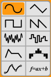

 

 
 
 
 
# Surge 1.8 User Manual
{:.no_toc}
 
## Table of Contents
{:.no_toc}

* unordered list
{:toc}

 
 
 
 

# Getting Started
Thank you for using **Surge**\!

Surge is a virtual synthesizer released into
open source by creator Claes Johanson in September 2018, and maintained by a group of volunteers since then.

This first section is intended to give you a brief overview of some concepts
that are specific to this synthesizer and an introduction on how to navigate,
manipulate, and use Surge to its full potential.

For detailed information regarding the synthesis engine and other advanced technical
specifications and options of this synthesizer, there is a second section dedicated to
[Technical Reference](#technical-reference).

Finally, for more tips and tricks, tutorials, and to download additional content, you can also take a look at [Surge's wiki](https://github.com/surge-synthesizer/surge-synthesizer.github.io/wiki).

 
 

## Installing Surge
*Audio Units, AU is a trademark of Apple Computer, Inc  
VST is a trademark of Steinberg Media Technologies GmbH*

Surge's installer is available at [https://surge-synthesizer.github.io](https://surge-synthesizer.github.io).

### Windows

On the Windows platform, Surge is delivered as both a 32 or 64-bit VST3 plug-in instrument.

The filename for the VST3 is `Surge.vst3`.

System Requirements:

  - Windows 7 or newer
  - A reasonably fast CPU (Pentium 4/Athlon 64 or above)
  - At least 4GB of RAM
  - VST-compatible host application

In addition, to use the 64-bit version  on Windows you need the following:

  - A CPU supporting the x64 (AMD64/EM64T) instruction set
  - A **64-bit** version of Windows
  - An application capable of hosting 64-bit VST plug-ins

The VST3 version of the plug-in should be automatically installed in the default VST3 plug-in location and
should be found by your host application. However, the Windows version also comes with a **portable mode**:

- Portable Mode allows you to store assets in the same directory as your surge.vst3.
- If Surge.vst3 is installed in a folder and in that same folder there is a directory called `SurgeData`, Surge will use that for factory data rather than `%PROGRAMDATA%\Surge`.
- If in that same folder there is a directory called `SurgeUserData`, Surge will use that for user data rather than `%DOCUMENTS%\Surge`.
- Either none, one, or both of those folders can be there. Surge will fall back to the defaults if they are not present.
You can always see your data paths in the [about screen](#about-surge).

 
### macOS

On Mac, Surge is delivered as a 64-bit Plug-in Instrument for both the Audio
Unit (AU) and VST Plug-in interfaces (VST3).

System Requirements:

  - Mac OS X 10.11 or newer
  - A 64-bit Intel CPU
  - At least 4GB of RAM
  - 64-bit AU or VST-compatible host application

To install, run the packaged installer. You will be given the option of automatically installing the
AU `Surge.component` and the VST3 `Surge.vst3` to their correct locations.
The factory presets and wavetables will also be automatically installed.

Running the packaged installer will install Surge for all of the users of your
Mac.

 
### Linux

On Linux, Surge is delivered as a 64-bit VST3.

The system requirements can be hard to determine, as there are a lot of distributions out there and other factors.
However, the following information might be good to know:

 - The installation package on **Surge's website** is in the form of a Debian package
 - The distribution package is built on Ubuntu 16.04
 - The packages required are listed in the source and in the deb file

**Note:** Some actions in Surge are done by doing Alt + Drag or scroll wheel. On certain Linux distributions,
those shortcuts and gestures may cause conflicts between Surge and the desktop environment. We decided we couldn't
give up alt-drag for all platforms because one window manager in one distribution used it by default. Therefore,
it's often possible to disable that global gesture in desktop environments, and would be the easiest way to solve
that possible issue.

 
 

### Building from source
If you would like to build Surge from source, see the instructions on
[our Github repository](https://github.com/surge-synthesizer/surge).

 
 

## Locations

### Windows

The preset library and wavetables are at `C:ProgramData\Surge`.
The user presets are at `C:\Users\your username\My Documents\Surge`

### macOS

The preset library and wavetables are at `/Library/Application Support/Surge`.
The user presets are at `~/Documents/Surge`.

### Linux

The plugin itself, preset library and wavetables are at `/usr/share/Surge` with a standard install.
The user presets are at `~/Documents/Surge`.

 

Note: These locations can be changed in Surge's menu (see [Data and Patches](#data-and-patches)).

 
 

# Introduction to the User Interface

The user-interface of Surge is divided into four main sections:
  - Patch/Global
  - Scene controls
  - Modulation/Routing
  - FX

Keeping this structure in mind will make it easier to understand the layout.

*The four sections of the user-interface that Surge is divided into.*

 

## The "Scene" Concept

Every patch in Surge contains two scenes (A & B) and an effect-section.
Both scenes and all effect settings are stored in every patch. A scene is similar to a
traditional synthesizer patch as it stores all the information used to synthesize a voice.
Since there are two scenes in each patch, it’s possible to have layered or split sounds stored within a single patch.
(see [Scene Select and Scene Mode](#scene-select-and-scene-mode)).

 

## Audio Outputs

When loaded into a DAW, each instance of Surge has **3 audio outputs**:
- Stereo Out
- Scene A Out
- Scene B Out

In some hosts, like FL Studio for instance, Surge will disable the individual scene outputs due to a conflict with
the DAW's audio routing architecture. To enable those additional outputs in such cases,
see [this option](#workflow) in the Surge menu.

 

## Sliders and controls

The most common user-interface control in Surge is the slider. They come
in both horizontal and vertical orientations but their functionality is
otherwise identical.

Sliders are always dragged, there is no jump if you click on the slider
tray instead of the slider head, it enters dragging mode nonetheless.

Slider interactions:  
  - **Left-click drag** - Drag slider
  - **Shift + Left-click drag** - Drag slider (fine)
  - **Ctrl/Cmd + Left-click drag** - Drag slider (quantized steps)
  - **Alt + Left-click drag** - Drag slider in elastic mode (snaps back to initial position upon release)
  - **Scroll Wheel** - Move Slider
  - **Shift + Scroll Wheel** - Move Slider (fine)
  - **Double left-click** - Reset parameter to default value  
  - **Right-click** - Context menu

Other than sliders, some of Surge's parameters are also displayed as number and value fields, buttons and button rows.

 

### Parameter context menu

Any parameter's context menu can be brought up with a right-click. This menu has numerous useful functions:

#### Name and contextualized help
Clicking on this first option will open this user manual to the correct section explaining the parameter in question.

#### Edit Value
This option allows you to type in the desired value of a parameter. Once the value popup appears, its text will already
be highlighted, and you can start typing the value right away. When you are done, simply press Enter to confirm
the change. To cancel and close this popup, simply press the Escape key or move any other parameter.

For discrete parameters (Unison Voices, or a button row for instance), instead of a type-in field, all the possible
values will be displayed right in the menu so it can be accessed directly.

If a control is modulated, there will also be edit options for the amount of modulation for each modulation source.
The entered value corresponds to the position of the modulation slider (blue slider) for that modulation source (see [Routing](#routing) for more information).

Note that in both cases, the actual unit of the parameter doesn't need to be typed in.

#### Extend Range
Some parameters can have their range extended. The option **Extend range** will appear in the context menu
if they do. **Pitch**, for instance, is one of those parameters.

#### Tempo Sync
Some parameters can be synchronized to the host tempo. The option **Tempo sync** will appear in the
context menu if they do.

Once tempo-synced, when using the Surge Classic skin, the slider will show a "TS" symbol on their handles to indicate that state, like so:

This indication can vary depending on the skin used.

#### Activate / Deactivate
Some parameters can be activated or deactivated. If a slider appears transparent or is missing its handle,
in some cases, it can be because the parameter is deactivated. To toggle it, simply use this option.

#### Assign parameter to...
This option allows to assign the right-clicked parameter to any MIDI CC.

#### MIDI Learn Parameter...
This is where you assign a MIDI controller to the desired slider. To abort MIDI learning on that parameter,
simply right-click again and the option will now become **Abort Parameter MIDI Learn**.

#### Clear learned MIDI (...)
This option will be available if the selected parameter has already been MIDI learned. It allows you to clear that link (the
existing link MIDI CC number will be shown in parentheses).

#### Add modulation from...
This menu entry allows to directly modulate the right-clicked parameter to any modulation source in Surge.
Once a source is selected, a pop-up window will appear and allow you to enter the desired modulation amount form
that source.

#### Clear Modulation
This menu also includes an easily accessible option to clear any or all modulation routings to a slider that is being modulated (those that have a blue tint) (see [Routing](#routing)).

#### VST3 Options
Finally, the VST3 version of Surge supports VST3 context menu items. Depending on the host,
there may be more or less options regarding automation, MIDI, or parameter values.

 
 
 
 

# Patch/Global Section

 
 
## Scene Select and Scene Mode

There are two setups of all controls within the Scene section of the user interface.
The **Scene Select** buttons **[A|B]** determine which one is selected for editing.
Right-clicking on these buttons brings up a context menu that allows you to copy/paste scene content.

Depending on the **Scene Mode**, these two buttons could also be used to choose which scene will be *played*.
Indeed, whether a scene will generate a voice when a key is pressed is determined by the **Scene Mode** setting:

  - **Single** – Notes will be played only by the selected scene.
  - **Key Split** – Notes below the **split key** will be played by scene A,
    notes above and including the **split key** will be played by scene
    B.
  - **Channel Split** Notes from MIDI channels below the **split MIDI channel** will be played by scene A,
    notes from MIDI channels above and including the **split MIDI channel** will be played by scene B.
  - **Dual** – Both scenes will play all the  notes.

In both **Key Split** and **Dual** mode, if MPE is disabled, the system also supports MIDI channel routing where Channel 2 plays only
Scene A and channel 3 plays only Scene B. MIDI channel 1 and all other channels higher than 3 play the Split/Dual mode.

**Poly** shows the number of voices currently playing and allows you to
set an upper limit to the number of voices allowed to play at the same
time by dragging horizontally on the value. The voice-limiter will kill off excess voices gently to avoid
audible artifacts, thus it's not uncommon for the voice count to exceed
the limit.

The state of the polyphony limit setting is **not currently** stored in patches.

 
## Patch Browser

### Navigating through presets
Finding sounds in Surge is easy: just press the arrow buttons
until you find something you like. If you left-click the patch-name
field (anywhere in the white area), a menu will list all available
patches arranged into categories. A right-click will bring up a menu with just the
patches of the current category.

These categories are also grouped into three sections depending on who created them:

  - Factory Patches - Patches created in-house by the Surge authors.

  - 3rd party patches - Patches created by users and 3rd parties.
    Categorized by creators.

  - User Patches - Your own patches will be stored here. How you categorize them
    is entirely up to you.

Finally, at the bottom, there is an option to [download additional content](https://github.com/surge-synthesizer/surge-synthesizer.github.io/wiki/Additional-Content).

You can also directly load patches (.fxp) by dragging and dropping them anywhere over the Surge interface.

 

### The Store Dialog

Clicking the store button of the patch browser opens the store dialog.
This is where you name your new patch and choose which category it
should belong in. You can also create a new category manually here as
well. The patches you store will end up in the user section at the bottom
of the patch menu. The store dialog also provides text fields for the name of the patch creator
and comments.

Note: Comments are not currently shown in the main GUI.

 

## Status Area

This area is meant to be a quick access to some of Surge's features that are also present in the Menu.
(see [Menu Button](#menu-button))

Right-clicking on one of these buttons will reveal more options which are also present in sub-menus under the Menu button as well.

For instance, the first time you press the **Tune** button if no custom tuning is loaded, it will open the same menu
as if you would have right-clicked on that button. Once a custom tuning is loaded however, left-clicking on it will
turn the loaded tuning on or off.

Alternatively, **.scl** and **.kbm** files can also be dragged and dropped anywhere on the interface to import
custom tuning.

See [Microtonal Tuning](#microtonal-tuning) in the Technical Reference section for more information.

 

## FX-Bypass, Character and Global Volume

**FX Bypass** lets you quickly hear what a patch sounds like without the effect-units. (see [FX Section](#fx-section))

  - **Off** – Bypass is disabled, all effects are active.
  - **Send** – The send effects are bypassed.
  - **Send + Global** - The send and global effects are bypassed.
  - **All** – All effects are bypassed.

**Character** controls the amount of high-frequency content present in
oscillators of the patch that are using the "classic" algorithm. The
possible choices are Warm, Neutral and Bright.

**Global Volume** controls the last gain stage before the output. The
VU meter above it shows the output level and will become red if it goes
above 0 dBFS.

The state of these two settings are **not** stored with patches. They
are however stored by the host application in your project files.

 
 
 
 

# Scene Controls Section

The UI of the scene section can also be further divided into two parts:

  - Sound generation
  - Sound shaping

The sound is generated and mixed in the sound generation section. After that, it
goes through the sound shaping section.

 

## Sound Generation

This is where the sound is born. The oscillators generate waveforms
according to the notes played. They are then summed up in the mixer.

 

### Oscillators

**1/2/3-buttons** – Chooses the active oscillator for editing. You can right-click on one of them
and a context menu with the name, **Copy** and **Copy (with modulation)** options will show up.

**Display** – Shows the active waveform. When the **Wavetable** or **Window** oscillator
is used, it will also work as wavetable selector by clicking on the orange bar or on the arrows
to cycle through them.

**Type** – Oscillator type. Chooses which algorithm is used for the
oscillator. Available options are Classic, Wavetable, Window, Sine,
FM2, FM3, SH Noise and Audio Input.

 See [Oscillator algorithms](#oscillator-algorithms) in the Technical Reference section for more information.

**Pitch & Octave** – Controls the pitch for this particular oscillator.
Its context menu can be used to extend its range, or to set the pitch to **Absolute** mode, which makes the pitch shift
in absolute frequency as opposed to relative to the note that is being played.

**Keytrack** – When disabled, the oscillator will play the same pitch
regardless of the key pressed.

**Retrigger** – If active, the oscillator and all its unison voices will always start immediately
at the same phase position. This is useful for snappy sounds where you want the
attack to sound exactly the same each note.

**Other** - The rest of the sliders from the oscillator editor are specific to each
oscillator type. See [Oscillator algorithms](#oscillator-algorithms) in the
Technical Reference section for more information.

 

### Mixer

#### Mixer Channels

Excluding the **Pre-filter Gain** (slider on the right), the Mixer has 6 channels (sources) from left to right:

  - **Oscillators 1, 2, 3**

  - **Ring Modulation of 1x2, 2x3** – The source of these two channels is **digital ring modulation** from the oscillators.
                                      This type of RM is a bit different from the traditional carrier-modulator style ring modulation.
                                      Digital ring modulation is simply the result of multiplying the output of oscillators 1 and 2,
                                      or 2 and 3.
  - **Noise Oscillator**

#### Channel Parameters

Each channel has the following controls:

  - **M** – Mute. You can of course have multiple channels muted at the same time, but you can also keep only the channel
  you mute muted by holding down **Ctrl / Cmd** and clicking on the desired mute switch.

  - **S** – Solo (only play channels that have solo active). You can have multiple channels in solo at the same time, or
  only one at a time by holding down **Ctrl / Cmd** and clicking on the desired solo switch.

  - **Triple Orange Box** (Filter routing) – Chooses which filter the channel is routed to.
                The left position routes the channel output to filter 1, the right position
                routes it to filter 2, while the middle position, which is selected
                by default, routes it to both.
                However, this setting will only route the channel output to filter
                1 if a **serial** filter block configuration is used, since the
                audio will then go through the second one in the filter block anyways.
                If any other configuration than serial is used, the audio will then
                be routed to both filters, as expected.

  - **Slider** – Gain control for each input.

 

### Other sound generation parameters

**Pitch & Octave** – Controls the pitch for the entire scene. Affects
the filter key-tracking and the keytrack modulation source as well. The
range of the slider can be extended using the context menu.

**Portamento** – Portamento is when a new note will slide in
pitch from the pitch of the last played note. This setting determines how
long the slide will be. A setting of 0 disables Portamento. This parameter can be
tempo-synced.

Portamento has some interesting options accessible in its context menu:
- **Constant rate** - If this option is enabled, the time to cover **one octave** is
defined by the Portamento slider value. From there on, gliding between 2 octaves
for instance will take twice as long, and so on.
By default, this option is disabled, so the **glide rate**
is proportional to the distance between the two keys, making it so that it
always takes the same time to glide between **any two keys**.
- **Glissando** - If this option is enabled, the pitch slide will be quantized
to the scale degrees.
- **Retrigger at scale degrees** - If this option is enabled, the FEG and AEG
(see [Envelope Generators](#envelope-generators)) will be triggered each time the portamento
slide crosses a scale degree.
- **Curve options** - You can choose between a **Logarithmic**, **Linear** or **Exponential**
portamento curve. By default, the portamento slide follows a linear curve.

**Osc Drift** – Applies a small amount of instability to the pitch of
all oscillators, making them subtly detuned. Although the parameter is
shared, the randomness of the instability effect is independent for all
oscillators and all the unison voices of each oscillator.

**Noise Color** – Affects the frequency spectrum of the noise
generator. The middle position results in white noise. Moving the slider
to the left emphasizes low frequencies while moving it to the right emphasizes high frequencies.

**Bend Depth** – Pitch Bend Depth Up/Down. Controls the range of the
pitch bend wheel, in semitones.

**Play Mode** – Chooses how multiple notes are handled. Poly will allow
multiple notes to be played simultaneously, while Mono will only let the last note
play. Latch will continuously play the last played note (mono).

Mono has two possible modifiers:

  - **Single Trigger EG (ST)** means that the two envelope generators are
    not restarted when sliding between two notes (two notes that overlap
    in time)
  - **Fingered Portamento (FP)** means that portamento is only applied when
    sliding between notes and not when there is time between the played
    notes.

When **Play Mode** is set to one of the Mono modes, the context menu of that button list will display
additional options related to mono note priority:

- **Last note priority** - Will play the latest note when multiple notes are played together
- **High note priority** - Will play the highest note when multiple notes are played together
- **Low note priority** - Will play the lowest note when multiple notes are played together
- **Legacy note priority** - When multiple notes are played together, it will play the latest note once hit and play
the highest remaining note once released.

- **Sustain pedal in mono mode**
  - **Sustain pedal holds all notes (no note off retrigger)** - If sustain is engaged and multiple notes are hit then
  held one after the other, Surge will stay on the latest note when releasing that note instead of switching to the previous
  note.
  - **Sustain pedal allows note off retrigger** - If sustain is engaged and multiple notes are hit then held one after
  the other, Surge will switch to the previous note when the latest note is released.

 
 

## Sound shaping

 

### Filter controls
**Filter Block Configuration** – Chooses how the filters, waveshaper and
the gain stage are connected together. Note that only the Stereo and Wide configurations
will output a stereo signal.

**Feedback** – Controls the amount (and polarity) of output that's fed
back into the input of the filter block. It has no effect when using the
Serial 1 filter block configuration (which because of this has a lower
CPU load).

Note:
Be careful with your monitoring volume when using feedback. It's easy to
make really loud high-pitched noises by mistake if you're not familiar
with how the synth reacts to feedback.  

Don't let this scare you though. There's a lot to be gained from proper
and creative use of feedback. Changing the character of filters, making
filters interact together, making basic physical models, making sounds
that are just about to break apart. It is these things that make
Surge truly special.

**Filter Balance** – Controls how the two filters are mixed. The
behavior depends on the filter block configuration.

**Type** – Selects the type of the filter. There are [numerous types available](#filter-algorithms).

**Subtype** – Selects variations of each filter type. The difference can
vary from subtle to radical depending on how the filter is used. See
[Filter algorithms](#filter-algorithms) in the Technical Reference section
for information regarding subtypes of each filter type. It is displayed
as a number next to the filter type (when available).

**Cutoff** – Controls the cutoff frequency of the filter. When tweaked, while its tooltip
will show frequency in Hz, it will also show its approximate MIDI note value,
very useful when using the filter for melodic and tuning purposes.  

**Resonance** – Controls the amount of resonance of the filter.

**Filter 2 Offset Button** (small "+" button to the right of the filter parameters) – When active,
the cutoff frequency will be set relative to filter 1.
This includes any modulations (including the hardwired FEG depth &
keytracking). Filter 2's cutoff frequency slider **becomes an offset** setting relative
to filter 1's cutoff frequency.

**Resonance Link Button** (small button, filter 2 only) – Makes the slider
follow filter 1's resonance slider setting.

**Keytrack \> F1/F2** – Controls how much the pitch of a note affects the
cutoff frequency of the filter. A setting of 100% means the filter
frequency will follow the pitch harmonically.

 

### Envelope Generators

There are two envelope generators connected to the filter block.

On the left is the Filter Envelope Generator (Filter EG).
It is hardwired to the two filters, whose depth is set by the **\>F1** and **\>F2** sliders.

On the right is the Amplitude Envelope Generator (Amp EG). This one is hardwired to the gain
stage of the filter block.

 

*The ADSR envelope structure*

The envelope generators are of the 4-stage ADSR type. This is the most
common form of EG used in synthesizers and it is named after its four
stages **Attack**, **Decay**, **Sustain** and **Release**. If you're new
to synthesizer programming the illustration should give you a good idea
how they work. The thing you need to remember is that after going
through the attack & decay stages the envelope will stick in the sustain
stage until the key is released.

**Attack**, **Decay** and **Release** are time-based parameters and can be tempo-synced by right-clicking on one of
those sliders. You will also find an option to tempo-sync those three controls at once for each envelope generator.

Above the envelope stage controls is a graphic representation of the
ADSR structure.

If the envelope mode is set to **Digital**, there will be small adjustable orange fields
on the graphic. Dragging them horizontally allows you to choose the curvature of the different stages of the envelope.

If the envelope mode is set to **Analog**, the curvature of the different stages
will automatically be set to a shape that tries to emulate analog behavior.

 

### Other sound shaping parameters

**Keytrack root note** – Sets the root key of the filter keytracking and the
keytrack modulation source. At the root key, the keytrack modulation
source will have the value zero. Above/below it it will have
positive/negative modulation depending on the distance to the root key
in octaves. This parameter does not affect the oscillator pitch.

**Keytrack amout sliders** - Sets the amount of filter keytracking applied to
each filter.

**HP** – Controls the scene high-pass filter (scene parameter). This parameter can be deactivated, which will remove it
from the audio path.

**FM configuration** – Chooses how oscillator FM (frequency modulation) is
routed.

**FM depth** – Sets the depth of the oscillator FM.

**Waveshaper type** – Chooses type of the non-linear wave-shaping
element.

**Waveshaper drive** – Sets the drive amount of the waveshaper. This control can be extended.

**Amp Vel.** - Controls how the **Amp Gain** scales with velocity. This
is neutral at the maximum position. Other settings provide attenuation
at lower velocities, thus this setting will never increase the **Amp
Gain** parameter by velocity.

**Amp Gain** – Controls the gain element inside the filter block.

 

### Scene output

The output stage is located after the filter block in the audio-path. As
it's outside the filter block-structure changing the gain here doesn't
have any affect on the timbre of the voice (unlike the previous
gain-control which may affect how the feedback and wave-shaping acts),
but it can still change the timbre of the effect section if non-linear
effects (like distortion) are used.

**Volume** – Scene volume control. You can choose to hard clip the scene output (default) or not by right-clicking
on this control and choosing **Hard clip signals over 0 dBFS**.

**Pan** – Pan/balance control

**Width** – The amount of stereo spread (only present for the **Stereo** and
**Wide** filter block configurations)

**Send FX 1/2 Level** – Send level to Send effect 1/2. (scene parameter)

 
 
 
 

# Modulation/Routing Section

The modulation section is different from the sound generation
and shaping sections as no audio data is passed through it. Instead it
allows you to control the parameters in the other sections from various
sources.

 

## Routing

Modulation routing in Surge is a bit different compared to most synthesizers,
but it's actually very intuitive and extremely powerful, thanks to the routing bar.

 

### How to apply modulation to parameters
Here's how it works:

1. Select the modulation source you want to use.

    

2. Engage routing mode with a second click on the source. It will become bright green,
and sliders that can be modulated will display a blue modulation depth slider on top of its normal slider.

    

3. Drag the desired modulation slider (blue slider) to the position you want the parameter to be at
when fully modulated (at the top peak of a Sine LFO, or after the attack stage of an envelope for example).
The modulation's full range will then be shown with the corresponding green bar on the slider.

    

4. Disengage routing mode by clicking again on the modulation source.

    

 
Alternatively, routing mode can also be engaged or disengaged by pressing **TAB** on the keyboard,
or by pressing the **middle**, **previous**, or **next** mouse buttons anywhere over the interface.

You can also directly access the numerical modulation amount dialog (explained [here](#edit-value))
by holding down **Ctrl/Cmd** on the keyboard, then dragging the desired modulation source over the target parameter.

Note that modulation range is always **relative** to the base value represented by the gray slider,
meaning that moving its position will then shift the whole modulation range up or down.
This also means that if a modulation slider's value is smaller than the base value,
the modulation polarity will be inverted.

 

### Modulating LFO parameters with another modulator

When clicking on one of the LFO buttons in the routing bar, both the LFO source
selection and the LFO editor will be selected. However, the two actions can be separated, as you can choose which button is selected as the modulation routing source, and at the same time edit parameters from **a different
LFO** than the source.

To do that, select the source normally, and then click
on the mini-button on another LFO (the small orange arrow):

This effectively lets you **modulate the parameters of one LFO with any other mod source(s)**.
However, as an example, note that logistically, an S-LFO can modulate parameters of an LFO, but
an LFO **cannot** modulate parameters of an S-LFO
(see [Voice modulators vs. Scene modulators](#voice-modulators-vs-scene-modulators)).

Remember that you can also see which LFO is currently being displayed in the editor by looking at what's written
vertically to the left of the editor.

 

### Modulated sliders

Once a slider is routed to a modulation source, the shade of blue on its tray indicates
whether the parameter is modulated and by which source.

1) Parameter is not modulated (gray)

2) Parameter is modulated (gray-blue)

3) Parameter is modulated by the currently selected modulation source (bright-blue)

Moreover, if you hover your mouse pointer over any modulated slider, the source(s) it's being modulated
from will be highlighted in the routing bar. This makes it easier to see what modulation source(s) are
linked to a parameter.

 

### Modulation source buttons
Once routed to any parameter, the modulation source buttons change their appearance depending if they are selected,
and if they are routed in the current patch or not. (scene dependent)

1) Unused modulation source

2) Used modulation source

3) Unused selected modulation source

4) Used selected modulation source

 

### Clearing modulation

After right-clicking on a modulated slider, you will see an option to easily clear the modulation and un-link it from its source.

Alternatively, you can also reset its modulation slider (blue slider) to 0 by double-clicking on it
when routing mode is engaged, or entering 0 in the type-in editor (see [Edit Value](#edit-value)).

 

Furthermore, by right-clicking on any modulation source, there will be options to clear a particular linked parameter,
but also all of them at once.

 
 
 
 

## Modulators
Surge has four main types of modulation sources :

 - LFOs
 - Internal modulators
 - Voice and note properties
 - Macros

All of these modulation sources are located in the routing bar (see [Routing](#routing)) :

 

*The four types of modulation sources, separated in categories.*

 

### Voice modulators vs. Scene modulators

Some modulation sources operate at the voice level, while others operate at the scene level.
Although they might seem similar, there is an important factor that distinguishes them.

One one hand, a voice modulator has separate modulation paths *for each voice*, meaning it can
control voice-level parameters (like filter cutoff) but cannot control scene level parameters (like FX levels or scene pitch).

On the other hand, a scene modulator has one identical modulation path *for the whole scene*, so it can control both scene level parameters **and** voice level parameters.

 

*On top, three voice LFOs. On the bottom, three Scene LFOs, "S-" meaning Scene.*

 
To demonstrate this distinction, let's say an sine wave LFO is modulating the cutoff of a filter.
Now, if 3 notes are being hit with a small delay between each of them, the phase of the LFO will be delayed between the notes accordingly.

You will indeed clearly hear the cutoff of the filter moving independently for each note, which gives the impression that there are three LFOs and three filters (which there actually is!).
The same principle applies for envelopes.

 

However, unlike the first demonstration, this time, if an S-LFO is modulating a certain parameter,
hitting more notes will not "add" an LFO for each voice, which gives the impression that there is a single LFO
modulating the cutoff frequency of the filter instead of many.

See [Modulation routing in-depth](#modulation-routing-in-depth) in the Technical Reference section for more information.
 
 

### LFOs

Compared to some other synthesizers, Surge does not have dedicated **LFO**, **Envelope**, **Step sequencer** or
**MSEG** modulation sources. Instead, those are integrated within every LFO. This effectively enables the
flexibility of having up to 12 LFOs, envelopes, step sequencers or MSEGs, and everything in between simply by
changing their shape.

Surge's LFOs are very flexible and come with a built in DAHDSR-envelope which can
either work as a dedicated envelope generator or shape the amplitude of other modulation types over time.

 

Surge has a total of 12 LFOs:
 - 6 Voice LFO sources (labeled LFO 1-6 for instance)
 - 6 Scene LFO sources (labeled S-LFO 1-6 for instance)

See [Voice modulators vs. Scene modulators](#voice-modulators-vs-scene-modulators) for an explanation about the difference LFOs and S-LFOs.

 
 

#### Shapes

LFO shapes (from left to right, top to bottom):

| -------- | ------------------------------------------------------------------------------------------------------------------------------------------ | ---------------- |
| Sine     | Sine wave LFO                                                                                                                                  | Vertical bend    |
| Triangle | Triangle wave LFO                                                                                                                              | Vertical bend    |
| Square   | Pulse wave LFO                                                                                                                                | Pulse width      |
| Sawtooth     | Sawtooth wave LFO                                                                                                                       | Vertical bend    |
| Noise    | Smooth noise LFO                                                                                                                              | Correlation      |
| S&H     | Sample & Hold (stepped noise) LFO                                                                                                                                | Correlation      |
| Envelope | Envelope generator - sets the LFO to a constant output of 1, which can then be shaped by the LFO EG (see [LFO Envelope Generator](#lfo-envelope-generator))                                                                                                                          | Envelope shape   |
| Step Seq  | 16 step step-sequencer (see [Step Sequencer](#step-sequencer)).                                                               | Smoothness/Spikyness |
| MSEG | Fully editable MSEG (Multi-Segment Envelope Generator) with a large number of curve types and various editing options (see [Multi-Segment Envelope Generator](#multi-segment-envelope-generator-mseg))       | Depends on segment type and configuration |
| f = ax + b | Nothing to see here, just a little teaser for an upcoming new modulation source... :-) |[...]|

*On the left, the different shapes and their explanation. On the right, the way that the* ***Deform*** *parameter affects the waveform.*

Depending on the selected shape for a particular LFO, its name in the routing bar will change.
When using the first 6 waveforms, it will be called **LFO**. However, when using the envelope shape, **ENV**
will be displayed, **SEQ** will be displayed when the step-sequencer is used, and for the MSEG, **MSEG**
will be displayed. Scene LFOs have their equivalent labels as well:

 

#### Parameters
 

**Rate** – Controls the modulation rate. When the type is set to
Step Seq, one step equals the whole cycle. This slider can be tempo-synced
and deactivated from its context menu.
Deactivating the rate effectively freezes the LFO to a certain constant value depending on the
Phase/Shuffle parameter.
This can be useful for manually scrubbing in a waveform cycle of an LFO for instance, and can also be used in
the same way in the sequencer. This feature can also be used to make the modulation source act as a
**randomizer** in tandem with the "Random" trigger mode. A simpler [Random](#random-modulation-source)
modulation source can however also be used for that purpose.
Furthermore, modulation can even be applied to the Phase/Shuffle parameter with another modulation source
which opens up a lot of possibilities, such as effectively using the frozen LFO as a mod mapper.

Note: In the LFO editor, when right-clicking parameters that can be tempo-synced, there will also be an option to Tempo sync all the LFO parameters at once.

**Phase/Shuffle** - Controls the starting phase of the modulation waveform. As with any parameter,
it can be modulated. However, in this case, its modulated value will not change after the modulation is triggered
(for instance, it's not possible to shift an LFO's phase while a note is pressed).
Only starting phase is taken into account.

**Amplitude** – Controls the amplitude of the modulation. This is the parameter
you should use if you want to control the depth of an LFO with a
controller (like controlling vibrato depth with the modulation wheel, for instance). This control can also be
extended form its context menu, which allows you to reach a negative amplitude range (-100 to 100% instead of 0 to 100%).

**Deform** – Deform the modulation shape in various ways. The effect varies depending on the selected shape.
Different deform types are available for the **Sine**, **Triangle**, **Sawtooth** and **Envelope** shapes,
and can be accessed by right-clicking on the **Deform** slider.

**Trigger mode** – Chooses how the LFO is triggered when a new note is played:

- **Freerun** – The LFO's starting phase is synchronized with the host's song position to make it continuously running in the background. Freerun acts the same with voice LFOs or scene LFOs.
- **Keytrigger** – The LFO's starting phase is triggered when a new note is pressed.
If the synth is set to "Poly", each new voice gets its own LFO triggered with it when using a voice LFO.
However, when using an scene LFO, the first voice sets the LFO's position, then the other ones will follow it.
- **Random** – The LFO's starting phase is set to a random point in its cycle. If the synth is set to "Poly",
each new voice gets its own LFO triggered with it when using an voice LFO.
However, when using an scene LFO, the first voice sets the LFO's position, then the other ones will follow it.

**Unipolar** - If active, the modulation will be in the \[0 .. 1\]
range (unipolar). If not, it will be in the \[-1 .. 1\] range (bipolar).

The modulation range on a parameter is represented by a green bar when routing
mode is engaged (see [Routing](#routing)).

*Modulation on a control from a bipolar source*

 

*Modulation on a control from a unipolar source*

 
 

#### LFO Envelope Generator

The Envelope Generators are of the 6-stage DAHDSR type that are
multiplied with the waveform generator, no matter what the selected LFO shape is.
This means that if the LFO shape is set to Envelope, the output will simply be 100%,
and can then be shaped by the LFO EG.

*6-stage DAHDSR envelope*

 

#### Step Sequencer

The **Step Seq** shape houses a step sequencing editor where the LFO display would be. It allows you to draw
the output waveform with up to 16 steps.

*Step Sequencer editor*

The two blue markers define loop-points in which the
sequence will repeat once it gets into the loop. The left mouse button is
used for drawing while the right one can be used to clear the values to
zero.

To quickly reset a step to 0, either double-click on a step, or hold down Ctrl/Cmd and click or drag with the mouse over
the desired step(s).

Right-clicking and dragging over steps allows you to draw a straight line over the desired steps,
thus creating a perfectly linear staircase pattern.

Holding down **Shift** while drawing will quantize the values to
the scale degrees (1/12th in case of standard tuning, or possibly other
for custom tuning) spanning the range of **one octave**.
Furthermore, holding down **Shift + Alt** makes two times more values available, hence
useful when modulating pitch by **two octaves** instead.

For more information on microtonal pitch modulation using the step sequencer, you can read
[this article](https://github.com/surge-synthesizer/surge-synthesizer.github.io/wiki/Microtonal-pitch-modulation-using-the-step-sequencer)
on Surge's wiki.

 

The step sequencers inside **voice LFOs** have an extra lane at the top of the
step editor allowing to re-trigger the two regular voice envelopes
(The Amplitude and Filter Envelope Generators) when the small
rectangle is filled at that particular step.

*Step Seq of LFO 1 containing the re-trigger pane*

However, shift-clicking or right-clicking those rectangles allows the specified step in the sequencer to **only
trigger one of the two envelopes**. When the step is half-filled on the left,
only the filter envelope will be triggered. When filled on the right, only the amplitude envelope will be triggered.

 

The **Deform** parameter gives the **Step Seq** waveform a lot of flexibility. A value of
0% will output the steps just as they look on the editor. Negative
values will give an increasingly spiky waveform while positive values
will make the output smoother.

|**Negative deform**| |
|**Positive deform**| |

*Effect of the deform parameter on the step Seq waveform*

 
 

#### Multi-Segment Envelope Generator (MSEG)

Surge's Multi-Segment Envelope Generator (MSEG) is powerful and fully editable with a large number of curve types
and various editing options. It can be used to create more complicated LFO waveforms or envelopes
compared to the previously mentioned modulation shapes.
With the combination of various settings in the editing window and the usual parameters from the LFO editor,
you can practically create any modulation shape you could think of.

To open this MSEG editing window, you can either click on the little pencil button next to the wave display (1),
click on the wave display itself (2), or double-click on the MSEG icon in the modulation type selector (3):

 

**Default MSEG state**

Once opened, you will see a shape working as an envelope if you're using a voice LFO, or a triangle wave
working as an LFO if you're using a scene LFO. In any case, you can either build upon these
shapes if they suit your needs, or you can reset them to a simple straight line by right-clicking anywhere
in the edit window, then choosing **Create -> Minimal MSEG**. More information on those menu entries can be
found below.

 

**Zooming and panning**

In the MSEG editor, you can pan the view left or right by either left-clicking or middle-clicking,
then drag on the background left or right.

You can also zoom in and out by either scrolling with the mouse wheel or left-clicking
then dragging your mouse up or down. Alternatively, you can again middle-click and drag if you prefer.

 

**Adding and removing nodes**

In Surge's MSEG, a segment is comprised of its starting node (point) and the segment itself. A "segment's end node"
is actually the next segment's starting node. To add a new node, simply double-click where you want it to
be added. To remove a node and its following segment, simply double-click on the node you want to remove.
Note that you can only remove nodes if there are more than two nodes remaining in the shape.

 

**Control points**

In addition, you will also often find a **control point** in the middle of a segment. This one can be dragged
vertically (and also sometimes horizontally) to alter the segment's curvature or other properties depending
on the line type. To reset a control point to its default position, simply double-click on it.

 

**MSEG editing and behavior options**

At the bottom of the editor are a couple of options to configure editing modes and general behavior of the MSEG:

- **Movement Mode** - Sets the behavior when moving nodes.
  - **Single** - When dragging a node horizontally, moves a single node without affecting the others.
  - **Shift** - When dragging a node horizontally, shifts around the nodes following the node being moved, keeping the length of the segment belonging to that node constant.
  - **Draw** - Locks horizontal dragging of nodes, allowing you to draw over existing nodes to set their value in a
  simple sweeping motion.

- **Edit Mode** - Configures the MSEG editor to work in Envelope or LFO mode.
  - **Envelope** - Displays draggable loop points and region (effectively representing the Sustain stage in an envelope).
  - **LFO** - Hides the draggable loop points and region, links the value of the start and end nodes to complete the
  waveform cycle, always keep loop mode enabled (even if set to off).

- **Loop Mode**
  - **Off** - Don't loop when in Envelope mode, turn off draggable loop points.
  - **On** - Loop forever in the loop region (between the loop points). Subsequent segments, if any,
  will never be reached.
  - **Gate** - Loop until the note is released, then immediately transition to the segments following the loop region.

- **Snap To Grid**
  - **Horizontal** - Enables horizontal snapping to the grid. The number field to the right corresponds to the
  horizontal grid resolution. You can also temporarily enable horizontal snapping by holding down the Ctrl/Cmd key
  while dragging.
  - **Vertical** - Enables vertical snapping to the grid. The number field to the right corresponds to the
  vertical grid resolution. You can also temporarily enable vertical snapping by holding down the Alt key
  while dragging.

 

**Segment options**

Each segment has options in a context menu which can be accessed with a right-click in the
area of that segment. Some of them are only applied to the right-clicked segment, while others are applied
to the whole shape:

- **Actions**
  - **Split** - Splits the segment into two by adding a new node in its center
  - **Delete** - Remove the segment and its starting node
  - **Double duration** - Doubles the total duration of the whole shape
  - **Half duration** - Halfs the total duration of the whole shape
  - **Flip vertically** - Flips the whole shape vertically
  - **Flip horizontally** - Flips the whole shape horizontally
  - **Quantize notes to snap division** - Quantizes the nodes in the whole shape to the nearest horizontal grid position. Available in Envelope edit mode only.
  - **Quantize notes to whole units** - Quantizes the nodes in the whole shape horizontally to the nearest whole time units. Available in Envelope edit mode only.
  - **Distribute nodes evenly** - Distributes the existing nodes from the whole shape evenly in the horizontal axis between the first and last node.

- **Create**
  - **Minimal MSEG** - Loads a straight line going from 1 to 0 in value, a great starting point to build upon.
  - **Default voice MSEG** - Loads the default voice MSEG preset (envelope shape)
  - **Default scene MSEG** - Loads the default scene MSEG preset (triangle wave LFO shape)
  - **8, 16, 32 step sequencer** - Replaces the existing shape by an 8, 16 or 32-step sequencer shape
  - **8, 16, 32 sawtooth plucks** - Replaces the existing shape by an 8, 16 or 32 sawtooth plucks shape
  - **8, 16, 32 lines sine** - Replaces the existing shape by a sine wave made out of 8, 16 or 32 segments.

- **Settings**
  - **Link start and end nodes** - Links the value of the start and end nodes (useful for seamless
  looping for example).
  - **Deform applied to segment** - Sets if the selected segment is affected by the
   Deform parameter found in the LFO editor or not (see [deform parameter](#parameters)).
  - **Invert deform value** - Inverts the deform polarity applied to the selected segment.

- **Segment types** - List of line types from which a segment can be. The control point, if present,
  will have a different effect depending on the type used.
  - **Hold** - Holds the value of the previous node up to the segment's end node. No control point available.
  - **Linear** - Single line. The control point controls the curvature of the segment.
  - **Bezier** - Single line. The control point can freely bend the segment.
  - **S-curve** - Curved line. The control point determines how abrupt the S-shape is and its direction.
  - **Bump** - Single line. The control point can be moved up or down to create a "bump" in the segment.
  - **Sine, sawtooth, triangle, square** - Sine, sawtooth, triangle or square waves.
  The control point determines how many wave cycles there are between the segment's beginning and end node.
  - **Stairs, smooth stairs** - Stair or smooth stairs line types. The control point determines
  how many steps there are between the segment's beginning and end node.
  - **Brownian bridge** - Random between the beginning and end node every time it's being triggered.
  Moving the control point down adjusts the number of steps while quantizing them up to 24 equidistant steps
  (useful for random scales, for instance). Moving the control point up also adjusts the number of steps, but
  this time without any quantization. The horizontal value of the control point adjusts correlation.

 
 

#### LFO presets
To the left of the **Rate** parameter, a small menu icon can be found. Clicking on it will reveal options to
save the selected LFO state, open previously saved states, and finally rescan presets to update the list.
Presets will be categorized by modulation shape.

#### Copy/Paste LFO settings
Finally, after setting up an LFO, its settings can be copied and pasted to another LFO
simply by right-clicking on any of them in the blue routing bar and using the option **Copy** and **Paste**.

 

For more information on LFO algorithms, see
[LFOs](#lfos) in the Technical Reference section.

 
 

### Internal modulators

#### Filter EG modulation source
The Filter Envelope Generator modulation source, which is labeled "Filter EG", is simply a modulation
source corresponding to the output of the Filter EG, which as its name suggests is already hardwired
to the filter modules. Other parameters can also be modulated by the Filter EG by various amounts,
simply by routing them to this source.

#### Amp EG modulation source
The Amp EG modulation source, which is labeled "Amp EG", is simply a modulation source corresponding to the
output of the Amp EG, which as its name suggests is already hardwired to the output amp module. Other
parameters can also be modulated by the Amp EG by various amounts,
simply by routing them to this source.

 

#### Random modulation source
This modulation source operates at voice level. It will generate a single random value inside the modulation range
for each voice every time a voice is played.

By default, this modulation source is bipolar. However, you can switch to a unipolar version of it by
right-clicking on it and selecting **Switch to Random Unipolar**. The two can also be used at the same time,
so they can be considered two independent modulation sources.

Note that multiple parameters routed to that modulation source will all receive the same value (in percentage).
To send different randomized values to different parameters, multiple LFOs can be
configured in a way to do this and with greater control. See the explanation of
[the **Rate** parameter](#parameters).

 

#### Alternate modulation source
This modulation operates at the voice level. It will generate alternating values between the two modulation range's
extremums.

By default, this modulation source is bipolar. However, you can switch to a unipolar version of it by
right-clicking on it and selecting **Switch to Alternate Unipolar**. The two can also be used at the same time,
so they can be considered two independent modulation sources.

 
 

### Voice and note properties

Like other synthesizers, Surge receives MIDI data to determine what note(s) to play.
However, it can also use **MIDI CC** data to modulate any routable parameter.

There are 14 of those voice and note properties in the routing bar:

|**Velocity**|Per note velocity amount|Voice modulator|Unipolar|
|**Release Velocity**|Per note release velocity amount|Voice modulator|Unipolar|
|**Polyphonic Aftertouch (labeled Poly AT)**|Per note polyphonic aftertouch|Voice modulator|Unipolar|
|**Channel Aftetouch (labeled Channel AT)**|Monophonic aftertouch if MPE is disabled|Scene modulator,  Voice modulator in MPE mode|Unipolar|
|**Pitch Bend**|Pitch bend wheel value|Scene modulator|Bipolar|
|**Modwheel**|Modulation wheel value|Scene modulator|Unipolar|
|**Breath**|Breath controller signal|Scene modulator|Unipolar|
|**Expression**|Often used in pedals and for crescendos or decrescendos|Scene modulator|Unipolar|
|**Sustain**|Sustain signal, often from a pedal|Scene modulator|Unipolar|
|**Timbre**|Primarily used for MPE controllers|Voice modulator|Bipolar|
|**Keytrack**|Per note keytrack value|Voice modulator|Bipolar|
|**Lowest Key**|Keytrack value corresponding to the lowest note played|Scene modulator|Bipolar|
|**Highest Key**|Keytrack value corresponding to the highest note played|Scene modulator|Bipolar|
|**Latest Key**|Keytrack value corresponding to the latest note played|Scene modulator|Bipolar|

Note that only scene-level modulation sources can be routed to FX sends and parameters.
For instance, you can use **Latest Key** instead of **Keytrack** to modulate FX parameters, as Keytrack is
a voice-level modulation.
See [Voice modulators vs. Scene modulators](#voice-modulators-vs-scene-modulators) for more details.

 

 

### Macros
There are 8 macros, and by default, they are blank.

What separates these assignable controllers from the rest is that with a right-click, they can be
assigned to a MIDI controller or any MIDI CC signal, and their value can be edited on-screen
with the blue digital slider below their names.

By default, the macros are assigned to midi CC 41-48, which is often mapped by default to knobs or
slider banks for a lot of midi controllers.

See [Continuous Controller information (CC)](#continuous-controller-information-cc) in the Technical Reference section for more information.

The right-click context menu also allows you to rename the controller.
There is also the typical routing and clearing options,
(see [Routing](#routing)) and you can choose if their modulation is bipolar (both positive and negative with 0
in the middle) or unipolar (just positive).

Marcos can also be dragged and dropped over other macros to make them switch place. To do so, simply left-click + drag over the desired macro slot location.

Finally, note that macros are considered **global modulators**, meaning they are shared between and act on both
scenes A and B. This is useful in case you would want to quickly control certain parameters from both scenes
in a single place.

 
 
 
 

# FX Section

The FX Section controls the 8 effect units of the effect block
stored in every patch.

 

 

## Effect Unit Selector
The effect unit selector can be found towards the top of the FX section. It also represents the signal path
of the effects bloc. Here it is in more detail:

*The effect block*

A **left-click** on a particular unit in the effect unit selector brings that unit in the editor.
A **right-click** on a unit disables/enables it. This state is stored within patches,
unlike the global FX bypass setting.

Moreover, you can drag and drop units over other units to make them switch places. Holding down **Ctrl/Cmd** and
dragging allows you to duplicate (copy) units on other units instead, and holding **Shift** allows to simply replace
(overwrite) the target unit with the source one.

 

## Effect and preset picker
Effects can be added or removed from the **Effect and preset picker**
(just below the FX return sliders). You can also cycle through effects and presets using the
same arrow buttons as those found in the global [Patch Browser](#patch-browser).

You can also save your own effect presets which will be stored globally with
the synth. Finally, at the bottom of this menu, there are **Copy** and **Paste** options, which allows you to copy an effect and its parameters and paste it on another unit. You can also use drag-and-drop gestures to accomplish this
(see [Effect Unit Selector](#effect-unit-selector)).

 

## Effect Editor
This is where every effect parameter can be edited. Like with the oscillator editor, the parameter of each slider
will change depending on the loaded effect.

Here's a list of the available effects:
- EQ
- Distortion
- Conditioner
- Frequency Shifter
- Ring Modulator
- Vocoder
- Chorus
- Flanger
- Phaser
- Rotary Speaker
- Delay
- Reverb 1
- Reverb 2
- Airwindows (58 effects collection from Airwindows)

See [Effect algorithms](#effect-algorithms) in the Technical Reference section for more information about each effect.

Note: remember that **FX parameters are scene controls**. This means that only scene-level modulation sources
can modulate them.

 
 
 

# Menu Button
On the bottom-right corner, there is a small menu button. Left-clicking on it will
reveal some configuration options.

Note: Some of these options are also present at the top of the user interface for easier access
(see [Status Area](#status-area)).

This menu can also be opened by right-clicking anywhere on the user interface where there are no controls.

 

### MPE Options
**MPE** stands for **MIDI Polyphonic Expression**. It can be enabled or disabled in its sub-menu.
The current and default pitch bend range can be changed here as well. Finally, you can also configure
the MPE pitch bend smoothing amount.

 

### Tuning Options

Surge features full-keyboard microtuning support, and uses an implementation of the complete
**Scala SCL** and **KBM** microtuning format.

The **Tuning** menu option allows you to import and **Apply .scl file tuning**, or **Apply .kbm keyboard mapping** files to use different scales than the standard one. Tuning settings are stored in the DAW state and optionally stored in a patch.

There's also an option to **set to standard tuning**, and
even an option to **show current tuning information**, which will open an HTML file containing all the information
of each of the tones in the scale.

Alternatively, Scala SCL and KBM files can also be imported using the [Status Area](#status-area) or by dropping
then anywhere on Surge's interface.

See [Microtonal Tuning](#microtonal-tuning) in the Technical Reference section for more information.

Finally, you can open the factory tuning library folder location using the last option in this sub-menu.

 

### Zoom
The **Zoom** option can be extremely useful on certain monitors and configurations.

In its sub-menu there are various options to change the scale of the whole user-interface to a certain size.
Keep in mind that it will not let you change it to any size, as there is an upper limit depending on your screen resolution.

When a new instance of Surge is loaded, its zoom will be set to default size. To change this value,
go back in this sub-menu and select the option "Set [zoom %] as default", or "Set default zoom to ..." then enter the desired value.

 

### Skins
This is where the UI skin can be chosen, reloaded and scanned. Surge comes with two factory skins:
**Classic** and **Dark**, and one third-party skin called **Royal** made by [Voger Design](https://vogerdesign.com/).

**Classic**:

 

**Dark**:

 

**Royal**:

 

From there, you can also reload the current skin, rescan skins, open the current skin folder location, open the skin
inspector and the skin development guide.

If you would like to get on board with the skin engine and developing skins,
see the documentation on [developing Surge skins](https://surge-synthesizer.github.io/skin-manual.html).

 

### User Settings

In this sub-menu, there are a numerous options regarding the user interface.

#### Mouse Behavior
This sub-menu contains options allowing you to change the sensitivity of the mouse when moving sliders.
While *Legacy* is used by default, the other 3 options range from *Slow* (more granular) to *Exact*
(as fast as the mouse pointer). Also, there is an option to keep showing the mouse pointer on the
screen when dragging on a control.

#### Patch Defaults
This is where you can configure what appears by default in the **Author** and **Comment** fields when saving a patch.

#### Value displays
- **High Precision Value Readouts** - Allows value popups that appear when tweaking parameters to show more digits
after the decimal point (6 digits). This can be useful in some more advanced and precise scenarios.

- **Modulation Popup Shows Bounds** - Allows the value popup that appears when applying modulation and adjusting
its amount to a parameter to show more values, such as the relative range in the negative direction, and both
absolute minimum and maximum values underneath.

- **Middle C** - Allows you to change the reference octave used in popup displays of some frequency-related parameters,
such as filter cutoff for instance. You can change Middle C to be either **C3**, **C4** or **C5**.

#### Workflow
- **Activate individual scene outputs** - Enable or disable the individual audio scene outputs. In most DAWs, this option
will be enabled by default, but for compatibility reasons, some other DAWs (such as FL Studio for instance) will have that
option disabled by default, and will need to be enabled then configured in the plugin wrapper to use this feature.

- **Load MSEG snap state from patch** - Tells Surge if it should load the MSEG snap parameters form the saved patch or
keep the existing settings.

- **Remember tab positions per scene** - Remember tab positions (for example, currently selected oscillator or
  LFO currently shown in the LFO editor) separately for each scene or unified in the whole synth.

 

### Data Folders

In this sub-menu, there are a couple of options regarding user data and patches.

#### Open User Data Folder

This opens the location where custom patches saved by the user will be stored.

#### Open Factory Data Folder

This opens the location where factory patches, wavetables and other configuration files are stored.

#### Set Custom User Data Folder
As its name suggests, it allows you to change where user patches will be saved.

#### Rescan All Data Folders

This option can be useful after importing patches created by someone else, after transferring user patches to another computer,
or after downloading patches from the internet.

 

### MIDI Settings

This sub-menu contains options for MIDI mappings.

#### Controller smoothing
This sub-menu contains options to set the amount of desired MIDI controller smoothing.

#### Sustain pedal in mono mode

- **Sustain pedal holds all notes (no note off retrigger)** - If sustain is engaged and multiple notes are hit then
held one after the other, Surge will stay on the latest note when releasing it instead of switching to the previous
note.
- **Sustain pedal allows note off retrigger** - If sustain is engaged and multiple notes are hit then held one after
the other, Surge will switch to the previous note when the latest note is released.

#### Save MIDI Mapping As...

This allows you to save the current MIDI mapping. The newly created profile will appear in this menu under the two top options.

#### Show Current MIDI Mapping...
This opens up an HTML file listing the currently loaded MIDI mapping.

#### Clear current MIDI mapping
As its name suggests, this option clears the existing MIDI mapping in Surge and resets it back to default.

 

### Online Options

The following items are for [reaching the developers and user feedback information](https://surge-synthesizer.github.io/feedback), [reading the code on GitHub](https://github.com/surge-synthesizer/surge/), [downloading additional content](https://github.com/surge-synthesizer/surge-synthesizer.github.io/wiki/Additional-Content), [opening Surge's website](https://surge-synthesizer.github.io/), and finally
opening this user manual.

 

### About Surge
Finally, there is an option to open the **About** pane containing various version, configuration and license information.

### Developer Menu
When right-clicking on the Menu button, some more options for development and testing purposes appear in various sub-menus.

 
 
 
 
 
 

# Technical Reference

## Surge Hierarchy

 

### Overview

*Block diagram of the synthesizer engine.*

Illustration shows an overview of the synthesizer engine of Surge.

 

### Voices

*Block diagram of a synthesizer voice*

Illustration shows most audio and control-paths of a single
voice. Not all processing elements of the voice are shown in the
diagram.

 

### LFOs

Each voice has 6 configurable LFOs and each scene has an
additional 6 configurable LFOs, making each voice effectively capable of receiving modulation from
a total of 12 LFOs.

*LFO bloc diagram*

 

### Modulation routing in-depth

How the modulation routing works internally isn't something you normally
have to think about when using Surge. Just activate the modulation mode
with the desired source and see which of the sliders that become blue.
Nonetheless, it is useful to know which limitations are present and why.

*Modulation routing behind the scenes*

The thing to remember is that voice modulation sources can't
modulate scene parameters, global/effect parameters or parameters from scene LFOs, since these are two
distinctly different modulation paths. Other that that it should be pretty straightforward.

 
 

## Oscillator algorithms

Surge provides 8 different oscillator algorithms, each capable of
generating sound in different ways with a different set of controls.
They're not just different waveforms.

 

### Classic

The classic oscillator algorithm consists of a main oscillator that can
generate a pulse wave, a sawtooth wave, a dual-saw wave or anything in
between.

A sub-oscillator provides a pulse-wave one octave below the main
oscillator. Changing the pulse-width of the sub-oscillator does affect
the main oscillator as well, as they will both change levels at the same
time except that the main oscillator does it twice as often.

The classic algorithm is also capable of oscillator self-sync. Note that
the sub-oscillator will be used as the base-pitch for the sync.

The algorithm provides unison at the oscillator-level with up to 16
instances. Unlike the wavetable-oscillator the cost of unison in terms
of CPU usage for the classic oscillator is quite modest. The unison
oscillator-instances are affected by the scene-level Osc-Drift parameter
independently.

|--- |--- |--- |
|Shape|Waveform shape -100% = pulse, 0% = saw, 100% = dual saw|-100 .. 100 %|
|Width 1|Pulse-width (pulse) or relative phase (dual saw)|0 .. 100 %|
|Width 2|Squeezes or expands the waveform in a different way. If positive, the two latter halves of two consecutive single cycles get squeezed closer together.|0 .. 100 %|
|Sub Mix|Sub-oscillator mix, 0% = only main, 100% = only sub|0 .. 100 %|
|Sync|Oscillator self-sync|0..60 semitones|
|Unison Detune|Detuning of unison oscillators. 100% = 1 semitone in both directions. Can be extended. Can be switched between relative (default) and absolute.|0 .. 100 cents 0 .. 1200 cents 0 .. 16 Hz 0 .. 192 Hz|
|Unison Voices|Number of oscillators used for unison (1 = unison disabled).|1 .. 16|

 

### Wavetable

A wavetable in Surge consists of up to 4096 single-cycle waveforms.
Using the **Morph** parameter it is possible to sweep across the waveforms
in the wavetable.

The individual waves are equidistant in the table. When the shape
setting is between two individual waves, they will be mixed to ensure
smooth travel. You can't edit the wavetable contents directly within
Surge, but it is possible to generate custom wavetables with external
software.

Surge can also import wavetables containing a **clm** block to indicate loop size (as used by Serum),
a **cue** block (as used by various products including Native Instruments) and a **smpl** block.
Wavetable files without loop information are loaded as one-shots.

This effectively lets you import various wavetables from other products such as **Serum**.
All those 3rd party wavetables that have been tested in Surge have been reported to work flawlessly.

To import custom wavetables, use the wavetable selection bar at the bottom of the oscillator display. This is where you can also
[download additional wavetable content](https://github.com/surge-synthesizer/surge-synthesizer.github.io/wiki/Additional-Content).

Alternatively, you can simply drag and drop any compatible wavetable file anywhere over the Surge interface
 to load it.

You can even create your own wavetables for Surge using [wt-tool](https://github.com/surge-synthesizer/surge-synthesizer.github.io/wiki/Creating-Wavetables-For-Surge) or [WaveEdit](https://github.com/surge-synthesizer/surge-synthesizer.github.io/wiki/Creating-Wavetables-With-WaveEdit).

Once a wavetable is loaded, you can also export it using the wavetable selection bar.

Then, by modulating the **Morph** parameter, it is possible to create motion,
dynamic response to playing and sonic variation. If you want to select an exact frame, drag the slider while holding
down Ctrl/Cmd, which allows you to snap to exact values in the table, useful for switching between distinct
shapes, for example.

What real-life
property, if any, the **Morph** parameter is supposed to mirror depend on
each wavetable. Common cases are:

  - Analyzed from sounds that evolve over time. The behavior can be
    recreated by letting shape increase over time by modulation. It's
    the most common among the analyzed wavetables.
  - Analyzed from static sounds over different pitches to capture the
    formant shift of a sound. The behavior can be recreated by
    modulating shape by the keytrack modsource.
  - A parameter of a mathematical equation.

In the end it's just a set of data and Surge doesn't care how it was
generated, all that matters is how it sounds.

The wave-table oscillator has some interesting sonic characteristics. It
outputs the waveform in a stair-stepped fashion, making no attempts to
'smooth the steps' in the process, but does so in a manner that is
completely band-limited. This makes it similar in sound to 1980s era
wave-table synths and samplers which didn't use resampling but had
dedicated D/A-converters for each voice instead and changed the pitch by
varying the sample rate of the individual D/As.

The fact that the steps aren't smoothed causes an artifact known as
harmonic aliasing. This is not to be confused with inharmonic aliasing
which sounds somewhat similar to an AM-radio being tuned and is
generally nasty. Instead, this artifact will cause the harmonics of the
waveform to repeat themselves and fill up the entire audible spectra
even at low pitches, just like a square-wave would, preventing the
waveform from sounding dull. As this artifact is completely harmonic it
is also musically pleasing. Nonetheless, it may sound a bit out of place
on very smooth waveforms but the effect can be filtered out by a
lowpass-filter in the filter block if desired. Some of the wave-tables,
such as the regular triangle wave, are large enough for this artifact to
never appear in the normally used range for this specific reason.

The important thing is that just like most other oscillators in Surge,
it doesn't output any inharmonic aliasing whatsoever or any audible
levels of interpolation-noise, two artifacts which has played a big part
in giving digital synthesizers a bad name.

For more information, you can read
[this article](https://github.com/surge-synthesizer/surge-synthesizer.github.io/wiki/Why-you-may-get-high-frequency-distortion-from-some-wavetables)
on Surge's wiki.

**For developers and advanced users**:
 
There is a reference for the .wt file-format used by the wavetables. It
is located at: `surgedata/wavetables/wt fileformat.txt`

 

|--- |--- |--- |
|Morph|Waveform shape. 0% = first, 100% = last|0 .. 100 %|
|Skew Vertical|Vertical skew of the waveform|-100 .. 100 %|
|Saturate|Soft saturation of the waveform|0 .. 100 %|
|Formant|Compresses the waveform in time but keeps the cycle-time intact|0..60 semitones|
|Skew Horizontal|Horizontal skew of the waveform|-100 .. 100 %|
|Unison Detune|Detuning of unison oscillators. 100% = 1 semitone in both directions. Can be extended. Can be switched between relative (default) and absolute.|0 .. 100 cents 0 .. 1200 cents 0 .. 16 Hz 0 .. 192 Hz|
|Unison Voices|Number of oscillators used for unison. 1 = disabled|1 .. 16|

 

### Window

The window oscillator is another shot at wavetable
synthesis that is quite different from the previous wavetable algorithm.

The wave, which can be any waveform included with Surge, is multiplied
by a second waveform, the window, which can be one of 9 waveform types
that are specifically made for the window oscillator. The formant
parameter controls the pitch of the wave independently of the window,
but as the wave is always restarted with the window the pitch will
remain the same. Instead, the timbre of the sound will change
dramatically, much depending on which window is selected.

Unlike the wavetable algorithm, the window oscillator uses a more
traditional resampling approach which doesn't result in harmonic
aliasing.

|--- |--- |--- |
|Morph|Waveform shape. 0% = first, 100% = last (doesn't interpolate)|0 .. 100 %|
|Formant|Pitch of the wave independently of the window|-60 .. 60 semitones|
|Window|Chooses the window waveform.|Triangle, Cosine, Blend 1, Blend 2, Blend 3, Sawtooth, Sine, Square, Rectangle |
|Low Cut|Integrated oscillator high pass filter. Must be activated in its context menu for it to take effect.|13.75 .. 25087.71 Hz|
|High Cut|Integrated oscillator low pass filter. Must be activated in its context menu for it to take effect.|13.75 .. 25087.71 Hz|
|Unison Detune|Detuning of unison oscillators. 100% = 1 semitone in both directions. Can be extended. Can be switched between relative (default) and absolute.|0 .. 100 cents 0 .. 1200 cents 0 .. 16 Hz 0 .. 192 Hz|
|Unison Voices|Number of oscillators used for unison. 1 = disabled|1 .. 16|

 

### Sine

The sine oscillator algorithm generates a sine wave.

|--- |--- |--- |
|Shape|Shaping  with quadrant masking, shifting and pitch doubling |1 .. 24|
|Feedback|FM feedback amount|0 .. 100%|
|FM Behavior|Chooses wether FM behaves like 1.6.1.1 and earlier or consistent with FM2/3|Legacy (before v1.6.2), Consistent with FM2/3|
|Low Cut|Integrated oscillator high pass filter. Must be activated in its context menu for it to take effect.|13.75 .. 25087.71 Hz|
|High Cut|Integrated oscillator low pass filter. Must be activated in its context menu for it to take effect.|13.75 .. 25087.71 Hz|
|Unison Detune|Detuning of unison oscillators. 100% = 1 semitone in both directions. Can be extended. Can be switched between relative (default) and absolute.|0 .. 100 cents 0 .. 1200 cents 0 .. 16 Hz 0 .. 192 Hz|
|Unison Voices|Number of oscillators used for unison, 1 = disabled.|1 .. 16|

 

### FM2

FM2 provides a miniature FM-synthesizer voice in an oscillator that is
specifically tailored towards making nice and musical FM sounds. A
single sine carrier is modulated by two sine modulators, whose ratios to
the carrier are always integer thus the resulting waveform is always
cyclic. However, **M1/2 Offset** lets you offset the modulators slightly in
an absolute fashion, creating an evolving and pleasing detune
effect.

| -------------- | --------------------------------------------------------------------------------------------- | ------------- |
| M1 Amount      | Modulation amount of the first modulator                                                      | 0 .. 100 %    |
| M1 Ratio       | Ratio of the first modulator to the carrier                                                   | 1 .. 32       |
| M2 Amount      | Modulation amount of the second modulator                                                     | 0 .. 100 %    |
| M2 Ratio       | Ratio of the second modulator to the carrier                                                  | 1 .. 32       |
| M1/2 Offset    | Absolute detuning of the modulators Can be extended          | -10 .. 10 Hz -1000 .. 1000 Hz |
| M1/2 Phase     | Changes the initial phase of the modulators to give different variations of the waveform. | 0 .. 100 %    |
| Feedback       | Modulation amount of the carrier to itself                                                    | -100 .. 100%  |

 

### FM3

As a contrast to FM2, FM3 is the algorithm of choice for scraping paint
off walls. The modulators have a larger range, the ratios can be
non-integer and there's a third modulator which has its rate set as an
absolute frequency.

| ----------- | --------------------------------------------                  | ------------- |
| M1 Amount   | Modulation amount of the first modulator                      | 0 .. 100 %    |
| M1 Ratio    | Ratio of the first modulator to the carrier, can either be extended or absolute. | 0.0 .. 32.00 1/32.0 .. 32.0 ~ 8 Hz .. 24 kHz   |
| M2 Amount   | Modulation amount of the second modulator                     | 0 .. 100 %    |
| M2 Ratio    | Ratio of the second modulator to the carrier, can either be extended or absolute. | 0.0 .. 32.00 1/32.0 .. 32.0 ~ 8 Hz .. 24 kHz   |
| M3 Amount   | Modulation amount of the third modulator                      | 0 .. 100 %    |
| M3 Frequency| Frequency of the third modulator                              | ~ 14 Hz .. 25 kHz |
| Feedback    | Modulation amount of the carrier to itself, can be extended.  | -100 .. 100 % -400 .. 400 % |

 

### S&H-Noise

S&H is an abbreviation for 'Sample and Hold'. The S&H-Noise oscillator algorithm works like a pulse oscillator,
but instead of always switching between +1 and -1, the levels used
are determined stochastically.

The correlation parameter determine how new levels are calculated. A
setting of 0% will have no memory and each new level will
effectively be a random number (white noise). A lower setting will
favor new values that is closer to the previous level and will
provide a noise with a darker spectra. Higher values will favor
values as far away from the previous one as possible, with 100%
resulting in a harmonic pulse-wave.

|--- |--- |--- |
|Correlation|Noise correlation. 0% = white noise, 100% = pulse|-100 .. 100 %|
|Width|Pulse-width (pulse)|0 .. 100 %|
|Low Cut|Integrated oscillator high pass filter. Must be activated in its context menu for it to take effect.|13.75 .. 25087.71 Hz|
|High Cut|Integrated oscillator low pass filter. Must be activated in its context menu for it to take effect.|13.75 .. 25087.71 Hz|
|Sync|Oscillator self-sync|0..60 semitones|
|Unison Detune|Detuning of unison oscillators. 100% = 1 semitone in both directions. Can be extended. Can be switched between relative (default) and absolute.|0 .. 100 cents 0 .. 1200 cents 0 .. 16 Hz 0 .. 192 Hz|
|Unison Voices|Number of oscillators used for unison. 1 = disabled|1 .. 16|

 

### Audio Input

Audio Input lets you route external audio into the voice-architecture of
Surge. It also allows you to route the audio output from Scene A into Scene B.

| ----- | ------------------------------------------------------------------ | -------------- |
|Audio In L/R Channel|Chooses which external input is used. -100% = left, 0% = both (stereo), 100% = right.|-100 .. 100 %|
|Audio In Gain| External input gain in dB.|48 .. +48 dB|
|Scene A L/R Channel**1**|Chooses which input from Scene A is used. -100% = left, 0% = both (stereo), 100% = right.|-100 .. 100%|
|Scene A Gain**1**| Scene A input gain in dB.|48 .. +48 dB|
|Audio In<>Scene A Mix**1**|Blend control between the external audio-in signal and the output of Scene A.|-100 .. +100%|
|Low Cut|Integrated oscillator high pass filter. Must be activated in its context menu for it to take effect.|13.75 .. 25087.71 Hz|
|High Cut|Integrated oscillator low pass filter. Must be activated in its context menu for it to take effect.|13.75 .. 25087.71 Hz|

**1** Only available in Scene B

Note: When using the Audio Input oscillator type in Scene B to get audio from Scene A,
you would probably want to **set Play Mode to latch**. That way, Scene B will always be triggered.

For more information and possible applications, you can read
[this article](https://github.com/surge-synthesizer/surge-synthesizer.github.io/wiki/Using-Surge-as-an-effect-(and-vocoder))
on Surge's wiki.

 
 

## Filter algorithms

There are multiple filter algorithms available for each of the 2
filter units in the filter block. Each of the algorithms have
different subtypes, which alter their sound.

Some of the filter-(sub)types have some non-linear elements in them
to allow them to self-oscillate in a stable and predictable manner.
This means they will sound different depending on how hard they're
driven, which can be conveniently controlled with the Pre-Filter
Gain setting found in the mixer. For example, if the resonance peaks of a filter is too
loud, increase the Pre-Filter Gain to make the rest of the signal
more dominant (and if needed decrease the gain at the output stage
of the voice to compensate).

Filters in Surge are divided into the following categories:
- Lowpass filters
- Highpass filters
- Bandpass filters
- Notch filters
- Effect filters

### Filter Models
 
**12 dB** - 2-Pole filter. Available in **Lowpass**, **Highpass**, **Bandpass**
and **Notch** types.

**24 dB** - 4-Pole filter. Available in **Lowpass**, **Highpass**, **Bandpass**
and **Notch** types.

Sub-types for both **12 dB** and **24 dB**:

1. **Clean** - clean with a strong resonance, capable of self-oscillation. Handles transient behavior extremely well.
2. **Driven** - chesty, somewhat distorted sound with a more held-back resonance. Capable of self-oscillation.
3. **Smooth** - the smoothest subtype, capable of lower resonance than the others, which is suitable when you do not want the sound of the filter to be noticed but only to roll-off a part of the spectrum.

 

**Legacy Ladder** - 4-Pole ladder filter. This is Surge's original and older ladder filter.
It has stable self-oscillation and requires less CPU processing than the newer Vintage Ladder filter.
Available in **Lowpass** type.

Sub-types:

1. **6 dB** - Output taken from 1st stage (1-pole).
2. **12 dB** - Output taken from 2nd stage (2-pole).
3. **18 dB** - Output taken from 3rd stage (3-pole).
4. **24 dB** - Output taken from 4th stage (4-pole).

 

**Vintage Ladder** - 4-Pole ladder filter. This is a more recent, accurate and often better-sounding ladder filter.
It also has stable self-oscillation, but requires more CPU processing than the older Legacy Ladder filter.
Available in **Lowpass** type.

Sub-types:

1. **Type 1** - Imitates a Moog resonant filter by Runge-Kutta numerical integration of
a differential equation approximately describing the dynamics of the circuit.
2. **Type 1 Compensated** - Gain-compensated version of Type 1.
3. **Type 2** - Moog Ladder filter that builds upon the work done by Smith and Stilson from Antti Huovilainen's paper.
4. **Type 2 Compensated** - Gain compensated version of Type 2.

Thanks to [@ddiakopoulos](https://github.com/ddiakopoulos) for maintaining this very
useful [repository of research and code](https://github.com/ddiakopoulos/MoogLadders) which
heavily informed the models we implemented.

 

**K35** - 12 dB/Octave filters from the Odin 2 synthesizer, and inspired by the Korg MS-20 filter topology.
Increasing resonance will make them sound dirtier and more aggressive.
Available in **Lowpass** and **Highpass** types.

Sub-types:

1. No Saturation
2. Mild Saturation
3. Moderate Saturation
4. Heavy Saturation
5. Extreme Saturation

Thanks to [@TheWaveWarden](https://github.com/TheWaveWarden) for allowing us to implement Odin 2's K35
filters inside Surge. You can download Odin 2 [here](https://www.thewavewarden.com/odin2), or read the code
[here](https://github.com/TheWaveWarden/odin2).

 

**Diode Ladder** - 4-pole diode ladder filter from the Odin 2 synthesizer with individually
tapped pole outputs. This filter attempts to model the sound of a ladder filter that uses diodes
instead of transistors. This filter does not self-oscillate without feedback.
Available in **Lowpass** type.

Sub-types:

1. **6 dB** - Output taken from 1st stage (1-pole).
2. **12 dB** - Output taken from 2nd stage (2-pole).
3. **18 dB** - Output taken from 3rd stage (3-pole).
4. **24 dB** - Output taken from 4th stage (4-pole).

Thanks to [@TheWaveWarden](https://github.com/TheWaveWarden) for allowing us to implement Odin 2's Diode Ladder
filters inside Surge. You can download Odin 2 [here](https://www.thewavewarden.com/odin2), or read the code
[here](https://github.com/TheWaveWarden/odin2).

 

**OB-Xd 12dB** - 12dB filters from the OB-Xd synthesizer by discoDSP, and from the work of Vadim Filatov, which is based on the filters found in the Oberheim OB-Xa. Available in **Lowpass**, **Highpass**, **Bandpass**
and **Notch** types.

Sub-types:
1. **Standard** - Standard filter response.
2. **Pushed** - Adds boosted non-linearities that drives the filter into more self-oscillation at high resonance
values.

Thanks to [discoDSP](https://www.discodsp.com/news/) for allowing us to implement OB-Xd's filters inside Surge. You can get OB-Xd [here](https://www.discodsp.com/obxd/), or read the source [here](https://github.com/reales/OB-Xd).

 

**OB-Xd 24dB** - 24dB filters found in the OB-Xd synthesizer by discoDSP, and from the work of Vadim Filatov, which is based on the filters found in the Oberheim OB-Xa. Available in **Lowpass** type.

Sub-types:

1. **6 dB** - Output taken from 1st stage (1-pole).
2. **12 dB** - Output taken from 2nd stage (2-pole).
3. **18 dB** - Output taken from 3rd stage (3-pole).
4. **24 dB** - Output taken from 4th stage (4-pole).

Thanks to [discoDSP](https://www.discodsp.com/news/) for allowing us to implement OB-Xd's filters inside Surge. You can get OB-Xd [here](https://www.discodsp.com/obxd/), or read the source [here](https://github.com/reales/OB-Xd).

 

**Cutoff Warp** - 12dB/Octave filters created using a nonlinear biquad filter structure. The nonlinearities in the Cutoff Warp filter cause the cutoff frequency to sweep to higher frequencies as the signal level increases (see below). Available in **Lowpass**, **Highpass**, **Bandpass**, **Notch** and **Allpass (Effect)** types.

For more information on the Cutoff Warp filter, you can see [this blog post](https://jatinchowdhury18.medium.com/complex-nonlinearities-episode-4-nonlinear-biquad-filters-ae6b3f23cb0e) by Jatin Chowdhury, or [this 2020 DAFx paper](https://dafx2020.mdw.ac.at/proceedings/papers/DAFx2020_paper_3.pdf), specifically section 4.

**Resonance Warp** - 12dB/Octave filters created using a nonlinear biquad filter structure. The nonlinearities in the Resonance Warp filter cause the resonance of the filter to decrease as the signal level increases (see below). Available in **Lowpass**, **Highpass**, **Bandpass**, **Notch** and **Allpass (Effect)** types.

For more information on the Cutoff Warp filter, you can see [this blog post](https://jatinchowdhury18.medium.com/complex-nonlinearities-episode-5-nonlinear-feedback-filters-115e65fc0402) by Jatin Chowdhury, or [this 2020 DAFx paper](https://dafx2020.mdw.ac.at/proceedings/papers/DAFx2020_paper_3.pdf), specifically section 3.

Sub-types for  **Cutoff Warp** and **Resonance Warp**:

1. **1 Stage tanh** - Output taken from 1st stage (2-pole), using `tanh` nonlinearities.
2. **2 Stages tanh** - Output taken from 2nd stage (4-pole), using `tanh` nonlinearities.
3. **3 Stages tanh** - Output taken from 3rd stage (6-pole), using `tanh` nonlinearities.
4. **4 Stages tanh** - Output taken from 4th stage (8-pole), using `tanh` nonlinearities.
5. **1 Stage Soft Clip** - Output taken from 1st stage (2-pole), using soft-clipping nonlinearities.
6. **2 Stages Soft Clip** - Output taken from 2nd stage (4-pole), using soft-clipping nonlinearities.
7. **3 Stages Soft Clip** - Output taken from 3rd stage (6-pole), using soft-clipping nonlinearities.
8. **4 Stages Soft Clip** - Output taken from 4th stage (8-pole), using soft-clipping nonlinearities.
9. **1 Stage OJD** - Output taken from 1st stage (2-pole), using OJD nonlinearities.
10. **2 Stages OJD** - Output taken from 2nd stage (4-pole), using OJD nonlinearities.
11. **3 Stages OJD** - Output taken from 3rd stage (6-pole), using OJD nonlinearities.
12. **4 Stages OJD** - Output taken from 4th stage (8-pole), using OJD nonlinearities.

 

**Allpass** - As its name suggests, this filter passes all frequencies equally in gain. However, it is useful to alter the phase relationship in the spectrum. Unless feedback is involved, its effect can mostly be heard when the Cutoff frequency is in movement. Thus, modulation can be used to get interesting results.

Allpass can be found under the **Effect** category.

 

**Comb +** and **Comb -** - Comb filter, which is different compared to the previous filter types since it doesn't
filter any part of the spectrum, but instead plays back the original signal with a delay. The former type has
positive feedback and the latter has negative feedback.

Sub-types:

1. **50% Wet**
2. **100% Wet**

When the sub-type is set to 2 and resonance is 0%, the
comb filter will work purely as a delay unit (with sub-sample
precision). This can be used together with the other filter unit
along with filter block feedback to provide interesting options. The
"Winds/Clarinet" and " Plucks/Simple Waveguide" presets
showcase how this ability can be used for simple physical modeling.
They only use the oscillator section to ignite the sound, the rest
is in the filter block.

Moreover, the negative comb filter produces the sound an octave lower than the positive comb filter.

Comb + and Comb - can be found in the **Effect** category.

 

**Sample & Hold** - The Sample & Hold module will sample the audio at the rate set by the
cutoff frequency. Resonance will emphasize oscillations around the
cutoff frequency, not unlike the resonance peak of a lowpass filter.

Sample & Hold can be found in the **Effect** category.

 
 

## Effect algorithms

Surge has 8 effect units which each can run one of the 10 provided
algorithms.

 

### EQ

The EQ unit provides 3-bands of fully parametric equalizing. This
high-quality algorithm has a much better response at high frequencies
than digital equalizers usually have.

|--- |--- |--- |
|Band 1/2/3 Gain|Band gain, can be deactivated|-48 .. +48 dB|
|Band 1/2/3 Freq|Band frequency|14Hz .. 25kHz|
|Band 1/2/3 Bandwidth|Band bandwidth|0 .. 5 octaves|
|Output gain|Gain control|-48 .. +48 dB|
|Mix|Blend control between the dry and the wet signal.|0 .. 100 %|

 

### Distortion

Distortion algorithm. Provides plenty of EQ options as well as a
feedback loop to alter the tonality of the clipping stage.

*Illustration 21: Distortion algorithm block diagram*

|--- |--- |--- |
|Pre-EQ Gain/Freq/BW|Parametric EQ band parameters prior to the clipping stage, Gain can be extended.||
|Pre-EQ High cut|High cut element prior to the clipping stage|14Hz .. 25kHz|
|Drive|Drive of the clipping stage, Can be extended.|-24 .. +24 dB -120 .. 120 dB|
|Feedback|Feedback loop around the clipping stage|-100 .. 100 %|
|Waveshaper|Wave shape used for distortion|Soft, Hard, Asymetric, Sine, Digital|
|Post-EQ Gain/Freq/BW|Parametric EQ band parameters after the clipping stage, Gain can be extended.||
|Post-EQ High cut|High cut element prior to the clipping stage|14Hz .. 25kHz|
|Output gain|Output gain|-24 .. +24 dB|

 

### Conditioner

The conditioner is a simple EQ, stereo image control and a limiter built
into one unit. The limiter applies make-up gain
automatically.

| --------- | -------------------------------------------------------------- | -------------- |
| Bass      | LF boost/cut                                                   | \-12 .. +12 dB |
| Treble    | HF boost/cut                                                   | \-12 .. +12 dB |
| Width     | Stereo width. 0% = mono, 100% = stereo, -100% = reverse stereo | \-100 .. 100 % |
| Balance   | Stereo balance                                                 | \-100 .. 100 % |
| Threshold | Limiter threshold level.                                       | \-48 .. 0 dB   |
| Attack    | Limiter attack rate                                            | \-100 .. 100 % |
| Release   | Limiter release rate                                           | \-100 .. 100 % |
| Output    | Limiter output attenuation                                     | \-48 .. 0 dB   |

 

### Frequency Shifter

Frequency shifter effect. Provides a delay unit and a feedback loop to
give consecutively shifted repeating delays.

|--- |--- |--- |
|Shift Left|Amount of frequency shift (in hertz) for the left channel, Range can be extended|-10 .. 10 Hz -1 .. 1 kHz|
|Shift Right|Amount of frequency shift (relative to the left channel) for the right channel.|-100 .. 100 %|
|Delay|Delay time for the frequency-shifted signal. Can be tempo-synced.|0 .. 32 s 1/512 .. 16 whole notes|
|Feedback|Feedback around the frequency shifter and delay-unit.|-inf .. 0 dB|
|Mix|Blend control between the dry and the wet signal.|0 .. 100 %|

 

### Ring Modulator

Flexible ring modulation algorithm.

|--- |--- |--- |
|Shape|Shape used for the ring modulation.|1 .. 24|
|Pitch|Pitch (frequency) of the ring modulation.|0 .. 127 semitones|
|Unison Detune|Detuning of the carrier unison voices. Can be extended. Can be switched between relative (default) and absolute.|0 .. 100 cents 0 .. 1200 cents 0 .. 16 Hz 0 .. 192 Hz|
|Unison Voices|Number of unison voices used for the carrier.|1 .. 16|
|Forward Bias|Controls the approximate model of the diode **1**.|0 .. 100 %|
|Linear Region|Controls the approximate model of the diode **1**.|0 .. 100 %|
|Low Cut|Low cut element before the output stage.|13.75 .. 25087.71 Hz|
|High Cut|High cut element before the output stage.|13.75 .. 25087.71 Hz|
|Mix|Blend control between the dry and the wet signal.|0 .. 100 %|

**1** For more information on the diode model used by the ring modulator,
you can read [this paper](http://dafx.de/paper-archive/2011/Papers/66_e.pdf).

 

### Vocoder

The audio-input of Surge is used to modulate the carrier signal at the
input stage of this 20-band vocoder algorithm. The carrier channels are
in stereo while the modulator use the mono sum of the input channels.

|--- |--- |--- |
|Gain|Gain control of the modulator|-48 .. +48 dB|
|Gate|Bands below this level will be silenced.|-96 .. 0 dB|
|Env Follow|Rate of the envelope followers.|0 .. 100 %|
|Q|Controls the steepness of the filters.|-100 .. 100 %|
|Bands|The number of vocoder bands.|4 .. 20|
|Min Frequency|Frequency of the lowest vocoder band applied to the carrier. Bands will be spreaded evenly in pitch between it and the high band.|55 .. 3520 Hz|
|Max Frequency|Frequency of the highest vocoder band applied to the carrier. Bands will be spreaded evenly in pitch between it and the low band.|440 .. 14080 Hz|
|Input|Chooses the input source configuration.|Mono Sum, Left Only, Right Only, Stereo|
|Range|Squeezes or expands the range of the modulator bands.|-100 .. 100 %|
|Center|The modulator bands default to the carrier bands, but this recenters the modulator while keeping the same low/high distance.|-100 .. 100 %|

 

### Chorus

4-stage chorus algorithm.

|--- |--- |--- |
|Time|Delay time used as chorus mid-point.|0 .. 0.125 s|
|Rate|Rate of the modulation, Can be tempo-synced.|0.008 .. 512 Hz 64 .. 1/1024 note|
|Depth|Depth of the modulation.|0 .. 100 %|
|Feedback|Amount fed from the output back into the input.|-inf .. 0 dB|
|Low/High-cut|EQ controls of the chorused signal.|14Hz .. 25kHz|
|Width|Gain scaling of the Side-component of the wet signal.|-24 .. 24 dB|
|Mix|Blend control between the dry and the wet signal.|0 .. 100 %|

 

### Flanger

Versatile Flanging algorithm.

|--- |--- |--- |
|Mode|Mode used for the flanging algorithm|Dry Signal + Combs, Combs Only, Dry Signal + Arpeggiated Combs, Arpeggiated Combs Only|
|Waveform|Waveform of the modulation|Sine, Triangle, Sawtooth, Sample & Hold|
|Rate|Rate of the modulation, Can be tempo-synced|0.008 .. 512 Hz 64 .. 1/1024 note|
|Depth|Depth of the modulation|0 .. 100%|
|Count|Number of comb filters used for the flanging algorithm.|1.00 .. 4.00|
|Base Pitch|Cutoff frequency/pitch of the first comb filter.|0 .. 127 semitones|
|Spacing|Cutoff frequency offset for the other comb filters.|0 .. 12 semitones|
|Feedback|Increases the flanging resonance. |0 .. 100 %|
|LF Damping|Damping for low frequencies.|0 .. 100%|
|Width|Gain scaling of the Side-component of the wet signal.|-24 .. +24 dB|
|Mix|Blend control between the dry and the wet signal.|-100 .. +100%|

 

### Phaser

Flexible phaser with adjustable number of stages.

|--- |--- |--- |
|Count|Number of stages|2 .. 16|
|Center|Base frequency for the stages.|-100 .. 100 %|
|Spread|Distance between the stages.|0 .. 100%|
|Sharpness|Q setting for the stages.|-100 .. 100 %|
|Feedback|Feedback of the phaser.|-100 .. 100 %|
|Rate|Rate of modulation LFO, Can be tempo-synced.|0.008 .. 512 Hz 64 .. 1/1024 note|
|Depth|Depth of modulation LFO.|0 .. 100 %|
|Stereo|LFO Phase relation between stereo channels 0% = 0 degrees, 100% = 180 degrees.|0 .. 100 %|
|Width|Gain scaling of the Side-component of the wet signal.|-24 .. +24 dB|
|Mix|Blend control between the dry and the wet signal.|0 .. 100 %|

 

### Rotary Speaker

Rotary speaker simulator algorithm.

|--- |--- |--- |
|Horn rate|Rate of HF horn rotation, the LF horn is a lower multiple of this rate, Can be tempo-synced.|0.008 .. 512 Hz 64 .. 1/1024 note|
|Rotor Rate|Horn rate amount (multiplier).|0 .. 100 %|
|Doppler|The amount of Doppler shift used in the simulation (vibrato).|0 .. 100 %|
|Tremolo|The amount of amplitude modulation used in the simulation.|0 .. 100 %|
|Width|Gain scaling of the Side-component of the wet signal.|-24 .. +24 dB|
|Mix|Blend control between the dry and the wet signal.|-100 .. +100%|

 

### Delay

The delay algorithm in Surge is very versatile and can work well both as
an echo/delay and chorus.

*Illustration 20: Delay algorithm block diagram*

There is an LFO connected to the delay-lines (not shown in diagram)
which can provide stereo-widening/detuning of the delay-line.

| --- | --- |--- |
|Channel|Routes the two channels to the delay-units by panning. The gain of the input-channels remain unaffected, it's only their stereo location that changes. (a sound only heard in the left channel will still be heard when pan is set to 100% here, but only in the right channel.)|-100 .. 100 %|
|Delay time L/R|Delay time for the two channels. Can be tempo-synced.|0 .. 32 s 1/512 .. 16 whole notes|
|Feedback|Amount fed from the channel to its own input.|-inf .. 0 dB|
|Crossfeed|Amount fed from the channel to the input of the opposing channel.|-inf .. 0 dB|
|Low/High- cut|EQ controls of the delayed signal.|14Hz .. 25kHz|
|Modulation rate|Rate of the modulation LFO (triangle). |0.008 .. 512 Hz 64 .. 1/1024 note|
|Modulation depth|Indirect control of the modulation LFO depth. The effect adjust the depth to match the detuning in cents set here.|0 .. 200 cents|
|Mix|Blend control between the dry and the wet signal.  0% = 100% dry, 0% wet 100% = 0% dry, 100% wet|0 .. 100 %|
|Width|Gain scaling of the Side-component of the wet signal.|-24 .. 24 dB|

 

### Reverb 1

The Reverb 1 algorithm is a classic and older sounding digital reverb.

|--- |--- |--- |
|Pre-Delay|Amount of delay applied to the signal before it is fed to the reverberation unit, Can be tempo-synced|0 .. 32 s 1/512 .. 16 whole notes|
|Room Shape|Selects between 4 room shapes that has different sounds. (changing this parameter will interrupt the signal)|0 .. 3|
|Size|Changes the apparent size of the simulated room. (changing this parameter will interrupt the signal)|0 .. 100 %|
|Decay Time|The time it takes for the reverberation to ring-out. (-60 dB)|0 .. 64 s|
|HF Damping|Amount of HF damping applied to the signal inside the reverberator.|0 .. 100 %|
|Low Cut, Peak Freq/Gain, High Cut|Post-reverb equalizer controls.||
|Width|Gain scaling of the Side-component of the wet signal|-24 .. 24 dB|
|Mix|Blend control between the dry and the wet signal.|0 .. 100 %|

 

### Reverb 2

The Reverb 2 algorithm is a second version of Surge's original Reverb effect and has a different algorithm and controls.
Reverb 2 is more natural and contains less digital artifacts. For most use cases, Reverb 2 sounds better than Reverb 1.

|--- |--- |--- |
|Pre-Delay|Amount of delay applied to the signal before it is fed to the reverberation unit, Can be tempo-synced|0 .. 32 s 1/512 .. 16 whole notes|
|Room Size|Changes the apparent size of the simulated room.|-100 .. 100 %|
|Size|Changes the apparent size of the simulated room.|0 .. 100 %|
|Decay time|The time it takes for the reverberation to ring-out. (-60 dB)|0 .. 64 s|
|Diffusion|Changes the complexity of the room, thus adjusting diffusion amount|0 .. 100 %|
|Buildup|Controls how long the reverb takes to come to its peak and how "smeared" in time the effect is.|0 .. 100 %|
|Modluation|Amount of pitch modulation applied to the input for a more lush sound|0 .. 100 %|
|LF/HF Damping|The amount of absorption/redution for Low or High frequencies|0 .. 100 %|
|Width|Gain scaling of the Side-component of the wet signal|-24 .. 24 dB|
|Mix|Blend control between the dry and the wet signal.|0 .. 100 %|

 

### Airwindows
Airwindows FXs is an integration of 59 effects from Airwindows of various types.
Thanks to Airwindows for providing high quality open source effects!

You can read more about those effects [here](https://www.airwindows.com/category/free/),
and read the code [here](https://github.com/airwindows/airwindows).

 
 

## Microtonal Tuning

Surge features full-keyboard microtuning
support, and uses an implementation of the complete
**Scala SCL** and **KBM** microtuning format from **Manuel
Op de Coul**, the developer of the Scala application. Scala
is a freeware utility that can be used for the creation and
analysis of historical, ethnic and contemporary musical instrument
intonation systems. A powerful capability of Scala is that
it enables the user to create and export the proprietary tuning
data required for microtuning a wide range of hardware and software
synthesizers and samplers.

Here are some external links to [Download Scala](http://www.huygens-fokker.org/scala/downloads.html),
information about the [Scala format](http://www.huygens-fokker.org/scala/scl_format.html) and
[Keyboard mappings](http://www.huygens-fokker.org/scala/help.htm#mappings).

The Scala format is comprised of two human-readable text files:

**SCL**: The scale file containing data for the degrees of an
intonation system in either cents or ratios.

**KBM**: The keyboard mapping file, which specifies the
allocation of scale degrees contained in an SCL file
to MIDI Notes on a keyboard controller.

 

### Loading Scala SCL and KBM Files
As explained earlier, Surge offers two methods for loading Scala SCL and KBM files
for changing the underlying intonation system of the instrument:

1. Using the [Menu Button](#menu-button) on the bottom right of the interface.

2. Right-clicking or Drag-and-Drop Scala SCL and KBM files on the **tun** button
located in the [Status Area](#status-area).

 

### View SCL and KBM Tuning Data

Surge has a useful analysis feature for viewing
information about the loaded Scala SCL and KBM files, and how
the pitches are mapped to MIDI Notes on the keyboard controller. To
open the loaded tuning data from an HTML file in a browser, right-click the **tun**
button, and select, **Show current tuning**.

The exported HTML page then shows the tuning description contained
in the SCL file, the degrees of the scale, and the mapping of pitches to
MIDI Notes. Below we can see that the Bohlen-Pierce tuning is mapped
with its 1/1 starting note on C.60 @ 261.626 Hz.

To change the 1/1 mapping to another MIDI Note, drag-and-drop a
different KBM file on the Surge interface, then open the HTML page again
with the **Show current tuning** option to see how it changed the
mapping.

Below we can see that the 1/1 for Bohlen-Pierce is now
mapped to MIDI Note A.69 @ 440 Hz:

Click the **Jump to Raw SCL** or **Jump to Raw KBM** links to view
the actual loaded SCL and KBM files mapping data.

 

### Definition of Scala Linear Keyboard Mapping Files (KBM)

*"Keyboard mappings determine the allocation of scale degrees to keys
on a MIDI keyboard, or MIDI note numbers in general"*.

Software implementations of the complete
[Scala format](http://www.huygens-fokker.org/scala/scl_format.html) will include both
the SCL file: the actual scale degrees of a given microtuning or
intonation system, and the KBM file, which specifies how the
pitches of the intonation system are directly [key-mapped](http://www.huygens-fokker.org/scala/help.htm#mappings)
to the notes of MIDI keyboard controllers. Both of these are human-readable text
format files.

While there are a wide variety of different uses for the Scala KBM
files, perhaps the most essential of them is the so called, Linear
Keyboard Mapping, which specifies:

- **Key For 1/1** - The MIDI Note on the controller where the scale will start:
the degree 0 of the microtuning. For example, this could be MIDI Note
C.60, A.69, or potentially any MIDI Note unique to the musical scenario at hand.

- **Reference Frequency** -   The frequency (Hz, CPS) that will be mapped
to the Reference Key, which could be for example, set to the standard A.69 at 440 Hz,
or C.60 at 261.625565 Hz.

- **Reference Key** - The MIDI Note on which the Reference Frequency will be mapped,
which, as above, might typically be C.60 or A.69. It is the combination
of the Reference Key and the Reference Frequency
assigned to it, that will determine the common base pitch and relative
mapping of frequencies to MIDI Notes across the musical range for any
given intonation system being mapped to a MIDI controller.

So, as we can see, a Linear Keyboard Mapping is 'linear' in the
sense that pitches of an intonation system are mapped sequentially
across the musical range of MIDI Notes relative to settings of the three
parameters: Key For 1/1, Reference Frequency and
Reference Key.

An intimate understanding of how this works, and why it is important to
practically all musical instrument tuning, is fundamental to working
with alternative intonation systems, as well as microtonal and
xenharmonic music composition, where high-precision intonation is a
frequent feature and requirement.

Here is an example Linear Keyboard Mapping, which maps the
Key For 1/1 to MIDI Note C.60, with the Reference
Frequency at 440 Hz, and the Reference Key on MIDI Note 69:

 
**Example of Linear Mapping**

`!`
 
`! Size of map:`
 
`0`
 
`! First MIDI note number to retune:`
 
`0`
 
`! Last MIDI note number to retune:`
 
`127`
 
`! Middle note where the first entry in the mapping is mapped to:`
 
`60`
 
`! Reference note for which frequency is given:`
 
`69`
 
`! Frequency to tune the above note to (floating point e.g. 440.0):`
 
`440.000000`
 
`! Scale degree to consider as formal octave:`
 
`0`
 
`! Mapping.`

 
This would be typical for mapping intonation systems to Halberstadt
keyboards, such as 12-note Pythagorean, various forms of meantone
tunings, and a range of other so-called syntonic temperaments built upon
chains (or cycles) of fifths, where the 1/1 starting note should fall on
C.60 (middle C), and the concert reference pitch on A.69 @ 440 Hz. With
this KBM, all of the well known classical diatonic modes will fall on
the white keys of the controller, with sharps and flats on the black
keys.

Microtuning is deeply integrated in Surge, as a lot of its modules will adapt their behavior to suit the loaded custom scale.
For example, you can read [this article](https://github.com/surge-synthesizer/surge-synthesizer.github.io/wiki/Microtonal-pitch-modulation-using-the-step-sequencer)
on the Surge Wiki about applying microtuning pitch modulation using the sequencer.

 
 

## Continuous Controller information (CC)

The eight macros towards the right of the routing bar have automatically assigned CC's.

The list is as follows:

**Control 1** = CC 41

**Control 2** = CC 42

**Control 3** = CC 43

**Control 4** = CC 44

**Control 5** = CC 45

**Control 6** = CC 46

**Control 7** = CC 47

**Control 8** = CC 48

 
 

## Questions?

Feel free to visit the Surge Synth Discord ([here](https://discord.com/invite/spGANHw) if you have questions about Surge, want to help in developing it further or if you come across any bugs or other issues.
