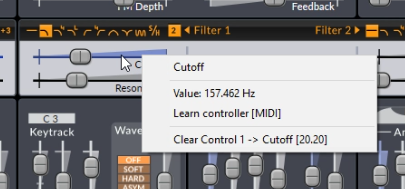
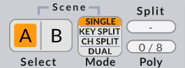
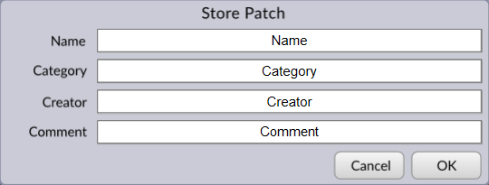
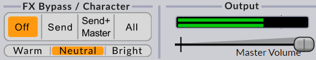
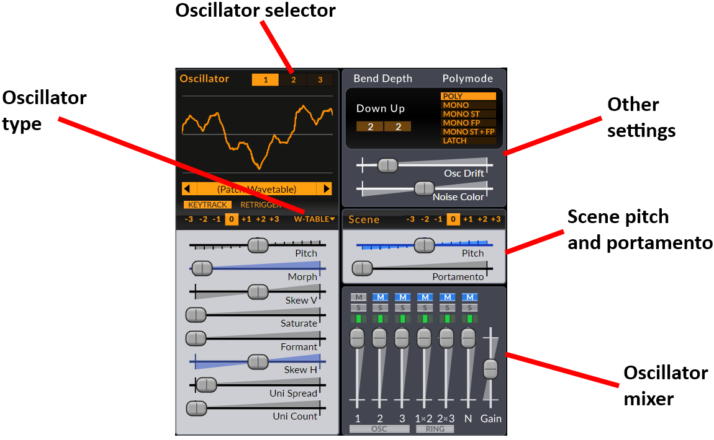
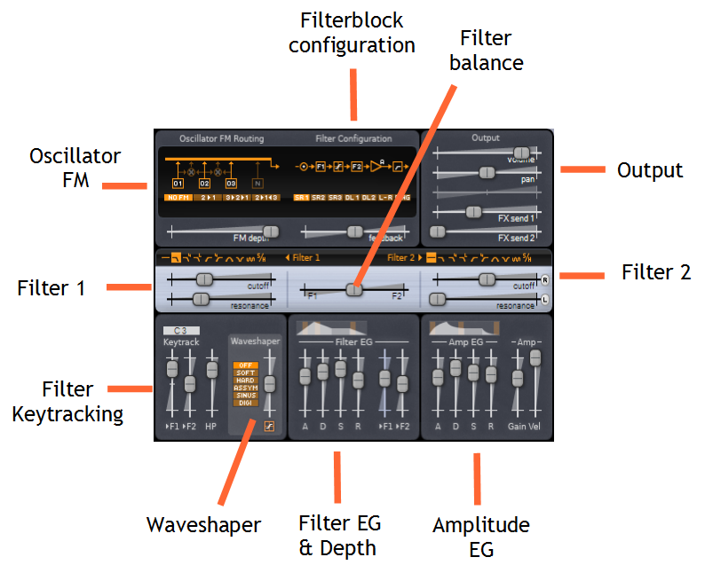
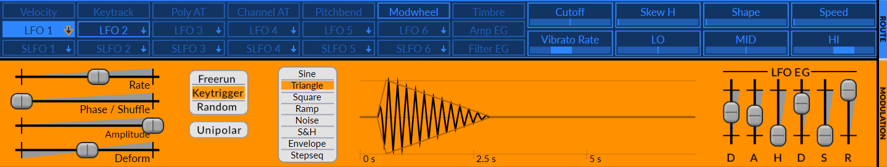
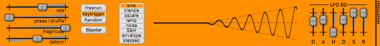

## Note:
This is a port of the old manual\!

# Getting Started

Thank you for choosing **Surge**\!

This chapter is intended to give you a brief overview to some concepts
that are specific to **Surge** and a general introduction of the
synthesizer. 

## Installing Surge

### On macOS

On Mac, **Surge** is delivered as a Plug-in Instrument for both the Audio
Unit (AU) and VST Plug-in interfaces (VST2, VST3). To use it, a host 
application compatible with one of the plug-in interfaces is required. 

System Requirements (1.6.0 and newer):

  - Mac OS X 10.5.0 or newer
  - An Intel CPU
  - AU or VST-compatible host application

To install, run the packaged installer. You will be given the option of
automatically installing the AU (`Surge.component`), the VST2 (`Surge.vst`)
and the VST3 (`Surge.vst3`) to their correct locations. The factory presets
and wavetables will also be automatically installed.

Running the packaged installer will install Surge for all of the users of your
computer.

Audio Units, AU is a trademark of Apple Computer, Inc  
VST is a trademark of Steinberg Media Technologies GmbH

### On Windows

On the Windows platform, **Surge** is delivered as both a VST2 and VST3 plug-in instrument
and needs a compatible host application to work. 

The filenames for the VST2 is (`Surge.dll`) and for the VST3 is (`Surge.vst`).

System Requirements:

  - Windows 2000/XP or newer
  - A reasonably fast (1 GHz or faster) CPU with SSE support (Pentium 3,
    Athlon XP or better)
  - VST-compatible host application

Make sure you install *Surge* in a directory in which your host application
will search for VST plug-ins. There is usually a directory named
`vstplugins` created by the host application for this purpose. (see your
host application's documentation for more information)

VST is a trademark of Steinberg Media Technologies GmbH

### 64-bit version of Surge (Windows x64)

To use the 64-bit version you need the following:

  - A CPU supporting the x64 (AMD64/EM64T) instruction set
  - A 64-bit OS (like Windows XP x64 edition, Windows 2003 x64 or Vista
    x64)
  - An application capable of hosting 64-bit VST plug-ins

Applications known to support 64-bit VST plug-ins at this time include
Plogue Bidule and Cakewalk SONAR.

## Locations

### macOS

The preset library and wavetables are at `/Library/Application Support/Surge`.
The user presets are at `~/Documents/Surge`.

### Windows

The preset library and wavetables are at `C:\Users\your username\AppData\Local\Surge`
The user presets are at `C:\Users\your username\My Documents\Surge`

## Introduction to the User Interface

The user-interface of **Surge** is divided into three main sections:
Patch/Global, Scene and FX to reflect what part of the synth they
control. Keeping this structure in mind will make it easier to
understand the layout.

*Illustration 1: The three sections of the user-interface of **Surge** is divided into.*

## About Scenes

Every patch in **Surge** contains two scenes (A & B) and an effect-section.
A scene is similar to a traditional synthesizer patch as it stores all the
information used to synthesize a voice. Since there's two scenes in each patch
it's possible to have layered or split sounds stored within a single patch.

*Illustration 2: Both scenes and all effect settings are stored in every patch.*

There are two setups of all controls within the Scene section of the user interface.
The state of the Scene-select buttons determine which one of the two Scenes you 
are currently editing.

## Browsing Patches

Browsing patches in **Surge** is easy, just press the **-/+** buttons
until you find something you like. If you click the patch-name field
(anywhere in the white area) a menu will list all available patches. 
A right-click will bring up a menu with just the patches of the current
category.

*Illustration 3: The patch browser*

The patches are grouped into categories, which themselves are grouped
into three sections depending on who created them.

- Factory Patches - Patches created in-house by Claes. Categorized by sound type.

- 3rd party patches - Patch packs created by users and 3rd parties.
Categorized by creators.

- User Patches - Your own patches will be stored here. How you categorize them
is entirely up to you.

A right-click will bring up a menu with just the patches of the current
category.

In the drop-down menu there's a division line between the categories of the
different sections to indicate the split.

## Modulation routing

Modulation routing in **Surge** is a bit different than most synthesizers,
but it's dead easy. Just select the modulation source you want to use,
activate the modulation mode with a second click and drag the slider to
the position you want the parameter to be at when fully modulated.

When the modulation mode is active the modulation source flashes
(green/blue) and all sliders that can be modulated by the modulation
source turn blue. A transparent 'ghost slider' will show the
non-modulated position while in modulation mode.

A third click on the modulation source button disengages the modulation
mode.

*Illustration 4: modulation routing step-by-step*

1-2) Select modulation source by clicking it.
4) Activate modulation mode by clicking it a second time.
5) Modulate-able sliders now appear blue.
6) Drag the slider to the desired position when fully modulated. A 'ghost slider' will display the original position.

The screenshots above are from an older version of *Surge*. The newer releases look slightly different

As entering/leaving the modulation mode is something you will do often
there's several ways to activate/deactivate the modulation mode:

  - Clicking an already selected modulation source again
  - Holding down the ALT-key
  - Pressing the TAB key
  - Pressing the middle, 4th or 5th mouse button.
    (cursor can be anywhere in the window)

The last three of the alternatives depend on the host application to
forward the correct mouse/keyboard-messages to the plug-in. They may not
work in all hosts because of this. Whether the middle, 4th
and 5th mouse buttons will work is also dependent on how the
mouse driver of the operating system is configured.

Keep in mind that although it might seem like the modulations are set to
an absolute position they are in fact relative. If you move the slider's
non-modulated position the modulated position will move as well.

# User Interface Reference

## Common UI elements
        
### Sliders

The most common user-interface control in **Surge** is the slider. They come
in both horizontal and vertical orientations but their functionality is
otherwise identical.

Sliders are always dragged, there is no jump if you click on the slider
tray instead of the slider head, it enters dragging mode nonetheless. 

Slider interaction:  
LMB - Drag slider  
LMB+RMB - Drag slider (fine)  
Shift+LMB - Drag slider (fine)  
Shift+LMB+RMB - Drag slider (ultra-fine)  
LMB double click - Reset parameter to default value  
RMB - Context menu

Right-clicking sliders bring up a context-menu that allows you to clear
modulation routings and assign a MIDI controller to the slider. 

*Illustration 5: Slider context menu* 

The 'Learn controller \[MIDI\]' command will engage the learning mode.
The slider will be assigned to the next controller message received by
**Surge**. The MIDI-messages recognized are ordinary Continuous Controllers as
well as RPN/NRPN messages. (Registered Parameter Number/Non Registered
Parameter Number)

Some parameters can have their range extended and/or be synchronized
to the host tempo. The options 'extend range' or 'Temposync' will show
up on the context-menu if they do.

The slider heads provide a visual indication whether they can be modulated
by the current modulation source when entering the modulation mode
(see [Modulation routing](#modulation-routing)).

*Illustration 6: Modulation mode (left) Off, Slider is editing parameter directly. (right) On, Slider is editing the modulation depth from the currently selected modulation source.*

The slider tray will have a blue tint if it is modulated by the current
modulation source. A half-tint indicates that it is modulated, but not
by the currently selected source.

*Illustration 7: The amount of blue-tint of slider tray indicates whether the parameter is modulated.*

1) Parameter is not modulated

2) Parameter is modulated (half-tint)

3) Parameter by the currently selected modulation source (full tint)

### Modulation source buttons

The modulation source buttons have a few additional features not shown in
the introductory modulation chapter. (see [Modulation routing](#modulation-routing))

They do change their appearance depending if they're used in the current
patch (scene dependent) and will highlight when the mouse is hovering
over a destination slider that is modulated by that particular source.

*Illustration 8: Modulation sources look different when used*

1) Unused modsource

2) Used modsource

3) Modsource that is used by the control the mouse is currently hovering over.

4) Selected modsource

Right-clicking a modulation source button brings up a context-menu that
allows you to:

  - Copy/paste LFO settings (LFO only)
  - Clear routings to either all destinations or a single destination
  - Assign/clear a MIDI controller (CTRL 1-8 only)
  - Toggle between bipolar/unipolar (CTRL 1-8 only)
  - Rename them (CTRL 1-8 only)

### Controller 1-8

What separates these controllers from the rest is that they can be
assigned by the user to either MIDI CC, RPN or NRPN controllers and
their value can be edited on-screen. Choose 'Learn Controller \[MIDI\]'
from the context-menu and it will be assigned to the next MIDI
controller received by the synth. 

**CC** = Continuous Controller (7-bit)  
**RPN** = Registered Parameter Number (14-bit)  
**NRPN** = Non Registered Parameter Number (14-bit)

These are different ways to send controller messages via MIDI. But as
**Surge** will recognize them automatically you just have twist the knob
and **Surge** will learn it.

These controllers are stored globally. You can also rename them and
choose if their modulation is bipolar (both positive and negative with 0
in the middle) or unipolar (just positive). 

## Patch/Global section
        
### Scene Select/Mode

Whether a scene will generate a voice when a key is pressed is
determined by the **Scene Mode** setting:

  - **Single** – Notes will be played only by the selected scene. 
  - **Split** – Notes below the **split-key** will be played by scene A,
    notes above and including the **split-key** will be played by scene
    B.
  - **Dual** – Both scenes will play the all notes.

**Scene Select** determines which scene is selected for editing and
playing (when **scene mode** is set to Single). 

Right-clicking on the **Scene Select** buttons brings up a context-menu
that allows you to copy/paste scene content.

**Poly** shows the number of voices currently playing and allows you to
set an upper limit to the number of voices allowed to play at the same
time. The voice-limiter will kill off excess voices gently to avoid
audible artifacts, thus it's not uncommon for the voice count to exceed
the limit.

The state of the polyphony limit setting is **not currently** stored in patches.

### Patch browser

Finding sounds in **Surge** is easy, just press the **-/+** buttons
until you find something you like. If you left-click the patch-name
field (anywhere in the white area) a menu will list all available
patches arranged into categories. The categories are further organized
into three sections: Factory patches, 3rd party patches and
User patches.

A right-click will bring up a menu with just the patches of the current
category.

*Illustration 9: The patch browser*

### The store dialog

Clicking the store button of the patch browser opens the store dialog.
It is where you name your new patch and choose which category it
should belong in. You can also create a new category manually here as 
well. The patches you store will end up in the user section at the bottom 
of the patch menu.

The store dialog also provides text fields for the name of the patch creator
and comments. 

The comments are not currently shown in the main GUI.

### FX-Bypass, Character and Master Volume

**FX Bypass** lets you quickly hear what a patch sounds like without the effect-units.

  - **Off** – All effects are active.
  - **Send** – The send effects are disabled.
  - **Send + Master** - The send and master-effects are disabled.
  - **All** – All effects are disabled.

**Master Volume** controls the last gain stage before the output. The
VU-meter above it shows the output-level and will become red if it goes
above 0 dBFS. 

The state of these two settings are **not** stored with patches. They
are however stored by the host application in your project files. 

**Character** controls the amount of high-frequency content present in
any oscillators of the patch that are using the “classic” algorithm. The
possible choices are Warm, Neutral and Bright.

## Scene Section

The UI of the scene section is roughly divided into three parts:

  - Sound generation
  - Sound shaping
  - Modulation

        
## Sound generation

This is where a sound is born. The oscillators generate waveforms
according to the notes played, are mixed in the oscillator mixer and the
audio is then passed on to the sound-shaping section.

### Oscillators

**1/2/3-buttons** – Chooses the active oscillator for editing.

**Display** – Shows the active waveform. When the wavetable oscillator
is used, it will also work as wavetable picker.

**Type** – Oscillator type. Chooses which algorithm is used for the
oscillator. Available options are Classic, Wavetable, Window, Sine, 
FM2, FM3, SH Noise and Audio Input.

**Pitch & Octave** – Controls the pitch for this particular oscillator.
The range of the slider can be extended from its context menu.

**Keytrack** – When disabled, the oscillator will play the same pitch
regardless of the key pressed.

**Retrigger** – If active, the oscillator will always start immediately
at zero phase. This is useful for snappy sounds where you want the
attach to sound exactly the same each note. 

The rest of the sliders controlling the oscillator are specific to each
oscillator type.

### Oscillator Mixer

The Oscillator Mixer has 6 inputs. Each channel has 4 controls.

**M** – Mute

**S** – Solo (only play oscillators that have solo active)

**Routing** (the green box) – Chooses which filter the oscillator is
routed to. The middle position (default) will route the output to filter
1 if a serial filter block configuration is used or both filters for any
other configuration.

**Slider** – Gain control

There is finally an output gain control which affect the level of all
the mixer inputs.

### Other

**Pitch & Octave** – Controls the pitch for the entire scene. Affects
the filter key-tracking and the keytrack modulation source as well. The
range of the slider can be extended using the context menu.

**Portamento** – Portamento is an effect where a new note will slide in
pitch from the pitch of the last played note. This setting determine how
long the slide will be. A setting of 0 disables Portamento. Can be
tempo-synced.

**Osc Drift** – Applies a small amount of instability to the pitch of
all oscillators, making them subtly detuned. Although the parameter is
shared, the randomness of the instability effect is independent for all
oscillators (and eventual unison sub-oscillators).

**Noise Color** – Affects the frequency spectrum of the noise
generator. The middle position results in white noise. Moving the slider
to the left emphasizes LF while moving it to the right emphasizes HF.

**Pitch Bend Up/Down** – Pitch Bend Depth. Controls how much the pitch
is affected by the pitch bend wheel, in semitones.

**Polymode** – Chooses how multiple notes are handled. Poly will allow
multiple notes to be played, while Mono will only let the last note
play.

Mono has two possible modifiers:

  - **Single Trigger EG (ST)** means that the two envelope generators are
    not restarted when sliding between two notes (two notes that overlap
    in time)
  - **Fingered Portamento (FP)** means that portamento is only applied when
    sliding between notes and not when there is time between the played
    notes.
        
## Sound shaping

**filter block configuration** – Chooses how the filters, waveshaper and
the gain stage are connected together. 

**Feedback** – Controls the amount (and polarity) of output that's fed
back into the input of the filter block. It has no effect when using the
Serial 1 filter block configuration (which because of this has a lower
CPU load).

**Filter balance** – Controls how the two filters are mixed. The
behavior depend on the filter block configuration.

NOTE:

Be careful with your monitoring volume when using feedback. It's easy to
make really loud high-pitched noises by mistake if you're not familiar
with how the synth reacts to feedback.  
  
Don't let this scare you though. There's a lot to be gained from proper
and creative use of feedback. Changing the character of filters, making
filters interact together, making basic physical models, making sounds
that are just about to break apart. It is these things that make
**Surge** truly special.

### Filter controls

**Type** – Selects the type of the filter. There are 10 choices. Off, 2-pole
low-pass, 4-pole low-pass, 4-pole low-pass ladder filter, 2-pole
high-pass, 4-pole high-pass, band-pass, notch, comb-filters with both
positive and negative polarity and a sample&hold module. 

**Subtype** – Selects variations of each filter type. The difference can
vary from subtle to radical depending on how the filter is used. See
[Filter algorithms](#filter-algorithms) in the [Technical Reference](#technical-reference)
for information regarding subtypes of each filter type. It is displayed
as a number next to the filter type (when available).

**Cutoff** – Controls the cutoff frequency of the filter.

**Cutoff relative switch** (small button, filter 2 only) – when active,
the cutoff frequency of filter 2 will be set relative to filter 1. This
includes any modulations (including the hardwired FEG depth &
keytracking).

**Resonance** – Controls the amount of resonance of the filter.

**Resonance link** (small button, filter 2 only) – Makes the slider
follow filter 1's resonance slider setting.

**Keytrack \> F1/F2** – Controls how much the pitch of a note affects the
cutoff frequency of the filter. A setting of 100% means the filter
frequency will follow the pitch harmonically.

### Envelope Generators

There are two envelope generators connected to the filter block. One of
them, the Amplitude Envelope Generator (AEG), is hardwired to the gain
stage of the filter block. The other one is hardwired to the two filters,
whose depth is set by the **\>F1** and **\>F2** sliders.

*Illustration 10: ADSR envelope structure*

The envelope generators are of the 4-stage ADSR type. This is the most
common form of EG used in synthesizers and it is named after its four
stages **Attack**, **Decay**, **Sustain** and **Release**. If you're new
to synthesizer programming the illustration should give you a good idea
how they work. The thing you need to remember is that after going
through the attack & decay stages the envelope will stick in the sustain
stage until the key is released. 

Above the envelope stage controls is a graphic representation of the
ADSR structure. The orange fields allows you to choose the curvature of
the different stages of the envelope.

### Other

**Keytrack root** – Sets the root key of the filter keytracking and the
keytrack modulation source. At the root key, the keytrack modulation
source will have the value zero. Above/below it it will have
positive/negative modulation depending on the distance to the root key
in octaves. This parameter does not affect the oscillator pitch.

**HP/low-cut** – Controls the scene low cut filter. (scene parameter)

**FM configuration** – Chooses how oscillator FM (frequency modulation) is
routed. 

**FM depth** – Sets the depth of the oscillator FM.

**Waveshaper type** – Chooses type of the non-linear wave-shaping
element. 

**Waveshaper drive** – Set the drive amount of the waveshaper. 

**Amp Gain** – Controls the gain element inside the filter block.

**Amp Vel.** - Controls how the **Amp Gain** scales with velocity. This
is neutral at the maximum position. Other settings provide attenuation
at lower velocities, thus this setting will never increase the **Amp
Gain** parameter by velocity.
        
### Output stage

The output stage is located after the filter block in the audio-path. As
it's outside the filter block-structure changing the gain here doesn't
have any affect on the timbre of the voice (unlike the previous
gain-control which may affect how the feedback and wave-shaping acts).
It can still change the timbre of the effect section if non-linear
effects (like distortion) are used.

**Volume** – volume control

**Pan** – Pan/balance control

**Width** – the amount of stereo spread (only present for the wide &
stereo filter block configurations)

**Send 1/2** – Send level to Send effect 1/2. (scene parameter)
        
## Modulation

The modulation section of the scene is different from the sound generation
and shaping sections as no audio data is passed through it. Instead it
allows you to control the parameters in the other sections from various
sources. (see [Modulation routing](#modulation-routing))

### Modulation source selection bar

The modulation source selection bar lets you choose which modulation
source is selected for modulation routing. It also lets you choose which
LFO that are active for editing by using the mini-buttons. When you
click the main button of one of the LFOs both the modulation source
state and the LFO editor state will be changed.

NOTE: 

By using the mini-button next to the main one you can select a different
LFO for editing than the modulation source. This lets you modulate the
parameters of one LFO with another.

The sub-chapter [Modulation source buttons](#modulation-source-buttons) contain more
information about how the buttons work.

### LFO Overview

*Illustration 11: LFO-unit structure*

The LFOs (Low Frequency Oscillator) in **Surge** are very flexible and come
with a built in DAHDSR-envelope which lets the LFO work as a dedicated
envelope generator or shape the magnitude of the LFO over time. 

### Parameters

**Waveform** – Selects the shape of the LFO.

| -------- | ------------------------------------------------------------------------------------------------------------------------------------------ | ---------------- |
| Sine     | Sine wave                                                                                                                                  | Vertical bend    |
| Triangle | Triangle wave                                                                                                                              | Vertical bend    |
| Square   | Pulse wave                                                                                                                                 | Pulse width      |
| Ramp     | Ramp wave (sawtooth)                                                                                                                       | Vertical bend    |
| Noise    | Smooth noise                                                                                                                               | Correlation      |
| S\&H     | Step noise                                                                                                                                 | Correlation      |
| Envelope | The LFO waveform output is one, making the LFO-unit as a whole work as an envelope generator.                                              | Envelope shape   |
| Stepseq  | The 'stepseq' waveform is a special case that has an additional editor. It can be used to draw waveforms or be used like a step-sequencer. | Smooth/Spikyness |

**Rate** – Controls the rate of the LFO oscillation. When waveform is
'Stepseq' 1 step equals the whole cycle. Can be tempo-synced.

**Phase/Shuffle** - Controls the starting phase of the LFO waveform. 

**Magnitude** – Controls the magnitude of the LFO. This is the parameter
you should use if you want to control the depth of an LFO with a
controller. (like controlling vibrato depth with the modulation wheel) 

**Deform** – Deform the LFO shape in various ways. The effect varies
with the LFO waveform.

**Trigger mode** (Freerun/Keytrigger/Random) – Chooses how the LFO is
triggered when a new note is played. 

**Unipolar** - If active, the LFO-output will be in the \[0 .. 1\]
range. If not \[-1 .. 1\]

### LFO EG

*Illustration 12: 6-stage DAHDSR envelope*

The LFO Envelope Generators are of the 6-stage DAHDSR type that are
multiplied with the waveform generator. 

### Stepseq

The 'Stepseq' waveform is a special case. Instead of the graphical
preview there is an editor that allow you to draw the output waveform
with up to 16-steps. The two green markers define loop-points that the
LFO will repeat once it gets into the loop. The left mouse button is
used for drawing while the right one can be used to clear the values to
0. Holding down shift while drawing will quantize the values to
1/12th steps, hence if the LFO is used to modulate pitch by
an octave, each step will represent a semitone.

*Illustration 13: Stepseq editor*

The step-sequencer of Voice LFO 1 has an extra pane at the top of the
step-editor that will re-trigger the two regular envelopes of the voice
(AEG and FEG) at each step if it is checked (black) at that particular
step.

*Illustration 14: Envelope retrigger pane of Voice LFO 1* 

The deform parameter give this waveform a lot of flexibility. A value of
0% will output the steps just as they look on the editor. Negative
values will give an increasingly spiky waveform while positive values
will make the output smoother.

*Illustration 15: Effect of the deform parameter on the stepseq waveform*

## FX Section

The FX Section lets you control the 8 effect units of the effect block
stored in every patch. 

The effect unit selector chooses which effect unit is active in the
effect editor. A right-click disables/enables that particular unit (this
setting is stored within patches unlike the global FX bypass setting).

The effect algorithm/preset-picker lets you assign an effect to the unit
selected in the effect unit selector. The effect is assigned by
selecting one of the preset settings for that effect from the menu. You
can also save your own effect presets which will be stored globally with
the synth.

# Technical Reference

## Surge Hierarchy
        
### Overview

*Illustration 16: Block diagram of the synthesizer engine.*

Illustration shows an overview of the synthesizer engine of **Surge**. 

### Voices

*Illustration 17: Block diagram of a synthesizer voice*

Illustration shows most audio and control-paths of a single
voice. Not all processing elements of the voice are shown in the
diagram. 

### LFOs

Each voice has 6 modulation source called LFOs (Low Frequency
Oscillator) that you can use for modulation purposes. Each scene has an
additional 6 LFOs making each voice capable of receiving modulation from
a total of 12 LFOs.

Calling them LFOs is a great understatement as they have an integrated
envelope generator and can function as a 16-step waveform-generator as
well.

More information about the LFOs in the UI reference. (see [LFO Overview](#lfo-overview))

### The effect block

**Surge** has 8 effect units, arranged into an 'effect block'. 

*Illustration 18: The effect block*

See the chapter [FX section](#fx-section) for more
information.

### Modulation routing in-depth

How the modulation routing works internally isn't something you normally
have to think about when using **Surge**. Just activate the modulation mode
with the desired source and see which of the sliders that become blue.
Nonetheless, it is useful to know which limitations are present and why.

*Illustration 19: Modulation routing behind the scenes*

The thing to remember is that the voice modulation sources can't
modulate the scene parameters, global/effect parameters or the scene
LFOs. Other that that it should be pretty straightforward.

## Oscillator algorithms

**Surge** provide 8 different oscillator algorithms. Each capable of
generating sound in different ways with a different set of controls.
They're not just different waveforms.

### Classic

The classic oscillator algorithm consists of a main oscillator that can
generate a pulse wave, a sawtooth wave, a dual-saw wave or anything in
between.

A sub-oscillator provide a pulse-wave one octave below the main
oscillator. Changing the pulse-width of the sub-oscillator does affect
the main oscillator as well, as they will both change levels at the same
time except that the main oscillator does it twice as often. 

The classic algorithm is also capable of oscillator self-sync. Note that
the sub-oscillator will be used as the base-pitch for the sync. 

The algorithm provides unison at the oscillator-level with up to 16
instances. Unlike the wavetable-oscillator the cost of unison in terms
of CPU usage for the classic oscillator is quite modest. The unison
oscillator-instances are affected by the scene-level Osc-Drift parameter
independently. 

|--- |--- |--- |
|Shape|Waveform shape -100% = pulse, 0% = saw, 100% = dual saw|-100 .. 100 %|
|Width|Pulse-width (pulse) or relative phase (dual saw)|0 .. 100 %|
|Sub-width|Pulse-width of sub-oscillator.|0 .. 100 %|
|Sub-level|Sub-oscillator mix. 0% = only main, 100% = only sub|0 .. 100 %|
|Sync|Oscillator self-sync|0..60 semitones|
|Osc-spread|Detuning of unison oscillators. 100% = 1 semitone in both directions Can be switched between relative (default) and absolute using the context-menu of the slider.|0 .. 100% 0..16Hz|
|Osc-count|Number of oscillators used for unison. 1 = disabled|1 .. 16|

### Sinus

The sinus oscillator algorithm generates a simple sine-wave. It has no
non-standard parameters.

### Wavetable

A wavetable in **Surge** consists of up to 1024 single-cycle waveforms.
Using the Shape parameter it is possible to sweep across the waveforms
in the wavetable. 

The individual waves are equidistant in the table. When the shape
setting is between two individual waves they will be mixed to ensure
smooth travel. You can't edit the wavetable contents directly within
**Surge** but it is possible to generate custom wavetables with external
software. 

By modulating the shape parameter it is possible to create motion,
dynamic response to playing or just sonic variation. What real-life
property, if any, the shape parameter is supposed to mirror depend on
each wavetable. Common cases are: 

  - Analyzed from sounds that evolve over time. The behavior can be
    recreated by letting shape increase over time by modulation. It's
    the most common among the analyzed wavetables.
  - Analyzed from static sounds over different pitches to capture the
    formant shift of a sound. The behavior can be recreated by
    modulating shape by the keytrack modsource.
  - A parameter of a mathematical equation. 

In the end it's just a set of data and **Surge** doesn't care how it was
generated, all that matters is how it sounds. 

The wave-table oscillator has some interesting sonic characteristics. It
outputs the waveform in a stair-stepped fashion, making no attempts to
'smooth the steps' in the process, but does so in a manner that is
completely band-limited. This makes it similar in sound to 1980s era
wave-table synths and samplers which didn't use resampling but had
dedicated D/A-converters for each voice instead and changed the pitch by
varying the sample rate of the individual D/As. 

The fact that the steps aren't smoothed causes an artifact known as
harmonic aliasing. This is not to be confused with inharmonic aliasing
which sounds somewhat similar to an AM-radio being tuned and is
generally nasty. Instead, this artifact will cause the harmonics of the
waveform to repeat themselves and fill up the entire audible spectra
even at low pitches, just like a square-wave would, preventing the
waveform from sounding dull. As this artifact is completely harmonic it
is also musically pleasing. Nonetheless, it may sound a bit out of place
on very smooth waveforms but the effect can be filtered out by a
lowpass-filter in the filter block if desired. Some of the wave-tables,
such as the regular triangle wave, are large enough for this artifact to
never appear in the normally used range for this specific reason.

The important thing is that just like most other oscillators in **Surge**,
it doesn't output any inharmonic aliasing whatsoever or any audible
levels of interpolation-noise, two artifacts which has played a big part
in giving digital synthesizers a bad name. 

### For developers & advanced users: 
There is a reference for the .wt file-format used by the wavetables. It
is located at: `surgedata/wavetables/wt fileformat.txt`

|--- |--- |--- |
|Shape|Waveform shape. 0% = first, 100% = last|0 .. 100 %|
|Skew V|Vertical skew of the waveform|-100 .. 100 %|
|Saturate|Soft saturation of the waveform|0 .. 100 %|
|Formant|Compresses the waveform in time but keeps the cycle-time intact|0..60 semitones|
|Skew H|Horizontal skew of the waveform|-100 .. 100 %|
|Osc-spread|Detuning of unison oscillators. 100% = 1 semitone in both directions Can be switched between relative (default) and absolute using the context-menu of the slider.|0 .. 100% 0..16Hz|
|Osc-count|Number of oscillators used for unison. 1 = disabled|1 .. 7|

### Window

The window oscillator is another shot at wavetable
synthesis that is quite different from the previous wavetable algorithm.

The wave, which can be any waveform included with **Surge**, is multiplied
by a second waveform, the window, which can be one of 9 waveform types
that are specifically made for the window oscillator. The formant
parameter controls the pitch of the wave independently of the window,
but as the wave is always restarted with the window the pitch will
remain the same. Instead, the timbre of the sound will change
dramatically, much depending on which window is selected.

Unlike the wavetable algorithm, the window oscillator uses a more
traditional resampling approach which doesn't result in harmonic
aliasing. Obviously, being part of a Vember Audio product, the sound
quality is still top-notch.

|--- |--- |--- |
|Shape|Waveform shape. 0% = first, 100% = last (doesn't interpolate)|0 .. 100 %|
|Formant|Pitch of the wave independently of the window|-60 .. 60 semitones|
|Window|Chooses the window waveform.|-|
|Osc-spread|Detuning of unison oscillators. 100% = 1 semitone in both directions Can be switched between relative (default) and absolute using the context-menu of the slider.|0 .. 100% 0..16Hz|
|Osc-count|Number of oscillators used for unison. 1 = disabled|1 .. 7|

### FM2

FM2 provides a miniature FM-synthesizer voice in an oscillator that is
specifically tailored towards making nice and musical FM sounds. A
single sine carrier is modulated by two sine modulators, whose ratios to
the carrier are always integer thus the resulting waveform is always
cyclic. However, “Mx Shift” lets you offset the modulators slightly in
an absolute fashion, creating an evolving and pleasing detune
effect.

| -------------- | --------------------------------------------------------------------------------------------- | ------------- |
| M1 Amount      | Modulation amount of the first modulator                                                      | 0 .. 100 %    |
| M1 Ratio       | Ratio of the first modulator to the carrier                                                   | 1 .. 32       |
| M2 Amount      | Modulation amount of the second modulator                                                     | 0 .. 100 %    |
| M2 Ratio       | Ratio of the second modulator to the carrier                                                  | 1 .. 32       |
| Mx Shift       | Absolute detuning of the modulators                                                           | \-10 .. 10 Hz |
| Mx Start Phase | Changes the initial phase of the modulators to give you different variations of the waveform. | 0 .. 100 %    |
| Feedback       | Modulation amount of the carrier to itself                                                    | 0 .. 100 %    |

### FM3

As a contrast to FM2, FM3 is the algorithm of choice for scraping paint
off walls. The modulators have a larger range, the ratios can be
non-integer and there's a third modulator which has its rate set as an
absolute frequency.

| --------- | -------------------------------------------- | ------------- |
| M1 Amount | Modulation amount of the first modulator     | 0 .. 100 %    |
| M1 Ratio  | Ratio of the first modulator to the carrier  | 0.0 .. 32.0   |
| M2 Amount | Modulation amount of the second modulator    | 0 .. 100 %    |
| M2 Ratio  | Ratio of the second modulator to the carrier | 0.0 .. 32.0   |
| M3 Amount | Modulation amount of the third modulator     | 0 .. 100 %    |
| M3 Ratio  | Frequency of the third modulator             | 14Hz .. 25kHz |
| Feedback  | Modulation amount of the carrier to itself   | 0 .. 100 %    |

### S&H-Noise

  - S&H is an abbreviation for 'Sample and Hold'.
  - The S&H-Noise oscillator algorithm works like a pulse oscillator,
    but instead of always switching between +1 and -1 the levels used
    are determined stochastically. 
  - The correlation parameter determine how new levels are calculated. A
    setting of 0% will have no memory and each new level will
    effectively be a random number (white noise). A lower setting will
    favor new values that is closer to the previous level and will
    provide a noise with a darker spectra. Higher values will favor
    values as far away from the previous one as possible, with 100%
    resulting in a harmonic pulse-wave.

|--- |--- |--- |
|Correlation|Noise correlation. 0% = white noise, 100% = pulse|-100 .. 100 %|
|Width|Pulse-width (pulse)|0 .. 100 %|
|Sync|Oscillator self-sync|0..60 semitones|
|Osc-spread|Detuning of unison oscillators. 100% = 1 semitone in both directions Can be switched between relative (default) and absolute using the context-menu of the slider.|0 .. 100% 0..16Hz|
|Osc-count|Number of oscillators used for unison. 1 = disabled|1 .. 16|

### Audio Input

Audio Input lets you route external audio into the voice-architecture of
**Surge**.

| ----- | ------------------------------------------------------------------ | -------------- |
| Input | Chooses which input is used. -100% = left, 0% = both, 100% = right | \-100 .. 100 % |
| Gain  | Input gain in dB.                                                  | \-48 .. +48 dB |

Windows only:

Some problematic VST host applications will refuse to feed instrument
plug-ins with audio input unless they are configured as a regular
effect. Making a copy of the file `surge.dll` named `surge_fx.dll` in
the same directory will cause that copy of **Surge** to identify itself as
an effect instead of an instrument which will make it work in such
hosts.

## Filter algorithms

  - There are 9 filter algorithms available (+ off) for each of the 2
    filter units in the filter block. Each of the algorithms have
    different subtypes, which alter their sound.

  - Most of the filter-(sub)types have some non-linear elements in them
    to allow them to self-oscillate in a stable and predictable manner.
    This means they will sound different depending on how hard they're
    driven, which can be conveniently controlled with the Pre-Filter
    Gain setting. For example, if the resonance peaks of a filter is too
    loud, increase the Pre-Filter Gain to make the rest of the signal
    more dominant (and if needed decrease the gain at the output stage
    of the voice to compensate).

### Subtypes for LP12/LP24/HP12/HP24/BP

Depending on the setting of the subtype switch, the characteristics and
behavior of these filters will be altered, although their main purpose
remains the same.

| - | -------------------------------------------------------------------------------------------------------------------------------------------------------------------------------------------- |
| 1 | Clean with a strong resonance, capable of self-oscillation. Handles transient behavior extremely well. (default)                                                                             |
| 2 | Chesty, somewhat distorted sound with a more held-back resonance. Capable of self-oscillation. (default in v1.2.2)                                                                           |
| 3 | The smoothest subtype, capable of lower resonance than the others, which is suitable when you do not want the sound of the filter to be noticed but only to roll-off a part of the spectrum. |

### LP12

  - 2-Pole Low-Pass filter.

### LP24

  - 4-Pole Low-Pass filter.

### HP12

  - 2-Pole High-Pass filter.

### HP24

  - 4-Pole High-Pass filter.

### BP

  - 2-Pole Band-Pass filter.

  - For this particular algorithm an extra subtype (\#4) is provided
    which is a 4-pole equivalent of subtype 1.

### LP24L

  - 4-Pole Low-Pass ladder filter. You can select at which stage (1-4)
    the signal is output using the sub-type control. Has stable
    self-oscillation.

### Notch

  - 2-Pole Band-Reject filter.

| - | ---------------------------------------------------------------- |
| 1 | Default subtype                                                  |
| 2 | Included for compatibility with v1.2.0 (smaller resonance range) |

### Comb

  - Delay-Based Comb filter. 

| - | ---------------------------------- |
| 1 | Positive feedback, 50% dry/wet mix |
| 2 | Positive feedback, 100% wet mix    |
| 3 | Negative feedback, 50% dry/wet mix |
| 4 | Negative feedback, 100% wet mix    |

  - When the sub-type is set to 2 (or 4) and resonance is 0% the
    comb-filter will work purely as a delay-unit (with sub-sample
    precision). This can be used together with the other filter-unit
    along with filter block feedback to provide interesting options. The
    “wind/clarinet” and “pluck (fast)/simple waveguide” presets
    showcase how this ability can be used for simple physical modeling.
    They only use the oscillator section to ignite the sound, the rest
    is in the filter block. 

### Sample & Hold

  - Sample & Hold module. Will sample the audio at the rate set by the
    cutoff-frequency. Resonance will emphasize oscillations around the
    cutoff frequency, not unlike the resonance peak of a lowpass-filter.

## Effect algorithms

**Surge** has 8 effect units which each can run one of the 10 provided
algorithms. 

### Delay

The delay algorithm in **Surge** is very versatile and can work well both as
an echo/delay- and chorus-effect.

*Illustration 20: Delay algorithm block diagram*

There is an LFO connected to the delay-lines (not shown in diagram)
which can provide stereo-widening/detuning of the delay-line.

| --- | --- |--- |
|Pan|Routes the two channels to the delay-units by panning. The gain of the input-channels remain unaffected, it's only their stereo location that changes. (a sound only heard in the left channel will still be heard when pan is set to 100% here, but only in the right channel.)|-100 .. 100 %|
|Delay time L/R|Delay time for the two channels. Can be tempo-synced.|0.004 .. 32 s 1/512 .. 16 bars|
|Feedback|Amount fed from the channel to its own input|-inf .. 0 dB|
|Crossfeed|Amount fed from the channel to the input of the opposing channel|-inf .. 0 dB|
|Low/High- cut|EQ controls of the delayed signal|14Hz .. 25kHz|
|Modulation rate|Rate of the modulation LFO (triangle). This parameter is inexact due to implementation.|0.008..1024 Hz|
|Modulation depth|Indirect control of the modulation LFO depth. The effect adjust the depth to match the detuning in cents set here.|0 .. 200 cents|
|Mix|Blend control between the dry and the wet signal.  0% = 100% dry, 0% wet 100% = 0% dry, 100% wet|0 .. 100 %|
|Width|Gain scaling of the Side-component of the wet signal|-24 .. 24 dB|

### Reverb

The reverberation algorithm simulates room acoustics and is suitable
both at adding ambience to sounds and creating special effects.

|--- |--- |--- |
|Pre-delay|The amount of delay applied to the signal before it is fed to the reverberation unit. Can be tempo-synced.|0.004 .. 32 s 1/512 .. 16 bars|
|Room-shape|Selects between 4 room shapes that has different sounds. (changing this parameter will interrupt the signal)|0 .. 3|
|Size|Changes the apparent size of the simulated room. (changing this parameter will interrupt the signal)|0 .. 100 %|
|Decay time|The time it takes for the reverberation to ring-out. (-60 dB)|0.063 .. 64 s|
|HF-damp|Amount of HF damping applied to the signal inside the reverberator.|0 .. 100 %|
|Low cut, Band1 freq/gain, High cut|Post-reverb equalizer controls.||
|Mix|Blend control between the dry and the wet signal.|0 .. 100 %|
|Width|Gain scaling of the Side-component of the wet signal|-24 .. 24 dB|

### Reverb 2

TODO

### Chorus

4-stage chorus algorithm.

|--- |--- |--- |
|Time|Delay time used as chorus mid-point.|0 .. 1/8 s|
|Mod rate|Rate of modulation LFO. Can be tempo-synced.|0.008..1024 Hz 64..1/2048 bar|
|Mod depth|Depth of modulation LFO|0 .. 100 %|
|Feedback|Amount fed from the output back into the input|-inf .. 0 dB|
|Low/High-cut|EQ controls of the chorused signal|14Hz .. 25kHz|
|Mix|Blend control between the dry and the wet signal.|0 .. 100 %|
|Width|Gain scaling of the Side-component of the wet signal|-24 .. 24 dB|

### Phaser

4-stage phaser.

|--- |--- |--- |
|Base freq|Base frequency for all the stages|-100 .. 100 %|
|Feedback|Feedback of the phaser|-100 .. 100 %|
|Q|Q setting for the stages|-100 .. 100 %|
|Rate|Rate of modulation LFO. Can be tempo-synced.|0.008..1024 Hz 64..1/2048 bar|
|Depth|Depth of modulation LFO|0 .. 100 %|
|Stereo|LFO Phase relation between stereo channels 0% = 0 degrees, 100% = 180 degrees|0 .. 100 %|
|Mix|Blend control between the dry and the wet signal.|0 .. 100 %|

### Rotary Speaker

Rotary speaker simulator algorithm.

|--- |--- |--- |
|Horn rate|Rate of HF horn rotation. The LF horn is a lower multiple of this rate. Can be tempo-synced.|0.008..1024 Hz 64..1/2048 bar|
|Doppler depth|The amount of Doppler shift used in the simulation. (vibrato)|0 .. 100 %|
|Ampmod depth|The amount of amplitude modulation used in the simulation. (tremolo)|0 .. 100 %|

### Distortion

Distortion algorithm. Provides plenty of EQ options as well as a
feedback loop to alter the tonality of the clipping stage.

*Illustration 21: Distortion algorithm block diagram*

|--- |--- |--- |
|Pre-EQ gain/freq/BW|Parametric EQ band prior to the clipping stage||
|Pre-EQ High cut|High cut element prior to the clipping stage|14Hz .. 25kHz|
|Drive|Drive of the clipping stage|-24 .. +24 dB|
|Feedback|Feedback loop around the clipping stage|-100 .. 100 %|
|Post-EQ gain/freq/BW|Parametric EQ band after the clipping stage||
|Post-EQ High cut|High cut element prior to the clipping stage|14Hz .. 25kHz|
|Output gain|Output gain|-24 .. +24 dB|

### EQ

The EQ unit provide 3-bands of fully parametric equalizing. This
high-quality algorithm has a much better response at high frequencies
than digital equalizers usually have.

|--- |--- |--- |
|Band 1/2/3 Gain|Band gain|-48 .. +48 dB|
|Band 1/2/3 Freq|Band frequency|14Hz .. 25kHz|
|Band 1/2/3 Bandwidth|Band bandwidth|0 .. 5 octaves|
|Output gain|Gain control|-48 .. +48 dB|

### Conditioner

The conditioner is a simple EQ, stereo image control and a limiter built
into one unit. The limiter applies make-up gain
automatically.

| --------- | -------------------------------------------------------------- | -------------- |
| Bass      | LF boost/cut                                                   | \-12 .. +12 dB |
| Treble    | HF boost/cut                                                   | \-12 .. +12 dB |
| Width     | Stereo width. 0% = mono, 100% = stereo, -100% = reverse stereo | \-100 .. 100 % |
| Balance   | Stereo balance                                                 | \-100 .. 100 % |
| Threshold | Limiter threshold level.                                       | \-48 .. 0 dB   |
| Attack    | Limiter attack rate                                            | \-100 .. 100 % |
| Release   | Limiter release rate                                           | \-100 .. 100 % |
| Output    | Limiter output attenuation                                     | \-48 .. 0 dB   |

### Frequency Shifter

Frequency shifter effect. Provides a delay unit and a feedback loop to
give consecutively shifted repeating delays.

|--- |--- |--- |
|Shift Left|Amount of frequency shift (in hertz) for the left channel. The range can be extended from the sliders context menu.|-10 .. 10 Hz / -1 .. 1 kHz|
|Shift Right|Amount of frequency shift (relative to the left channel) for the right channel.|-100 .. 100 %|
|Delay|Delay time for the frequency-shifted signal. Can be tempo-synced.|0.004 .. 32 s 1/512 .. 16 bars|
|Feedback|Feedback around the frequency shifter and delay-unit.||
|Mix|Blend control between the dry and the wet signal.|0 .. 100 %|

### Vocoder

The audio-input of Surge is used to modulate the carrier signal at the
input stage of this 20-band vocoder algorithm. The carrier channels are
in stereo while the modulator use the mono sum of the input channels.

|--- |--- |--- |
|Gain|Gain control of the modulator|-48 .. +48 dB|
|Gate|Bands below this level will be silenced.|-96 .. 0 dB|
|Rate|Rate of the envelope followers.|0 .. +100 %|
|Q|Controls the steepness of the filters.|-100 .. +100 %|

## Questions?

Feel free to visit the Surge Synth Slack ([here]( https://join.slack.com/t/surgesynth/shared_invite/enQtNTE4OTg0MTU2NDY5LTE4MmNjOTBhMjU5ZjEwNGU5MjExODNhZGM0YjQxM2JiYTI5NDE5NGZkZjYxZTkzODdiNTM0ODc1ZmNhYzQ3NTU)) if you have questions about Surge, want to help in developing it further or if you come across any bugs or other issues.

## Licenses

"Surge Code" The surge code is licensed under GPL3

"VSTGUI" The VSTGUI is licensed under the below Steinberg license

GNU GENERAL PUBLIC LICENSE

Version 3, 29 June 2007

Copyright © 2007 Free Software Foundation, Inc. <https://fsf.org/>

Everyone is permitted to copy and distribute verbatim copies of this license document, but changing it is not allowed.

Preamble
The GNU General Public License is a free, copyleft license for software and other kinds of works.
The licenses for most software and other practical works are designed to take away your freedom to share and change the works. By contrast, the GNU General Public License is intended to guarantee your freedom to share and change all versions of a program--to make sure it remains free software for all its users. We, the Free Software Foundation, use the GNU General Public License for most of our software; it applies also to any other work released this way by its authors. You can apply it to your programs, too.

When we speak of free software, we are referring to freedom, not price. Our General Public Licenses are designed to make sure that you have the freedom to distribute copies of free software (and charge for them if you wish), that you receive source code or can get it if you want it, that you can change the software or use pieces of it in new free programs, and that you know you can do these things.

To protect your rights, we need to prevent others from denying you these rights or asking you to surrender the rights. Therefore, you have certain responsibilities if you distribute copies of the software, or if you modify it: responsibilities to respect the freedom of others.

For example, if you distribute copies of such a program, whether gratis or for a fee, you must pass on to the recipients the same freedoms that you received. You must make sure that they, too, receive or can get the source code. And you must show them these terms so they know their rights.

Developers that use the GNU GPL protect your rights with two steps: (1) assert copyright on the software, and (2) offer you this License giving you legal permission to copy, distribute and/or modify it.

For the developers' and authors' protection, the GPL clearly explains that there is no warranty for this free software. For both users' and authors' sake, the GPL requires that modified versions be marked as changed, so that their problems will not be attributed erroneously to authors of previous versions.

Some devices are designed to deny users access to install or run modified versions of the software inside them, although the manufacturer can do so. This is fundamentally incompatible with the aim of protecting users' freedom to change the software. The systematic pattern of such abuse occurs in the area of products for individuals to use, which is precisely where it is most unacceptable. Therefore, we have designed this version of the GPL to prohibit the practice for those products. If such problems arise substantially in other domains, we stand ready to extend this provision to those domains in future versions of the GPL, as needed to protect the freedom of users.

Finally, every program is threatened constantly by software patents. States should not allow patents to restrict development and use of software on general-purpose computers, but in those that do, we wish to avoid the special danger that patents applied to a free program could make it effectively proprietary. To prevent this, the GPL assures that patents cannot be used to render the program non-free.

The precise terms and conditions for copying, distribution and modification follow.
TERMS AND CONDITIONS

0. Definitions.
“This License” refers to version 3 of the GNU General Public License.
“Copyright” also means copyright-like laws that apply to other kinds of works, such as semiconductor masks.
“The Program” refers to any copyrightable work licensed under this License. Each licensee is addressed as “you”. “Licensees” and “recipients” may be individuals or organizations.

To “modify” a work means to copy from or adapt all or part of the work in a fashion requiring copyright permission, other than the making of an exact copy. The resulting work is called a “modified version” of the earlier work or a work “based on” the earlier work.
A “covered work” means either the unmodified Program or a work based on the Program.

To “propagate” a work means to do anything with it that, without permission, would make you directly or secondarily liable for infringement under applicable copyright law, except executing it on a computer or modifying a private copy. Propagation includes copying, distribution (with or without modification), making available to the public, and in some countries other activities as well.
To “convey” a work means any kind of propagation that enables other parties to make or receive copies. Mere interaction with a user through a computer network, with no transfer of a copy, is not conveying.

An interactive user interface displays “Appropriate Legal Notices” to the extent that it includes a convenient and prominently visible feature that (1) displays an appropriate copyright notice, and (2) tells the user that there is no warranty for the work (except to the extent that warranties are provided), that licensees may convey the work under this License, and how to view a copy of this License. If the interface presents a list of user commands or options, such as a menu, a prominent item in the list meets this criterion.

1. Source Code.
The “source code” for a work means the preferred form of the work for making modifications to it. “Object code” means any non-source form of a work.

A “Standard Interface” means an interface that either is an official standard defined by a recognized standards body, or, in the case of interfaces specified for a particular programming language, one that is widely used among developers working in that language.
The “System Libraries” of an executable work include anything, other than the work as a whole, that (a) is included in the normal form of packaging a Major Component, but which is not part of that Major Component, and (b) serves only to enable use of the work with that Major Component, or to implement a Standard Interface for which an implementation is available to the public in source code form. A “Major Component”, in this context, means a major essential component (kernel, window system, and so on) of the specific operating system (if any) on which the executable work runs, or a compiler used to produce the work, or an object code interpreter used to run it.

The “Corresponding Source” for a work in object code form means all the source code needed to generate, install, and (for an executable work) run the object code and to modify the work, including scripts to control those activities. However, it does not include the work's System Libraries, or general-purpose tools or generally available free programs which are used unmodified in performing those activities but which are not part of the work. For example, Corresponding Source includes interface definition files associated with source files for the work, and the source code for shared libraries and dynamically linked subprograms that the work is specifically designed to require, such as by intimate data communication or control flow between those subprograms and other parts of the work.

The Corresponding Source need not include anything that users can regenerate automatically from other parts of the Corresponding Source.

The Corresponding Source for a work in source code form is that same work.

2. Basic Permissions.

All rights granted under this License are granted for the term of copyright on the Program, and are irrevocable provided the stated conditions are met. This License explicitly affirms your unlimited permission to run the unmodified Program. The output from running a covered work is covered by this License only if the output, given its content, constitutes a covered work. This License acknowledges your rights of fair use or other equivalent, as provided by copyright law.

You may make, run and propagate covered works that you do not convey, without conditions so long as your license otherwise remains in force. You may convey covered works to others for the sole purpose of having them make modifications exclusively for you, or provide you with facilities for running those works, provided that you comply with the terms of this License in conveying all material for which you do not control copyright. Those thus making or running the covered works for you must do so exclusively on your behalf, under your direction and control, on terms that prohibit them from making any copies of your copyrighted material outside their relationship with you.

Conveying under any other circumstances is permitted solely under the conditions stated below. Sublicensing is not allowed; section 10 makes it unnecessary.

3. Protecting Users' Legal Rights From Anti-Circumvention Law.
No covered work shall be deemed part of an effective technological measure under any applicable law fulfilling obligations under article 11 of the WIPO copyright treaty adopted on 20 December 1996, or similar laws prohibiting or restricting circumvention of such measures.

When you convey a covered work, you waive any legal power to forbid circumvention of technological measures to the extent such circumvention is effected by exercising rights under this License with respect to the covered work, and you disclaim any intention to limit operation or modification of the work as a means of enforcing, against the work's users, your or third parties' legal rights to forbid circumvention of technological measures.

4. Conveying Verbatim Copies.
You may convey verbatim copies of the Program's source code as you receive it, in any medium, provided that you conspicuously and appropriately publish on each copy an appropriate copyright notice; keep intact all notices stating that this License and any non-permissive terms added in accord with section 7 apply to the code; keep intact all notices of the absence of any warranty; and give all recipients a copy of this License along with the Program.

You may charge any price or no price for each copy that you convey, and you may offer support or warranty protection for a fee.
5. Conveying Modified Source Versions.

You may convey a work based on the Program, or the modifications to produce it from the Program, in the form of source code under the terms of section 4, provided that you also meet all of these conditions:
	•	a) The work must carry prominent notices stating that you modified it, and giving a relevant date.
	•	b) The work must carry prominent notices stating that it is released under this License and any conditions added under section 7. This requirement modifies the requirement in section 4 to “keep intact all notices”.
	•	c) You must license the entire work, as a whole, under this License to anyone who comes into possession of a copy. This License will therefore apply, along with any applicable section 7 additional terms, to the whole of the work, and all its parts, regardless of how they are packaged. This License gives no permission to license the work in any other way, but it does not invalidate such permission if you have separately received it.
	•	d) If the work has interactive user interfaces, each must display Appropriate Legal Notices; however, if the Program has interactive interfaces that do not display Appropriate Legal Notices, your work need not make them do so.
    
A compilation of a covered work with other separate and independent works, which are not by their nature extensions of the covered work, and which are not combined with it such as to form a larger program, in or on a volume of a storage or distribution medium, is called an “aggregate” if the compilation and its resulting copyright are not used to limit the access or legal rights of the compilation's users beyond what the individual works permit. Inclusion of a covered work in an aggregate does not cause this License to apply to the other parts of the aggregate.

6. Conveying Non-Source Forms.
You may convey a covered work in object code form under the terms of sections 4 and 5, provided that you also convey the machine-readable Corresponding Source under the terms of this License, in one of these ways:
	•	a) Convey the object code in, or embodied in, a physical product (including a physical distribution medium), accompanied by the Corresponding Source fixed on a durable physical medium customarily used for software interchange.
	•	b) Convey the object code in, or embodied in, a physical product (including a physical distribution medium), accompanied by a written offer, valid for at least three years and valid for as long as you offer spare parts or customer support for that product model, to give anyone who possesses the object code either (1) a copy of the Corresponding Source for all the software in the product that is covered by this License, on a durable physical medium customarily used for software interchange, for a price no more than your reasonable cost of physically performing this conveying of source, or (2) access to copy the Corresponding Source from a network server at no charge.
	•	c) Convey individual copies of the object code with a copy of the written offer to provide the Corresponding Source. This alternative is allowed only occasionally and noncommercially, and only if you received the object code with such an offer, in accord with subsection 6b.
	•	d) Convey the object code by offering access from a designated place (gratis or for a charge), and offer equivalent access to the Corresponding Source in the same way through the same place at no further charge. You need not require recipients to copy the Corresponding Source along with the object code. If the place to copy the object code is a network server, the Corresponding Source may be on a different server (operated by you or a third party) that supports equivalent copying facilities, provided you maintain clear directions next to the object code saying where to find the Corresponding Source. Regardless of what server hosts the Corresponding Source, you remain obligated to ensure that it is available for as long as needed to satisfy these requirements.
	•	e) Convey the object code using peer-to-peer transmission, provided you inform other peers where the object code and Corresponding Source of the work are being offered to the general public at no charge under subsection 6d.
A separable portion of the object code, whose source code is excluded from the Corresponding Source as a System Library, need not be included in conveying the object code work.

A “User Product” is either (1) a “consumer product”, which means any tangible personal property which is normally used for personal, family, or household purposes, or (2) anything designed or sold for incorporation into a dwelling. In determining whether a product is a consumer product, doubtful cases shall be resolved in favor of coverage. For a particular product received by a particular user, “normally used” refers to a typical or common use of that class of product, regardless of the status of the particular user or of the way in which the particular user actually uses, or expects or is expected to use, the product. A product is a consumer product regardless of whether the product has substantial commercial, industrial or non-consumer uses, unless such uses represent the only significant mode of use of the product.

“Installation Information” for a User Product means any methods, procedures, authorization keys, or other information required to install and execute modified versions of a covered work in that User Product from a modified version of its Corresponding Source. The information must suffice to ensure that the continued functioning of the modified object code is in no case prevented or interfered with solely because modification has been made.

If you convey an object code work under this section in, or with, or specifically for use in, a User Product, and the conveying occurs as part of a transaction in which the right of possession and use of the User Product is transferred to the recipient in perpetuity or for a fixed term (regardless of how the transaction is characterized), the Corresponding Source conveyed under this section must be accompanied by the Installation Information. But this requirement does not apply if neither you nor any third party retains the ability to install modified object code on the User Product (for example, the work has been installed in ROM).
The requirement to provide Installation Information does not include a requirement to continue to provide support service, warranty, or updates for a work that has been modified or installed by the recipient, or for the User Product in which it has been modified or installed. Access to a network may be denied when the modification itself materially and adversely affects the operation of the network or violates the rules and protocols for communication across the network.

Corresponding Source conveyed, and Installation Information provided, in accord with this section must be in a format that is publicly documented (and with an implementation available to the public in source code form), and must require no special password or key for unpacking, reading or copying.

7. Additional Terms.
“Additional permissions” are terms that supplement the terms of this License by making exceptions from one or more of its conditions. Additional permissions that are applicable to the entire Program shall be treated as though they were included in this License, to the extent that they are valid under applicable law. If additional permissions apply only to part of the Program, that part may be used separately under those permissions, but the entire Program remains governed by this License without regard to the additional permissions.

When you convey a copy of a covered work, you may at your option remove any additional permissions from that copy, or from any part of it. (Additional permissions may be written to require their own removal in certain cases when you modify the work.) You may place additional permissions on material, added by you to a covered work, for which you have or can give appropriate copyright permission.
Notwithstanding any other provision of this License, for material you add to a covered work, you may (if authorized by the copyright holders of that material) supplement the terms of this License with terms:
	•	a) Disclaiming warranty or limiting liability differently from the terms of sections 15 and 16 of this License; or
	•	b) Requiring preservation of specified reasonable legal notices or author attributions in that material or in the Appropriate Legal Notices displayed by works containing it; or
	•	c) Prohibiting misrepresentation of the origin of that material, or requiring that modified versions of such material be marked in reasonable ways as different from the original version; or
	•	d) Limiting the use for publicity purposes of names of licensors or authors of the material; or
	•	e) Declining to grant rights under trademark law for use of some trade names, trademarks, or service marks; or
	•	f) Requiring indemnification of licensors and authors of that material by anyone who conveys the material (or modified versions of it) with contractual assumptions of liability to the recipient, for any liability that these contractual assumptions directly impose on those licensors and authors.
    
All other non-permissive additional terms are considered “further restrictions” within the meaning of section 10. If the Program as you received it, or any part of it, contains a notice stating that it is governed by this License along with a term that is a further restriction, you may remove that term. If a license document contains a further restriction but permits relicensing or conveying under this License, you may add to a covered work material governed by the terms of that license document, provided that the further restriction does not survive such relicensing or conveying.

If you add terms to a covered work in accord with this section, you must place, in the relevant source files, a statement of the additional terms that apply to those files, or a notice indicating where to find the applicable terms.

Additional terms, permissive or non-permissive, may be stated in the form of a separately written license, or stated as exceptions; the above requirements apply either way.

8. Termination.
You may not propagate or modify a covered work except as expressly provided under this License. Any attempt otherwise to propagate or modify it is void, and will automatically terminate your rights under this License (including any patent licenses granted under the third paragraph of section 11).

However, if you cease all violation of this License, then your license from a particular copyright holder is reinstated (a) provisionally, unless and until the copyright holder explicitly and finally terminates your license, and (b) permanently, if the copyright holder fails to notify you of the violation by some reasonable means prior to 60 days after the cessation.

Moreover, your license from a particular copyright holder is reinstated permanently if the copyright holder notifies you of the violation by some reasonable means, this is the first time you have received notice of violation of this License (for any work) from that copyright holder, and you cure the violation prior to 30 days after your receipt of the notice.

Termination of your rights under this section does not terminate the licenses of parties who have received copies or rights from you under this License. If your rights have been terminated and not permanently reinstated, you do not qualify to receive new licenses for the same material under section 10.

9. Acceptance Not Required for Having Copies.
You are not required to accept this License in order to receive or run a copy of the Program. Ancillary propagation of a covered work occurring solely as a consequence of using peer-to-peer transmission to receive a copy likewise does not require acceptance. However, nothing other than this License grants you permission to propagate or modify any covered work. These actions infringe copyright if you do not accept this License. Therefore, by modifying or propagating a covered work, you indicate your acceptance of this License to do so.

10. Automatic Licensing of Downstream Recipients.
Each time you convey a covered work, the recipient automatically receives a license from the original licensors, to run, modify and propagate that work, subject to this License. You are not responsible for enforcing compliance by third parties with this License.
An “entity transaction” is a transaction transferring control of an organization, or substantially all assets of one, or subdividing an organization, or merging organizations. If propagation of a covered work results from an entity transaction, each party to that transaction who receives a copy of the work also receives whatever licenses to the work the party's predecessor in interest had or could give under the previous paragraph, plus a right to possession of the Corresponding Source of the work from the predecessor in interest, if the predecessor has it or can get it with reasonable efforts.

You may not impose any further restrictions on the exercise of the rights granted or affirmed under this License. For example, you may not impose a license fee, royalty, or other charge for exercise of rights granted under this License, and you may not initiate litigation (including a cross-claim or counterclaim in a lawsuit) alleging that any patent claim is infringed by making, using, selling, offering for sale, or importing the Program or any portion of it.

11. Patents.
A “contributor” is a copyright holder who authorizes use under this License of the Program or a work on which the Program is based. The work thus licensed is called the contributor's “contributor version”.

A contributor's “essential patent claims” are all patent claims owned or controlled by the contributor, whether already acquired or hereafter acquired, that would be infringed by some manner, permitted by this License, of making, using, or selling its contributor version, but do not include claims that would be infringed only as a consequence of further modification of the contributor version. For purposes of this definition, “control” includes the right to grant patent sublicenses in a manner consistent with the requirements of this License.

Each contributor grants you a non-exclusive, worldwide, royalty-free patent license under the contributor's essential patent claims, to make, use, sell, offer for sale, import and otherwise run, modify and propagate the contents of its contributor version.

In the following three paragraphs, a “patent license” is any express agreement or commitment, however denominated, not to enforce a patent (such as an express permission to practice a patent or covenant not to sue for patent infringement). To “grant” such a patent license to a party means to make such an agreement or commitment not to enforce a patent against the party.

If you convey a covered work, knowingly relying on a patent license, and the Corresponding Source of the work is not available for anyone to copy, free of charge and under the terms of this License, through a publicly available network server or other readily accessible means, then you must either (1) cause the Corresponding Source to be so available, or (2) arrange to deprive yourself of the benefit of the patent license for this particular work, or (3) arrange, in a manner consistent with the requirements of this License, to extend the patent license to downstream recipients. “Knowingly relying” means you have actual knowledge that, but for the patent license, your conveying the covered work in a country, or your recipient's use of the covered work in a country, would infringe one or more identifiable patents in that country that you have reason to believe are valid.

If, pursuant to or in connection with a single transaction or arrangement, you convey, or propagate by procuring conveyance of, a covered work, and grant a patent license to some of the parties receiving the covered work authorizing them to use, propagate, modify or convey a specific copy of the covered work, then the patent license you grant is automatically extended to all recipients of the covered work and works based on it.

A patent license is “discriminatory” if it does not include within the scope of its coverage, prohibits the exercise of, or is conditioned on the non-exercise of one or more of the rights that are specifically granted under this License. You may not convey a covered work if you are a party to an arrangement with a third party that is in the business of distributing software, under which you make payment to the third party based on the extent of your activity of conveying the work, and under which the third party grants, to any of the parties who would receive the covered work from you, a discriminatory patent license (a) in connection with copies of the covered work conveyed by you (or copies made from those copies), or (b) primarily for and in connection with specific products or compilations that contain the covered work, unless you entered into that arrangement, or that patent license was granted, prior to 28 March 2007.

Nothing in this License shall be construed as excluding or limiting any implied license or other defenses to infringement that may otherwise be available to you under applicable patent law.

12. No Surrender of Others' Freedom.
If conditions are imposed on you (whether by court order, agreement or otherwise) that contradict the conditions of this License, they do not excuse you from the conditions of this License. If you cannot convey a covered work so as to satisfy simultaneously your obligations under this License and any other pertinent obligations, then as a consequence you may not convey it at all. For example, if you agree to terms that obligate you to collect a royalty for further conveying from those to whom you convey the Program, the only way you could satisfy both those terms and this License would be to refrain entirely from conveying the Program.
13. Use with the GNU Affero General Public License.

Notwithstanding any other provision of this License, you have permission to link or combine any covered work with a work licensed under version 3 of the GNU Affero General Public License into a single combined work, and to convey the resulting work. The terms of this License will continue to apply to the part which is the covered work, but the special requirements of the GNU Affero General Public License, section 13, concerning interaction through a network will apply to the combination as such.
14. Revised Versions of this License.

The Free Software Foundation may publish revised and/or new versions of the GNU General Public License from time to time. Such new versions will be similar in spirit to the present version, but may differ in detail to address new problems or concerns.

Each version is given a distinguishing version number. If the Program specifies that a certain numbered version of the GNU General Public License “or any later version” applies to it, you have the option of following the terms and conditions either of that numbered version or of any later version published by the Free Software Foundation. If the Program does not specify a version number of the GNU General Public License, you may choose any version ever published by the Free Software Foundation.

If the Program specifies that a proxy can decide which future versions of the GNU General Public License can be used, that proxy's public statement of acceptance of a version permanently authorizes you to choose that version for the Program.

Later license versions may give you additional or different permissions. However, no additional obligations are imposed on any author or copyright holder as a result of your choosing to follow a later version.

15. Disclaimer of Warranty.
THERE IS NO WARRANTY FOR THE PROGRAM, TO THE EXTENT PERMITTED BY APPLICABLE LAW. EXCEPT WHEN OTHERWISE STATED IN WRITING THE COPYRIGHT HOLDERS AND/OR OTHER PARTIES PROVIDE THE PROGRAM “AS IS” WITHOUT WARRANTY OF ANY KIND, EITHER EXPRESSED OR IMPLIED, INCLUDING, BUT NOT LIMITED TO, THE IMPLIED WARRANTIES OF MERCHANTABILITY AND FITNESS FOR A PARTICULAR PURPOSE. THE ENTIRE RISK AS TO THE QUALITY AND PERFORMANCE OF THE PROGRAM IS WITH YOU. SHOULD THE PROGRAM PROVE DEFECTIVE, YOU ASSUME THE COST OF ALL NECESSARY SERVICING, REPAIR OR CORRECTION.

16. Limitation of Liability.
IN NO EVENT UNLESS REQUIRED BY APPLICABLE LAW OR AGREED TO IN WRITING WILL ANY COPYRIGHT HOLDER, OR ANY OTHER PARTY WHO MODIFIES AND/OR CONVEYS THE PROGRAM AS PERMITTED ABOVE, BE LIABLE TO YOU FOR DAMAGES, INCLUDING ANY GENERAL, SPECIAL, INCIDENTAL OR CONSEQUENTIAL DAMAGES ARISING OUT OF THE USE OR INABILITY TO USE THE PROGRAM (INCLUDING BUT NOT LIMITED TO LOSS OF DATA OR DATA BEING RENDERED INACCURATE OR LOSSES SUSTAINED BY YOU OR THIRD PARTIES OR A FAILURE OF THE PROGRAM TO OPERATE WITH ANY OTHER PROGRAMS), EVEN IF SUCH HOLDER OR OTHER PARTY HAS BEEN ADVISED OF THE POSSIBILITY OF SUCH DAMAGES.

17. Interpretation of Sections 15 and 16.
If the disclaimer of warranty and limitation of liability provided above cannot be given local legal effect according to their terms, reviewing courts shall apply local law that most closely approximates an absolute waiver of all civil liability in connection with the Program, unless a warranty or assumption of liability accompanies a copy of the Program in return for a fee.

END OF TERMS AND CONDITIONS
How to Apply These Terms to Your New Programs
If you develop a new program, and you want it to be of the greatest possible use to the public, the best way to achieve this is to make it free software which everyone can redistribute and change under these terms.
To do so, attach the following notices to the program. It is safest to attach them to the start of each source file to most effectively state the exclusion of warranty; and each file should have at least the “copyright” line and a pointer to where the full notice is found.
    <one line to give the program's name and a brief idea of what it does.>
    Copyright (C) <year>  <name of author>

    This program is free software: you can redistribute it and/or modify
    it under the terms of the GNU General Public License as published by
    the Free Software Foundation, either version 3 of the License, or
    (at your option) any later version.

    This program is distributed in the hope that it will be useful,
    but WITHOUT ANY WARRANTY; without even the implied warranty of
    MERCHANTABILITY or FITNESS FOR A PARTICULAR PURPOSE.  See the
    GNU General Public License for more details.

    You should have received a copy of the GNU General Public License
    along with this program.  If not, see <https://www.gnu.org/licenses/>.
Also add information on how to contact you by electronic and paper mail.
If the program does terminal interaction, make it output a short notice like this when it starts in an interactive mode:
    <program>  Copyright (C) <year>  <name of author>
    This program comes with ABSOLUTELY NO WARRANTY; for details type `show w'.
    This is free software, and you are welcome to redistribute it
    under certain conditions; type `show c' for details.
  
The hypothetical commands `show w' and `show c' should show the appropriate parts of the General Public License. Of course, your program's commands might be different; for a GUI interface, you would use an “about box”.

You should also get your employer (if you work as a programmer) or school, if any, to sign a “copyright disclaimer” for the program, if necessary. For more information on this, and how to apply and follow the GNU GPL, see <https://www.gnu.org/licenses/>.

The GNU General Public License does not permit incorporating your program into proprietary programs. If your program is a subroutine library, you may consider it more useful to permit linking proprietary applications with the library. If this is what you want to do, use the GNU Lesser General Public License instead of this License. But first, please read <https://www.gnu.org/licenses/why-not-lgpl.html>.

VSTGUI LICENSE
 
 (c) 2018, Steinberg Media Technologies, All Rights Reserved

 Redistribution and use in source and binary forms, with or without modification,
 are permitted provided that the following conditions are met:
 
   * Redistributions of source code must retain the above copyright notice, 
     this list of conditions and the following disclaimer.
   * Redistributions in binary form must reproduce the above copyright notice,
     this list of conditions and the following disclaimer in the documentation 
     and/or other materials provided with the distribution.
   * Neither the name of the Steinberg Media Technologies nor the names of its
     contributors may be used to endorse or promote products derived from this 
     software without specific prior written permission.
 
 THIS SOFTWARE IS PROVIDED BY THE COPYRIGHT HOLDERS AND CONTRIBUTORS "AS IS" AND
 ANY EXPRESS OR IMPLIED WARRANTIES, INCLUDING, BUT NOT LIMITED TO, THE IMPLIED 
 WARRANTIES OF MERCHANTABILITY AND FITNESS FOR A PARTICULAR PURPOSE ARE DISCLAIMED. 
 IN NO EVENT SHALL THE COPYRIGHT OWNER OR CONTRIBUTORS BE LIABLE FOR ANY DIRECT, 
 INDIRECT, INCIDENTAL, SPECIAL, EXEMPLARY, OR CONSEQUENTIAL DAMAGES (INCLUDING, 
 BUT NOT LIMITED TO, PROCUREMENT OF SUBSTITUTE GOODS OR SERVICES; LOSS OF USE, 
 DATA, OR PROFITS; OR BUSINESS INTERRUPTION) HOWEVER CAUSED AND ON ANY THEORY OF 
 LIABILITY, WHETHER IN CONTRACT, STRICT LIABILITY, OR TORT (INCLUDING NEGLIGENCE 
 OR OTHERWISE) ARISING IN ANY WAY OUT OF THE USE  OF THIS SOFTWARE, EVEN IF ADVISED
 OF THE POSSIBILITY OF SUCH DAMAGE.