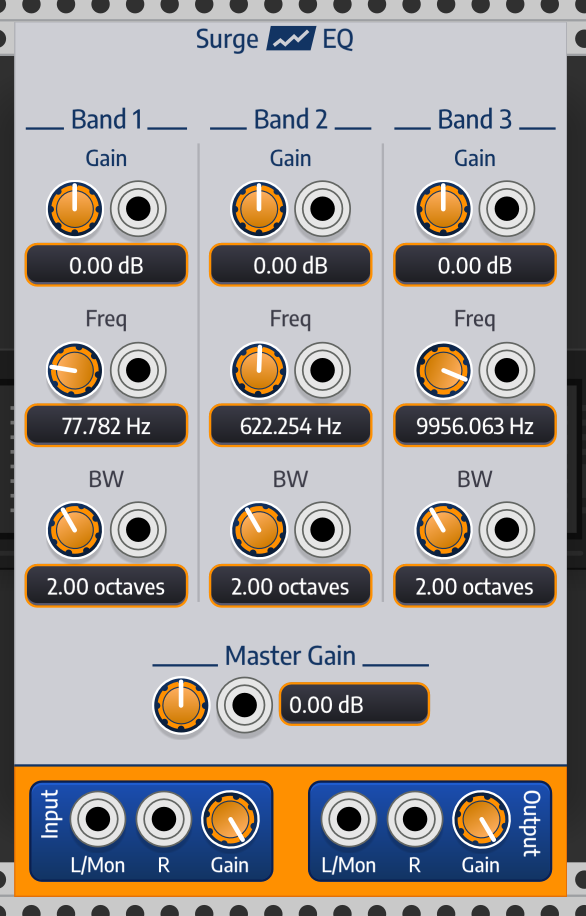
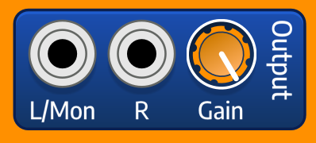
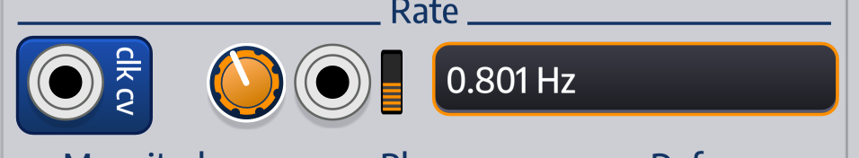
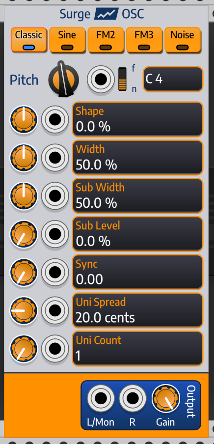
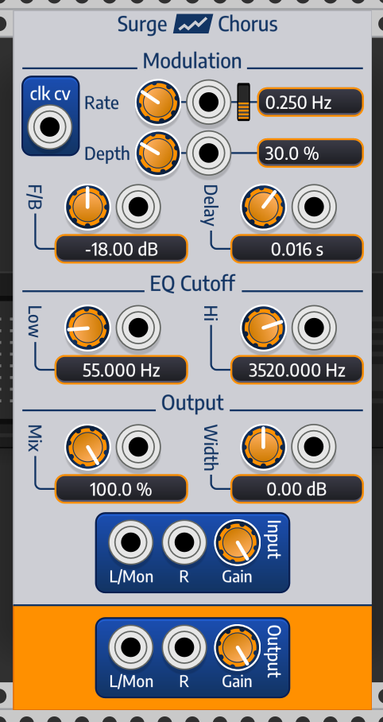
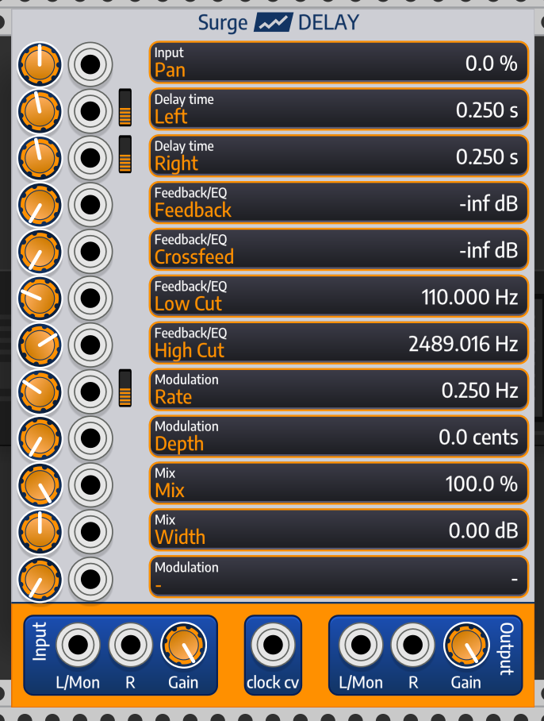
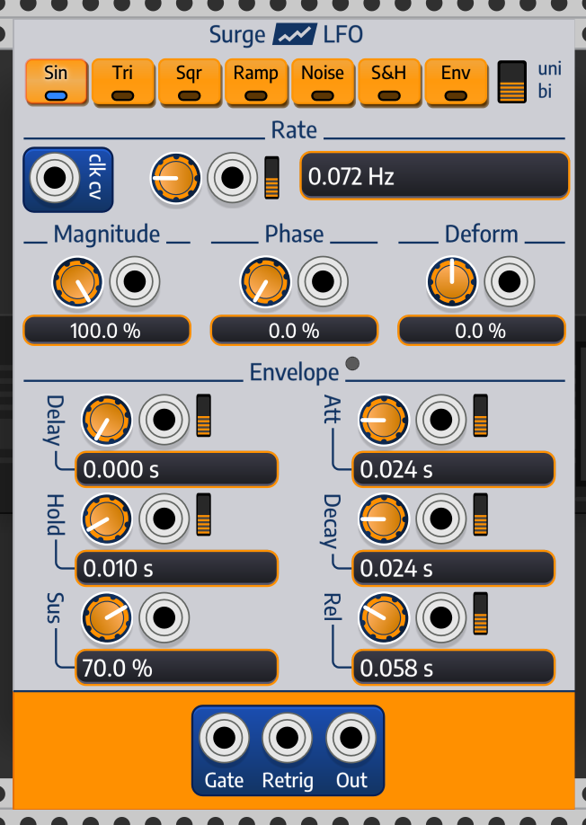

Surge is now available for [VCVRack v1.0](https://vcvrack.com/) as a collection of modules which break the
Surge block diagram into individual modules. This manual describes those modules, but assumes that you
are familiar with Rack and also that you have some basic familiarity with Surge. If that is not the case you
may want to consider [downloading the Surge VST](/) and [reading the Surge VST manual](/manual) in conjunction with 
exploring these modules.

Much as surge-rack is beta, so is this manual. It is intended to at least provide a rudimentary overview. If you 
are interested in contributing to the surge-rack project but are not a developer, we would welcome work and improvement
on this document.

# Overview

Surge is an unabashedly digital synth, and VCVRack is an obviously analog-inspired environment. Bridging these
two worlds creates a collection of fascinating musical opportunities, but also brings some choices in how we
introduce the surge modules to Rack. In order to make the Rack experience coherent, we have worked to use
common design and behavior patterns through all the modules. This overview section describes them.

## Common design elements

Here is the SurgeEQ 3 band EQ effect

This module displays many of the common elements we see in a surge module. At the top of the module is the
Surge Logo and the name of the module. At the bottom, in the orange region, is an input and output section, and
in the middle are a set of effects with the ability to change base values and modulate the value with a CV input.

Surge is a stereo synth at its core, so each of the inputs and outputs are paired with a "L/Mon" and "R" input
and a gain control.

For a given input, if only the L/Mono input is connected, Surge will use that as both the left and right channels.
And for a given output, if only the L/Mon output is connected, Surge will evenly mix its stereo channel into a mono
channel. Input gains are applied before the input is read; output gains are applied after surge generates its output.

For surge parameters, we typically have three components. A knob which centers the value, a CV input which modulates it,
and a display which shows the center value but not the modulations. Modulating the CV input will not update the label
but will update the value. Modulations expect a +/-5v CV input.

Almost all of the parameters are bound to a custom Rack parameter renderer, so you can enter in natural units with a right mouse
edit.

## BLOCK_SIZE vs sample

Surge is a digital synth aimed at VST environments. As such it calculates its output in blocks of 32 samples. This has an 
important impact on the implementation in rack. For instance:

* If you are using an effect it will introduce a 32 sample delay between your input and output
* If you modulate an input, that modulation is only captured every 32 samples when re-processing is done
* If you chain a long list of surge modules, the delay could be significant.
* If you try to do classic FM synthesize with a surge oscillator (for instance, run VCO-1 into the pitch input
of SurgeOSC) it will not work as you expect.

There are some exceptions to this rule. The Wave-Shaper processes in blocks of 4 samples. The biquad filter processes the input on 
a sample by sample basis but only reads parameters every 8 samples. And there are other exceptions. But you may need to
account for this block size in your rack network design.

Surge overcomes these modulation issues internally by co-evaluating all of its modulation sources in a step, which is why
a Surge Voice can have FM synthesis and so on. If you want to use these features of the surge engine, for now you are best
served with the SurgePatchPlayer module. As surge-rack continues, we will add more "compound" modules which allow expanded
interaction inside a block.

## Polyphony

All of the surge modules are polyphonic, including enveloped modules like the ADSR and LFO. For oscillator sources, the pitch
is the polyphony driver. For envelope and voice sources, the gate is the polyphony driver. The FX handle polyphony by summing a
polyphonic input automatically.

## Tempo-sync and Clocks

Almost all time parameters in Surge can work in an absolute (frequency in Hz) or tempo-sync (fractions of a 1/4 mote for a current BPM).
To have a concept of BPM, though, Surge needs a clock input. We use the Rack standard CV for setting BPM, namely `bpm = 60 * pow(2.0, cv)`.
You can input a CV level using that semantic into surge modules which support tempo-sync and then toggle tempo-sync.

The visual indicators we use for tempo-sync are shown by these two images from the LFO module:

The small orange switch next to a parameter indicates that it is available for Tempo-Sync. When toggled the display
will change to a fraction of a quarter note (and for larger displays will include the current BPM rate from the clock).
In these images, the "CLK CV" input is where you would route the CV input to set BPM.

Many rack parameters - especially in effects and envelopes - can tempo-sync. It's fun - you should try it!

# Oscillator Modules

Surge has two oscillator modules in rack, The "SurgeOSC" module, which has generated
waveforms, and the "SurgeWTOSC" module, which is a wavetable oscillator over a collection of 
wavetables.

## SurgeOSC

SurgeOSC has 5 waveform generators, chosen through the toggle buttons at the top. It has
a base pitch set either in notes or frequency (toggle the 'f/n') and modulated by a polyphonic
CV, and has a collection of parameters. The parameter types and meanings change per oscillator
as described in the Surge manual.

Unison Count is a special property which ignores the control voltage input for a technical reason.

## SurgeWTOSC

SurgeWTOSC is the surge interpolating wavetable oscillator. It has two interpolation modes, them
WaveTable mode, which simulates early d/a converters outputting pre-set waveforms, and a Window
mode, which uses a collection of more prosaic interpolation methods.  It also ships with more than 
300 wavetables.

The primary control in WTOSC which is missing in OSC is the wavetable selection. Wavetables in surge
are broken into categories, toggled by the "cat" spinner, and each category has a collection of wavetables
chosen by the "wt" spinner. Browsing wavetables does not change the oscillator; when you are ready to
load a wavetable, press the "load" button. The red light being active by the "load" button indicates that
you are viewing a wavetable different than the one you are playing.

If you have created custom .wt files in ~/Documents/Surge (or your OS appropriate place, as per the Surge manual)
the SurgeWTOSC module will make them available to you.

# FX Modules

FX modules will, eventually, have custom face plates per FX. For now, they break into two groups, ones with
custom face plates, such as the Chorus shown here

and ones with generic face plates where the parameters are shown as a simple labeled list, like their
Stereo Delay shown here

You can see that common UI elements, like tempo-sync switches and clocks, carry over, but the 
designed face plates are more logically grouped into parameters.

The full list of FX available are

* SurgeDelay
* SurgeChorus
* SurgeEQ
* SurgePhase
* SurgeRotary
* SurgeDistort
* SurgeReverb
* SurgeFreqShift
* SurgeConditioner
* SurgeVOC

The SurgeVOC effect is special in that it has two input channels, a carrier and modulator.

# The SurgePatchPlayer module

SurgePatchPlayer plays a surge patch with the full blown surge synthesizer loaded. The notes played
are triggered by the polyphonic Gate input (which acts as a note on note off trigger), capturing the note
and velocity at the time of trigger, using 1v/oct standard for note. The other controls surge reads from 
standard midi are exposed as CV.

We follow the same load/browse semantic as SurgeWTOSC.

*FIXME* this section needs improving.

# Filter Modules

Surge has a rich collection of interlocking filters and filter banks. As of 1.beta1.0, only the
most primitive single biquad unit is available as the SurgeBiQuad unit, which supports multiple filter types.

# Other modules

Surge LFO is a polyphonic LFO. It has two modes. If not gated, it outputs a single free running LFO
controlled by the top section of the control panel. If gated (mono- or poly-phonically) it outputs a
collection of enveloped LFOs, following the DAHDSR envelope shown in the lower section. If gated, there
is one unique LFO and envelope for each degree of gate polyphony. All items can support tempo-sync to a clock.

The Surge ADSR is a polyphonic ADSR envelop generator with multiple modes and tempo-sync. Polyphony is driven by the gate input.

The Surge Wave Shaper is a collection of wave shaping algorithms to add warmth and distortion to incoming signals.

The SurgeClock is a tiny utility clock which outputs gates and CV at a given BPM set by a control.

Surge Noise is the noise generator which appears in the Surge Mixer in the VST.
