Surge XT for Rack is a collection of modules which brings the majority of the DSP code
from Surge XT into the VCV Rack environment in a modern and carefully designed fashion.

This manual is a collaborative work in progress. We are happy to merge pull requests and changes!

# Omri Cohen's Overview Video

A great starting point if you are impatient is to just
watch our beta-day launch video from Omri Cohen. Thanks for making such a great
video, Omri, and awesome flute playing!

<iframe width="100%" height="315" 
        src="https://www.youtube.com/embed/8MavXLbI50A" 
        title="Sound Design Heaven - Omri Cohen demonstrates Surge XT in Rack" 
        frameborder="0" 
        allow="accelerometer; autoplay; clipboard-write; encrypted-media; gyroscope; picture-in-picture" 
        allowfullscreen></iframe>

# Collection Overview

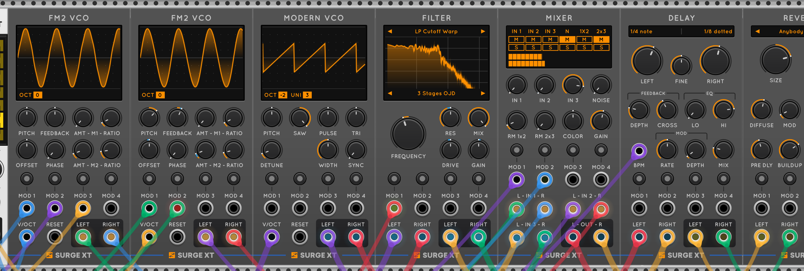

Surge XT contains a collection of modules which project the core capabilities of the
Surge XT synth into VCV Rack. It contains multiple VCOs, multiple FX, a Filter module
with a large number of complicated filter modes, a Waveshaper with multiple shaper models,
an LFO/Envelope Generator module, and a collection of utility modules.

This manual covers how to use these modules in VCV Rack, but it is intended to be read in
conjunction with the [Surge XT Manual](/manual-xt). Concepts like the meaning of a 
particular setting in a VCO or a particular knob on an effect are covered there in detail,
and we won't repeat that information here.

# Core Concepts

The module set strives for a high degree of consistency in the panels, and there are several
core concepts which cover nearly every module which you should understand before you turn
to the particular modules.

## Knobs, Switches, and Display Area Controls

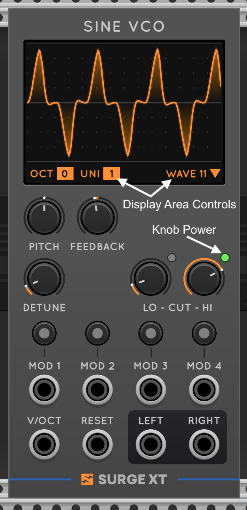
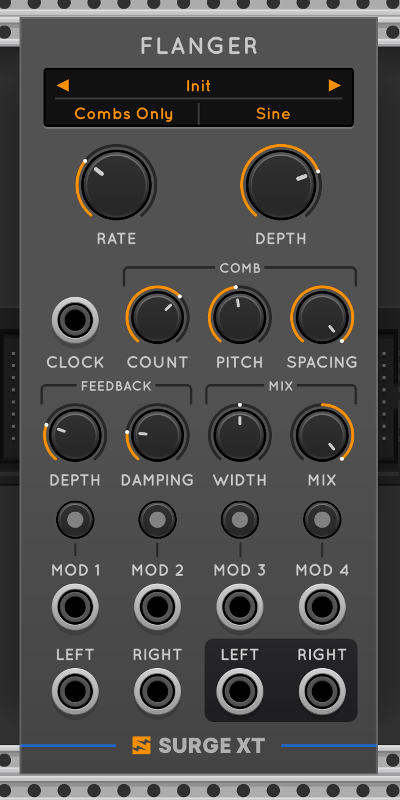

All Surge XT modules share a few basic features, shown in the above annotated image of the
Sine VCO and the Flanger. All components in Surge XT support the full set of Rack 2 features, including
value tooltips and typeins, using the standard Rack gestures. We can see almost all the
core UI features on the screenshot above of the Sine and Flanger modules.

* Knobs with rings to show their value, which can either be uni- or bi-polar. Knobs
  are labeled, and some panels have dynamic labels below knobs.
* Toggleable knobs have power buttons (here the green lit button above HI CUT in the Sine). For these
  you need to toggle the knob "On" for the feature to be in effect.
* Controls in the display area (here unison, octave, and wave shape in the Sine) will open a menu , In FX, controls in the preset area (like
  on click and support a knob-style drag gesture. Labels in FX display areas (here
  "combs only" and "sine" in the Flanger image) will open a multi-choice menu. 
* Presets and Model Choices (here the item at the top of the flanger) present a left-right jog buttons
  and open a menu when selected.

The modules with display area charts will update those charts in realtime based on values
and modulations. We endeavour to make sure the charts show what is actually happening
in an appropriate fashion!

## Modulation

Surge XT contains an advanced modulation system where every module contains a many-to-many
modulation matrix from 4 CV inputs to each of the knobs. 

To modulate a value:
* Attach a CV input into one of the four mod inputs.
* "Arm" the corresponding modulator by pressing the button above the input. (Or with the module focused, use Alt/Opt + 1-4 to toggle modulators armed)
* Once armed, each modulatable knob or slider will switch from 
a value display to a modulation depth display. 
* Drag the knob to adjust the inbound modulations effect on the parameter.
* While modulating, you can use shift-alt drag to edit the parameter's baseline value.

The modulation bounds and tooltip on the knob while editing modulation
show a bipolar level which is the impact of a + or -10V signal. If you are using
a +/-5V modulator (as opposed to a 0-10v modulator) you may need to set your depth higher.

Finally, this modulation gesture is far more natural to just do or see than it is to write 
about! We strongly suggest you watch Omri's video or just try the modules if this doesn't make
sense.

## Polyphony

All the Surge XT modules are Polyphonic. Polyphony is driven by natural inputs
(V/Oct, Trigger, and so on) in each module. Each of the FX (except the Delay, as
discussed below) can work either monophonically, summing inputs, or optionally 
polyphonically, with an instance of the FX per channel.

Modulation inputs do *not* set polyphony in modules. Instead, a module which has
polyphony P will interact with modulation with polyphony M as follows:

1. P=1, M=1: This is the simple case. It's just all monophonic!
2. P=n, M=n; if the modulator and module polyphony match, each modulator addresses each voice
3. P=n, M=1; if the module is polyphonic and the modulator monophonic, the
   modulator is broadcast to each polyphonic voice
3. P=n; M=m, m!=n; In this case the first m modulator channels are used for
   the first m voices, and any voice n > m gets modulation value 0.

## TempoSync and Clocks

Surge XT supports temposynced values across the time-based effects, and we have 
extended those features to the Surge XT modules. If a module supports tempo-sync
values, it has a CLOCK input.

The CLOCK input can take two forms, which you can toggle between in the module
menu.

* CLOCK - the module expects a quarter-note trigger. Establishing tempo will require
multiple triggers and tempo changes will lag.
* BPM CV - the module expects a CV signal for the tempo frequency, as output by
popular modules such as CLOCKED. This allows instant setting and changing of tempo.

The panel label for the CLOCK input will change based on the mode you select.

## Skins, Colors, and Animations

We love the way the Surge modules look, but we also know people like picking colors,
light and dark modes, and the like. So we added all of that!

On any module you can right click and choose between three skins (light, medium, and dark)
and can choose the colors for the panel displays, the knob rings and the modulation gestures.
You can also deactivate animation and drawing features on the display.

Bu default, changing a skin or a color changes your global state and all Surge XT modules
will follow. If you want, you can also decouple a module from the global state and it 
will have independent retained colors and skin settings.

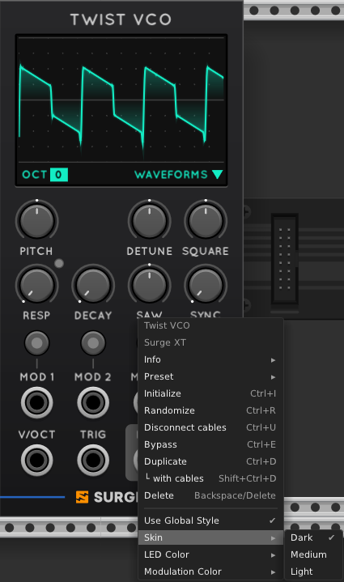

Here are some examples of the base skins:

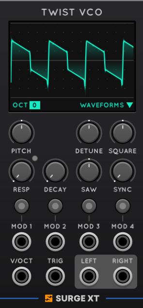
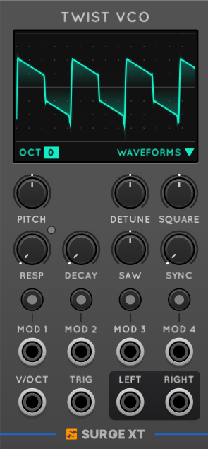
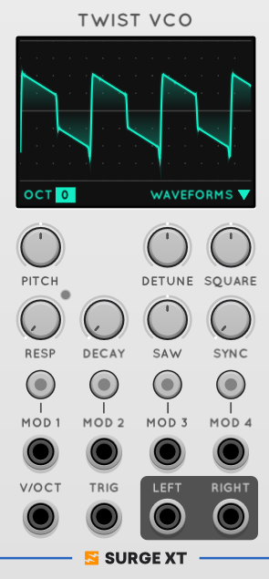

## Extra Controls in the Menus

The Surge VST is a menu-driven experience for many controls, and some of the lesser
used options in the VST are not on the front panel but are in the module menus per module.
We strongly suggest you look at the module menu since it contains a bunch of great
features! 

## Block Size and Latency

By virtue of being a VST, Surge is designed for a block-processing environment as
opposed to a per-sample processing environment. This means there are a collection
of places where latency can appear or modulators are snapped less frequently than
per sample.

Luckily, in the Surge XT modules, we have undertaken the work to make the Surge code
base use a compile time variable block size, and for the Rack implementation, set the
module block size to 8 samples, greatly improved from the 32 sample condition
in the prior rack implementation.

Most of the time, everything will simply work as you think, and you don't need to worry about block size.
There are a few exceptions and considerations, which we'll come back to where relevant.

# The VCO Modules

## Oscillator List

The Surge XT collection contains the following VCOs from the Surge oscillator section:

* **Classic** - a classic analog-style saw and square oscillator
* **Modern** - an analog-style multi-shape oscillator
* **Sine** - a sine wave oscillator with a collection of shaping functions, unison, and filtering options
* **FM2** - a 3 operator (2 modulators and a carrier) FM operator with integral C:M ratios
* **FM3** - a 4 operator (3 modulators and a carrier) FM operator with arbitrary and absolut-able C:M ratios
* **Wavetable** - a modern wavetable oscillator with multi-wavetable loading and warping
* **Window** - another wavetable oscillator using fixed windowing functions
* **S&H Noise** - a tuned noise generator
* **Alias** - a purposefully gritty and aliasing oscilator
* **String** - an oscillator with a pair of physical string (Karplus-Strong-style) models, multiple exciters, and more
* **Twist** - The SurgeXT adaptation of Mutable Plaits

Each oscillator is documented more thoroughly in the [Surge XT manual](../manual-xt/#oscillator-algorithms).

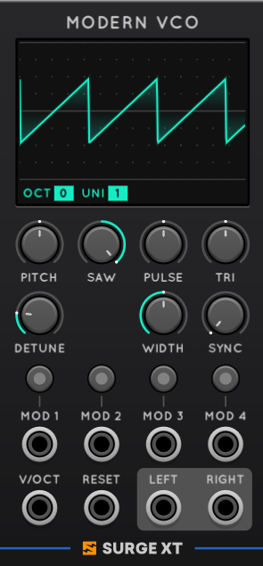
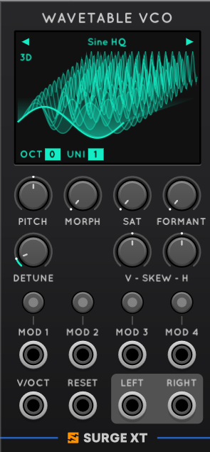
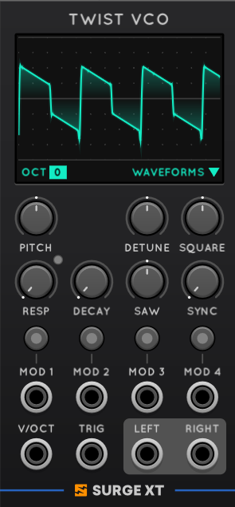

## Common Features

The oscillators all have a collection of common features, available on the right mouse menu. Some 
oscillators have VCO-specific menu items also. Among these options are

* Character: A set of basic filters to make the output warmer or brighter
* Oscillator Drift: A low frequency pitch drift applied across the life of the oscillator for an "analog" style
* Output Attenuation: A fixed attenuator to "turn down" an oscillator; especially useful at high unison and low detune
* Halfband Filter: Alternate half-band filters to downsample the internally oversampled oscillators. At high
  polyphony, you may save some CPU at some quality expense by chosing an lower-M version
* DC Blocker: All the VCOs have a very low frequency high pass filter as a DC Blocker. You can deactivate this if you want.

## Tips for limiting CPU

The Surge VCOs use a collection of techniques to guarantee low CPU while maintaining high audio quality. But there
are some things which can drive the CPU high in VCOs. 

In general, the Modern, Twist, and WaveTable CPUs are among our most intensive, and Classic is among the lightest.
VCOs increase CPU count roughly linearly in unison count; a unison count of 3 or 5 is almost always as high as you want 
to go. Larger (higher number of points) wavetables can be more expensive than smaller ones. And finally, of course,
higher polyphony means higher CPU usage.

## Wavetables

The two surge Wavetable based oscillators ship with the factory section of the Surge XT wavetable bank. These wavetables can be 
accessed from the display area menu. 
The 3rd party section has been omitted by default, (to make the library download smaller). You can however 
easily access our 3rd party wavetables from the wavetable menu, just press "download extra wavetable content".

The VCOs will also read wavetables in a variety of formats,
including the popular wavetable formats used by Serum (2048-long tagged .wav) and 
Bitwig (.wt). It also interprets WAV loop markers as wavetables. 

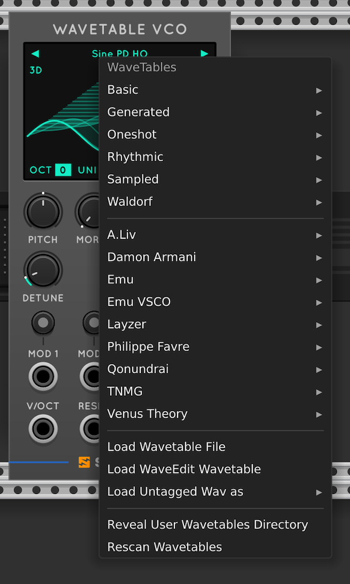

Wavetables in other formats require pre-processing. Unprocessed audio files will be loaded as one shots.
For more on this consult the [Surge XT manual](../manual-xt/#wavetable).

Since wavedit (with its 256-block untagged wav file) is a popular format, we have added
a special menu in the Surge XT Rack modules, where you can load this file directly from
the wavetable menu using the "Load WaveEdit Wavetable" menu item.

If you have a wav file which you know is a 512 wide wavetable, you can also load it explicitly
with "load untagged wav as" submenu

Finally, on startup surge will scan your surge user directory for additional wavetables,
so you can copy or link to those. To reveal the directory where Surge looks, use the
"Reveal User Wavetable Directory" entry. This is the same directory the VST uses, so if
you have already set up a user wavetable collection, they will appear in your menu.

Surge saves the selected wavetable in the VCV Json Patch, so if you make a patch then
remove a table from your system, your patch will still play in the future.

## VCO Block Size Considerations

All the Surge VCOs generate samples in blocks of 8, snapping the CV output at the start of the
block and smoothing to that value as an end of block target. In almost all music applications
this is unnoticable, but there are two consequences

1. Trigger events are processed every 8 samples, resulting in an amortized 4 sample delay
   on triggers; and
2. Audio-rate modulation has some aliasing issues. Very high notes or bright sounds likely won't sound pleasant.

## The Reset/Trigger input on VCOs

Each VCO has a "Reset" or "Trigger" input depending on its behavior.

If this input is labeled "Reset" resets the oscillator with the same action that happens at note on in the vst. 
It resets phases for unison, restarts the note drift, and a few other things. If you patch a VCO to a scope module, set unison to 2 and 
choose "Retrigger with Phase = 0", you will clearly see the effect of Reset in the scope.

For a few oscillators there are modes other than reset. String, Twist and Window/WaveTable in one shot mode toggle 
from "Reset" to "Trig" to indicate that the init action restarts playback. 

In String it re-fills the burst buffer and resets the modelling delay lines.

In Twist it re-triggers the built in LPG.

In Window/WaveTable in one shot mode it starts the one shot again. This mode is only active if you have loaded
a wavetable which acts as a one shot. In this case, on trigger the playback will start from the morph value which
is in effect when the trigger arrives.

# The VCF and Waveshaper Modules

## VCF

The Surge XT VCF presents all of the Surge XT filter types and subtypes in a single module.
There are preset menus at the top and bottomr of the display to select the core model and sub-type. The subtypes drastically alter 
the core models behaviors, we strongly encourage you to explore all the combinations. 

The module runs in polyphonic stereo with mix, pre- and post- gain, cutoff and resonance controls
which all do exactly what you'd expect.

What it doesn't have is a dedicated V/Oct input. But you can make it pitch tracking by patching a V/Oct signal into
a mod input, and assigning it to the frequency dial at full depth. Note that not all the filters play in tune consistently 
throughout their range, for some of them the tuning will vary with feedback and input level. Some of them play in tune 
very reliably though. the 24dB Lowpass and the OB-Xd Bandpass and Notch filters are particularly consistent. 

The VCF display shows the result of transforming a chirp sweep through the filter as configured. It is the 
actual filter response calculated in near-realtime.

### VCF Block Size Considerations

The surge filters are sample accurate adding no latency, but calculate coefficients every 8 samples and then
smooth over the block. This means the filters handle feedback well, but filter FM has the same limitation as audio rate modulation on the VCOs.
Can sound great for deep basses, but will easily fall apart in high registers. 

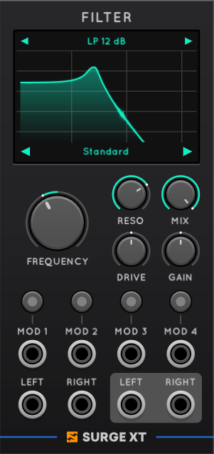

## Waveshaper

The Surge XT Waveshaper presents all the waveshaper models from Surge in a single module. It 
Using the preset menu at the top of the display, you can choose the waveshaper model to apply.

The module gives you control over bias, which adds DC offset before the waveshape and subtracts it after, making the waveshaping assymetric. 
There's also a drive control (pre-gain), optional high- and low-pass filters, and a post gain control. 

The Waveshaper display shows the output of the waveshaper, as presently configured, with input of a +/- 5V amplitude sine wave. 
This is the quickest way to get an overview of the various shape options the module provides. 

### Waveshaper Block Size Considerations

Unlike the filter and VCOs, the waveshaper module processes both audio and modulation per-sample. This means it's much better suited for 
audio rate modulation than the previously discussed modules. The Drive and Bias controls are particularly suitable targets, with 
very different results depending on which waveshape is selected. The coefficients on the filters are still per-block however,
so the filters dials are somewhat less suitable targets, comparable to the VCF.

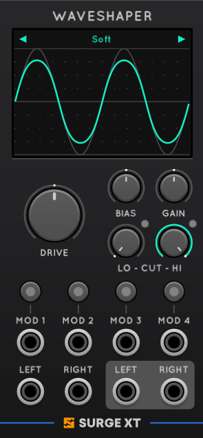

# The Surge Effect Modules

## The Effect List

Each of these effects is described in more detail in the [Surge XT manual](../manual-xt/#effects-1).

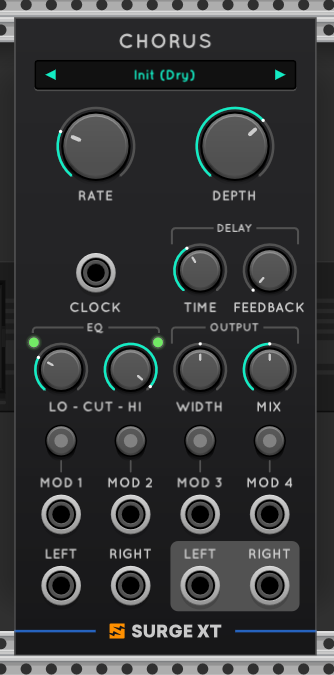

* Reverb/Delay
   * **Reverb1**: A digital reverb, good for short gated type sounds, a bit odd in long tails
   * **Reverb2**: A more lush reverb, good for spatial or ambient sounds
   * **Spring Reverb**: A detailed model of a spring reverb, including knock and chaos effects. 
Can be CPU intensive.
   *  **Delay**: A Digital Delay, strictly monophonic but supports delays up to 10 seconds and includes
tempo-sync without a block latency delay.
* Modulation Effects
   * **Phaser**: A digital phaser with many options to control the filter network
   * **Flanger**: A flanger with some advanced feedback and tuning options
   * **Rotary Speaker**: A rotary speaker model, including two horns and an overdrive phase
   * **Chorus**: A clean digital chorus
   * **Ensemble**: An ensemble/chorus model based on a detailed model of a BBD chain,
akin to ensemble effects in older string synthesizers. Can be CPU intensive.
* Distortion and Saturation
  * **Distortion**: The name kinda gives it away right? 
  * **Neuron**: A saturation circuit
  * **Chow**: An interesting asymmetric saturator
* Special Effects
  * **Frequency Shifter**: A stereo extendible frequency shifter
  * **Ring Modulator**: A model of an analog ring modulator, with a multi-shape unison internal carrier
  * **Vocoder**: A vocoder with selectable bands and filter parameters
  * **Resonator**: A filter bank configured like classic resonator modules
  * **Combulator**: A bank of comb filters with feedback
  * **Exciter**: An exciter to add "sparkle" to your sound
  * **TreeMonster**: A pitch detection circuit which generates a tuned tracker signal you can 
ring modulate against. Its kinda crazy!

## Polyphony

All the Surge FX except the Delay can run in either a monophonic or polyphonic mode. In monophonic mode,
the FX sum the inputs and hand them to a single instance of the effect. In polyphonic mode, there is an instance
of the effect for each polyphonic channel, adding substantial CPU in some cases, but
also adding polyphonic separation. All FX default to monophonic mode, except for TreeMonster which defaults to polyphonic.

You can toggle polyphony behavior in the module menu.

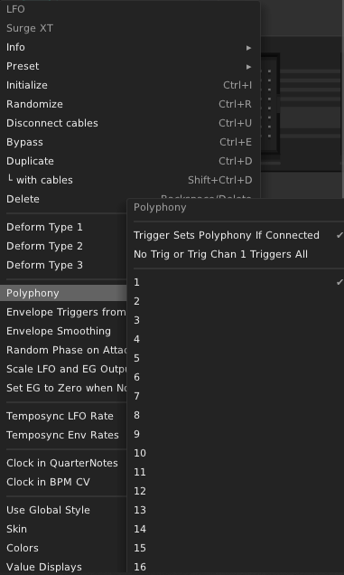

### FX Block Size Considerations

Except for the Delay, all the above effects work with a block size of 8, so have to collect 8 samples before 
processing. As such they add an 8 block latency to input signals, and audio rate mod will cause the aforementioned aliasing issues. 

# The Tuned Delays

Surge XT for Rack now has two special delay modules which are parameterized for physical modeling applications. 
They are delays in a DSP sense, but functionally you might as well call them experimental VCOs (though they can also serve as FX).

At the heart of both Tuned Delay modules is a very short delay, which has its length controlled by a V/Oct input such that
the delay time is always one cycle at the intended frequency. I.e. if the V/Oct input indicates a frequency of 1000 Hz the delay time will be 
one millisecond, if it indicates 100 Hz the time will be ten milliseconds etc. 

If you add feedback to such a tuned delay, and send it a short burst of sound, it creates a sound somewhat like a plucked string,
with the amount of feedback controlling how long the sound takes to decay. This is Karplus-Strong synthesis. 
But you could also patch a vco to the input and use them 

## Tuned Delay

This is the bare-bones version of the idea. 
It has stereo inputs and outputs, and a V/Oct input. 
The V/Oct Center parameter acts like the pitch control on a VCO. Type in whole number like 1, 2, -1 etc to change octave, for example. 

To use this module, send some sound into the input, mixed with the sound of the output to create a feedback loop (you'll need a mixer). 
Adding other modules into that feedback loop can create many kinds of interesting results.

That's what the Sample Correct control is for. Long story short: Count the number of cables the signal passes through 
between the output and the feedback input, and make sure this parameter is set to that number.

Why? Every cable in VCV Rack introduces 1 sample of latency, which means if you patch some modules into the feedback loop,
the cables will *very slightly* lengthen the delay time. This would make the module play out-of-tune in
high registers, so we put the Sample Offset control in to let you compensate. 

## Tuned Delay+

The Tuned Delay+ module is the same DSP, with some useful patching tools built-in. 
You could say the seemingly simpler one is the advanced tool, whereas this one is the more user-friendly version
that helps you out a little more. 

There are stereo inputs and outputs, and our familiar four modulation inputs.

The V/Oct input, and the Center parameter, are explained above. The Fine L/R parameters do the same thing as Center, 
but have a much smaller range and work independantly for the left and right channel.

The feedback inputs save you from having to use a second module to mix output back into the input.
We recommend starting out simply patching L/R outputs to the L/R feedback inputs.
The Level control attenuates the feedback signal, effectively controlling both the decay time and timbre of the sound. 
By default the control goes from -1dB to 0dB, where the most sensitive range is. If you want to be able to bring the 
feedback down to silence though, you can press the plus sign over the dial. 

There are optional high- and low-pass filters in the feedback path to shape the sound further. These filters track
V/Oct, the dials control the offset from the root frequency. The wet/dry control blends filtered and unfiltered feedback.

The exciter input directly applies a 0-10v CV to the amplitude of an internal noise generator, sent into the 
delays feedback path. If you've got output patched into the feedback as described above, 
you can send trigs to the exciter port to play the module. The length of the trig will greatly impact the sounds you get. 

This is the essential way to patch Tuned Delay+ as a Karplus-Strong VCO. V/Oct, trig to Exciter, and Output to Feedback.
Just like with the simple Tuned Delay, the Correct parameter should be set to 1 in that scenario. For each module you 
add to the feedback path, turn Correct up by 1.

### Tuned Delays Block Size considerations

Our delay line processes per-sample. So these will not introduce any (additional) latency to signals. 
This also makes parameters that directly control the delay time good targets for audio-rate modulations. 
Just like with the Waveshaper, the filters in the Tuned Delay+ feedback path calculate per block and will alias at high audio rates. 

# The Modulation & Envelope Modules

## LFOxEG 

The LFOxEG module is built around the main modulator type in the Surge VST. It is an LFO with various shapes including two 
random modes and a step sequencer. The amplitude of its output is scaled by a DAHDSR envelope generator. 

* **LFO** Continuously outputs the LFO wave.
* **EG** Outputs the envelope shape. 
* **LFOxEG** Is the main event, it outputs the LFO wave scaled by the envelope.

The [Surge XT manual](../manual-xt/#lfos) has some more info on each LFO shape, though the display of the module itself will
most likely tell you what you want to know. 
The straight lines above and below the LFO wave display are showing you the how the envelope influences the LFO wave output. 
The envelope also influences the output of the Step Sequencer type, though this is not shown on the display. 

The controls are mostly self-explanatory, and their effects are also shown on the display area. The Deform control
has different effects depending on the selected LFO type, and some of the types have different Deform options, accessible
via the module menu. Deform only affects LFO and LFOxEG outputs, never the EG output (even in the envelope type).

There is a switch in the bottom left of the display area for the output polarity. 
In the default mode, LFO output range is +/- 5V. In Unipolar mode, its range is 0V-10V.
The step sequencer type and the EG output are an exception. They never go to negative voltages. 
Their range is 0v-5V by default, and 0v-10V in unipolar mode.

There's also some end of cycle-type outputs, which send a trig at the end of various internal events.
* **EOSEG** triggers at the end of each stage in the envelope generator.
* **EOEG** triggers at the end of the entire envelope, after the release stage.
* **EOC** triggers at the end of each complete cycle.
* **A/B** (Step seq mode only), trigger at the selected steps in the sequence.

The **Gate** and **GateEnv** both open up the EG. The difference is that the Gate also resets the LFO phase, while the GateEnv does not. 
We do not currently recommend patching both of these at the same time.

**Clock** will take a clock input to tempo-sync the module. By default, the LFO will sync to clock when connected, but the EG will not.
You can change that, and also choose clock signal types in the menu. 

The **Phase** input will stop the LFO from cycling, and let you control the position in the LFO wave directly with a 0-10v input. 

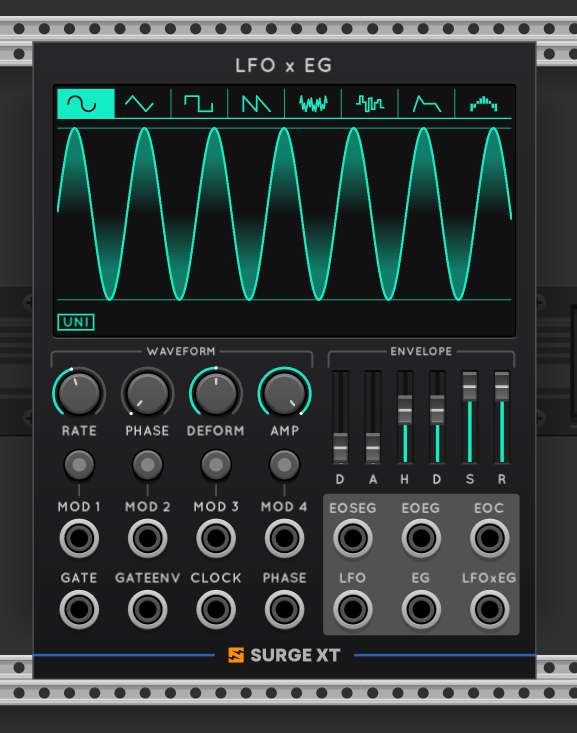

There are a number of menu options.
* *Polyphony* works the same as everywhere else
* *Envelope Triggers From Zero* makes the envelope restart from zero when triggered. Defaults to off, meaning envelopes will restart from the current value.
* *Random Phase on Attack* is fairly self-explanatory.
* *Scale LFO and EG outputs by Amp* defaults to on, meaning the Amp knob affects LFO, EG and LFOxEG outputs. Turn off to make Amp affect LFOxEG output only.
* *Set EG to Zero when No Trigger Connected* sets whether the EG output defaults to open or closed when nothing is patched to the gate inputs.
* *Rack Randomization Changes Shape* defaults to on. Turn this off to randomize parameters while staying on the same LFO type. 

## EGxVCA 

When making voices in VCV Rack, you typically use an envelope generator plus a VCA to control amplitude.
This module combines both in one, with stereo inputs/outputs and a pan control! 

The envelope can either be a typical ADSR (suitable for sustained synth voices) or a less common DAHD (suitable 
for drums). Toggle between these in the top left of the display.

The envelope segments can be adjusted for many different kinds of response. The envelope sliders are labelled and self-explanatory. 
At the top of the display area, you can change the curve of each segment between faster, slower, and standard curves. 
Like the Surge VST amp and filter envelopes, this EG can also be toggled between digital and analog modes, which have 
different curve behaviors. There's also the Response parameter, which subtly changes the curve shapes to tame 
or exaggerate pops and clicks.

The pan control will work for both mono and stereo inputs. And since the module is polyphonic, voices
can be panned independantly with modulation.

Like the LFOxEG module, this one has clock signal options (for tempo-sync of envelope segments) and retrigger options in the menu.
We also have two Pan behaviors for stereo inputs. 
* With the default behavior, panning left gradually silences the right side signal.
* With the optional "true panning" behavior, panning left gradually moves the right input to the left output.

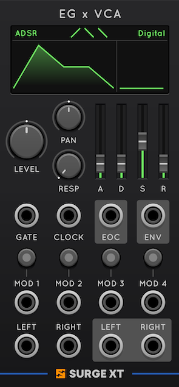

## Quad AD

Four envelope generators in one module, perfect for percussive sounds! 

The EG can be either attack-decay or attack-(sustain)-release. In either case you get the same three curve options and 
analog/digital modes you had in the EGxVCA. Also, like our other EGs it has retrigger from zero/current options in the menu.

Each EG gets an independant trig/gate input, and attack/release time controls. 

Make sure to try out the buttons in between the trig inputs. They allow you to link the end of cycle from each EG
to the attack of one of its neighbors, so you can chain the EGs into a longer cycle.

## Quad LFO

The Quad LFO combines four identical simple LFOs, which interact with one another in one of five ways.
Each LFO has the same types as the LFOxEG module available (minus the envelope and sequencer types), which
can be either unipolar or bipolar. There's also a new mode called Random Trigger, which has a chance to choose
a new random value every trigger/cycle. The deform parameter controls the chance that the output value changes. 

Besides the 4 modulation inputs and outputs, it has 4 variable inputs that change behavior depending on the inter-operation mode.

The modes are:

* **Independent**: Each LFO is oblivious of the others, with its own rate and deform controls and reset input.
* **Rate Ratio**: The first LFO sets the tempo, and the others are synced at integer multiples/divisions of the first.
* **Quadrature** Puts the LFOs at fixed 90 degree phase offsets. The first controls rate, you can change amplitudes of the others. 
* **Phase Offset** Like Quadrature, except the amplitudes are fixed, and you can alter the phase offsets instead. 
* **Entangled** You can set a baseline value for each parameter, and then spread the LFO's out from that baseline. 

All the inter-operation modes except Independent have a Reset trig input to start the cycle over from the beginning, and a
clock input for tempo sync. There's also a freeze input, which stops all LFOs in their tracks when it receives a high gate. 
Last but not least, you can reverse the pattern with a trig to the Reverse input.

The module is polyphonic, by default the poly count on the Reset input.

### Modulator and Envelope Block Size considerations

These modules process modulation input per-block. 
The envelopes respond to triggers in a sample accurate manner though, so no latency there. 

# Mixer Modules 

We have two mixer modules. One is intended for audio signals, the other for modulation, though you can do it "wrong" if you like.

## Mixer

The Rack Mixer is an implementation of the VST mixer section. It contains

* Three stereo oscillator inputs with independent modulatable gains
* 2 digital ring modulators (1x2 and 2x3)
* A noise source with filtering (color)
* Full polyphony and modulation support
* Mute and Solo for each channel

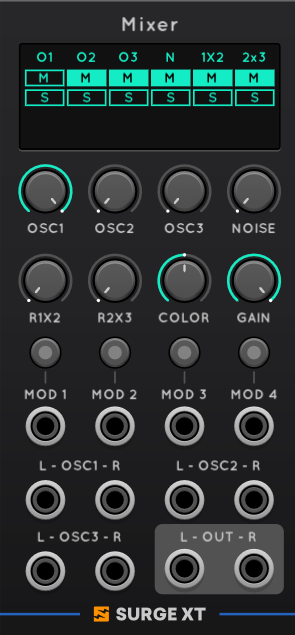

## The Mod Matrix

We think the Surge modulation matrix model is really great! And it would be great
if we could extend it to other modules. In order to do that, we include a mod matrix
module which is simply a collection of knobs which output fixed voltage to the associated modulation output. 
Since these knobs are modulation targets, you can use them to generate 8 re-mixed modulations
from 4 modulation sources to route to other CV sources. 

Patch output 1 to the destination you want to modulate. Then bring the modulation sources you want to use into the mod inputs.
Then arm the modulators and assign them to knob 1 one by one. The opt/alt + 1,2,3,4 shortcuts come in handy here for 
adjusting the amount of each modulator that goes into the mix. 

### Mixer Block Size Considerations

These are per-sample throughout, no latency or aliasing from audio-rate signals. 

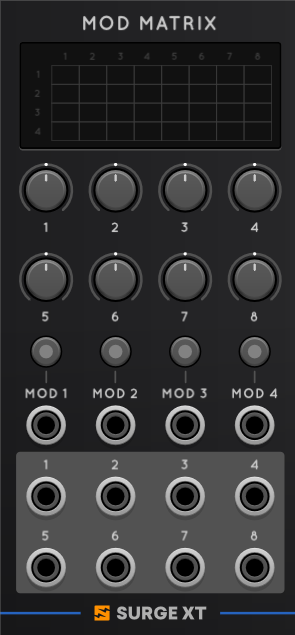

