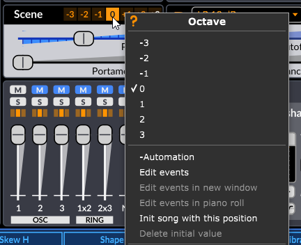

# User Interface Basics

The user-interface of Surge XT is divided into four main sections:

-   Header
-   Scene controls
-   Modulation/Routing
-   Effects

Keeping this structure in mind will make it easier to understand the layout.

_The four sections of the user-interface that Surge is divided into._

## The Scene Concept

Every patch in Surge XT contains two scenes (A & B) and an effect-section.
Both scenes and all effect settings are stored in every patch. A scene is similar to a
traditional synthesizer patch as it stores all the information used to synthesize a voice.
Since there are two scenes in each patch, it's possible to have layered or split sounds stored within a single patch.
(see [Scene Select and Scene Mode](#scene-select-and-scene-mode)).

## Audio Outputs

When loaded into a DAW, each instance of Surge XT has **3 audio outputs**:

-   Stereo Out
-   Scene A Out
-   Scene B Out

Depending on the host, those outputs can be used and routed to be processed separately.

## Sliders and Controls

The most common user-interface control in Surge XT is the slider. They come
in both horizontal and vertical orientations but their functionality is
otherwise identical.

Sliders are always dragged, there is no jump if you click on the slider
tray instead of the slider head, it enters dragging mode nonetheless.

Slider interactions:

-   **Left-click drag** - Drag slider
-   **Shift + Left-click drag** - Drag slider (fine)
-   **Ctrl/Cmd + Left-click drag** - Drag slider (quantized steps)
-   **Alt + Left-click drag** - Drag slider in elastic mode (snaps back to initial position upon release)
-   **Scroll Wheel** - Move Slider
-   **Shift + Scroll Wheel** - Move slider (fine)
-   **Double left-click** - Reset parameter to default value
-   **Right-click** - Context menu
-   **Hover** - See the slider's current value without clicking on it

Other than sliders, some of Surge XT's parameters are also displayed as number and value fields, buttons and button rows.

## Undo and Redo

Below the [Patch Browser](#patch-browser), you will find curved arrow buttons just to the left of the **Save** button.
Clicking on these will allow you to undo and redo the latest changes. You can also use keyboard shortcuts (by default,
Ctrl+Z and Ctrl+Y) to undo and redo respectively.

### Parameter Context Menu

Any parameter's context menu can be brought up with a right-click. This menu has numerous useful functions:

#### Name and Contextual Help

Clicking on this first option will open this user manual to the correct section explaining the parameter in question.
Alternatively, you can simply hover over the control in question and press F1.

#### Edit Value

This option allows you to type in the desired value of a parameter. Once the value popup appears, its text will
already be highlighted, and you can start typing the value right away. When you are done, simply press Enter to
confirm the change. To cancel and close this popup, simply press the Escape key or move any other parameter.

Note that for any value type-in windows in Surge XT, there is no need to type in the unit of the entered value.

For discrete parameters (Unison Voices, or a button row for instance), instead of a type-in field, all the possible
values will be displayed right in the menu so they can be accessed directly.

#### Extend Range

Some parameters can have their range extended. The option **Extend range** will appear in the context menu
if they do. **Pitch**, for instance, is one of those parameters.

#### Tempo Sync

Some parameters can be synchronized to the host tempo. The option **Tempo sync** will appear in the
context menu if they do.

Once tempo-synced, when using the Surge XT Classic skin, the slider will show a "TS" symbol on their handles to indicate that state, like so:

This indication can vary depending on the skin used.

#### Enabled

Some parameters can be enabled or disabled. If a slider appears transparent or is missing its handle,
in some cases, it can be because the parameter is disabled. To toggle it, simply click on that option.

#### Modulations

This section of the menu will appear if the right-clicked slider is being modulated by some modulation source(s) (if it has a blue tint).
See [Routing](#routing) for more information.

-   **Red X icon** - Clicking on this icon to the left of a modulation source will clear that modulation routing.
-   **Speaker icon** - Clicking on this will allow you to mute (bypass) a modulation source in the list. Simply click
    that icon again to unmute that source.
-   **Pencil icon** - This will bring up the modulation amount type-in window.
    Simply type-in the desired amount of modulation you want to apply to that parameter. See
    [Edit Value](#edit-value) for more information.

#### Add Modulation From

As its name suggests, this menu entry allows you to directly link a modulator to the right-clicked control.
All the available modulation sources are sorted in different categories so you can find the desired one easier.
Once a modulation source is chosen, a type-in window will appear, allowing you to enter the modulation amount you
want to apply.

#### Assign Parameter To

This option allows to assign the right-clicked parameter to any MIDI CC.

#### MIDI Learn

This is where you assign a MIDI controller to the desired slider. To abort MIDI learning on that parameter,
simply right-click again and the option will now become **Abort Parameter MIDI Learn**.

#### Clear learned MIDI

This option will be available if the selected parameter has already been MIDI learned. It allows you to clear that link (the
existing link MIDI CC number will be shown in parentheses).

#### VST3 Options

Finally, the VST3 version of Surge XT supports VST3 context menu items. Depending on the host,
there may be more or less options regarding automation, MIDI, or parameter values.
