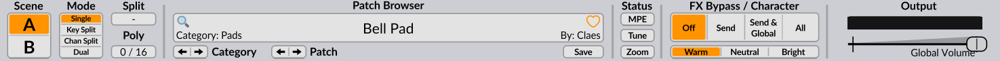

# Header

## Scene Select and Scene Mode

There are two setups of all controls within the Scene section of the user interface.
The **Scene Select** buttons **[A|B]** determine which one is selected for editing.
Right-clicking on these buttons brings up a context menu that allows you to copy/paste scene content.

Depending on the **Scene Mode**, these two buttons could also be used to choose which scene will be _played_.
Indeed, whether a scene will generate a voice when a key is pressed is determined by the **Scene Mode** setting:

-   **Single** – Notes will be played only by the selected scene.
-   **Key Split** – Notes below the **split key** will be played by scene A,
    notes above and including the **split key** will be played by scene
    B.
-   **Channel Split** Notes from MIDI channels below the **split MIDI channel** will be played by scene A,
    notes from MIDI channels above and including the **split MIDI channel** will be played by scene B.
-   **Dual** – Both scenes will play all the notes.

In both **Key Split** and **Dual** mode, if MPE is disabled, the system also supports MIDI channel routing where Channel 2 plays only
Scene A and channel 3 plays only Scene B. MIDI channel 1 and all other channels higher than 3 play the Split/Dual mode.

**Poly** shows the number of voices currently playing and allows you to
set an upper limit to the number of voices allowed to play at the same
time by dragging horizontally on the value. The voice-limiter will kill off excess voices gently to avoid
audible artifacts, thus it's not uncommon for the voice count to exceed
the limit.

## Patch Browser

### Navigation

Cycling through sounds in Surge XT is easy: just press the arrow buttons
until you find something you like. If you left-click the patch-name
field (anywhere in the white area), a menu will list all available
patches arranged into categories. A right-click will bring up a menu with just the
patches of the current category. If you middle-click on these buttons, a random patch
will be loaded.

These categories are also grouped into three sections depending on who created them:

-   Factory Patches - Patches created in-house by the Surge XT authors.

-   3rd party patches - Patches created by users and 3rd parties.
    Categorized by creators.

-   User Patches - Your own patches will be stored here. How you categorize them
    is entirely up to you. At the top of this section is where your favorites patches will show up.

At the bottom, there is an option to
[download additional content](https://github.com/surge-synthesizer/surge-synthesizer.github.io/wiki/Additional-Content).

By default, to help prevent you loosing an unsaved patch by switching patches, a confirmation dialog will open, asking
you if you still want to proceed. You can turn off this warning by checking the _Don't ask me again_ box, or by
disabling the appropriate option in the [Workflow](#workflow) category found in the [main menu](#main-menu).
A modified or unsaved patch name will show an asterisk in the patch name area.

You can also directly load patches (.fxp) by dragging and dropping them anywhere over the Surge XT interface.

There is also an option in the patch menu to set the current patch as the default one to be loaded when
opening a new instance of Surge XT.

Finally, the patch menu allows you to rename or delete a patch. Those options will only appear if you have a
non-factory patch loaded in the synth.

### Searching Patches

To search patches by name, simply click on the magnifier glass icon to the left of the patch name area.
You may see Surge XT first update the patch database before being able to type in your search query.

You can also search for patches by **author** or **category** by typing "AUTHOR=" or "CATEGORY=", followed by
your search query.

If the **Retain patch search results after loading** option is enabled in the [Workflow](#workflow) category found in
the main menu, holding Ctrl while selecting your desired search result with your mouse or while pressing enter will
close the search results.

### The Save Dialog

Clicking the **Save** button of the patch browser opens the save dialog.
This is where you name your new patch and choose which category it
should belong in. You can also create a new category manually here as
well. The patches you save will end up in the user section at the bottom
of the patch menu. The save dialog also provides text fields for the name of the patch creator,
license, and comments.

Note: You can display the comments of a particular patch by hovering over the patch name area with your mouse.

Holding down the **Shift** key when saving a patch will automatically overwrite an existing patch, which
bypasses the dialog asking you for an overwrite confirmation.

### Favoriting Patches

Adding a patch to your favorites list is as easy as pressing the heart icon to the right of the patch name area.
Right-clicking on that same icon will allow you to access the favorite patches list.

## Status Area

This area is meant to be a quick access to some of Surge XT's features that are also present in the Menu.
(see [Main Menu](#main-menu))

The **MPE** and **Tune** buttons are for quickly enabling/disabling those features in the current Surge XT instance.
Right-clicking on one of these buttons will reveal more options which are also present in sub-menus under the Menu button as well.
Left-clicking the Tune button while Surge XT is in its default tuning will also simply open the menu. See [Microtuning](#microtuning) for more information.

## FX Bypass, Character, Global Volume

**FX Bypass** lets you quickly hear what a patch sounds like without the effect-units. (see [Effects](#effects))

-   **Off** – Bypass is disabled, all effects are active.
-   **Send** – The send effects are bypassed.
-   **Send + Global** - The send and global effects are bypassed.
-   **All** – All effects are bypassed.

**Character** controls the amount of high-frequency content present in
most of Surge XT's oscillator algorithms. Available choices are Warm, Neutral
and Bright.

**Global Volume** controls the last gain stage before the output.
You can choose to hard clip the global output either at **+18 dBFS** (default) or **0 dBFS**
by right-clicking on it.

### Level Meter

The level meter above the global volume shows the output level, and will become red if it goes
above 0 dBFS. If you right-click on the level meter, you will find options to open the [oscilloscope](#oscilloscope),
and also to display CPU usage.
