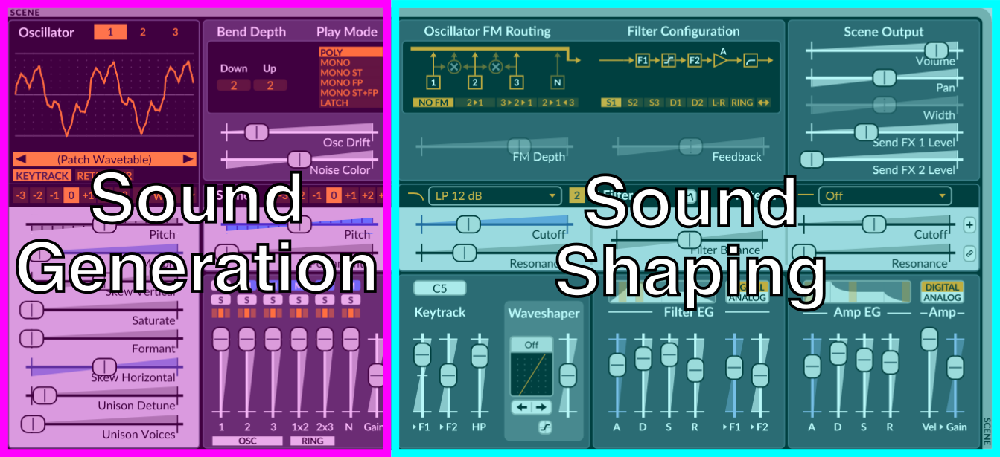
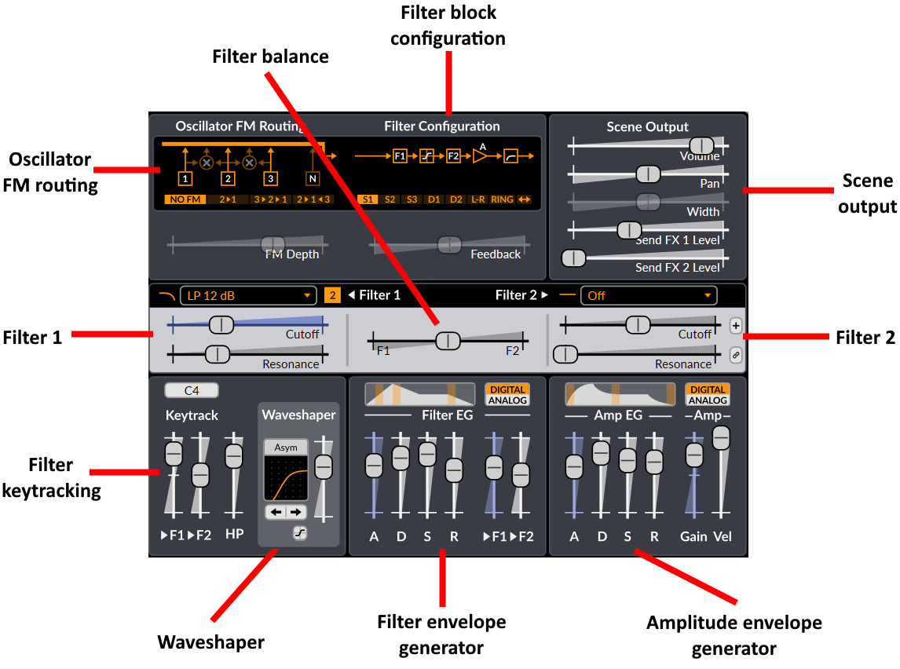
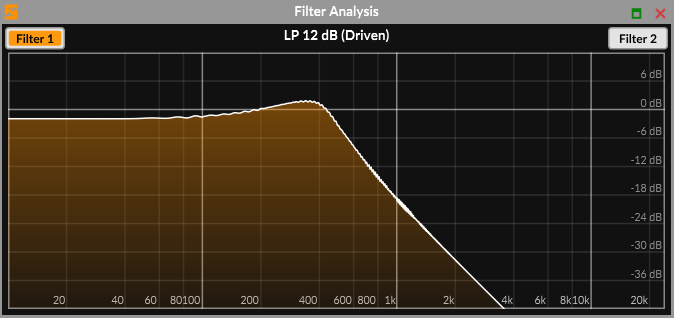

# Scene Controls

The UI of the scene section can also be further divided into two parts:

-   Sound generation
-   Sound shaping

The sound is generated and mixed in the sound generation section. After that, it
goes through the sound shaping section.

## Sound Generation

This is where the sound is born. The oscillators generate waveforms
according to the notes played. They are then summed up in the mixer.

### Oscillators

**1/2/3-buttons** – Chooses the active oscillator for editing. You can right-click on one of them
and a context menu with the name, **Copy** and **Copy (with modulation)** options will show up.

**Display** – Shows the active waveform. When the **Wavetable** or **Window** oscillator
is used, it will also work as wavetable selector by clicking on the orange bar or on the straight arrow buttons
to cycle through them. When the selected oscillator in the display is muted, the waveform will be semi-transparent.

**Type** – Oscillator type. Chooses which algorithm is used for the
oscillator. Available options are:

-   Classic
-   Modern
-   Wavetable
-   Window
-   Sine
-   FM2
-   FM3
-   String
-   Twist
-   Alias
-   S&H Noise
-   Audio Input.

See [Oscillators](#oscillator-algorithms) in the Technical Reference section for more information.

**Pitch & Octave** – Controls the pitch for this particular oscillator.
Its context menu can be used to extend its range, or to set the pitch to **Absolute** mode, which makes the pitch shift
in absolute frequency as opposed to relative to the note that is being played.

**Keytrack** – When disabled, the oscillator will play the same pitch
regardless of the key pressed. This button can be right-clicked to toggle its state across all
oscillators in the scene.

**Retrigger** – If active, the oscillator and all its unison voices will always start immediately
at the same phase position. This is useful for snappy sounds where you want the
attack to sound exactly the same each note. This button can be right-clicked to set its state across all
oscillators in the scene.

**Other** - The rest of the sliders from the oscillator editor are specific to each
oscillator type. See [Oscillators](#oscillator-algorithms) in the
Technical Reference section for more information.

### Mixer

#### Mixer Channels

Excluding the **Pre-filter Gain** (slider on the right), the Mixer has 6 channels (sources) from left to right:

-   **Oscillators 1, 2, 3**

-   **Ring Modulation of 1x2, 2x3** – The source of these two channels is **digital ring modulation** from the oscillators.
    This type of RM is a bit different from the traditional carrier-modulator style ring modulation.
    Digital ring modulation is simply the result of multiplying the output of oscillators 1 and 2,
    or 2 and 3.
-   **Noise Oscillator**

#### Channel Parameters

Each channel has the following controls:

-   **M** – Mute. You can of course have multiple channels muted at the same time, but you can also keep only the channel
    you mute muted by holding down **Ctrl / Cmd** and clicking on the desired mute switch.

-   **S** – Solo (only play channels that have solo active). You can have multiple channels in solo at the same time, or
    only one at a time by holding down **Ctrl / Cmd** and clicking on the desired solo switch.

-   **Triple Orange Box** (Filter routing) – Chooses which filter the channel is routed to.
    The left position routes the channel output to filter 1, the right position
    routes it to filter 2, while the middle position, which is selected
    by default, routes it to both.
    However, this setting will only route the channel output to filter
    1 if a **serial** filter block configuration is used, since the
    audio will then go through the second one in the filter block anyways.
    If any other configuration than serial is used, the audio will then
    be routed to both filters, as expected.

-   **Slider** – Gain control for each input.

### Other Sound Generation Parameters

**Pitch & Octave** – Controls the pitch for the entire scene. Affects
the filter key-tracking and the keytrack modulation source as well. The
range of the slider can be extended using the context menu.

**Portamento** – Portamento is when a new note will slide in
pitch from the pitch of the last played note. This setting determines how
long the slide will be. A setting of 0 disables Portamento. This parameter can be
tempo-synced.

Portamento has some interesting options accessible in its context menu:

-   **Constant rate** - If this option is enabled, the time to cover **one octave** is
    defined by the Portamento slider value. From there on, gliding between 2 octaves
    for instance will take twice as long, and so on.
    By default, this option is disabled, so the **glide rate**
    is proportional to the distance between the two keys, making it so that it
    always takes the same time to glide between **any two keys**.
-   **Glissando** - If this option is enabled, the pitch slide will be quantized
    to the scale degrees.
-   **Retrigger at scale degrees** - If this option is enabled, the FEG and AEG
    (see [Envelope Generators](#envelope-generators)) will be triggered each time the portamento
    slide crosses a scale degree.
-   **Curve options** - You can choose between a **Logarithmic**, **Linear** or **Exponential**
    portamento curve. By default, the portamento slide follows a linear curve.

**Osc Drift** – Applies a small amount of instability to the pitch of
all oscillators, making them subtly detuned. Although the parameter is
shared, the randomness of the instability effect is independent for all
oscillators and all the unison voices of each oscillator. By right-clicking
on this control, you can choose to also randomize the pitch at the very start of
the note by enabling the **Randomize initial drift phase** option.

**Noise Color** – Affects the frequency spectrum of the noise
generator. The middle position results in white noise. Moving the slider
to the left emphasizes low frequencies while moving it to the right emphasizes high frequencies.

**Bend Depth** – Pitch Bend Depth Up/Down. Controls the range of the
pitch bend wheel, in semitones.

This control can be extended with the dedicated option in its context menu. It enables
type-ins of fractions and cents for configuring microtonal pitch-bends of arbitrary size within the range
of 24 semitones.

**Play Mode** – Chooses how multiple notes are handled. Poly will allow
multiple notes to be played simultaneously, while Mono will only let the last note
play. Latch will continuously play the last played note (mono).

Mono has two possible modifiers:

-   **Single Trigger EG (ST)** means that the two envelope generators are
    not restarted when sliding between two notes (two notes that overlap
    in time)
-   **Fingered Portamento (FP)** means that portamento is only applied when
    sliding between notes and not when there is time between the played
    notes.

When **Play Mode** is set to one of the Poly modes, the context menu of that button list will display
additional options related to the voice allocation for a key:

-   **Stack Multiple** - Selected by default. Surge XT will play the replayed note on a new voice, in a cyclic manner
    known as round-robin.
-   **Reuse Single** - Selecting this option will make Surge XT allocate the replayed note to the same voice with which
    that note was previously played.

When **Play Mode** is set to one of the Mono modes, the context menu of that button list will display
additional options related to mono notes:

-   **Note Priority**

    -   **Last note priority** - Will play the latest note when multiple notes are played together
    -   **High note priority** - Will play the highest note when multiple notes are played together
    -   **Low note priority** - Will play the lowest note when multiple notes are played together
    -   **Legacy note priority** - When multiple notes are played together, it will play the latest note once hit and play
        the highest remaining note once released.

-   **Envelope Retrigger Behavior**

    -   **Reset to zero** - Selected by default. The envelopes will immediately reset to the beginning of the attack stage
        when pressing a note.
    -   **Continue from current level** - Selecting this option will make the envelopes start at the level they were left
        off from the previous note.

-   **Sustain pedal in mono mode**
    -   **Sustain pedal holds all notes (no note off retrigger)** - If sustain is engaged and multiple notes are hit then
        held one after the other, Surge XT will stay on the latest note when releasing that note instead of switching to the
        previous note.
    -   **Sustain pedal allows note off retrigger** - If sustain is engaged and multiple notes are hit then held one after
        the other, Surge XT will switch to the previous note when the latest note is released.

## Sound Shaping

### Filter Controls

**Filter Block Configuration** – Chooses how the filters, waveshaper and
the gain stage are connected together. Note that only the Stereo and Wide configurations
will output a stereo signal.

-   **Serial 1** - The signal from the Mixer goes into Filter 1, then into the Waveshaper, then into Filter 2, then the
    Amplifier which contains the Amplifier Envelope Generator (AEG), before going through the Scene Highpass and to the final
    Scene Output section.

-   **Serial 2** - The signal path is the same as with **Serial 1**, with the addition of a feedback path going from the
    output of the Amplifier back into Filter 1.

-   **Serial 3** - The signal path is the same as with **Serial 2**, but Filter 2 is in the feedback loop, which is after
    the signal is being tapped from the Amplifier instead of before.

-   **Dual 1** - The signal from the Mixer is sent to both Filter 1 and Filter 2 in parallel. The outputs from both filters are
    then summed, then sent to the Waveshaper, then into the Amplifier, and finally in the Scene Highpass before the Scene Output section.
    Feedback is again tapped at the output of the Amplifier and goes back into both filters (it is summed with the output from the Mixer).

-   **Dual 2** - The signal path is the same as with **Dual 1**, except that the Waveshaper is only applied to Filter 1
    before its output is summed with the output from Filter 2.

-   **Stereo** - The signal path is the same as with **Dual 1**, except that Filter 1 is always on the left channel and
    Filter 2 is always on the right channel.

-   **Ring** - The signal path is the same as with **Dual 1**, except that the outputs from Filter 1 and 2 are multiplied
    (ring modulated) together instead of being summed before continuing onwards to the Waveshaper.

-   **Wide** - The signal path is the same as with **Serial 2**, except it is being doubled for a full stereo signal path.

**Feedback** – Controls the amount (and polarity) of output that's fed
back into the input of the filter block. It has no effect when using filter
block configurations without a feedback path.

Note:
Be careful with your monitoring volume when using feedback. It's easy to
make really loud high-pitched noises by mistake if you're not familiar
with how the synth reacts to feedback.

Don't let this scare you though. There's a lot to be gained from proper
and creative use of feedback. Changing the character of filters, making
filters interact together, making basic physical models, making sounds
that are just about to break apart. It is these things that make
Surge XT truly special.

**Filter Balance** – Controls how the two filters are mixed. The
behavior depends on the filter block configuration.

**Type** – Selects the type of the filter. There are [numerous types available](#filters).
You can disable the filter in question here by unchecking the **Enabled** option below the different
filter type categories.

**Subtype** – Selects variations of each filter type. The difference can
vary from subtle to radical depending on how the filter is used. See
[Filters](#filters) in the Technical Reference section
for information regarding subtypes of each filter type. It is displayed
as a number next to the filter type (when available).

**Cutoff** – Controls the cutoff frequency of the filter. When tweaked, while its tooltip
will show frequency in Hz, it will also show its approximate MIDI note value,
very useful when using the filter for melodic and tuning purposes.
You can also right-click on this control and choose the option
**Reset cutoff to keytrack root** which makes it very easy to tune filters
when using filter keytracking. Finally, the **Apply SCL/KBM tuning to filter cutoff**
option can be accessed when the **Apply tuning after modulation** option is enabled in the Tuning menu.
See the [microtuning](#microtuning) section for more information.

**Resonance** – Controls the amount of resonance of the filter.

**Filter Analysis** – To open the Filter Analysis window, simply click on the small button above the filter
balance control. It will display the current filter response according to the current type, subtype, cutoff and
resonance settings. You can switch to the other filter by using the corresponding buttons. You can also drag on the
display horizontally to change the displayed filter's cutoff frequency, and drag vertically to change its resonance.

**Filter 2 Offset Button** (small "+" button to the right of the filter parameters) – When active,
the cutoff frequency will be set relative to filter 1.
This includes any modulations (including the hardwired FEG depth &
keytracking). Filter 2's cutoff frequency slider **becomes an offset** setting relative
to filter 1's cutoff frequency.

**Resonance Link Button** (small button, filter 2 only) – Makes the slider
follow filter 1's resonance slider setting.

**Keytrack \> F1/F2** – Controls how much the pitch of a note affects the
cutoff frequency of the filter. A setting of 100% means the filter
frequency will follow the pitch harmonically.

### Envelope Generators

There are two envelope generators connected to the filter block.

On the left is the Filter Envelope Generator (Filter EG).
It is hardwired to the two filters, whose depth is set by the **\>F1** and **\>F2** sliders.

On the right is the Amplifier Envelope Generator (Amp EG). This one is hardwired to the gain
stage of the filter block.

_The ADSR envelope structure_

The envelope generators are of the 4-stage ADSR type. This is the most
common form of EG used in synthesizers and it is named after its four
stages **Attack**, **Decay**, **Sustain** and **Release**. If you're new
to synthesizer programming the illustration should give you a good idea
how they work. The thing you need to remember is that after going
through the attack & decay stages the envelope will stick in the sustain
stage until the key is released.

**Attack**, **Decay** and **Release** are time-based parameters and can be tempo-synced by right-clicking on one of
those sliders. You will also find an option to tempo-sync those three controls at once for each envelope generator.

Above the envelope stage controls is a graphic representation of the
ADSR structure.

If the envelope mode is set to **Digital**, there will be small adjustable orange fields
on the graphic. Dragging them horizontally allows you to choose the curvature of the different stages of the envelope.

If the envelope mode is set to **Analog**, the curvature of the different stages
will automatically be set to a shape that tries to emulate analog behavior.

### Waveshaper

The waveshaper module now features 43 waveforms and is an integral part of Surge's audio path.

**Waveshaper selector** - Menu allowing you to change the type of the non-linear wave-shaping.
Alternatively, you can also use the arrow buttons, left-click and drag, or scroll with the mouse wheel
over the waveshaper display to cycle through the different shapes.

**Waveshaper drive** – The vertical slider to the right of the waveshaper display. Sets the drive amount
of the waveshaper. This control can be extended.

**Waveshaper Analysis window** - This panel can be opened by clicking on the small icon at the
bottom of the waveshaper module. It allows you to visually preview the output of the waveshaper
at different input levels, which can be controlled with the waveshaper's **Drive** control.

### Other Sound Shaping Parameters

**Keytrack root note** – Sets the root key of the filter keytracking and the
keytrack modulation source. At the root key, the keytrack modulation
source will have the value zero. Above/below it it will have
positive/negative modulation depending on the distance to the root key
in octaves. This parameter does not affect the oscillator pitch.

**Keytrack amount sliders** - Sets the amount of filter keytracking applied to
each filter.

**HP** – Controls the scene high-pass filter (scene parameter). This parameter can be disabled, which will remove it
from the audio path. You also have a choice for filter slope between **12**, **24**, **36**, **48** dB/Octave.

**FM configuration** – Chooses how oscillator FM (frequency modulation) is
routed.

**FM depth** – Sets the depth of the oscillator FM.

**Amp Vel.** - Controls how the **Amp Gain** scales with velocity. This
is neutral at the maximum position. Other settings provide attenuation
at lower velocities, thus this setting will never increase the **Amp
Gain** parameter by velocity.

**Amp Gain** – Controls the gain element inside the filter block.

### Scene Output

The output stage is located after the filter block in the audio-path. As
it's outside the filter block-structure changing the gain here doesn't
have any affect on the timbre of the voice (unlike the previous
gain-control which may affect how the feedback and wave-shaping acts),
but it can still change the timbre of the effect section if non-linear
effects (like distortion) are used.

**Volume** – Scene volume control. You can choose to hard clip the scene output at **+18 dBFS** (default),
**0 dBFS** , or to **disable hard clipping** by right-clicking this control and choosing the desired option.

**Pan** – Pan/balance control

**Width** – The amount of stereo spread (only present for the **Stereo** and
**Wide** filter block configurations)

**Send FX 1/2 or 3/4 Level** – Send levels to send slot 1 to 4 (scene parameters).
To display the send 3/4 levels, simply select one of those send FX units in the unit selector
(see [Effect Unit Selector](#effect-unit-selector)).
