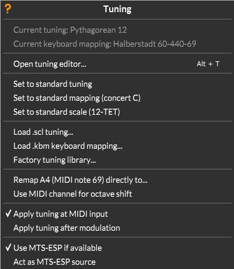

# Microtuning

Surge XT has become known as a good synth for microtuning. It features full keyboard microtuning support using two
different modes, **Scala SCL/KBM** and **MTS-ESP**, as well as from its internal **Tuning Editor**. Here we will focus
on explaining the options in Surge XT's **Tune** menu, one by one. If you want to learn more about the different
tuning workflows, and the pros and cons of each of them, please visit our [Tuning Guide](../tuning-guide/#methods)

While using either of the modes, the **Tune** and **Filter Cutoff** menus will dynamically change to reveal the relevant
tuning-related options. Also note, with any tuning mode active, left-clicking the **Tune** label in the [status area](#status-area)
simply turns the tuning mode on or off. To access the menu from this state, right-click instead

## Default

By default, Surge XT tunes incoming MIDI notes the same way (nearly) every other software instrument does:
To 12 equal divisions of an octave (12edo for short), with middle C tuned to 261.626Hz as a reference note (which makes A=440).

From this default state, opening the tuning menu shows you this:

_The tuning menu in default mode_

The options near the top pertain to the Tuning Editor and SCL/KBM mode of retuning, the ones at the bottom to MTS-ESP.
Let's go through the menu options one by one, and also briefly describe the advantages of each tuning method.

## Tuning Editor

The first option on the previously shown menu opens Surge XT's built in tuning editor, which can
change the intonation of the current Surge XT instance (and other instances and instruments too,
via MTS-ESP, more on that later). Its function is described in more detail in our [Tuning Guide](../tuning-guide/#tuning-editor)

## Scala SCL/KBM Mode

Scala SCL/KBM uses small plain text files to give tuning information to an instrument. For more
general information about this method, refer to our [Tuning Guide](../tuning-guide/#scala-files)

Once in SCL/KBM mode, the tuning menu looks like this:

_The tuning menu with an SCL/KBM pair loaded_

-   **Current tuning** - Once an SCL file has been loaded, the description line of the tuning will appear here.

-   **Current keyboard mapping** - Once a KBM has been loaded, the file name of the keyboard mapping will appear here.

-   **Open tuning editor…** - As mentioned above, opens the [Tuning Editor](../tuning-guide/#tuning-editor)

The following three options are grayed out in the default menu, but become available once SCL/KBM files are loaded.
Their purpose is returning the instrument to standard intonation settings:

-   **Set to standard tuning** - Resets the currently loaded SCL tuning table to 12 tone equal temperament, keeping
    the currently loaded KBM.

-   **Set to standard mapping (Concert C)** - Resets the currently loaded KBM such that the 1/1 of the loaded SCL is
    mapped to middle C.60 at 261.626 Hz, keeping the current SCL.

-   **Set to standard scale (12-TET)** - Resets both of the above.

The next three options are for loading SCL/KBM files. These can also be imported via drag-and-drop
anywhere on the Surge XT interface:

-   **Load .scl tuning** - Loads .scl files.

-   **Load .kbm keyboard mapping** - Loads .kbm files.

-   **Factory tuning library** - Clicking on this option will open the system file browser at the location of the
    included Surge XT factory SCL/KBM content.

Then come some auxiliary options:

-   **Remap A4 (MIDI note 69) directly to…** - Instead of using a _.kbm_ file, this option lets you directly type in the frequency (in Hz)
    of MIDI note 69, A above middle C.

-   **Use MIDI channel for octave shift** - Enables users of generalized array keyboard controllers (such as the
    Lumatone) to map large tuning gamuts and equal-temperaments contiguously across all 16 MIDI Channels.

Then follow two options which determine how Surge XT's internal modulators will relate to the tuning information:

-   **Apply tuning at MIDI input** - Selected by default. When checked, the tuning is only applied
    to MIDI input, but pitch modulation is in 12-tone equal temperament amounts. So for example, a pitch bend of 2 always means
    200 cents, whether or not your chosen tuning has a 200 cent interval.

-   **Apply tuning after modulation** - When checked, pitch modulation is instead tuned to the loaded scale.
    For instance, this means that a pitch bend of 2 always lands on the same frequency as the note two steps up,
    even in tunings with unequal step sizes.

Since choosing between one of the two options explained above fundamentally changes how a patch would play in tuned mode,
this setting is stored at the patch level.

## MTS-ESP Mode

**MTS-ESP** is a system in which all software instruments are retuned simultaneously by one central interface.
To learn more about what MTS-ESP is, visit our [Tuning Guide](../tuning-guide/#mts-esp)

In MTS-ESP mode, the tuning menu will look like this:

_The Surge XT Tuning menu in MTS-ESP mode._

The MTS-ESP in parentheses at the top indicates that an MTS-ESP Source is present.

-   **Current tuning** - Displays the name of the currently active tuning in MTS-ESP.

-   **Use MTS-ESP if available** - This option was already visible in the previous menus. If this option is checked,
    when Surge XT detects the presence of an MTS-ESP Source, its tuning will be determined by that Source. If no source is present,
    Surge XT will go back to the default or SCL/KBM modes. This settings applies across all Surge XT instances that are loaded after
    it was checked.

-   **Act as MTS-ESP source** - When this option is checked, the current instance of Surge XT will become the MTS-ESP source.
    Any **SCL/KBM** loaded (or any changes applied from the **Tuning Editor**) in the current instance, will be applied to any
    MTS-ESP compatible instruments present, for example into all other instances of Surge XT (provided the "Use MTS-ESP..." option
    above was checked). The MTS-ESP specification only allows one source to exist at a time, so this option will be
    grayed out if another source is already present.

-   **Re-Initialize MTS-ESP Library and IPC** - Since there can only be one MTS-ESP source at a time, it's important that
    sources properly de-register themselves when closing. If that doesn't happen (say if the host crashes), that can lead to
    some problems. Pressing this button and re-starting your host session should solve these.

-   **Disconnect as client from MTS-ESP** - Provides a way to disable MTS-ESP in the current Surge XT instance,
    even when a Source is present, whereupon the individual instance will return to SCL-KBM mode.

-   **Query tuning at note on only** - This option is only relevant if you're using an MTS-ESP source which can change tunings
    on-the-fly, like for example [ODDsounds MTS-ESP Master](https://oddsound.com/mtsespsuite.php).
    If the MTS-ESP tuning changes while notes are held, a client can choose whether to adjust those notes immediately (which will
    sound like pitch bends) or to wait until the next note-on. The former behavior (known as Dynamic Microtuning, the
    default for Surge XT), can enable some unheard-of musical gestures like morphing gradually from one tuning to the next.
    That may not always be what you want though, which is why this option exists. With it enabled, held notes
    keep their pitch when the tuning changes.
