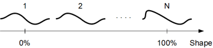
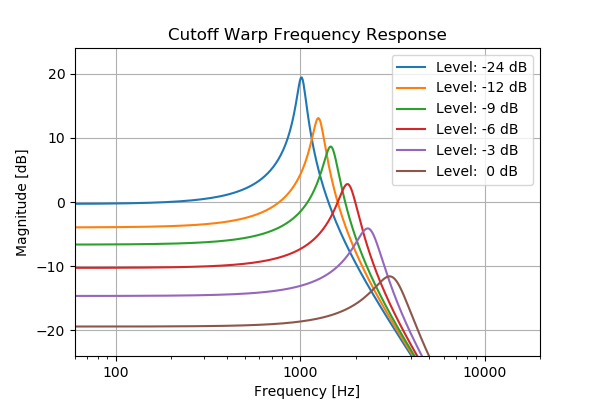

# Technical Reference

## Surge XT Hierarchy

### Overview

_Block diagram of the synthesizer engine._

Illustration shows an overview of the synthesizer engine of Surge XT.

### Voices

_Block diagram of a synthesizer voice_

Illustration shows most audio and control-paths of a single
voice. Not all processing elements of the voice are shown in the
diagram.

### LFOs

Each voice has 6 configurable LFOs and each scene has an
additional 6 configurable LFOs, making each voice effectively capable of receiving modulation from
a total of 12 LFOs.

_LFO block diagram_

### Modulation Routing Details

How the modulation routing works internally isn't something you normally
have to think about when using Surge XT. Just activate the modulation mode
with the desired source and see which of the sliders that become blue.
Nonetheless, it is useful to know which limitations are present and why.

_Modulation routing behind the scenes_

The thing to remember is that voice modulation sources can't
modulate scene parameters, global/effect parameters or parameters from scene LFOs, since these are two
distinctly different modulation paths. Other than that it should be pretty straightforward.

## Oscillator Algorithms

Surge XT provides 12 different oscillator algorithms, each capable of
generating sound in different ways with a different set of controls.
They're not just different waveforms.

### Classic

The Classic oscillator algorithm consists of a main oscillator that can
generate a pulse wave, a sawtooth wave, a dual-saw wave or anything in
between.

A sub-oscillator provides a pulse-wave one octave below the main
oscillator. Changing the pulse-width of the sub-oscillator does affect
the main oscillator as well, as they will both change levels at the same
time except that the main oscillator does it twice as often.

The Classic algorithm is also capable of oscillator self-sync. Note that
the sub-oscillator will be used as the base-pitch for the sync.

The algorithm provides unison at the oscillator-level with up to 16
instances. Unlike the Wavetable oscillator, the cost of unison in terms
of CPU usage for the Classic oscillator is quite modest. The unison
oscillator voices are affected by the scene level Osc Drift parameter
independently.

|               |                                                                                                                                                        |                                                                      |
| ------------- | ------------------------------------------------------------------------------------------------------------------------------------------------------ | -------------------------------------------------------------------- |
| Shape         | Waveform shape. -100% = pulse, 0% = saw, 100% = dual saw.                                                                                              | -100 .. 100 %                                                        |
| Width 1       | Duty cycle (pulse) or relative phase (dual saw).                                                                                                       | 0 .. 100 %                                                           |
| Width 2       | Squeezes or expands the waveform in a different way. If positive, the two latter halves of two consecutive single cycles get squeezed closer together. | 0 .. 100 %                                                           |
| Sub Mix       | Sub-oscillator mix, 0% = only main, 100% = only sub.                                                                                                   | 0 .. 100 %                                                           |
| Sync          | Oscillator hard sync.                                                                                                                                  | 0 .. 60 semitones                                                    |
| Unison Detune | Detuning of unison oscillators. Can be extended. Can be switched between relative (default) and absolute.                                    | 0 .. 100 cents 0 .. 1200 cents 0 .. 16 Hz 0 .. 192 Hz |
| Unison Voices | Number of oscillators used for unison (1 = disabled).                                                                                                  | 1 .. 16                                                              |

### Modern

The Modern oscillator algorithm is a multi-waveform oscillator which creates pulse, 
triangle, saw and sine waveforms with unison and sub-oscillator capabilities. 
It is based on the differentiated polynomial waveform algorithm, from 
[this paper](https://www.researchgate.net/profile/Juhan-Nam/publication/224557976_Alias-Suppressed_Oscillators_Based_on_Differentiated_Polynomial_Waveforms/links/573f274d08ae9ace84133dc9/Alias-Suppressed-Oscillators-Based-on-Differentiated-Polynomial-Waveforms.pdf).
The pulse, triangle and sawtooth waveforms are clean and result in very low aliasing, while the sine produces some 
additional harmonics.

Three parameters labeled **Sawtooth**, **Pulse** and **Triangle** control relative mixes of those waveforms, while
the **Width** parameter controls the pulse width for the Pulse wave. **Sync** offsets the pitch of the oscillator against the pitch of the internal reference oscillator
while resetting the phase of the main oscillator to the phase of the reference oscillator, to achieve typical hard sync effects.
Unison controls work like in other Surge XT oscillators.

|                      |                                                                                                                     |                                                                      |
| -------------------- | ------------------------------------------------------------------------------------------------------------------- | -------------------------------------------------------------------- |
| Sawtooth             | Amplitude of the Sawtooth waveform.                                                                                 | -100 .. 100 %                                                        |
| Pulse                | Amplitude of the Pulse waveform.                                                                                    | -100 .. 100 %                                                        |
| Triangle/Sine/Square | Amplitude of the third waveform, can be right-clicked (for more information, see below this parameter list).        | -100 .. 100 %                                                        |
| Width                | Duty cycle of the Pulse waveform.                                                                                   | 0 .. 100 %                                                           |
| Sync                 | Oscillator hard sync.                                                                                               | 0 .. 60 semitones                                                    |
| Unison Detune        | Detuning of unison oscillators. Can be extended. Can be switched between relative (default) and absolute. | 0 .. 100 cents 0 .. 1200 cents 0 .. 16 Hz 0 .. 192 Hz |
| Unison Voices        | Number of oscillators used for unison (1 = unison disabled).                                                        | 1 .. 16                                                              |

#### Third Waveform Parameter

The third waveform parameter (labeled "Triangle" by default) is special in that
it has several waveform options to choose from. If you right-click it, you can see
that it can generate a triangle wave, a sine wave, or a square wave. This control
can also become a sub-oscillator, playing at half the frequency of the other two waveforms.
Importantly, in sub-oscillator mode, the third waveform does **not** participate in unison,
which is in contrast to the Sub Mix parameter in Classic oscillator. Finally,
there is also an option for the sub-oscillator to bypass hard syncing against the internal reference oscillator.

### Wavetable

A wavetable in Surge XT consists of up to 512 single-cycle waveforms (frames), each of which can consist of up to 4096 samples.
Using the **Morph** parameter it is possible to sweep across the waveforms
in the wavetable.

The individual waves are equidistant in the table. When the shape
setting is between two individual waves, they will be mixed to ensure
smooth travel. You can't edit the wavetable contents directly within
Surge XT, but it is possible to generate custom wavetables with external
software.

Surge XT can also import wavetables containing a **clm** block to indicate loop size (as used by Serum),
a **cue** block (as used by various products including Native Instruments) and a **smpl** block.
Wavetable files without loop information are loaded as one-shots.

This effectively lets you import various wavetables from other products such as **Serum**.
All those 3rd party wavetables that have been tested in Surge XT have been reported to work flawlessly.

To import custom wavetables, use the wavetable selection bar at the bottom of the oscillator display. This is where you can also
[download additional wavetable content](https://github.com/surge-synthesizer/surge-synthesizer.github.io/wiki/Additional-Content).

Alternatively, you can simply drag-and-drop any compatible wavetable file anywhere over the Surge interface to load it.

You can even create your own wavetables for Surge using [wt-tool](https://github.com/surge-synthesizer/surge-synthesizer.github.io/wiki/Creating-Wavetables-For-Surge) or [WaveEdit](https://github.com/surge-synthesizer/surge-synthesizer.github.io/wiki/Creating-Wavetables-With-WaveEdit).

Once a wavetable is loaded, you can also export it using the wavetable selection bar.

Then, by modulating the **Morph** parameter, it is possible to create motion,
dynamic response to playing and sonic variation. If you want to select an exact frame, drag the slider while holding
down Ctrl/Cmd, which allows you to snap to exact values in the table, useful for switching between distinct
shapes, for example.

What real-life property, if any, the **Morph** parameter is supposed to mirror depend on
each wavetable. Common cases are:

-   Analyzed from sounds that evolve over time. The behavior can be
    recreated by letting shape increase over time by modulation. It's
    the most common among the analyzed wavetables.
-   Analyzed from static sounds over different pitches to capture the
    formant shift of a sound. The behavior can be recreated by
    modulating shape by the keytrack modsource.
-   A parameter of a mathematical equation.

In the end it's just a set of data and Surge XT doesn't care how it was
generated, all that matters is how it sounds.

The Wavetable oscillator has some interesting sonic characteristics. It
outputs the waveform in a stair-stepped fashion, making no attempts to
'smooth the steps' in the process, but does so in a manner that is
completely band-limited. This makes it similar in sound to 1980s era
wave-table synths and samplers which didn't use resampling but had
dedicated D/A-converters for each voice instead and changed the pitch by
varying the sample rate of the individual D/As.

The fact that the steps aren't smoothed causes an artifact known as
harmonic aliasing. This is not to be confused with inharmonic aliasing
which sounds somewhat similar to an AM-radio being tuned and is
generally nasty. Instead, this artifact will cause the harmonics of the
waveform to repeat themselves and fill up the entire audible spectra
even at low pitches, just like a square-wave would, preventing the
waveform from sounding dull. As this artifact is completely harmonic it
is also musically pleasing. Nonetheless, it may sound a bit out of place
on very smooth waveforms but the effect can be filtered out by a
lowpass filter in the filter block if desired. Some of the wave-tables,
such as the regular triangle wave, are large enough for this artifact to
never appear in the normally used range for this specific reason.

The important thing is that just like most other oscillators in Surge XT,
it doesn't output any inharmonic aliasing whatsoever or any audible
levels of interpolation-noise, two artifacts which has played a big part
in giving digital synthesizers a bad name.

For more information, you can read
[this article](https://github.com/surge-synthesizer/surge-synthesizer.github.io/wiki/Why-you-may-get-high-frequency-distortion-from-some-wavetables)
on Surge's wiki.

**For developers and advanced users**:

There is a reference for the .wt file-format used by the wavetables. It
is located at: `surgedata/wavetables/wt fileformat.txt`

|                 |                                                                                                                     |                                                                      |
| --------------- | ------------------------------------------------------------------------------------------------------------------- | -------------------------------------------------------------------- |
| Morph           | Interpolates between wavetable frames. 0% = first frame, 100% = last frame. Can be set to non-continuous. | 0 .. 100 %                                                           |
| Skew Vertical   | Vertical skew of the waveform.                                                                                      | -100 .. 100 %                                                        |
| Saturate        | Soft saturation of the waveform.                                                                                    | 0 .. 100 %                                                           |
| Formant         | Compresses the waveform in time but keeps the cycle-time intact.                                                    | 0 .. 60 semitones                                                    |
| Skew Horizontal | Horizontal skew of the waveform.                                                                                    | -100 .. 100 %                                                        |
| Unison Detune   | Detuning of unison oscillators. Can be extended. Can be switched between relative (default) and absolute. | 0 .. 100 cents 0 .. 1200 cents 0 .. 16 Hz 0 .. 192 Hz |
| Unison Voices   | Number of oscillators used for unison. 1 = disabled.                                                                | 1 .. 16                                                              |

### Window

The Window oscillator is another shot at wavetable
synthesis that is quite different from the previous wavetable algorithm.

The wave, which can be any wavetable included with Surge XT, is multiplied
by a second waveform, the window, which can be one of 9 waveform types
that are specifically made for the window oscillator. The formant
parameter controls the pitch of the wave independently of the window,
but as the wave is always restarted with the window, the pitch will
remain the same. Instead, the timbre of the sound will change
dramatically, much depending on which window is selected.

Unlike the Wavetable algorithm, the Window oscillator uses a more
traditional resampling approach which doesn't result in harmonic
aliasing.

|               |                                                                                                                                 |                                                                                     |
| ------------- | ------------------------------------------------------------------------------------------------------------------------------- | ----------------------------------------------------------------------------------- |
| Morph         | Selects a frame from the wavetable, without interpolation. 0% = first frame, 100% = last frame.  Can be set to continuous. | 0 .. 100 %                                                                          |
| Formant       | Adjusts pitch of the wavetable frame, independently from the pitch of the window.                                               | -60 .. 60 semitones                                                                 |
| Window        | Chooses the waveform used for the amplitude window.                                                                             | Triangle, Cosine, Blend 1, Blend 2, Blend 3, Sawtooth, Sine, Square, Rectangle |
| Low Cut       | Cutoff frequency of built-in highpass filter. Must be activated in context menu.                                           | 13.75 .. 25087.71 Hz                                                                |
| High Cut      | Cutoff frequency of built-in lowpass filter. Must be activated in context menu.                                            | 13.75 .. 25087.71 Hz                                                                |
| Unison Detune | Detuning of unison oscillators. Can be extended. Can be switched between relative (default) and absolute.             | 0 .. 100 cents 0 .. 1200 cents 0 .. 16 Hz 0 .. 192 Hz                |
| Unison Voices | Number of oscillators used for unison. 1 = disabled.                                                                            | 1 .. 16                                                                             |

### Sine

Quite unsurprisingly, this oscillator generates a sine waveform. However, there's a number of other interesting things this oscillator can do!

|               |                                                                                                                     |                                                                      |
| ------------- | ------------------------------------------------------------------------------------------------------------------- | -------------------------------------------------------------------- |
| Shape         | Various variants of sine wave achieved through quadrant masking, shifting and frequency doubling.                   | 1 .. 28                                                              |
| Feedback      | FM feedback amount. Can be extended.                                                                           | -100 .. 100 % -400 .. 400 %                                      |
| FM Behavior   | Chooses whether FM behaves like Surge 1.6.1.1 and earlier, or consistent with FM2/3 oscillators.                    | Legacy (before v1.6.2), Consistent with FM2/3                   |
| Low Cut       | Cutoff frequency of built-in highpass filter. Must be activated in context menu.                               | 13.75 .. 25087.71 Hz                                                 |
| High Cut      | Cutoff frequency of built-in lowpass filter. Must be activated in context menu.                                | 13.75 .. 25087.71 Hz                                                 |
| Unison Detune | Detuning of unison oscillators. Can be extended. Can be switched between relative (default) and absolute. | 0 .. 100 cents 0 .. 1200 cents 0 .. 16 Hz 0 .. 192 Hz |
| Unison Voices | Number of oscillators used for unison, 1 = disabled.                                                                | 1 .. 16                                                              |

### FM2

FM2 provides a miniature FM synthesizer voice in an oscillator that is
specifically tailored towards making nice and musical FM sounds. A
single sine carrier is modulated by two sine modulators, whose ratios to
the carrier are always integer thus the resulting waveform is always
cyclic. However, **M1/2 Offset** lets you offset the modulators slightly in
an absolute fashion, creating an evolving and pleasing detune
effect.

|             |                                                                                           |                                   |
| ----------- | ----------------------------------------------------------------------------------------- | --------------------------------- |
| M1 Amount   | Modulation amount of the first modulator                                                  | 0 .. 100 %                        |
| M1 Ratio    | Ratio of the first modulator to the carrier                                               | 1 .. 32                           |
| M2 Amount   | Modulation amount of the second modulator                                                 | 0 .. 100 %                        |
| M2 Ratio    | Ratio of the second modulator to the carrier                                              | 1 .. 32                           |
| M1/2 Offset | Absolute detuning of the modulators Can be extended.                                  | -10 .. 10 Hz -1000 .. 1000 Hz |
| M1/2 Phase  | Changes the initial phase of the modulators to give different variations of the waveform. | 0 .. 100 %                        |
| Feedback    | Modulation amount of the carrier to itself Extended mode (default) can be disabled.  | -400 .. 400 %   -100 .. 100 % |

### FM3

As a contrast to FM2, FM3 is the algorithm of choice for scraping paint
off the walls. The modulators have a larger range, the ratios can be
non-integer and there's a third modulator which has its rate set as an
absolute frequency.

|              |                                                                                          |                                                      |
| ------------ | ---------------------------------------------------------------------------------------- | ---------------------------------------------------- |
| M1 Amount    | Modulation amount of the first modulator                                                 | 0 .. 100 %                                           |
| M1 Ratio     | Ratio of the first modulator to the carrier, can either be extended or absolute.         | 0.0 .. 32.00 1/32.0 .. 32.0 ~ 8 Hz .. 24 kHz |
| M2 Amount    | Modulation amount of the second modulator                                                | 0 .. 100 %                                           |
| M2 Ratio     | Ratio of the second modulator to the carrier, can either be extended or absolute.        | 0.0 .. 32.00 1/32.0 .. 32.0 ~ 8 Hz .. 24 kHz |
| M3 Amount    | Modulation amount of the third modulator                                                 | 0 .. 100 %                                           |
| M3 Frequency | Frequency of the third modulator                                                         | ~ 14 Hz .. 25 kHz                                    |
| Feedback     | Modulation amount of the carrier to itself Extended mode (default) can be disabled. | -400 .. 400 %   -100 .. 100 %                    |

### String

The String oscillator uses a physical modeling technique where excitation sources
are sent into a tuned delay line with feedback, with various filters inline
(based on the original Karplus-Strong algorithm). The oscillator runs two strings
at all times which can be detuned from each other and individually damped.

To make the model create sound, you need to excite it. We have two classes of
excitation modes, **Burst** and **Constant**. In Burst mode, the delay line is loaded with a pattern
before a note is played, and then no further signal is added to the oscillator.
Think of this as emulating a plucked string. In Constant mode, the delay
line is also pre-loaded, but the signal continues to be applied for as long as you hold the key.
Think of this as emulating a bowed string. In almost all cases, Continuous excitation modes would be used
along with modulation of **Exciter Level** parameter, in order to emulate bow pressure, and so on.

Exciter modes provide various waveforms - noise, pink noise, ramp, etc. - which you can use to excite the strings,
leading to different timbres. Surge XT's audio input can also be used as an exciter signal!

|                 |                                                                                                                                                                                           |                                                                                  |
| --------------- | ----------------------------------------------------------------------------------------------------------------------------------------------------------------------------------------- | -------------------------------------------------------------------------------- |
| Exciter         | Determines mode and waveform used to excite the string.                                                                                                                                   | Burst, Constant                                                                  |
| Exciter Level   | Determines how strongly the string gets excited. Oversampling and interpolation can be configured in its context-menu.                                                          | -100 .. 100 %                                                                    |
| String 1 Decay  | Sets the decay time of the first string (amount of delay line feedback).                                                                                                                  | -100 .. 100 %                                                                    |
| String 2 Decay  | Sets the decay time of the second string (amount of delay line feedback).                                                                                                                 | -100 .. 100 %                                                                    |
| String 2 Detune | Adjusts tuning of the second string. Can be extended. Can be switched between relative (default) and absolute.                                                                  | -100 .. 100 cents -1200 .. 1200 cents -16 .. 16 Hz -192 .. 192 Hz |
| String Balance  | Adjusts mix between the two strings.                                                                                                                                                      | -100 .. 100%                                                                     |
| Stiffness       | Applies lowpass (left) and highpass (right) filters in the feedback loop. Results in inharmonic timbres at the extremes. The stiffness filter can be configured in its context-menu. | -100 .. 100%                                                                     |

### Twist

This oscillator imports a rather famous Eurorack macro oscillator into Surge XT, based on Émilie Gillet's
device. You can read the manual for the hardware module on which this oscillator is based
[here](https://mutable-instruments.net/modules/plaits/manual).

This implementation presents all 16 oscillator modes and the controls are dynamically renamed
appropriately for every model. Core differences between the hardware module and Surge XT's implementation are:

1. By default, the LPG in the module is disabled, but by activating the LPG level and decay sliders with (right-click, then Activate),
   the LPG will be triggered per voice for each received MIDI note.

2. By default, you can mix between the main and the auxiliary oscillator outputs with the **Mix** parameter.
   You can also right-click the Mix parameter and enable **Pan main and auxiliary signals** option,
   in which case -100% value is Main to left/Aux to right, +100% is Main to right/Aux to left, and 0% is an even mix of both signals sent to both left and right.
   Do note that for this to be audible, you have to be in one of stereo filter configuration modes.

Twist can be more CPU demanding than most other Surge XT oscillator algorithms.
Judiciously using maximum polyphony setting and being careful with Amp EG release times
can go a long way in minimizing the CPU usage, thus making robust patches.

### Alias

The Alias oscillator purposefully ignores a few decades of research into making digital signals with low or no
aliasing, and does all the things you shouldn't do, so it purposefully sounds digital, gross, broken, terrible,
yet awesome all at once.

|               |                                                                                                                     |                                                                      |
| ------------- | ------------------------------------------------------------------------------------------------------------------- | -------------------------------------------------------------------- |
| Shape         | Sets the oscillator waveform.                                                                                       | See explanation [below](#shape)                                      |
| Wrap          | Mangles the waveform by amplifying it, then making it wrap around from the other side instead of hard clipping.     | -100 .. 100 %                                                        |
| Mask          | Sets a 8-bit bitmask applied to the waveform.                                                                       | -100 .. 100 %                                                        |
| Threshold     | Adjusts the turning point (ramp), duty cycle (pulse) or wavetable readout offset (others) of the waveform.          | -100 .. 100 %                                                        |
| Bitcrush      | Sets the amount of bitcrushing applied to the waveform.                                                             | 1.00 .. 8.00 bits                                                    |
| Unison Detune | Detuning of unison oscillators. Can be extended. Can be switched between relative (default) and absolute. | 0 .. 100 cents 0 .. 1200 cents 0 .. 16 Hz 0 .. 192 Hz |
| Unison Voices | Number of oscillators used for unison, 1 = disabled.                                                                | 1 .. 16                                                              |

#### Shape

**Shape** parameter (comes in the form of a menu) is very important and is worth explaining in more detail,
as it allows you to choose the source used for the Alias algorithm.

In addition to the more regular shapes (such as Sine, Ramp, Pulse and Noise), Surge XT's audio input can be also used.

Going further, there is Additive, which allows you to create a custom waveform by adjusting amplitudes of up to 16
harmonics, accessible by clicking on the Edit button that appears in this mode:

This editor works in a similar way to the step sequencer editor, however there are some additional options available when right-clicking:

-   **Shapes** - Partial level presets which roughly represent different wave shapes, including a random option.
-   **Absolute** - Sets the level of all the partials in the positive range.
-   **Invert** - Flips the partial levels vertically.
-   **Reverse** - Flips the partial levels horizontally.

Additionally, you can also use **Quadrant Shaping** waveforms as a source, which are also found in the
[Sine](#sine) oscillator.

Finally, we have various **Memory from...** options:

-   **This Alias Instance** - Generates a waveform based on reading memory associated with the currently selected instance of Alias.
-   **Oscillator Data** - Generates a waveform based on reading memory associated with general oscillator data.
-   **Step Sequencer Data** - Generates a waveform based on reading memory associated with step sequencer data.
-   **Scene Data** - Generates a waveform based on reading memory associated with general scene data.
-   **DAW Chunk Data** - Generates a waveform based on reading memory that serves as additional DAW chunk data (various non-automatable parameters and settings).

**Note:** When using **Memory From...** as a source, there is no guarantee that the resulting waveform
will be consistent, as memory data can vary depending on a number of things: the DAW used, the particular Surge XT instance, rebooting your machine, and so on.
Thus, it's good practice to bounce the audio output from Surge XT when using this mode.
You know what they say; "If you like it, you should... put a mic on it."

### S&H Noise

S&H is an abbreviation for 'Sample and Hold'. The S&H Noise oscillator algorithm works like a pulse oscillator,
but instead of always switching between +1 and -1, the levels used are determined stochastically.

The correlation parameter determines how new levels are calculated. A
setting of 0% will have no memory and each new level will
effectively be a random number (white noise). A lower setting will
favor new values that are closer to the previous level and will
provide noise with a darker spectra. Higher values will favor
values as far away from the previous one as possible, with 100%
resulting in a harmonic pulse wave.

|               |                                                                                                                     |                                                                      |
| ------------- | ------------------------------------------------------------------------------------------------------------------- | -------------------------------------------------------------------- |
| Correlation   | Noise correlation. 0% = white noise, 100% = pulse wave.                                                             | -100 .. 100 %                                                        |
| Width         | Duty cycle of the oscillator.                                                                                       | 0 .. 100 %                                                           |
| Low Cut       | Cutoff frequency of built-in highpass filter. Must be activated in context menu.                               | 13.75 .. 25087.71 Hz                                                 |
| High Cut      | Cutoff frequency of built-in lowpass filter. Must be activated in context menu.                                | 13.75 .. 25087.71 Hz                                                 |
| Sync          | Oscillator hard sync.                                                                                               | 0 .. 60 semitones                                                    |
| Unison Detune | Detuning of unison oscillators. Can be extended. Can be switched between relative (default) and absolute. | 0 .. 100 cents 0 .. 1200 cents 0 .. 16 Hz 0 .. 192 Hz |
| Unison Voices | Number of oscillators used for unison. 1 = disabled.                                                                | 1 .. 16                                                              |

### Audio Input

Audio Input lets you route external audio into the voice architecture of
Surge XT. It also allows you to route the audio output from Scene A into Scene B.

|                                      |                                                                                           |                      |
| ------------------------------------ | ----------------------------------------------------------------------------------------- | -------------------- |
| Audio In L/R Channel                 | Chooses which external input is used. -100% = left, 0% = both (stereo), 100% = right.     | -100 .. 100 %        |
| Audio In Gain                        | External input gain in dB.                                                                | 48 .. +48 dB         |
| Scene A L/R Channel**1**  | Chooses which input from Scene A is used. -100% = left, 0% = both (stereo), 100% = right. | -100 .. 100%         |
| Scene A Gain**1**         | Scene A input gain in dB.                                                                 | 48 .. +48 dB         |
| Audio In Scene A Mix**1** | Blend control between the external audio-in signal and the output of Scene A.             | -100 .. +100%        |
| Low Cut                              | Cutoff frequency of built-in highpass filter. Must be activated in context menu.     | 13.75 .. 25087.71 Hz |
| High Cut                             | Cutoff frequency of built-in lowpass filter. Must be activated in context menu.      | 13.75 .. 25087.71 Hz |

**1** Only available in Scene B

Note: When using the Audio Input oscillator type in Scene B to get audio from Scene A,
you will likely want to **set Play Mode to Latch**. That way, Scene B will always be triggered.

For more information and possible applications, you can read
[this article](<https://github.com/surge-synthesizer/surge-synthesizer.github.io/wiki/Using-Surge-as-an-effect-(and-vocoder)>)
on Surge's wiki.

## Filters

There are multiple filter algorithms available for each of the 2
filter units in the filter block. Each of the algorithms have
different subtypes, which alter their sound.

Some of the filter-(sub)types have some non-linear elements in them
to allow them to self-oscillate in a stable and predictable manner.
This means they will sound different depending on how hard they're
driven, which can be conveniently controlled with the Pre-Filter
Gain setting found in the mixer. For example, if the resonance peaks of a filter is too
loud, increase the Pre-Filter Gain to make the rest of the signal
more dominant (and if needed decrease the gain at the output stage
of the voice to compensate).

Filters in Surge XT are divided into the following categories:

-   Lowpass filters
-   Highpass filters
-   Bandpass filters
-   Notch filters
-   Effect filters

### Filter Types

**12 dB** - 2-Pole filter. Available in **Lowpass**, **Highpass**, **Bandpass**
and **Notch** types.

**24 dB** - 4-Pole filter. Available in **Lowpass**, **Highpass**, **Bandpass**
and **Notch** types.

Sub-types for both **12 dB** and **24 dB**:

1. **Standard** - clear with a strong resonance, capable of self-oscillation. Handles transient behavior extremely well.
2. **Driven** - chesty, somewhat distorted sound with a more held-back resonance. Capable of self-oscillation.
3. **Clean** - the smoothest and cleanest sounding subtype, capable of lower resonance than the others, which is suitable when you do not want the sound of the filter to be noticed but only to roll-off a part of the spectrum.

**Legacy Ladder** - 4-Pole ladder filter. This is Surge's original and older ladder filter.
It has stable self-oscillation and requires less CPU processing than the newer Vintage Ladder filter.
Available in **Lowpass** type.

Sub-types:

1. **6 dB** - Output taken from 1st stage (1-pole).
2. **12 dB** - Output taken from 2nd stage (2-pole).
3. **18 dB** - Output taken from 3rd stage (3-pole).
4. **24 dB** - Output taken from 4th stage (4-pole).

**Vintage Ladder** - 4-Pole ladder filter. This is a more recent, accurate and often better-sounding ladder filter.
It also has stable self-oscillation, but requires more CPU processing than the older Legacy Ladder filter.
Available in **Lowpass** type.

Sub-types:

1. **Type 1** - Imitates a Moog resonant filter by Runge-Kutta numerical integration of
   a differential equation approximately describing the dynamics of the circuit.
2. **Type 1 Compensated** - Gain-compensated version of Type 1.
3. **Type 2** - Moog Ladder filter that builds upon the work done by Smith and Stilson from Antti Huovilainen's paper.
4. **Type 2 Compensated** - Gain compensated version of Type 2.

Thanks to [@ddiakopoulos](https://github.com/ddiakopoulos) for maintaining this very
useful [repository](https://github.com/ddiakopoulos/MoogLadders) of research and code which
heavily informed the models we implemented.

**K35** - 12 dB/Octave filters from the Odin 2 synthesizer, and inspired by the Korg MS-20 filter topology.
Increasing resonance will make them sound dirtier and more aggressive.
Available in **Lowpass** and **Highpass** types.

Sub-types:

1. No Saturation
2. Mild Saturation
3. Moderate Saturation
4. Heavy Saturation
5. Extreme Saturation

Thanks to [@TheWaveWarden](https://github.com/TheWaveWarden) for allowing us to implement Odin 2's K35
filters inside Surge XT. You can download Odin 2 [here](https://www.thewavewarden.com/odin2), or read the code
[here](https://github.com/TheWaveWarden/odin2).

**Diode Ladder** - 4-pole diode ladder filter from the Odin 2 synthesizer with individually
tapped pole outputs. This filter attempts to model the sound of a ladder filter that uses diodes
instead of transistors. This filter does not self-oscillate without feedback.
Available in **Lowpass** type.

Sub-types:

1. **6 dB** - Output taken from 1st stage (1-pole).
2. **12 dB** - Output taken from 2nd stage (2-pole).
3. **18 dB** - Output taken from 3rd stage (3-pole).
4. **24 dB** - Output taken from 4th stage (4-pole).

Thanks to [@TheWaveWarden](https://github.com/TheWaveWarden) for allowing us to implement Odin 2's Diode Ladder
filters inside Surge XT. You can download Odin 2 [here](https://www.thewavewarden.com/odin2), or read the code
[here](https://github.com/TheWaveWarden/odin2).

**OB-Xd 12dB** - 12dB filters from the OB-Xd synthesizer by discoDSP, and from the work of Vadim Filatov, which is based on the filters found in the Oberheim OB-Xa. Available in **Lowpass**, **Highpass**, **Bandpass**
and **Notch** types.

Sub-types:

1. **Standard** - Standard filter response.
2. **Pushed** - Adds boosted non-linearities that drives the filter into more self-oscillation at high resonance
   values.

Thanks to [discoDSP](https://www.discodsp.com/news/) for allowing us to implement OB-Xd's filters inside Surge XT. You can get OB-Xd [here](https://www.discodsp.com/obxd/), or read the source [here](https://github.com/reales/OB-Xd).

**OB-Xd 24dB** - 24dB filters found in the OB-Xd synthesizer by discoDSP, and from the work of Vadim Filatov, which is based on the filters found in the Oberheim OB-Xa. Available in **Lowpass** type.

Sub-types:

1. **6 dB** - Output taken from 1st stage (1-pole).
2. **12 dB** - Output taken from 2nd stage (2-pole).
3. **18 dB** - Output taken from 3rd stage (3-pole).
4. **24 dB** - Output taken from 4th stage (4-pole).

Thanks to [discoDSP](https://www.discodsp.com/news/) for allowing us to implement OB-Xd's filters inside Surge XT. You can get OB-Xd [here](https://www.discodsp.com/obxd/), or read the source [here](https://github.com/reales/OB-Xd).

**Cutoff Warp** - 12dB/Octave filters created using a nonlinear biquad filter structure. The nonlinearities in the Cutoff Warp filter cause the cutoff frequency to sweep to higher frequencies as the signal level increases (see below). Available in **Lowpass**, **Highpass**, **Bandpass**, **Notch** and **Allpass (Effect)** types.

For more information on the Cutoff Warp filter, you can see [this blog post](https://jatinchowdhury18.medium.com/complex-nonlinearities-episode-4-nonlinear-biquad-filters-ae6b3f23cb0e) by Jatin Chowdhury, or [this 2020 DAFx paper](https://dafx2020.mdw.ac.at/proceedings/papers/DAFx2020_paper_3.pdf), specifically section 4.

**Resonance Warp** - 12dB/Octave filters created using a nonlinear biquad filter structure. The nonlinearities in the Resonance Warp filter cause the resonance of the filter to decrease as the signal level increases (see below). Available in **Lowpass**, **Highpass**, **Bandpass**, **Notch** and **Allpass (Effect)** types.

For more information on the Cutoff Warp filter, you can see [this blog post](https://jatinchowdhury18.medium.com/complex-nonlinearities-episode-5-nonlinear-feedback-filters-115e65fc0402) by Jatin Chowdhury, or [this 2020 DAFx paper](https://dafx2020.mdw.ac.at/proceedings/papers/DAFx2020_paper_3.pdf), specifically section 3.

Sub-types for **Cutoff Warp** and **Resonance Warp**:

1. **1 Stage tanh** - Output taken from 1st stage (2-pole), using `tanh` nonlinearities.
2. **2 Stages tanh** - Output taken from 2nd stage (4-pole), using `tanh` nonlinearities.
3. **3 Stages tanh** - Output taken from 3rd stage (6-pole), using `tanh` nonlinearities.
4. **4 Stages tanh** - Output taken from 4th stage (8-pole), using `tanh` nonlinearities.
5. **1 Stage Soft Clip** - Output taken from 1st stage (2-pole), using soft-clipping nonlinearities.
6. **2 Stages Soft Clip** - Output taken from 2nd stage (4-pole), using soft-clipping nonlinearities.
7. **3 Stages Soft Clip** - Output taken from 3rd stage (6-pole), using soft-clipping nonlinearities.
8. **4 Stages Soft Clip** - Output taken from 4th stage (8-pole), using soft-clipping nonlinearities.
9. **1 Stage OJD** - Output taken from 1st stage (2-pole), using OJD nonlinearities.
10. **2 Stages OJD** - Output taken from 2nd stage (4-pole), using OJD nonlinearities.
11. **3 Stages OJD** - Output taken from 3rd stage (6-pole), using OJD nonlinearities.
12. **4 Stages OJD** - Output taken from 4th stage (8-pole), using OJD nonlinearities.

**Tri-Pole** - 3-pole filter based on the [Threeler filter](http://ijfritz.byethost4.com/Threeler_board_doc.pdf)
designed by Ian Fritz, which contains 3 filter stages and a resonance stage all in a global feedback loop.

1. **Low -> Low -> Low, First** - Output taken from the 1st filter stage. 
   Filter stages are: LPF, LPF, LPF.
2. **Low -> High -> Low, First** - Output taken from the 1st filter stage. 
   Filter stages are: LPF, HPF, LPF.
3. **High -> Low -> High, First** - Output taken from the 1st filter stage. 
   Filter stages are: HPF, LPF, HPF.
4. **High -> High -> High, First** - Output taken from the 1st filter stage. 
   Filter stages are: HPF, HPF, HPF.
5. **Low -> Low -> Low, Second** - Output taken from the 2nd filter stage. 
   Filter stages are: LPF, LPF, LPF.
6. **Low -> High -> Low, Second** - Output taken from the 2nd filter stage. 
   Filter stages are: LPF, HPF, LPF.
7. **High -> Low -> High, Second** - Output taken from the 2nd filter stage. 
   Filter stages are: HPF, LPF, HPF.
8. **High -> High -> High, Second** - Output taken from the 2nd filter stage. 
   Filter stages are: HPF, HPF, HPF.
9. **Low -> Low -> Low, Third** - Output taken from the 3rd filter stage. 
   Filter stages are: LPF, LPF, LPF.
10. **Low -> High -> Low, Third** - Output taken from the 3rd filter stage. 
    Filter stages are: LPF, HPF, LPF.
11. **High -> Low -> High, Third** - Output taken from the 3rd filter stage. 
    Filter stages are: HPF, LPF, HPF.
12. **High -> High -> High, Third** - Output taken from the 3rd filter stage. 
    Filter stages are: HPF, HPF, HPF.

For more information on the development of the Tri-Pole filter, please see
[this Python notebook](https://github.com/surge-synthesizer/surge-python/blob/main/scripts/dsp_simulations/ThreelerAnalysis.ipynb)
which outlines the development of the signal processing building blocks behind the filter.

**Allpass** - As its name suggests, this filter passes all frequencies equally in gain. However, it is useful to alter the phase relationship in the spectrum. Unless feedback is involved, its effect can mostly be heard when the Cutoff frequency is in movement. Thus, modulation can be used to get interesting results.

Allpass can be found under the **Effect** category.

**Comb +** and **Comb -** - Comb filter, which is different compared to the previous filter types since it doesn't
filter any part of the spectrum, but instead plays back the original signal with a delay. The former type has
positive feedback and the latter has negative feedback.

Sub-types:

1. **50% Wet**
2. **100% Wet**

When the sub-type is set to 2 and resonance is 0%, the
comb filter will work purely as a delay unit (with sub-sample
precision). This can be used together with the other filter unit
along with filter block feedback to provide interesting options. The
"Winds/Clarinet" and " Plucks/Simple Waveguide" patches
showcase how this ability can be used for simple physical modeling.
They only use the oscillator section to ignite the sound, the rest
is in the filter block.

Moreover, the negative comb filter produces the sound an octave lower than the positive comb filter.

Comb + and Comb - can be found in the **Effect** category.

**Sample & Hold** - The Sample & Hold module will sample the audio at the rate set by the
cutoff frequency. Resonance will emphasize oscillations around the
cutoff frequency, not unlike the resonance peak of a lowpass filter.

Sample & Hold can be found in the **Effect** category.

## Effects

Surge XT has 8 effect units which each can run one of the 10 provided
algorithms.

### EQ

The EQ unit provides 3-bands of fully parametric equalizing. This
high-quality algorithm has a much better response at high frequencies
than digital equalizers usually have.

|                           |                                                   |                |
| ------------------------- | ------------------------------------------------- | -------------- |
| Band 1/2/3 Gain      | Band gain, can be disabled                        | -48 .. +48 dB  |
| Band 1/2/3 Freq      | Band frequency                                    | 14Hz .. 25kHz  |
| Band 1/2/3 Bandwidth | Band bandwidth                                    | 0 .. 5 octaves |
| Output gain               | Gain control                                      | -48 .. +48 dB  |
| Mix                       | Blend control between the dry and the wet signal. | 0 .. 100 %     |

### Exciter

Exciter is a harmonic exciter based on the famous Aphex Aural Exciter unit.
For more information, see [this blog post](https://jatinchowdhury18.medium.com/complex-nonlinearities-epsiode-2-harmonic-exciter-cd883d888a43) by Jatin Chowdhury.

|         |                                                       |              |
| ------- | ----------------------------------------------------- | ------------ |
| Drive   | Controls the amount of generated harmonics.           | 0 .. 100 %   |
| Tone    | Controls the tone balance of the generated harmonics. | 0 .. 100 %   |
| Attack  | Controls the attack time of the generated harmonics.  | 5 .. 20 ms   |
| Release | Controls the release time of the generated harmonics. | 50 .. 200 ms |
| Mix     | Controls the mix of wet and dry signals.              | 0 .. 100 %   |

### Graphic EQ

Graphic EQ is, as its name suggests, a graphic equalizer. It is comprised of
11 level-adjustable and deactivatable (from the right-click menu) bands, which
makes this equalizer better than the normal EQ at sculpting relatively complex response curves.
Apart from the fact that there is also an output gain control at the bottom
of the interface, there is not much else to add.

### Resonator

The Resonator provides carefully tuned lowpass, bandpass, bandpass + notch or highpass filters,
each with individual output gain and resonance. By default, the filters cannot be driven into self-oscillation,
but if you right-click any of the three **Resonance** parameters and enable **Modulation extends into self-oscillation**,
modulation sources can drive the filters to a self-oscillating point. Similarly, the three resonator bands
are tuned to match the ranges of a very famous resonator circuit, but they can be extended to allow a wider range.

|                 |                                                                                                                                                            |                                             |
| --------------- | ---------------------------------------------------------------------------------------------------------------------------------------------------------- | ------------------------------------------- |
| Frequency 1/2/3 | Frequency of the filter for the the first, second or third band. Can be extended.                                                                     | 60 .. 300 Hz 60 .. 7500 Hz             |
| Resonance 1/2/3 | Amount of resonance for the first, second or third band. Modulation can be allowed to push the filter into self-oscillation from the right-click menu. | 0 .. 100 %                                  |
| Gain 1/2/3      | First, second or third band gain.                                                                                                                          | -inf .. 0 dB                                |
| Mode            | Sets the filter type used in the resonator effect.                                                                                                         | Lowpass, Bandpass, Bandpass+Notch, Highpass |
| Mix             | Controls the mix of wet and dry signals                                                                                                                    | 0 .. 100 %                                  |

### CHOW

Chow is a half-wave rectifier distortion effect with controls similar to those found in a compressor.
The original effect was implemented as an [open source audio plugin](https://github.com/Chowdhury-DSP/CHOW) by Jatin Chowdhury.

|           |                                                       |              |
| --------- | ----------------------------------------------------- | ------------ |
| Threshold | Controls the threshold at which rectification starts. | -96dB .. 0dB |
| Ratio     | Controls the amount of rectification.                 | 1:1 .. 1:20  |
| Flip      | Flips the output signal to be positive or negative.   | On/Off       |
| Mix       | Controls the mix of wet and dry signals.              | 0 .. 100 %   |

### Distortion

Distortion algorithm. Provides plenty of EQ options as well as a
feedback loop to alter the tonality of the clipping stage.

_Distortion algorithm block diagram_

|                      |                                                                                       |                                       |
| -------------------- | ------------------------------------------------------------------------------------- | ------------------------------------- |
| Pre-EQ Gain/Freq/BW  | Parametric EQ band parameters prior to the clipping stage, Gain can be extended. |                                       |
| Pre-EQ High cut      | High cut element prior to the clipping stage                                          | 14Hz .. 25kHz                         |
| Model                | Waveshaper used for distortion                                                        | Soft, Hard, Asymmetric, Sine, Digital |
| Drive                | Drive of the clipping stage, Can be extended.                                    | -24 .. +24 dB -120 .. 120 dB     |
| Feedback             | Feedback loop around the clipping stage                                               | -100 .. 100 %                         |
| Post-EQ Gain/Freq/BW | Parametric EQ band parameters after the clipping stage, Gain can be extended.    |                                       |
| Post-EQ High cut     | High cut element prior to the clipping stage                                          | 14Hz .. 25kHz                         |
| Output gain          | Output gain                                                                           | -24 .. +24 dB                         |

### Neuron

Neuron is an effect based on a [Gated Recurrent Unit](https://en.wikipedia.org/wiki/Gated_recurrent_unit)
(GRU), a commonly used building block in recurrent neural networks.

For more information on the development of the Neuron effect, you can read
[this blog post](https://jatinchowdhury18.medium.com/complex-nonlinearities-episode-10-gated-recurrent-distortion-6d60948323cf) by Jatin Chowdhury.

|                              |                                                                                                   |                     |
| ---------------------------- | ------------------------------------------------------------------------------------------------- | ------------------- |
| Drive                        | The <i>Wh</i> coefficient of the GRU; controls the input gain of the main signal path. | 0 .. 100 %          |
| Squash                       | The <i>Wf</i> coefficient; controls the input gain of the sidechain signal path.       | 0 .. 100 %          |
| Stab                         | The <i>Uf</i> coefficient; controls the feedback gain of the sidechain signal path.    | 0 .. 100 %          |
| Asymmetry                    | The <i>Uh</i> coefficient; controls the feedback gain of the main signal path.         | 0 .. 100 %          |
| Bias                         | The <i>bf</i> coefficient; controls the bias amount of the sidechain signal path.      | 0 .. 100 %          |
| Comb Freq               | Controls the length of the feedback delay, creating an internal comb filter.                      | 14Hz .. 25kHz       |
| Comb Separation         | Controls the separation between the comb frequencies in the left and right channels.              | -96 .. 96 semitones |
| LFO Waveform/Rate/Depth | Controls for the modulation of the comb frequency.                                                |                     |

### Tape

Tape effect is a port of the Chow Tape Model tape emulation effect, a real-time
physical model of a reel-to-reel analog tape machine. The model contains
parameters for controlling the amount of tape distortion and degradation,
as well as physical characteristics of the tape machine, like the play head
width, or tape thickness.

The original plugin can be found [on GitHub](https://github.com/jatinchowdhury18/AnalogTapeModel),
and signal processing details are outlined in [this 2019
DAFx paper](http://dafx2019.bcu.ac.uk/papers/DAFx2019_paper_3.pdf).

|            |                                                        |                   |
| ---------- | ------------------------------------------------------ | ----------------- |
| Drive      | Controls the gain of the tape distortion               | 0 .. 100 %        |
| Saturation | Controls the amount of tape saturation                 | 0 .. 100 %        |
| Bias       | Controls the amount of tape bias                       | 0 .. 100 %        |
| Tone       | Controls the tone balance of the tape distortion       | -100 .. 100 %     |
| Speed      | Controls the tape speed                                | 1 .. 50 ips       |
| Gap        | Controls the width of the playhead gap                 | 0.1 .. 20 microns |
| Spacing    | Controls the spacing between the tape and the playhead | 0.1 .. 50 microns |
| Thickness  | Controls the tape thickness                            | 1 .. 50 microns   |
| Depth      | Controls the tone balance of the tape distortion       | 0 .. 100 %        |
| Amount     | Controls the tone balance of the tape distortion       | 0 .. 100 %        |
| Variance   | Controls the tone balance of the tape distortion       | 0 .. 100 %        |
| Mix        | Controls the mix of wet and dry signals                | 0 .. 100 %        |

### Waveshaper

The full waveshaper module present in the sound shaping section of the synth (see [Waveshaper](#waveshaper))
is also available as an effect unit which, like other effects, can be loaded anywhere in the FX signal path.
It also hosts additional controls for further adjustments of the resulting distorted output.

|                 |                                                                                            |                                                         |
| --------------- | ------------------------------------------------------------------------------------------ | ------------------------------------------------------- |
| Low Cut (pre)   | Low cut filter prior to the waveshaping stage. disabled by default, but can be activated.  | 13.75 Hz .. 25kHz                                       |
| High cut (pre)  | High cut filter prior to the waveshaping stage. disabled by default, but can be activated. | 13.75 Hz .. 25kHz                                       |
| Shape           | Shape used for waveshaping                                                                 | Full list of wave shapes also present in the waveshaper |
| Bias            | Alters the symmetry of the shaping curve                                                   | -100 .. 100 %                                           |
| Drive           | Drive of the waveshaping stage. Can be extended.                                      | -24 .. +24 dB -120 .. 120 dB                       |
| Low Cut (post)  | Low cut filter after the waveshaping stage. Can be activated.                              | 13.75 Hz .. 25kHz                                       |
| High cut (post) | High cut filter after the waveshaping stage. Can be activated.                             | 13.75 Hz .. 25kHz                                       |
| Gain            | Output gain                                                                                | -24 .. +24 dB                                           |
| Mix             | Controls the mix of wet and dry signals                                                    | 0 .. 100 %                                              |

### Combulator

Combulator effect is somewhat similar to the [Resonator](#resonator) in that it
is also made of three filter bands. However, it uses comb filters instead.
These three filters are tuned to a center pitch and two offsets, each with
its own gain control, and combs 2 and 3 with individual pan.
A common use case is to use a monophonic (scene-level) modulation source like **Highest Key** to modulate the
center pitch. The circuit also implements an envelope
follower on the input signal, and mixes additional noise in based on the followed envelope and the **Extra
Noise** parameter.

|             |                                                                                                                                   |                      |
| ----------- | --------------------------------------------------------------------------------------------------------------------------------- | -------------------- |
| Extra Noise | Controls the level of extra noise added to the comb filters                                                                       | 0 .. 100 %           |
| Center      | Master center pitch control, offsets the three comb filters simultaneously                                                        | 0.5 .. 25087.71 Hz % |
| Offset 1/2  | Controls the offset independently for two of the comb filters Can be set to absolute (unlinked from the center comb filter). | -60 .. 60 semitones  |
| Feedback    | Controls the feedback amount applied to the comb filters                                                                          | -100 .. 100 %        |
| Tone        | Applies low-pass filtering (left) or high-pass filtering (right)                                                                  | -100 .. 100 %        |
| Comb 1/2/3  | Output gain for each of the comb filters                                                                                          | -inf .. 0 dB         |
| Pan 2/3     | Independent output panning controls for two of the comb filters                                                                   | -inf .. 0 dB         |
| Mix         | Controls the mix of wet and dry signals                                                                                           | 0 .. 100 %           |

### Frequency Shifter

Based on the classic Bode frequency shifter effect, which uses a carrier wave to shift frequencies linearly.
This changes the frequency relationships between overtones, usually resulting in a more inharmonic sound.
This version also provides a delay unit and a feedback loop to create
consecutively shifted repeating delays, as heard in a classic english sci-fi theme.

|          |                                                                                 |                                        |
| -------- | ------------------------------------------------------------------------------- | -------------------------------------- |
| Left     | Amount of frequency shift (in hertz) for the left channel, Can be extended | -10 .. 10 Hz -1 .. 1 kHz          |
| Right    | Amount of frequency shift (relative to the left channel) for the right channel. | -100 .. 100 %                          |
| Time     | Delay time for the frequency-shifted signal. Can be tempo-synced.               | 0 .. 32 s 1/512 .. 16 whole notes |
| Feedback | Feedback around the frequency shifter and delay-unit.                           | -inf .. 0 dB                           |
| Mix      | Blend control between the dry and the wet signal.                               | 0 .. 100 %                             |

### Nimbus

The Nimbus effect imports the granular texture effect from Émilie Gillet's Eurorack project.
You can read the manual for the hardware device on which this effect is based
[here](https://mutable-instruments.net/modules/clouds/manual).

The labels and ranges in the effect adjust based on the mode to allow you to use this
effect appropriately in Surge XT.

### Ring Modulator

Flexible ring modulation algorithm.

|               |                                                                                                                            |                                                                      |
| ------------- | -------------------------------------------------------------------------------------------------------------------------- | -------------------------------------------------------------------- |
| Shape         | Shape used by the carrier oscillator.                                                                                      | 1 .. 24                                                              |
| Frequency     | Frequency of the carrier oscillator.                                                                                       | 8.18 .. 12543.86 Hz                                                  |
| Unison Detune | Detuning of the carrier unison voices. Can be extended. Can be switched between relative (default) and absolute. | 0 .. 100 cents 0 .. 1200 cents 0 .. 16 Hz 0 .. 192 Hz |
| Unison Voices | Number of unison voices used by the carrier oscillator. 1 = disabled.                                                      | 1 .. 16                                                              |
| Forward Bias  | Controls the approximate model of the diode **1**.                                                              | 0 .. 100 %                                                           |
| Linear Region | Controls the approximate model of the diode **1**.                                                              | 0 .. 100 %                                                           |
| Low Cut       | Low cut element before the output stage.                                                                                   | 13.75 .. 25087.71 Hz                                                 |
| High Cut      | High cut element before the output stage.                                                                                  | 13.75 .. 25087.71 Hz                                                 |
| Mix           | Blend control between the dry and the wet signal.                                                                          | 0 .. 100 %                                                           |

**1** For more information on the diode model used by the ring modulator,
you can read [this paper](http://dafx.de/paper-archive/2011/Papers/66_e.pdf).

### Treemonster

Treemonster is a specialized effect ported from Shortcircuit 2, a proper Vember Audio classic!
Treemonster runs a naïve pitch detection algorithm on the input signal, runs a
sine oscillator at the detected pitch, then ring modulates the input signal with the
resulting tuned sine oscillator. It can get pretty crazy, especially if you apply pitch
shifts to the generated oscillator. Like the emulated analog ring modulation in Surge XT,
this effect can very rapidly become very inharmonic.

|                 |                                                                                                                   |                      |
| --------------- | ----------------------------------------------------------------------------------------------------------------- | -------------------- |
| Threshold       | Level above which the input signal will have its pitch detected.                                                  | -96 .. 0 dB          |
| Speed           | Transition speed between two detected pitches.                                                                    | 0 .. 100 %           |
| Low Cut         | Cutoff frequency of the highpass filter applied to the input signal before pitch detection. Can be disabled. | 13.75 .. 25087.71 Hz |
| High Cut        | Cutoff frequency of the lowpass filter applied to the input signal before pitch detection. Can be disabled.  | 13.75 .. 25087.71 Hz |
| Pitch           | Pitch offset of the carrier oscillator.                                                                           | 0 .. 100 %           |
| Ring Modulation | Mix between the clean sine carrier oscillator (left) and the ring modulated signal (right).                       | 0 .. 100 %           |
| Width           | Stereo width. 0% = mono, 100% = stereo, -100% = reverse stereo                                                    | -100 .. 100 %        |
| Mix             | Blend control between the dry and the wet signal.                                                                 | -100 .. +100%        |

### Vocoder

The audio input of Surge XT is used to modulate the carrier signal at the
input stage of this 20-band vocoder algorithm.

|               |                                                                                                                                 |                                         |
| ------------- | ------------------------------------------------------------------------------------------------------------------------------- | --------------------------------------- |
| Gain          | Gain control of the modulator                                                                                                   | -48 .. +48 dB                           |
| Gate          | Bands below this level will be silenced.                                                                                        | -96 .. 0 dB                             |
| Env Follow    | Rate of the envelope followers.                                                                                                 | 0 .. 100 %                              |
| Q             | Controls the steepness of the filters.                                                                                          | -100 .. 100 %                           |
| Bands         | The number of vocoder bands.                                                                                                    | 4 .. 20                                 |
| Min Frequency | Frequency of the lowest vocoder band applied to the carrier. Bands will be spread evenly in pitch between it and the high band. | 55 .. 3520 Hz                           |
| Max Frequency | Frequency of the highest vocoder band applied to the carrier. Bands will be spread evenly in pitch between it and the low band. | 440 .. 14080 Hz                         |
| Input         | Chooses the input source configuration.                                                                                         | Mono Sum, Left Only, Right Only, Stereo |
| Range         | Squeezes or expands the range of the modulator bands.                                                                           | -100 .. 100 %                           |
| Center        | The modulator bands default to the carrier bands, but this recenters the modulator while keeping the same low/high distance.    | -100 .. 100 %                           |

### Chorus

4-stage chorus algorithm.

|              |                                                       |                                        |
| ------------ | ----------------------------------------------------- | -------------------------------------- |
| Rate         | Rate of the modulation, Can be tempo-synced.     | 0.008 .. 512 Hz 64 .. 1/1024 note |
| Depth        | Depth of the modulation.                              | 0 .. 100 %                             |
| Time         | Delay time used as center.                            | 0 .. 0.125 s                           |
| Feedback     | Amount fed from the output back into the input.       | -inf .. 0 dB                           |
| Low/High-cut | EQ controls of the chorused signal.                   | 14Hz .. 25kHz                          |
| Width        | Gain scaling of the Side-component of the wet signal. | -24 .. 24 dB                           |
| Mix          | Blend control between the dry and the wet signal.     | 0 .. 100 %                             |

### Ensemble

Ensemble chorus effect based on BBD (bucket-brigade device) delay lines (with optional clean digital delay lines, too).

Implementation of the BBD chip is based on a [2018
DAFx paper](http://dafx2018.web.ua.pt/papers/DAFx2018_paper_12.pdf)
by Martin Holters and Julian Parker.

|                           |                                                                           |                                 |
| ------------------------- | ------------------------------------------------------------------------- | ------------------------------- |
| Filter                    | The frequency of the anti-aliasing filter used by the BBD                 | 14Hz .. 25kHz                   |
| Modulation Freq 1/2  | Controls the modulation frequency of the chorus                           | 0.01 .. 20 Hz                   |
| Modulation Depth 1/2 | Controls the modulation depth of the chorus                               | 0 .. 100 %                      |
| Delay Type                | Controls the type of delay line used for the chorusing effect             | 128 .. 4096 BBD Stages, Digital |
| Clock Rate                | Controls the clock rate used by the BBD delays                            | 1.5kHz .. 100kHz                |
| Saturation                | Controls a BBD-style saturation on the chorusing delays                   | 0 .. 100 %                      |
| Feedback                  | Controls feedback around the chorusing delays, creating a flanging effect | 0 .. 100 %                      |

### Flanger

Versatile Flanging algorithm.

|            |                                                         |                                                                                                  |
| ---------- | ------------------------------------------------------- | ------------------------------------------------------------------------------------------------ |
| Waveform   | Waveform of the modulation                              | Sine, Triangle, Sawtooth, Sample & Hold                                                          |
| Rate       | Rate of the modulation, Can be tempo-synced        | 0.008 .. 512 Hz 64 .. 1/1024 note                                                           |
| Depth      | Depth of the modulation                                 | 0 .. 100%                                                                                        |
| Count      | Number of comb filters used for the flanging algorithm. | 1.00 .. 4.00                                                                                     |
| Base Pitch | Cutoff frequency/pitch of the first comb filter.        | 0 .. 127 semitones                                                                               |
| Spacing    | Cutoff frequency offset for the other comb filters.     | 0 .. 12 semitones                                                                                |
| Feedback   | Increases the flanging resonance.                       | 0 .. 100 %                                                                                       |
| LF Damping | Damping for low frequencies.                            | 0 .. 100%                                                                                        |
| Mode       | Mode used for the flanging algorithm                    | Dry Signal + Combs, Combs Only, Dry Signal + Arpeggiated Combs, Arpeggiated Combs Only |
| Width      | Gain scaling of the Side-component of the wet signal.   | -24 .. +24 dB                                                                                    |
| Mix        | Blend control between the dry and the wet signal.       | -100 .. +100%                                                                                    |

### Phaser

Flexible phaser with adjustable number of stages.

|           |                                                                                         |                                                             |
| --------- | --------------------------------------------------------------------------------------- | ----------------------------------------------------------- |
| Waveform  | Shape of the modulation                                                                 | Sine, Triangle, Sawtooth, Noise, Sample & Hold, Square |
| Rate      | Rate of modulation LFO, Can be tempo-synced. Can be disabled**1**. | 0.008 .. 512 Hz 64 .. 1/1024 note                      |
| Depth     | Depth of the phaser modulation LFO.                                                     | 0 .. 100 %                                                  |
| Stereo    | LFO Phase relation between stereo channels 0% = 0 degrees, 100% = 180 degrees.     | 0 .. 100 %                                                  |
| Count     | Number of stages                                                                        | 2 .. 16                                                     |
| Spread    | Distance between the stages.                                                            | 0 .. 100%                                                   |
| Center    | Base frequency for the stages.                                                          | -100 .. 100 %                                               |
| Sharpness | Q setting for the stages.                                                               | -100 .. 100 %                                               |
| Feedback  | Feedback of the phaser.                                                                 | -100 .. 100 %                                               |
| Tone      | Applies Low Pass filtering (left) or High Pass filtering (right)                        | -100 .. 100 %                                               |
| Width     | Gain scaling of the Side-component of the wet signal.                                   | -24 .. +24 dB                                               |
| Mix       | Blend control between the dry and the wet signal.                                       | 0 .. 100 %                                                  |

**1** Once disabled, the **Rate** parameter acts like a phase parameter,
which can be scrubbed through and modulated to achieve manual phasing and combing
effects.

### Rotary Speaker

Rotary speaker simulator algorithm.

|            |                                                                                                   |                                        |
| ---------- | ------------------------------------------------------------------------------------------------- | -------------------------------------- |
| Horn rate  | Rate of HF horn rotation, the LF horn is a lower multiple of this rate, Can be tempo-synced. | 0.008 .. 512 Hz 64 .. 1/1024 note |
| Rotor Rate | Rotor rate (as a factor of Horn rate).                                                            | 0 .. 200 %                             |
| Model      | Waveshaper used for distortion.                                                                   | Soft, Hard, Asymmetric, Sine, Digital  |
| Drive      | Distortion amount                                                                                 | 0 .. 100 %                             |
| Doppler    | The amount of Doppler shift (vibrato).                                                            | 0 .. 100 %                             |
| Tremolo    | The amount of amplitude modulation.                                                               | 0 .. 100 %                             |
| Width      | Gain scaling of the side component of the wet signal.                                             | -24 .. +24 dB                          |
| Mix        | Blend control between the dry and the wet signal.                                                 | -100 .. +100%                          |

### Delay

The delay algorithm in Surge XT is very versatile and can work well both as
an echo/delay and chorus.

_Delay algorithm block diagram_

There is an LFO connected to the delay-lines (not shown in diagram)
which can provide stereo-widening/detuning of the delay-line.

|                  |                                                                                                                                                                                                                                                                                                 |                                        |
| ---------------- | ----------------------------------------------------------------------------------------------------------------------------------------------------------------------------------------------------------------------------------------------------------------------------------------------- | -------------------------------------- |
| Channel          | Routes the two channels to the delay-units by panning. The gain of the input-channels remain unaffected, it's only their stereo location that changes. (a sound only heard in the left channel will still be heard when pan is set to 100% here, but only in the right channel.) | -100 .. 100 %                          |
| Delay time Left  | Delay time for the left channel. Can be tempo-synced.                                                                                                                                                                                                                                      | 0 .. 32 s 1/512 .. 16 whole notes |
| Delay time Right | Delay time for the right channel. Can be tempo-synced. Can be linked to left channel.                                                                                                                                                                                                 | 0 .. 32 s 1/512 .. 16 whole notes |
| Feedback         | Amount fed from the channel to its own input. Can be extended. Clipping can be configured in its context-menu.                                                                                                                                                                        | -inf .. 0 dB                           |
| Crossfeed        | Amount fed from the channel to the input of the opposing channel.                                                                                                                                                                                                                               | -inf .. 0 dB                           |
| Low/High- cut    | EQ controls of the delayed signal.                                                                                                                                                                                                                                                              | 14Hz .. 25kHz                          |
| Modulation rate  | Rate of the modulation LFO (triangle).                                                                                                                                                                                                                                                          | 0.008 .. 512 Hz 64 .. 1/1024 note |
| Modulation depth | Indirect control of the modulation LFO depth. The effect adjust the depth to match the detuning in cents set here.                                                                                                                                                                         | 0 .. 200 cents                         |
| Width            | Gain scaling of the Side-component of the wet signal.                                                                                                                                                                                                                                           | -24 .. 24 dB                           |
| Mix              | Blend control between the dry and the wet signal.                                                                                                                                                                                                                                               | 0 .. 100 %                             |

### Reverb 1

The Reverb 1 algorithm is a classic and older sounding digital reverb.

|                                   |                                                                                                                   |                                        |
| --------------------------------- | ----------------------------------------------------------------------------------------------------------------- | -------------------------------------- |
| Pre-Delay                         | Amount of delay applied to the signal before it is fed to the reverberation unit. Can be tempo-synced.  | 0 .. 32 s 1/512 .. 16 whole notes |
| Room Shape                        | Selects between 4 room shapes that has different sounds. (changing this parameter will interrupt the signal) | 0 .. 3                                 |
| Size                              | Changes the apparent size of the simulated room. (changing this parameter will interrupt the signal)         | 0 .. 100 %                             |
| Decay Time                        | The time it takes for the reverberation to ring-out. (-60 dB)                                                     | 0 .. 64 s                              |
| HF Damping                        | Amount of HF damping applied to the signal inside the reverberator.                                               | 0 .. 100 %                             |
| Low Cut, Peak Freq/Gain, High Cut | Post-reverb equalizer controls.                                                                                   |                                        |
| Width                             | Gain scaling of the Side-component of the wet signal                                                              | -24 .. 24 dB                           |
| Mix                               | Blend control between the dry and the wet signal.                                                                 | 0 .. 100 %                             |

### Reverb 2

The Reverb 2 algorithm is a second version of Surge's original Reverb effect and has a different algorithm and controls.
Reverb 2 is more natural and contains less digital artifacts. For most use cases, Reverb 2 sounds better than Reverb 1.

|               |                                                                                                                  |                                    |
| ------------- | ---------------------------------------------------------------------------------------------------------------- | ---------------------------------- |
| Pre-Delay     | Amount of delay applied to the signal before it is fed to the reverberation unit. Can be tempo-synced. | 0 .. 2 s 1/512 .. whole notes |
| Room Size     | Changes the apparent size of the simulated room.                                                                 | -100 .. 100 %                      |
| Decay time    | The time it takes for the reverberation to ring-out. (-60 dB)                                                    | 0 .. 64 s                          |
| Diffusion     | Changes the complexity of the room, thus adjusting diffusion amount                                              | 0 .. 100 %                         |
| Buildup       | Controls how long the reverb takes to come to its peak and how "smeared" in time the effect is.             | 0 .. 100 %                         |
| Modulation    | Amount of pitch modulation applied to the input for a more lush sound                                            | 0 .. 100 %                         |
| LF/HF Damping | The amount of absorption/reduction for Low or High frequencies                                                   | 0 .. 100 %                         |
| Width         | Gain scaling of the Side-component of the wet signal                                                             | -24 .. 24 dB                       |
| Mix           | Blend control between the dry and the wet signal.                                                                | 0 .. 100 %                         |

### Spring Reverb

The Spring Reverb algorithm is an emulation of old spring reverb effects. It is based loosely on the
algorithm outlined by Parker ([EURASIP 2011](https://asp-eurasipjournals.springeropen.com/articles/10.1155/2011/646134)).

|             |                                                                         |              |
| ----------- | ----------------------------------------------------------------------- | ------------ |
| Size        | Size of the springs being used to create the reverb.                    | 0 .. 100 %   |
| Decay       | Decay time of the reverb.                                               | 0.5 .. 4.5 s |
| Reflections | Amount of early reflections propagated through the springs.             | 0 .. 100 %   |
| Damping     | Amount of high-frequency damping in the springs.                        | 0 .. 100 %   |
| Spin        | Amount of frequency smearing happening in the springs.                  | 0 .. 100 %   |
| Chaos       | Amount of random modulation used to excite the springs.                 | 0 .. 100 %   |
| Knock       | Emulates the sound of a person knocking against the spring reverb unit. | Off/On       |
| Mix         | Blend control between the dry and the wet signal.                       | 0 .. 100 %   |

### Airwindows

Airwindows effect is an integration of 56 diverse effects by Chris Johnson.
Thanks to Airwindows for providing high quality open source effects!

You can read more about these effects [here](https://www.airwindows.com/category/free/),
and read the code [here](https://github.com/airwindows/airwindows).

### Conditioner

The Conditioner is a simple EQ, stereo image control and a limiter built
into one unit. The limiter applies make-up gain automatically.

|              |                                                                                       |                      |
| ------------ | ------------------------------------------------------------------------------------- | -------------------- |
| Bass         | LF boost/cut.                                                                         | \-12 .. +12 dB       |
| Treble       | HF boost/cut.                                                                         | \-12 .. +12 dB       |
| Width        | Stereo width. 0% = mono, 100% = stereo, -100% = reverse stereo.                       | \-100 .. 100 %       |
| Side Low Cut | Low cut filter for the side component. Must be enabled to be used.                    | 13.75 .. 25087.71 Hz |
| Balance      | Stereo balance (left-right).                                                          | \-100 .. 100 %       |
| Threshold    | Limiter threshold level.                                                              | \-48 .. 0 dB         |
| Attack       | Limiter attack rate. Negative values are faster and positive values are slower.  | \-100 .. 100 %       |
| Release      | Limiter release rate. Negative values are faster and positive values are slower. | \-100 .. 100 %       |
| Output       | Limiter output attenuation.                                                           | \-48 .. 0 dB         |

### Mid-Side Tool

The Mid-Side tool is a set of controls useful for transforming a stereo signal to mid-side and vice versa,
with additional separate filtering for the mid and side signal.

|                  |                                                                          |                              |
| ---------------- | ------------------------------------------------------------------------ | ---------------------------- |
| (Mid) Low Cut    | Low cut filter for mid component. Must be enabled to be used.            | 13.75 .. 25087.71 Hz         |
| (Mid) Gain       | Gain of the mid peak band. Must be enabled (with Frequency) to be used.  | -24 .. 24 dB                 |
| (Mid) Frequency  | Frequency of the mid peak band. Must be enabled (with Gain) to be used.  | -24 .. 24 dB                 |
| (Mid) High Cut   | Low cut filter for mid component. Must be enabled to be used.            | 13.75 .. 25087.71 Hz         |
| (Side) Low Cut   | Low cut filter for side component. Must be enabled to be used.           | 13.75 .. 25087.71 Hz         |
| (Side) Gain      | Gain of the side peak band. Must be enabled (with Frequency) to be used. | -24 .. 24 dB                 |
| (Side) Frequency | Frequency of the side peak band. Must be enabled (with Gain) to be used. | -24 .. 24 dB                 |
| (Side) High Cut  | Low cut filter for side component. Must be enabled to be used.           | 13.75 .. 25087.71 Hz         |
| Mid Gain         | Output level of mid component.                                           | -48 .. 12 dB                 |
| Side Gain        | Output level of side component.                                          | -48 .. 12 dB                 |
| Balance          | Stereo balance (left-right).                                             | -100 (Left) .. 100 % (Right) |

## MIDI CC Information

The eight macros atop the routing bar have MIDI CCs assigned to them by default. They are as follows:

**Macro 1** = CC 41

**Macro 2** = CC 42

**Macro 3** = CC 43

**Macro 4** = CC 44

**Macro 5** = CC 45

**Macro 6** = CC 46

**Macro 7** = CC 47

**Macro 8** = CC 48
