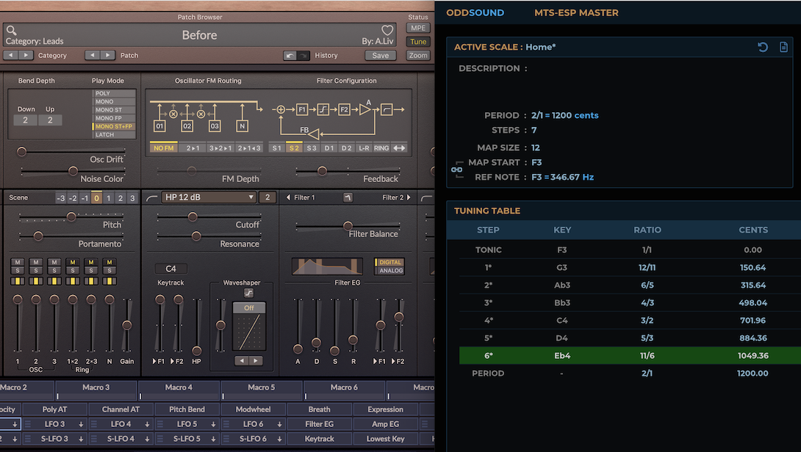

# Introduction 

##### Welcome to the Surge Synth Team tuning guide!

Microtuning, also known as intonation or simply tuning, is a somewhat underdeveloped aspect of modern music making. Surge XT has become
renowned for its extensive capabilties in this regard, the goal of which is simply to let the musician decide how the notes heard in their 
music should be tuned. Since the implementation found in SST products is going to be consistent for times to come, we gathered all 
relevant information in this guide. Hopefully you will find this useful in your exploration. 

# Methods

## Defaults

By default, almost all software instruments are tuned the same way. To 12 equal divisions of an octave, with either C=261.626Hz or A=440Hz as a 
reference frequency (those are in effect the same). That's also the same way that almost every guitar and piano is tuned nowadays. While it is evidently
a great tuning system (or it couldn't have become this widespread), it's not the only one. And if you're reading this that likely means you're
interested in other possibilities.

If you use electronic instrument for your explorations, you'll soon find that there are a number of different methods for retuning software 
instruments. There are two methods of re-tuning that the Surge Synth Team find especially solid, and those are the ones we've chosen to implement.
What follows is a summary of how those work in a general sense.

## Scala Files

Scala SCL/KBM is a well-established method for retuning software instruments. Big thanks to everyone at the
[huygens-fokker foundation](https://www.huygens-fokker.org/scala/) and beyond for developing and maintaining 
this method through the years.

SCL/KBM uses **human-readable plain text** files to provide tuning information to the instrument. Scale files with the
**.scl** extension contain information about the frequencies notes should be tuned to, and keyboard mapping files with the **.kbm** extention 
determine how those frequencies should be laid out across the MIDI note numbers (and thus in effect across the keyboard
or piano roll).

#### Scala Pros and Cons

This tuning info is handled individually by each instance of a software instrument. So if you have 5 instances of Surge XT, two Pianoteqs, 
and maybe a few other instruments as well, and you want them all to play in tune with each other, you'll need to load the SCL/KBM 
files into *each of them*. This makes for some repetitive work. 

Also, the Scala workflow was not designed with changing tunings in mind. As a basic example, if you wanted to change tunings between the verse and 
bridge of your song, you'd typically achieve this by making copies of your instruments to load the next tuning into, making for more repetitive work. 
While there are some ways around this limitations, it's fair to say MTS-ESP is a better fit for these needs, more below. 

There are some upsides though. If you want to explore multiple tuning systems
being played *at the same time*, scl/kbm is still the best method we know of. And if you're playing one instrument at a time, the repetitive scale loading 
is a much lesser issue. Another advantage is that this has been the most common method 
for many years by now, meaning there's a huge amount of scales available out there to try. Witness our [Factory Tuning Library](#factory-tuning-library).

#### Scale file specifications

For more info on how these scales are structured, please refer to the huygens-fokker foundations' reference material for [scale](https://www.huygens-fokker.org/scala/scl_format.html) and [keyboard mapping](https://www.huygens-fokker.org/scala/help.htm#mappings) files.

## For developers

The Surge Synth Team has put together a liberally licenced [open-source library](https://github.com/surge-synthesizer/tuning-library) which 
can be used to implement scl/kbm tuning in software instruments. If you're a developer and want to do this, contact us through Github or the Discord link in 
the [questions](#questions) section, we're happy to offer assistance with implementing this! 

## MTS-ESP

**MTS-ESP** is a new standard for tuning software instruments. 
Big thanks to [Oli and everyone else at ODDsound](https://oddsound.com/) for developing this system.

The core principle of MTS-ESP is that there is one centralized tuning interface plugin, called a **Master**
(or in Surge's case, a **Source**), to which all software instruments connect behind the scenes. Changing the tuning at the Source
will make all the instruments follow suit, and this can happen on-the-fly as the music plays.

#### MTS-ESP Pros and Cons

The advantage to this is twofold. First, it saves the repetitive work of loading the same tuning into multiple
software instruments (at the expense of the freedom to tune each instrument separately). Second, if the MTS-ESP Source
has the capacity, tuning can be changed dynamically during playback. This can make it much easier to alter tunings between different song
sections, and even gradually morph from one tuning to another!
There is however certain information about the scale structure (reference note and repetition interval) which is currently not provided 
to clients, and this makes some specific tuning scenarios (such as what's detailed [here](#surge-xt-microtonal-step-sequencing)) 
impossible to resolve in a satisfying way. 

#### Requirements

The MTS-ESP requires a certain dynamic library to be installed on your computer to function. 
This middleware passes the information from the tuning source to all its clients. If you already have an 
MTS-ESP Master/Source plugin installed, it will have given you this middleware when you installed it.
If you don't have that, the easiest way to get it on Mac or Windows is to install ODDsounds' free [MTS-ESP Mini](https://oddsound.com/mtsespmini.php). 
If you're on linux, follow the instructions near the bottom of [this page](https://github.com/ODDSound/MTS-ESP).

## MTS-ESP Source List

You obviously need an MTS-ESP Master/Source plugin to make use of the system. Since it's an open source standard, there are now options
available from several developers, and as of version 1.2, Surge XT itself is one of them! Here's the list as we know it today: 

| **Developer**    | **Application**  | **Capable of Dynamic Tuning** | **Comments**                       | **Link**                                         |
| ODDsound         | MTS-ESP Master   | Yes                       | Also has a pitch-bend/MPE MIDI plugin. | https://www.oddsound.com/mtsespsuite.php         |
| ODDsound         | MTS-ESP Mini     | No                        |                                        | https://www.oddsound.com/mtsespmini.php          |
| Infinitone       | Infinitone DMT   | Yes                       | Also does pitch-bend/MPE               | https://infinitone.com/                          |
| Node Audio       | Entonal Studio   | No                        | Also does pitch-bend/MPE               | https://entonal.studio/                          |
| Wilsonic         | Wilsonic MTS-ESP | Yes                       | Currently in Beta                      | https://wilsonic.co/downloads/downloads-mts-esp/ |
| Surge Synth Team | Surge XT         | No                        | From version 1.2 and onwards.          | https://surge-synthesizer.github.io/downloads    |

## MTS-ESP Client List

This is the most complete list of MTS-ESP compatible instruments and FX that we're aware of. If you find a piece of software that can be tuned with 
MTS-ESP which isn't listed here, please let us know! 

The 4th column, Dynamic or Note-On Microtuning, refers to the fact that, if the tuning in MTS-ESP changes while a note is being held, the note can 
either maintain its current pitch (Note-On behavior) or bend to follow the tuning change (Dynamic behavior).  

 

<h4>View the List</h4>

  
| **Developer**         | **Virtual-Instrument**  | **Type**                          | **Dynamic (DM) or Note-On (NO) Microtuning** | **Comments**                 |
| Antares           | Auto-Tune Slice                     | Virtual-Instrument            | ?                                        |                                          |
| Arturia           | Augmented Strings                   | Virtual-Instrument            |  NO and DM                                       |                                          |
| Arturia           | Augmented Voices                    | Virtual-Instrument            |  NO and DM                                       |                                          |
| Arturia           | Buchla Easel V                      | Virtual-Instrument            |  NO and DM                                       |                                          |
| Arturia           | Clavinet V                          | Virtual-Instrument            |  NO and DM                                       |                                          |
| Arturia           | CMI V                               | Virtual-Instrument            |  NO and DM                                       |                                          |
| Arturia           | CS-80 V4                            | Virtual-Instrument            |  NO and DM                                       |                                          |
| Arturia           | CZ V                                | Virtual-Instrument            |  NO and DM                                       |                                          |
| Arturia           | DX7 V                               | Virtual-Instrument            |  NO and DM                                       |                                          |
| Arturia           | Emulator II V                       | Virtual-Instrument            |  NO and DM                                       |                                          |
| Arturia           | Jun-6 V                             | Virtual-Instrument            |  NO and DM                                       |                                          |
| Arturia           | Jup-8 V                             | Virtual-Instrument            |  NO and DM                                       |                                          |
| Arturia           | MS-20 V                             | Virtual-Instrument            |  NO and DM                                       |                                          |
| Arturia           | OP-Xa V                             | Virtual-Instrument            |  NO and DM                                       |                                          |
| Arturia           | Piano V                             | Virtual-Instrument            |  NO and DM                                       |                                          |
| Arturia           | Pigments 4                          | Virtual-Instrument            |  NO and DM                                       |                                          |
| Arturia           | Prophet-5 V                         | Virtual-Instrument            |  NO and DM                                       |                                          |
| Arturia           | Prophet-VS V                        | Virtual-Instrument            |  NO and DM                                       |                                          |
| Arturia           | SQ80 V                              | Virtual-Instrument            |  NO and DM                                       |                                          |
| Arturia           | Stage 73 V                          | Virtual-Instrument            |  NO and DM                                       |                                          |
| Arturia           | Synthi V                            | Virtual-Instrument            |  NO and DM                                       |                                          |
| Arturia           | Vocoder V                           | Virtual-Instrument            |  NO and DM                                       |                                          |
| Audio Damage      | Continua                            | Virtual-Instrument            | ?                                        |                                          |
| Audio Damage      | Phosphor                            | Virtual-Instrument            | ?                                        |                                          |
| Audio Damage      | Quanta                              | Virtual-Instrument            | ?                                        |                                          |
| Audio Nebula      | Aurora FM                           | Virtual-Instrument            | DM                                       |                                          |
| Audio Realism     | Bass Line 3                         | Virtual-Instrument            | ?                                        |                                          |
| Audio Realism     | ReDominator                         | Virtual-Instrument            | ?                                        |                                          |
| ChowDSP           | ChowKick                            | Virtual-Instrument            | NO                                       |                                          |
| CWITEC            | TX16Wx                              | Virtual-Instrument            | NO                                       |                                          |
| discoDSP          | OB-Xd                               | Virtual-Instrument            | DM                                       |                                          |
| DMG Audio         | Equilibrium                         | Virtual-Instrument            | ?                                        |                                          |
| DMG Audio         | PitchFunk                           | Virtual-Instrument            | ?                                        |                                          |
| DS Audio          | Thorn                               | Virtual-Instrument            | DM                                       |                                          |
| Expert Sleepers   | Silent Way                          | CV Plugins for Modular Synths | ?                                        |                                          |
| FabFilter         | Twin 3                              | Virtual-Instrument            | NO                                       |                                          |
| Full Bucket Music | Bucket ONE                          | Virtual-Instrument            | NO                                       |                                          |
| Full Bucket Music | FB-7999                             | Virtual-Instrument            | NO                                       |                                          |
| Full Bucket Music | Full Bucket Vocoder FBVC            | Effect                        | NO                                       |                                          |
| Full Bucket Music | Fury-800                            | Virtual-Instrument            | NO                                       |                                          |
| Full Bucket Music | Grain Strain                        | Effect                        | NO                                       |                                          |
| Full Bucket Music | ModulAir                            | Virtual-Instrument            | NO                                       |                                          |
| Full Bucket Music | Mono-Fury                           | Virtual-Instrument            | NO                                       |                                          |
| Full Bucket Music | MPS                                 | Virtual-Instrument            | NO                                       |                                          |
| Full Bucket Music | Stigma                              | Virtual-Instrument            | NO                                       |                                          |
| Full Bucket Music | The blooo                           | Virtual-Instrument            | NO                                       |                                          |
| Full Bucket Music | The qyooo                           | Virtual-Instrument            | NO                                       |                                          |
| Full Bucket Music | The scrooo                          | Virtual-Instrument            | NO                                       |                                          |
| Full Bucket Music | Tricent mk III                      | Virtual-Instrument            | NO                                       |                                          |
| Full Bucket Music | WhispAir                            | Virtual-Instrument            | NO                                       |                                          |
| HY-Plugins        | HY-Poly                             | Virtual-Instrument            | DM                                       |                                          |
| Modartt           | Pianoteq                            | Virtual-Instrument            | NO and DM                                 | Use ‘Continuous retuning (pitch bending) |
| Monoplugs         | Monique                             | Virtual-Instrument            | NO                                       |                                          |
| nakst             | Altitude                            | Virtual-Instrument            | NO                                       |                                          |
| nakst             | Apricot                             | Virtual-Instrument            | NO                                       |                                          |
| nakst             | Integrate                           | Virtual-Instrument            | NO                                       |                                          |
| nakst             | Fluctus                             | Virtual-Instrument            | NO                                       |                                          |
| nakst             | Regency                             | Virtual-Instrument            | NO                                       |                                          |
| Newfangled Audio  | Generate                            | Virtual-Instrument            | DM                                    |                                      |
| Newfangled Audio  | Pendulate                           | Virtual-Instrument            | DM                                     |                                          |
| NUSofting         | Sinmad                              | Virtual-Instrument            | ?                                        | NO is assumed but not confirmed.         |
| NUSofting         | Sinnah                              | Virtual-Instrument            | NO                                       |                                          |
| Oli Larkin        | VirtualCZ                           | Virtual-Instrument            | NO                                       |                                          |
| Plogue            | Bidule                              | Sub-Host, Virtual-Instrument  | ?                                        |                                          |
| Plogue            | chipsynth OPS7                      | Virtual-Instrument            | NO                                       |                                          |
| Plogue            | chipsynth MD                        | Virtual-Instrument            | NO                                       |                                          |
| Plogue            | chipsynth PortaFM                   | Virtual-Instrument            | NO                                       |                                          |
| Plogue            | chipsynth SFC                       | Virtual-Instrument            | NO                                       |                                          |
| Rhizomatic        | Plasmonic                           | Virtual-Instrument            | DM                                       |                                          |
| Soundyan          | Interstellar Waterphone             | Virtual-Instrument            | ?                                        |                                          |
| Soundyan          | Zanza & Kalimba                     | Virtual-Instrument            | ?                                        |                                          |
| Surge Synth Team  | MTS-ESP to Note Expression CLAP     | See: [Tuning Note CLAPS](#tuning-note-claps)    | NO and DM                                       |                                          |
| Surge Synth Team  | Surge XT                            | Virtual-Instrument            | NO and DM                                 |                                          |
| TAL               | TAL-BassLine-101                    | Virtual-Instrument            | DM                                       |                                          |
| TAL               | TAL-J-8                             | Virtual-Instrument            | DM                                       |                                          |
| TAL               | TAL-MOD                             | Virtual-Instrument            | DM                                       |                                          |
| TAL               | TAL-Sampler                         | Virtual-Instrument            |                                          |                                          |
| TAL               | TAL-U-No-LX                         | Virtual-Instrument            | DM                                       |                                          |
| U-He              | ACE                                 | Virtual-Instrument            | DM                                       |                                          |
| U-He              | Bazille                             | Virtual-Instrument            |                                          |                                          |
| U-He              | Beatzille (free)                    | Virtual-Instrument            | ?                                        | NO is assumed but not confirmed.         |
| U-He              | ColourCopy                          | Effect                        | NO                                       |                                          |
| U-He              | Diva                                | Virtual-Instrument            | NO                                       |                                          |
| U-He              | Hive 2                              | Virtual-Instrument            | NO                                       |                                          |
| U-He              | MFM2.5                              | Effect                        | NO                                       |                                          |
| U-He              | Podolski (free)                     | Virtual-Instrument            | ?                                        | NO is assumed but not confirmed.         |
| U-He              | Repro                               | Virtual-Instrument            | NO                                       |                                          |
| U-He              | Triple Cheese (Free)                | Virtual-Instrument            | ?                                        | NO is assumed but not confirmed.         |
| U-He              | Zebra 2                             | Virtual-Instrument            | NO                                       |                                          |
| U-He              | Zebra CM                            | Virtual-Instrument            | ?                                        | NO is assumed but not confirmed.         |
| U-He              | ZebraHZ                             | Virtual-Instrument            | NO                                       |                                          |
| U-He              | Zebralette (free)                   | Virtual-Instrument            | ?                                        | NO is assumed but not confirmed.         |
| Unfiltered Audio  | Lion                                | Virtual-Instrument            | NO                                       |                                          |
| VCV               | VCV Rack and VCV Rack Pro           | Virtual-Instrument            | DM                                       | Using the free ODDSound MTS-ESP Modules  |
| Xfer Records      | Serum                               | Virtual-Instrument            | DM                                       |                                          |

# Factory Tuning Library

The Surge Synth Team distributes a collection of 182 basic microtuning table files for developers, musicians, composers, researchers and intonation enthusiasts alike, 
in the popular [Scala SCL/KBM format](#scala-files). Originally compiled as a learning device for newcomers to microtuning, it provides a useful overview of many
basic musical instrument intonation types, such as equal-temperaments (included are equal divisions of harmonics 2, 3 and 4), just-intonation (harmonic and subharmonic 
series sections), nonoctave systems by Wendy Carlos and others, and a selection of Linear Temperaments. If you've installed Surge XT on your computer, you can easily 
find this collection by opening Surge XT and clicking "Factory Tuning Library...".

## Scales

The lion's share of the collection is found in the SCL folder. As noted above, these scales can be divided up into four categories: Just Intonation, Equal Divisions, 
Non-Octave scales, and Linear Temperaments. We hope that this collection can inspire you to begin (or of course continue) exploring tunings by ear and in practice. 

### Non-Octave scales

As the name implies, they're scales which do not contain the octave interval (the frequency ratio 2/1), on which the majority of the worlds tuning systems have been based. 
Each is named after the person who designed it or made it famous. These are seemingly fewest in number of the types found here, but do note that some of the scales in the
other categories also do not contain a pure octave. If those are counted, the scales without a 2/1 octave make up a little more than a quarter of the scales. 

### Just Intonation 

There's a world of possibilities with Just tunings, and making a selection from among these is a daunting task. 
We feel that a good place to begin is the Harmonic Series itself, so we've made a collection of segments of the harmonic series, and the so-called 
subharmonic series (which takes the step sizes of the harmonic series in reverse order).

These Just scales (and the equal scales that follow) come in three versions, with different intervals of repetition. Some span the interval of 2/1, which is an octave. They will contain 
all the harmonics or subharmonics between a given one, and its double. For example, the scale called "HD2 04-08" contains the harmonics between the fourth and the 8th.
As was mentioned above, scales that repeat after the frequency ratio 2/1 (the octave) are most common by far. But they aren't the only good option! You'll also find 
scales here which repeat after 3/1 (which is an octave + a perfect 5th), or after 4/1 (which is two octaves).

The scales whose names start with HD (for "Harmonic Division") are harmonic series segments. Those that start with SD (for "Subharmonic Division") are subharmonic
series segments. The number after the letters (either 2, 3 or 4) is the repetition interval being divided, the next numbers show how it is divided. 

### Equal Divisions

These scales divide some simple Just ratio into equal parts. 
As in the previous category, the repetition interval can be either 2, 3 or 4. Octave, octave + 5th, or double octave. 
These scales have names starting with ED (for "Equal Division"), followed by the interval being divided, followed by the number of parts it's divided into.

A couple of equal scales are actually in the collection twice. The files called 12 Tone Equal Temperament and Bohlen-Pierce, contain exactly the same
information as the files called "ED2-12" and "ED3-13" respectively. These tunings are so well known by those names, that we felt it made sense to include them
by those names also. 

### Equal Linear Temperaments 

Musicians and composers exploring the vast resources of musical instrument intonation systems, will be aware that our Western 12 tone 
equal temperament was arrived at by tempering the intervals of the classical 12-note Pythagorean parent tuning, which is formed from a cycle of 
acoustic 3/2 fifths at 701.955 cents.

When the Pythagorean tuning is mapped to 12-note Halberstadt keyboards or MIDI controllers, the interval sequence is generated from three 3/2 fifths down, 
and eight 3/2 fifths up, which places the familiar diatonic modes on the white keys of the keyboard, and likewise with many 12-note meantone systems, 
where the fifths may be tempered slightly flat or sharp from 3/2, thereby improving, or otherwise, changing the tuning of other intervals, such as the thirds of such temperaments.

With this category of linear temperaments, the sizes of these regular diatonic fifth generators will always lie between 4\7 (4 steps of 7 equal divisions of an octave) 
at 685.714 cents to 3\5 (3 steps of 5 equal divisions of an octave) at 720 cents.

Similarly, we find with equal-temperaments, that between 17 and 71 tone equal temperament, there are 32 that meet this criteria of having regular diatonic fifth 
generators within this range, and this SCL collection of 12-note subsets from them, use a file-naming convention where the tunings are in order of the fifth 
generator sizes, starting with 47 tone equal- temperament, having a fifth generator of 689.362 cents, through 42 tone equal-temperament at 714.286 cents.

This collection of 12-note subsets of these equal-temperaments was compiled, and is presented here, in a way that can be used as a device for the study 
of linear-temperaments, which illustrates that as the size of the tempered fifths increase from small to large, how this impacts not only on the tuning of the thirds, 
but all of the intervals of each tuning.

A Scala keyboard mapping file is included with the SCL collection: Halberstadt 60-440-69.kbm, which when used in combination with any of the SCL tables for 
these 12-note tunings, will map the 1/1 starting note on MIDI Note C.60, with the diapason (Reference Pitch/Reference MIDI Note) on A.69 at 440 Hz.

To use these files with any virtual-instruments that supports the complete Scala SCL and KBM microtuning table format (such as Modartt Pianoteq or Surge XT),
load any combination of an SCL file with the above KBM to explore this exciting collection of temperaments on a 12-note Halberstadt keyboard controller.

These Linear Temperaments are found in a separate folder, where you'll also find a helpful interval-matrix PDF, showing each temperament, and the available 
interval patterns from any starting point of the tunings.

### Keyboard Mappings

This archive contains a collection of basic linear keyboard mapping files (KBM) which may be used in virtual-instruments that support loading both the Scala SCL and KBM 
microtuning format files, such as Pianoteq and Surge, as well as for creating custom microtuning mappings within the Scala application itself for 
exporting to other popular formats, such as TUN, MTS and KSP.

This small linear KBM collection may be used for mapping the starting 1/1 MIDI Note, as well as the Reference Frequency MIDI Note (diapason), to the standard concert-pitch chromatic notes.

The file naming convention indicates:

* The 1/1 starting MIDI Note for the mapping.
* The rounded Reference Frequency.
* The mapping for the Reference Frequency MIDI Note.
* The standard letter format concert-pitch chromatic scale degree.

For example: 60-262-60 Concert C, indicates at a glance that: The 1/1 of the microtuning will be mapped to MIDI Note 60, the Reference Frequency is 262 Hz, and the MIDI Note
on which the Reference Frequency is mapped is 60.

Please note here that the KBM format is flexible enough that the above parameters can be arbitrarily and independently mapped, such that for instance, a microtuning could 
have its diapason mapped to the standard concert-pitch of MIDI Note A.69 @ 440 Hz, while the 1/1 starting note could be mapped on 60.C, or any other MIDI Note 
required of the musical scenario at hand. Such a mapping would look like this:

60-440-69.kbm
|
Range         : 0.C  .. 127.G 
Middle        : 60.C 
Reference     : 440.000000 Hertz at note 69.A 
Octave degree : 0 (highest degree of scale)
Mapping : linear

This potential for arbitrary mapping of pitches to MIDI Notes, is the very nature and definition of what's referred to as 'full keyboard microtuning'.

 

# Tuning Editor

Here's the instruction manual for the tuning editor which is built into Surge XT. It's an interface for loading, creating, modifying, and analyzing tunings. 
These tunings will be played by the Surge XT instance you're working from. As of Surge XT 1.2, Surge itself can act as MTS-ESP source, which in effect means
you can use the Tuning Editor to control the tuning of all ([compatible](#mts-esp-client-cist)) software instruments that are playing simultaneously. 
You can also export the current tuning and keyboard mapping info as [.scl and .kbm files](#scala-files) 

The integrated Surge XT Tuning Editor has a built-in collection of microtuning utilities for loading, modifying,
analysing and exporting Scala SCL-KBM tuning tables that enable working with a broad range of historical and
contemporary musical intonation systems. 

It is also worth mentioning here that Surge XT supports the use and creation of non-monotonic intonation systems that may 
not necessarily be sorted in a linear order.

**Keyboard Mapping** - On the far left of the Tuning editor UI, there is a keyboard diagram showing the current
tuning and how  its frequencies are mapped directly to **MIDI Note Numbers** across the musical range.

Notice that when playing notes from a MIDI controller, that the keys will light up showing the notes that are being
played as well the fundamental pitches that Surge XT is sounding with each MIDI Note On.

### Edit Modes

Along the bottom left of the Tuning Editor are five buttons that switch between the different editing and analysis
functions:

#### Scala

Click Scala button, where the values for the currently loaded Scala SCL and KBM file can be viewed and
or edited. In the left pane is the Scala SCL, with the KBM on the right. Notice here too that input from an attached
MIDI controller will highlight the scale degrees being played from the keyboard.

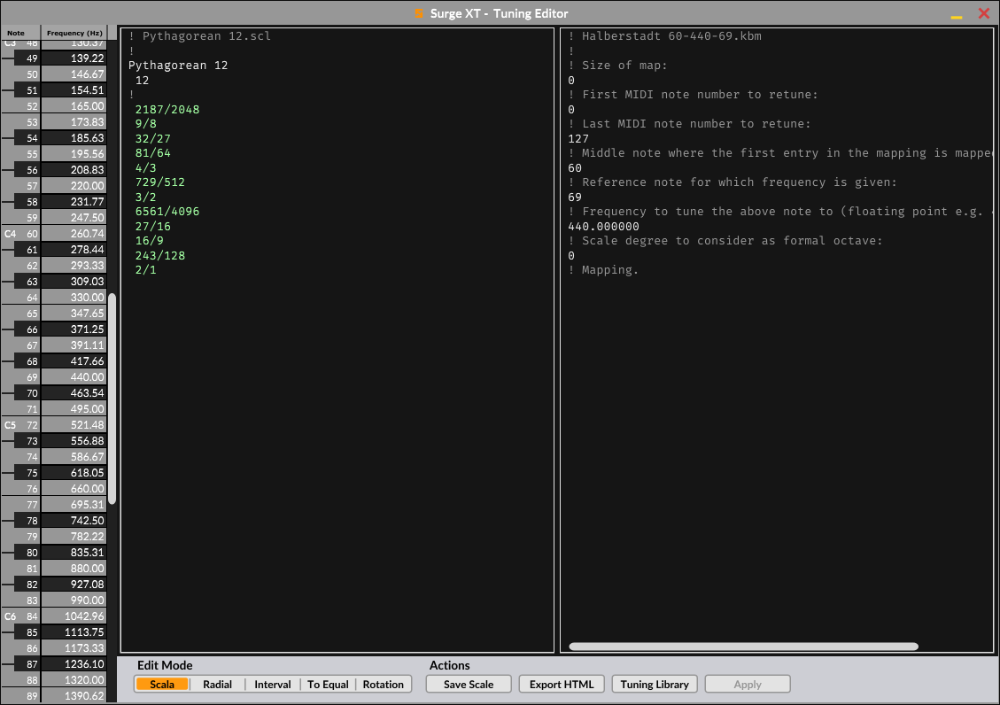

It’s possible to directly edit SCL and KBM values in either pane, then using the Save Scale feature, export the
results to any directory on the user’s computer. Editing SCL and KBM is a slightly advanced topic, so it is advised
to only make changes to tunings here, when one understands how these features work for creating custom tuning tables
that can be read by Surge XT, or any other virtual-instruments that use the Scala SCL-KBM format.

#### Radial

Click the **Radial** button to access features for creating new scales, or otherwise modifying
existing ones, with its features for tuning by ear using either the Scale Tones on the left, or the Tone Wheel on
the right.

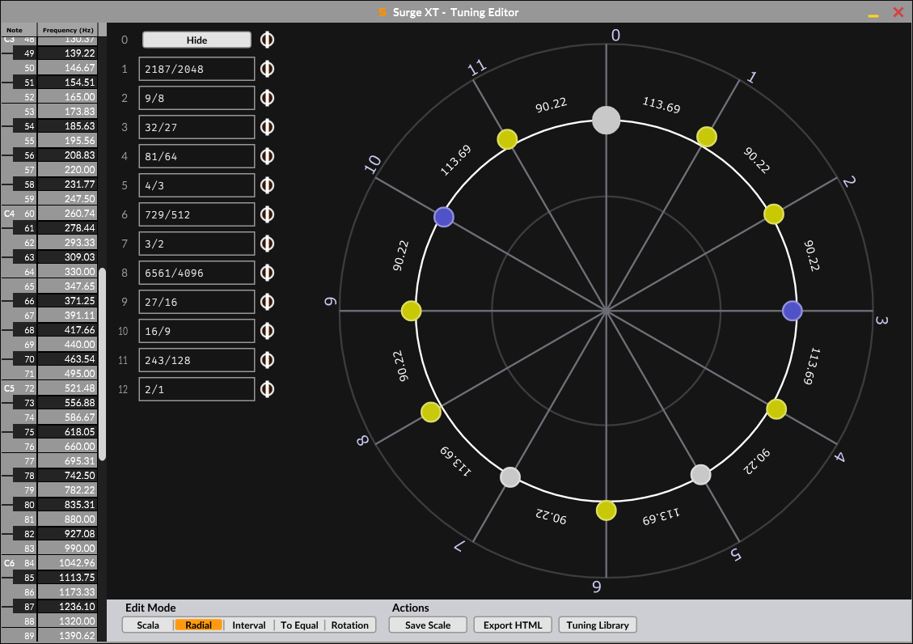

The **Scale Tones** features show the ratios or cents for each degree of the current tuning. The dials to the right of each scale degree can be used to retune each pitch of the scale by ear and the dial on the top right can be used to uniformly compress or stretch the current tuning.

Holding **Shift** on the typing keyboard while moving the tuning dials counterclockwise or clockwise allows fine
adjustments while retuning the scale by ear. Use the Hide button to hide the scale degrees when tuning by ear, then
click Show to see the results of the tuning exercise.

It is also possible to type new values for each of the scale degrees in either ratios or cents.

Any changes made to the Scale Tones dials are immediately reflected on the Radial Tone Wheel to the right, and it’s
also possible to click on the circular nodes of the Tone Wheel and retune each by ear as well.

#### Interval

Provides a way to view the intervals of the current scale, given any two notes in the loaded scale and show the
interval in cents between them.

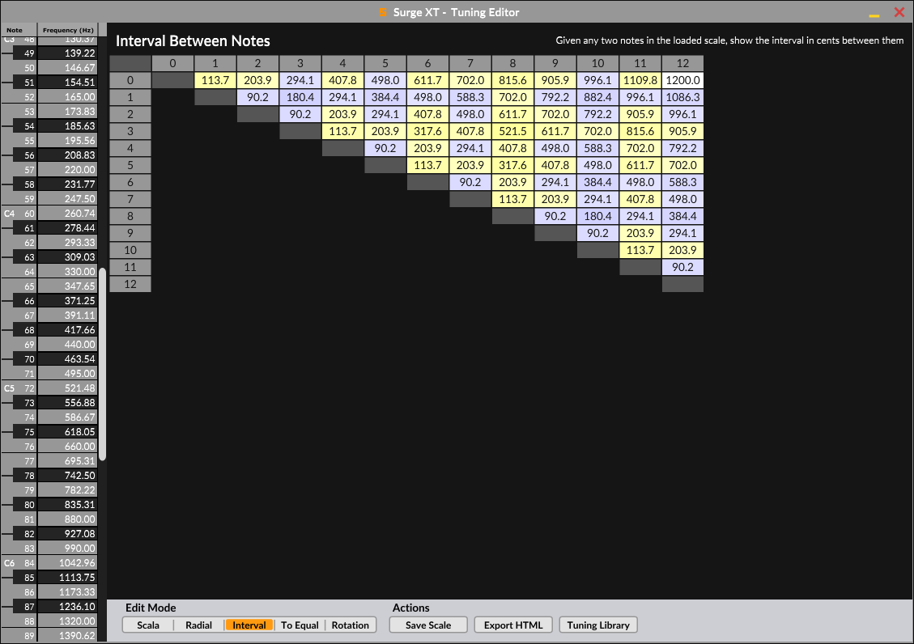

It’s also possible to hold keys on an attached MIDI controller, then click and drag on any of the columns to retune
each degree by ear in real-time.

Notice here too that input from a MIDI controller also highlights the scale degrees being played in the matrix.

#### To Equal

Given any two notes in the loaded scale, show the distance to the equal division interval.

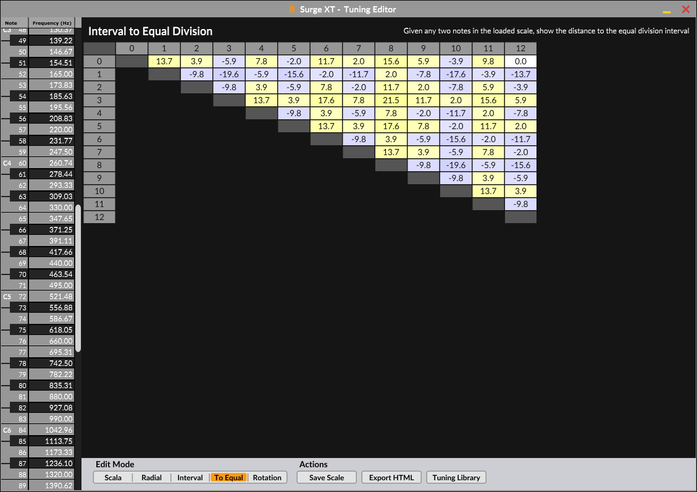

#### Rotation

Shows the current tuning in an interval matrix for modal rotation analysis, where each row reveals the intervals
available from each starting point of the scale.

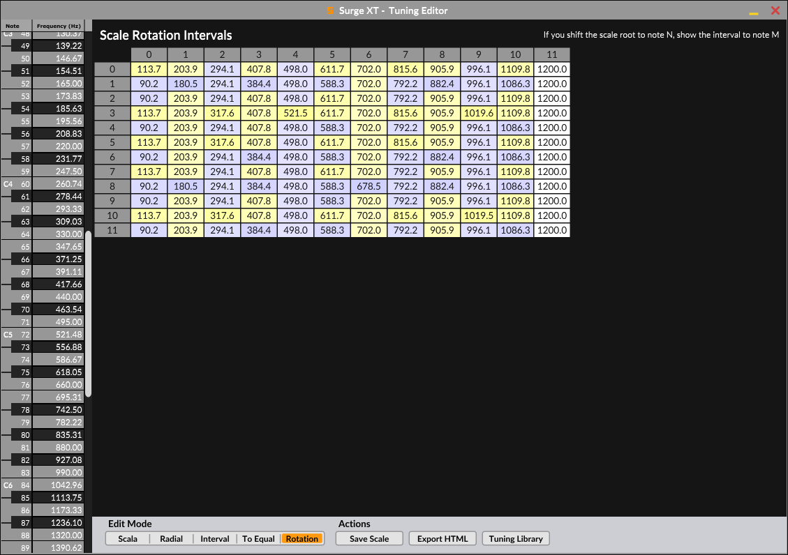

### Actions

The Surge SXT Tuning Editor has a set of Actions with the following features:

#### Save Scale

Click this button to export the current scale in the Scala SCL format to any location on the user’s computer, where
they can later be loaded back into Surge XT, or other virtual-instruments that use the Scala format.

#### Export HTML

Opens the current scale in an HTML page, where users can view complete information about the intonation, including
the Scala SCL scale degrees, the frequency mapping to MIDI Notes across the range, the KBM in use, as well as an
interval matrix that shows the current tuning under both modal and interval rotation. More information can be found
below.

#### Tuning Library

Clicking the Tuning Library button will open the directory containing the Surge XT factory SCL and KBM content,
making it easy to drag-and-drop SCL and KBM files onto the UI.

### Export HTML

Clicking the Export HTML button from within the Surge XT Tuning Editor opens the current tuning in an HTML page
enabling viewing information about the loaded Scala SCL and KBM files, and how the pitches are mapped to MIDI Notes
on the keyboard controller.

The exported HTML page then shows the tuning description contained in the SCL file, the degrees of the scale, and
the mapping of pitches to MIDI Notes. Below we can see that the Bohlen-Pierce tuning is mapped with its 1/1 starting
note on C.60 at 261.626 Hz.

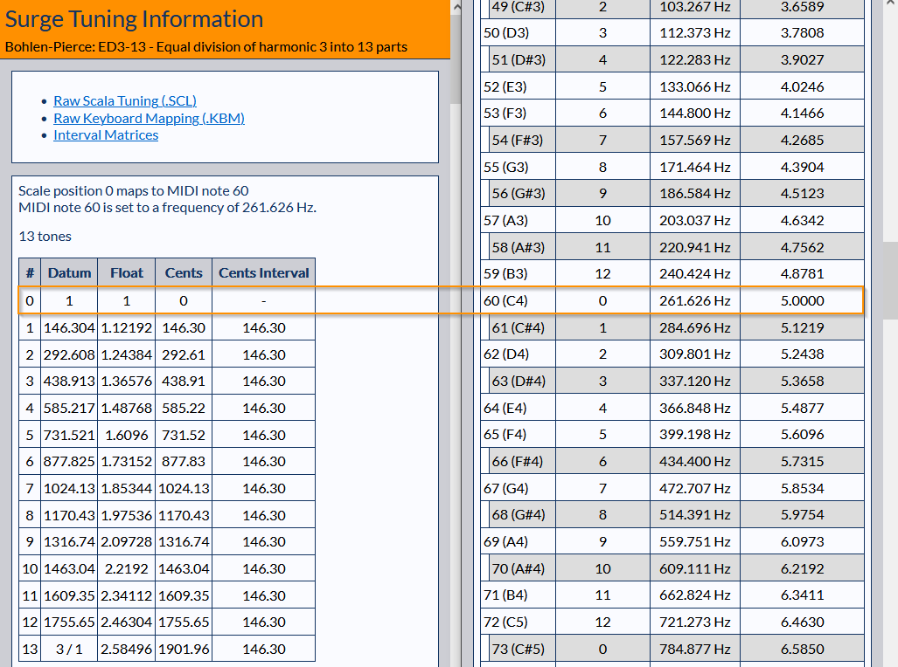

To change the 1/1 mapping to another MIDI Note, drag-and-drop a different KBM file onto the Surge XT interface, then
click the Export HTML button again to see how it changed the mapping.

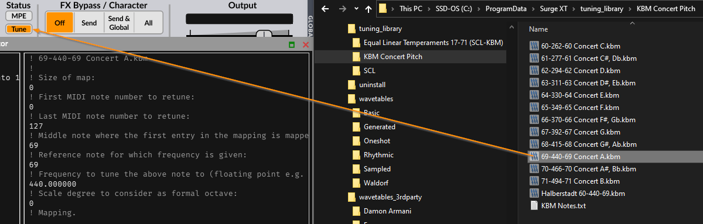

Below we can see that the 1/1 for Bohlen-Pierce is now mapped to MIDI Note A.69 at 440 Hz:

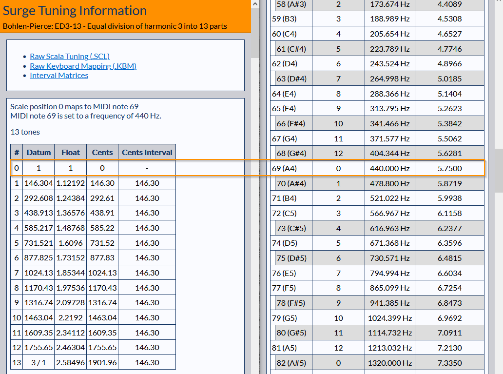

Click the Raw Scala Tuning (SCL) or Raw Keyboard Mapping (KBM) links to view the mapping data for the currently loaded SCL and KBM files.

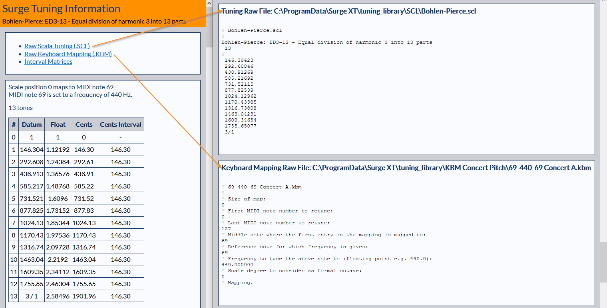

Click the Interval Matrices link to view a modal rotation of the current tuning by scale degrees and interval steps.

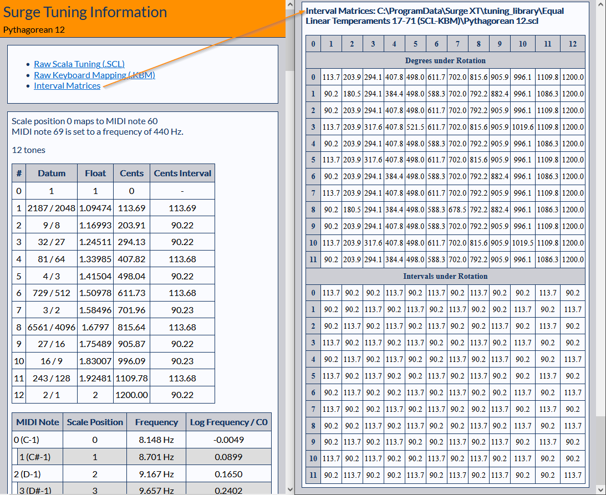

 

# Microtonal Step Sequencing

If you've tried to use Surge XT's Step Sequencer making pitch sequences and couldn't get it to work right, you've come to the right place! 

#### Before we begin, a few things to consider.
First of all, it's not currently possible to make this work with [MTS-ESP](#mts-esp) tuning. It will work with Scala file tuning only. 
Also, you have so select the option **"Apply Tuning After Modulation"** in Surge XT, without which none of this will work correctly.
So make sure you've done that before we start.

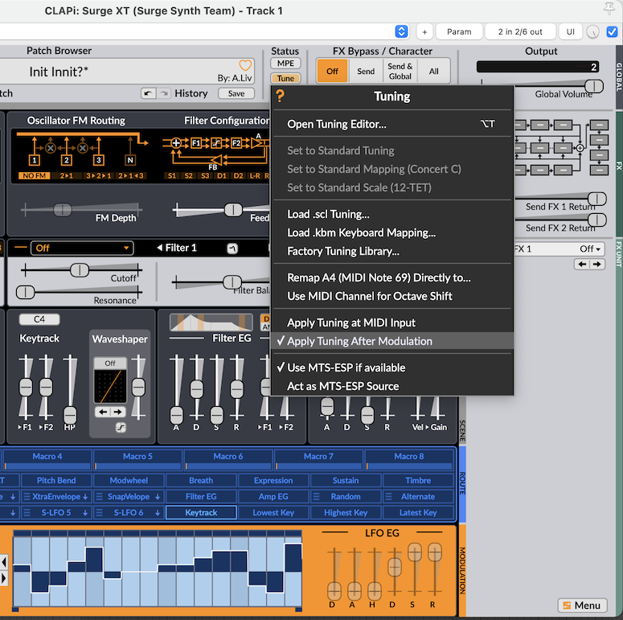

 

#### Modulating Scene Pitch vs. Oscillator Pitch
Another initial consideration in configuring Step Sequencers for microtonal sequencing is that there are actually two possible Pitch Modulation targets to which Step Sequencer modulation-sources may be assigned:

#### Scene Pitch
Modulating Scene Pitch with one, or multiple, Step Sequencers is useful where one wants all three oscillators in a Scene to track the pitch in unison. With Scene Pitch modulation using more than one Step Sequencer, all of the modulation sources are summed to a single voice. Polyphonic input from a MIDI controller is still possible, but each voice contains the sum of all running Step Sequencers assigned to Scene Pitch. 

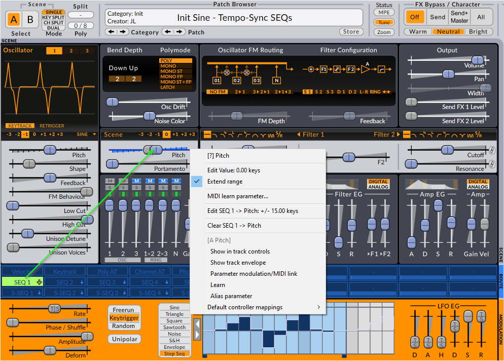

#### Oscillator Pitch
With Oscillator Pitch modulation using the Step Sequencers, it is possible to route separate sequencers to each of the three available oscillators in a Scene. In this scenario, it becomes possible for the sequencers to trigger chords as the notes from each Step Sequencer play together.

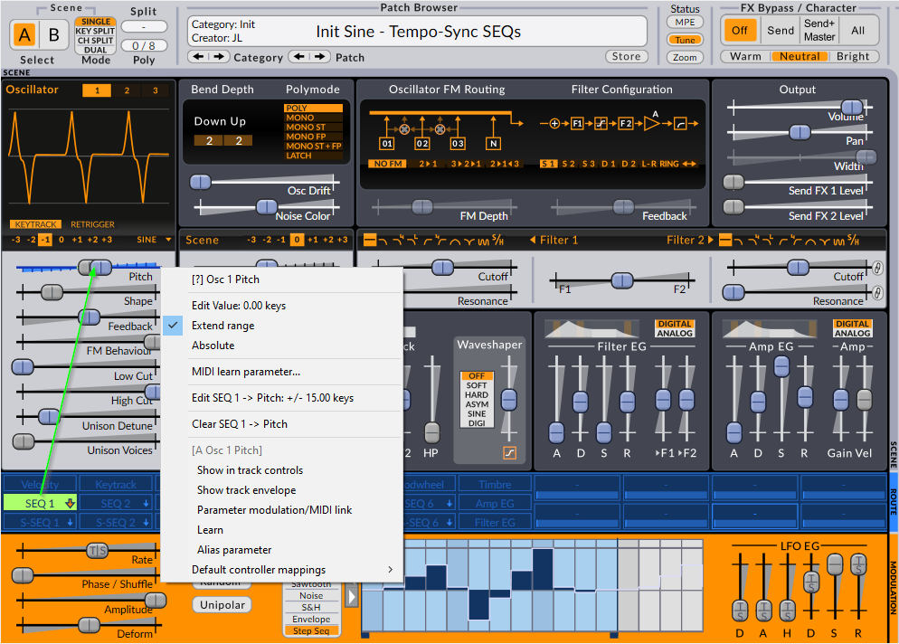 

 

### Making Modulation Assignments 

Since the processes for routing Step Sequencer modulation-sources to either **Scene Pitch** or **Oscillator Pitch** are functionally identical, in this brief overview, we’ll focus on assigning Step Sequencers to Oscillator Pitch for microtonal pitch sequencing:

1. Load a Scala **SCL** microtuning table file to use with the Step Sequencer, as outlined in the [Microtuning section of the user manual](https://surge-synthesizer.github.io/manual-xt/#microtuning). For this example, we’ll use 15-tone-equal-temperament, which is available in the factory data tuning-library as ED2-15 (Equal division of harmonic 2 into 15 parts).

2. Right-Click on the **Oscillator Pitch** slider, and check **Extend Range** in the context menu. Doing this enables pitch sequencing with SCL microtonal tuning tables of arbitrary size.
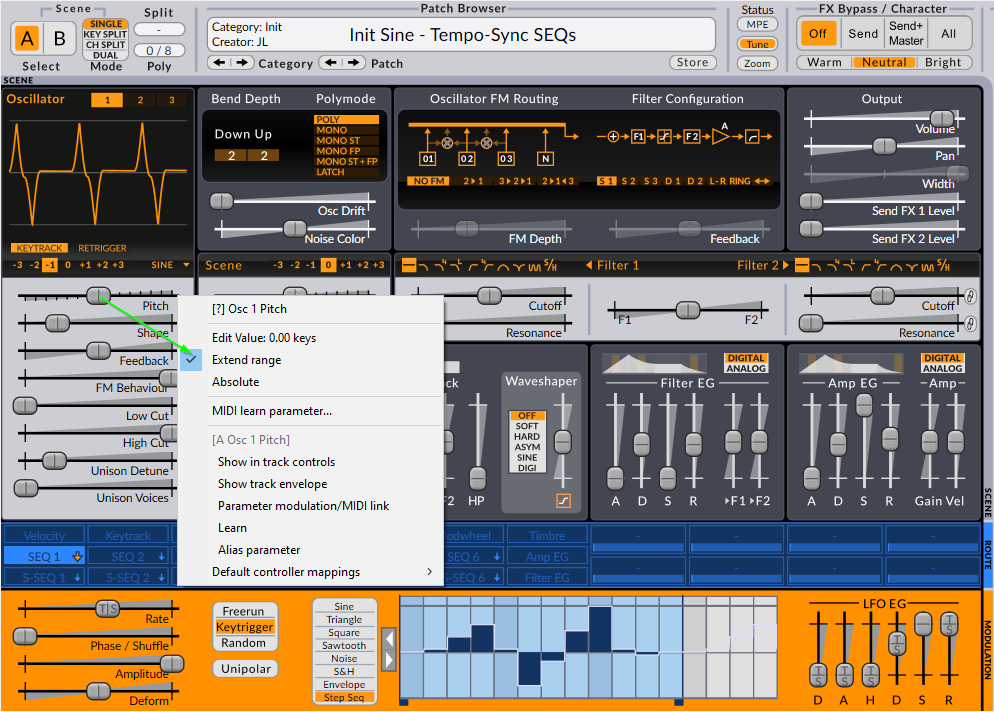

3. Assign a SEQ modulation-source to the Oscillator Pitch. For more info on assigning modulation sources to targets, read [this section in the manual](https://surge-synthesizer.github.io/manual-xt/#modulationrouting). Once you've done so, right-click the **Oscillator Pitch** slider and type-in the number of notes in your scale. In our example case, that's 15). If you're not sure what number this should be, you can open the [tuning-editor](#tuning-editor) and check the scala tab, the first number on the top left is the number you need. Here, it is also possible to type-in a range twice the loaded SCL scale size (in our example case, 30) for creating microtonal pitch-sequences over a range of two times the **repetition interval** (the interval at which any scale repeats across the range, usually but not necessarily an octave), more on this below.
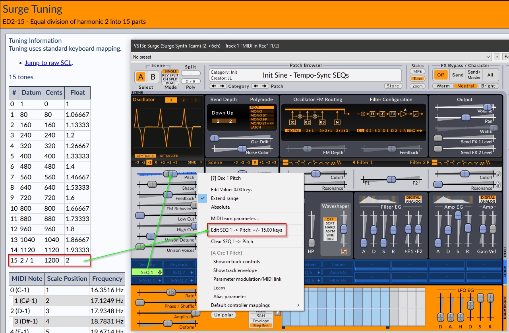
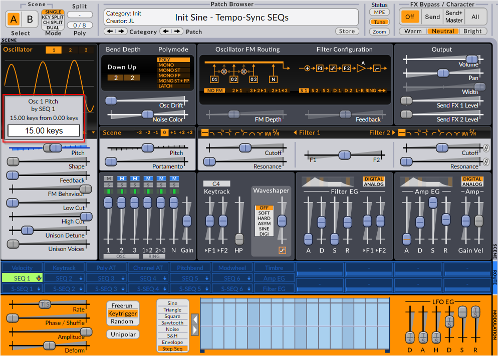
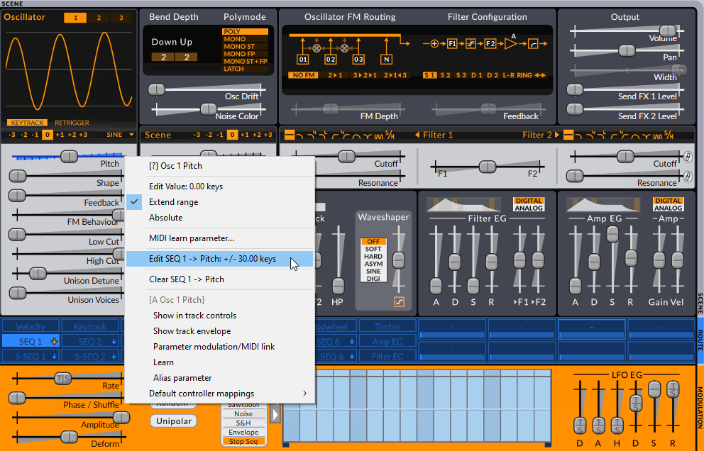

4. You've now correctly configured the modulation depth for the step sequencer to play the oscillator pitch in tune. We are now ready to create our microtonal Step Sequencer patterns. Here's the trick, the mouse modifiers which quantize the steps to scale degrees (which usually would make 12-equal steps only) will now be **‘SCL-aware’**. In the **Step Sequencer Editor**, place the mouse cursor over one of the 16 steps, hold **Shift**, then drag up or down to create a pitch-quantized step over the range of **one repetition interval**. If you previously set your modulation depth to **two repetition intervals** (30 instead of 15 in our example), you should instead use **Alt+Shift+Drag** to quantize to that doubled range. Here, one will notice that a popup appears, showing the pitch-quantized adjustments as they snap to degrees of the loaded SCL file when one drags the mouse up and down.
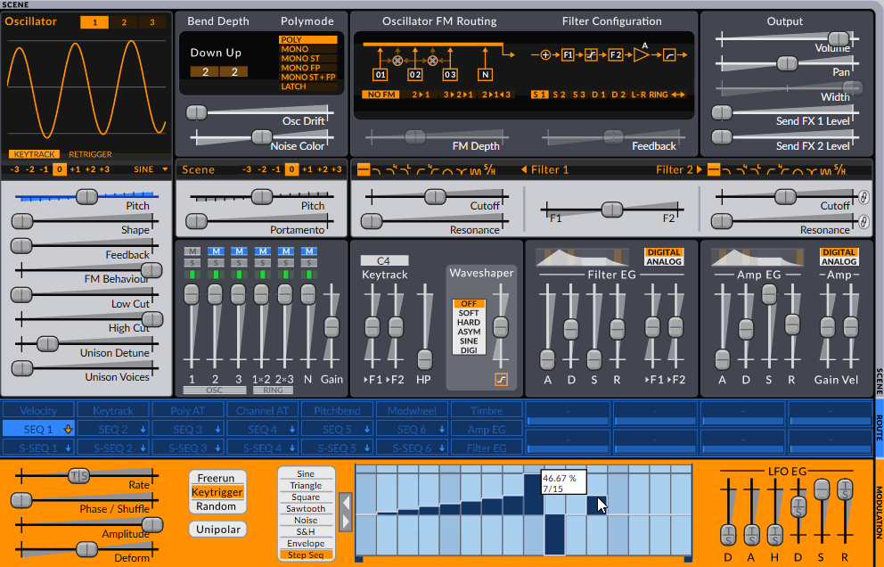
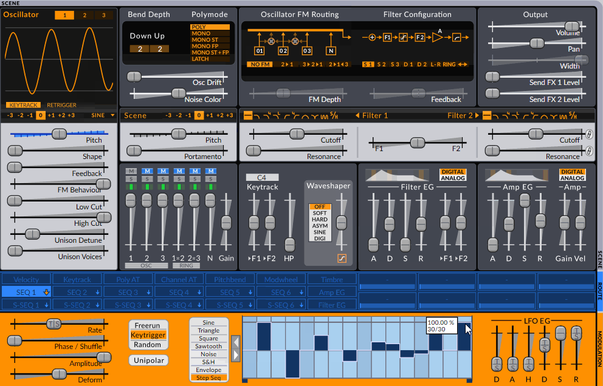

5. It is also possible to draw straight-lines across multiple steps in the **Step Sequencer Editor** and quantize their pitches to degrees of the loaded SCL microtuning table file, using the **Right-Mouse-Button** in combination with the **Shift+Drag** and **Alt+Shift+Drag** mouse-modifiers.
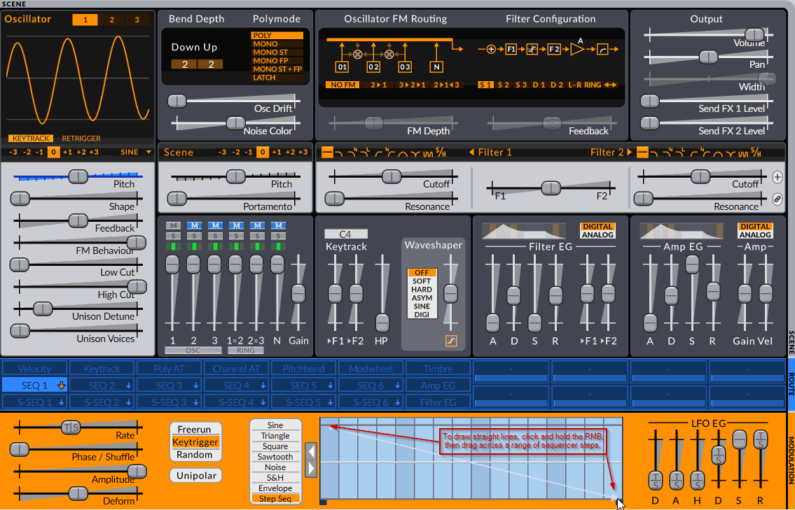
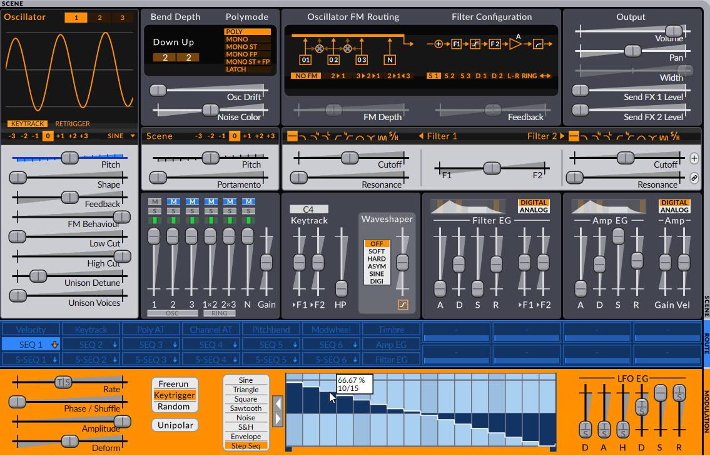

### Mouse Modifiers Reference

Use the below keyboard modifiers to create sequencer steps that are quantized to the pitch of the loaded SCL microtuning table file:
 
* **Shift+Drag** for quantizing vertical sequencer-editor steps to scale degrees spanning a range of one repetition interval (2/1, 3/1, 4/1, etc.). 
* **Alt+Shift+Drag** for quantizing vertical sequencer-editor steps to scale degrees spanning a range of twice the repetition interval. Doing this effectively doubles the number of vertical steps in the sequencer-editor.
* **Shift+Right-Mouse-Button+Drag** for drawing straight-lines across multiple steps in the sequencer-editor that quantize to scale degrees spanning a range of one repetition interval.
* **Alt+Shift+Right-Mouse-Button+Drag** for drawing straight-lines across multiple steps in the sequencer-editor that quantize to scale degrees spanning a range of twice the repetition interval.
* **Double-Click** to clear individual sequencer steps, or Ctrl+Drag across a range of steps to clear them.
* **Note**: Without any keyboard-modifiers, the pitch is not quantized to the loaded SCL file and essentially functions as a stepped modulation-source similar to an LFO. 
 

Enjoy your microtonal step sequencing! 

 

# Tuning Note CLAPs

The Surge Synth Team tuning-note-claps is a CLAP format plugin that contains two separate devices — EDN-M To Note Expression and MTS-ESP To Note Expression — which can be used to microtune various devices included with Bitwig Studio, by means of CLAP note expressions.

As of July 17th 2023, the Bitwig devices that can be microtuned with the tuning-note-claps are: FM-4, Organ, Phase-4, Poly Grid, Polymer, Polysynth,
Sampler, Resonator Bank and Keytrack+.

**EDN-M To Note Expression** can be used to tune the Bitwig instruments to a large range of **equal-temperaments**.

**MTS-ESP To Note Expression** Connects with **MTS-ESP**, and retunes incoming MIDI notes accordingly. This effectively makes the entire 
suite of Bitwig Studio devices compatible with MTS-ESP. For more info on what this means, check the [MTS-ESP](#mts-esp) section.

## Installation

To install the tuning-note-claps devices on Linux or Windows, download the plugins from [here](https://github.com/surge-synthesizer/tuning-note-claps/releases) and extract the 
tuning-note-claps.clap plugin into the CLAP plugin directory. 

// Linux
//   - ~/.clap
//   - /usr/lib/clap

// Windows
//   - %COMMONPROGRAMFILES%\CLAP
//   - %LOCALAPPDATA%\Programs\Common\CLAP

On MacOS, use the included installer to install the plugin in the CLAP directory.

Once installed, the two tuning note devices will appear in the Bitwig Studio browser in the CLAP plugins category:

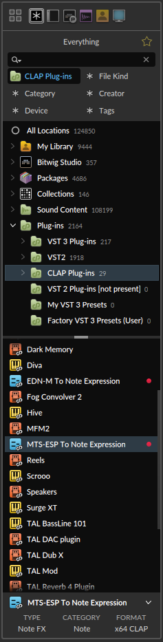

## Using the EDN-M device

1. Insert an instance of the EDN-M To Note Expression device into an empty Instrument Track, followed by one of the instrument devices, then arm the track for recording and reception of MIDI from a connected external MIDI controller.

2. Specify the repetition-interval for the equal-temperament using the topmost Even Division Of control, to set the desired harmonic as an integer value.

3. Configure the equal division of the repetition-interval using the Into Steps control.

4. Specify the MIDI Note on which the 1/1 starting note of the equal-temperament will be mapped using the Tuning Center Key control. For example, setting this to 60, will map the 1/1 to MIDI Note C.60, while setting it to 69, will map the 1/1 to A.69.

5. Specify the frequency of the 1/1 starting note for the equal-temperament using the Tuning Center Frequency control. For example, setting this to 261.626 in combination with the Tuning Center Key set to 60, will map the 1/1 on MIDI Note C.60 at a frequency of 261.626 Hz, while setting it to 440, with the Tuning Center Key set to 69, will map the 1/1 on A.69 at 440 Hz.

6. Use the Post Note Release (s) control to add a release time value, specified in seconds, to each played note. (Only relevant if the tuning changes during the release stage)

Of course, all parameters of the EDN-M To Note Expression device can be modulated with the Bitwig modulation devices.

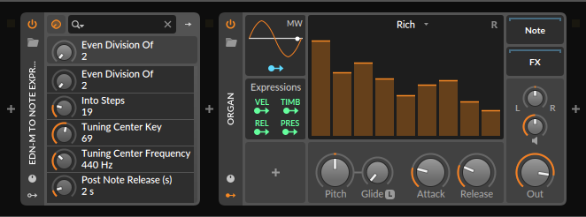

## Using the MTS-ESP device

In order to use the MTS-ESP To Note Expression CLAP device to microtune the integrated Bitwig instruments, an MTS-ESP master (source) must be present in the project. See [MTS-ESP sources](#mts-esp) for more information on this.

For this basic overview, we'll assume the source is ODDsound MTS-ESP Master. To illustrate its ability to dynamically change the intonation for ensembles of instrument devices in tandem, lets configure Bitwig for this purpose.

1. First, insert an instance of MTS-ESP Master into an empty track, which will be used to control the intonation of all instrument devices loaded into the project. Then open some individual tunings, or Scale List presets, that will be used in the sequencing project.

2. On the next four successive tracks, load instances of Organ, FM4, Polysynth and Phase-4, then set each of their MIDI reception channels to receive MIDI on channels 1 through 4.

3. Before each of these Bitwig instrument devices, place an instance of the MTS-ESP To Note Expression CLAP, which will then communicate the tunings loaded in MTS-ESP Master to the instruments that follow. The CLAP plugin will even display the name of the currently loaded tuning.

With this basic multi-track MIDI configuration, when the tunings are changed in MTS-ESP Master, the four instruments loaded on the adjacent tracks will follow those changes and retune the virtual-ensemble accordingly. Now it's possible to individually perform and record MIDI on each of the instrument tracks using one common musical intonation system.

# Questions?

The [Surge Synth Team Discord server](https://discord.com/invite/spGANHw) has a channel dedicated to tuning questions. We're always happy to answer any questions to the best of our ability. Or to hear whatever tuning-specific music you've made and would love to share! Welcome by if you like. 
